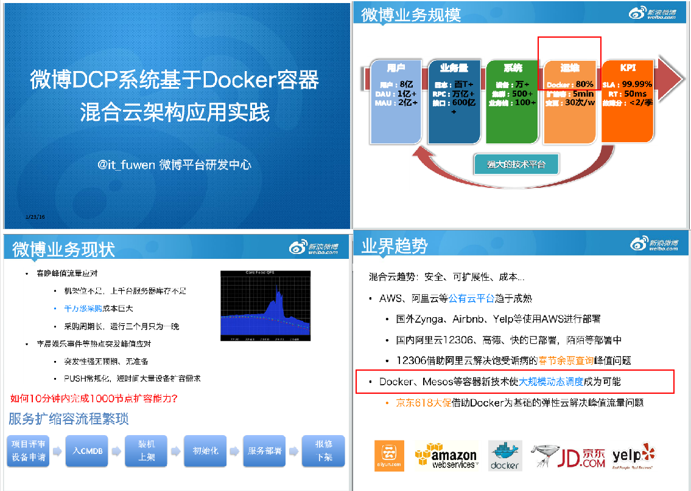
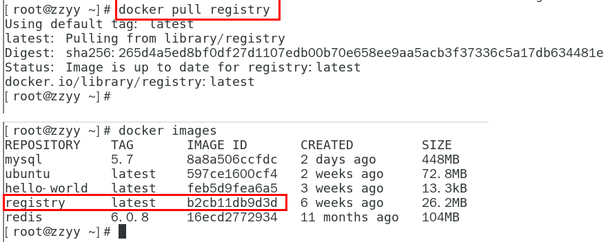
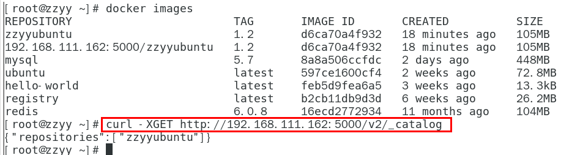
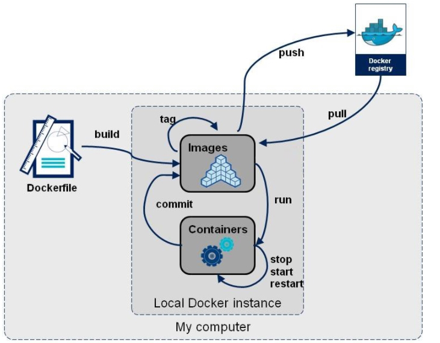
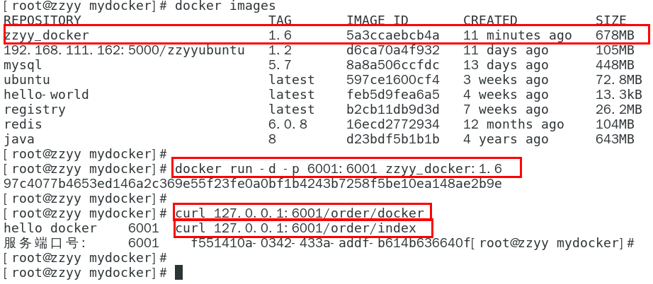
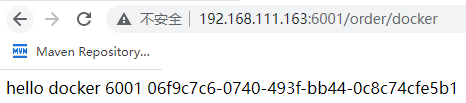

<!-- START doctoc generated TOC please keep comment here to allow auto update -->
<!-- DON'T EDIT THIS SECTION, INSTEAD RE-RUN doctoc TO UPDATE -->
**Table of Contents**  *generated with [DocToc](https://github.com/thlorenz/doctoc)*

- [一.docker基础](#%E4%B8%80docker%E5%9F%BA%E7%A1%80)
  - [1.Docker简介](#1docker%E7%AE%80%E4%BB%8B)
      - [1.1 背景](#11-%E8%83%8C%E6%99%AF)
      - [1.2 理念](#12-%E7%90%86%E5%BF%B5)
      - [1.3 作用](#13-%E4%BD%9C%E7%94%A8)
      - [1.4 对比虚拟机](#14-%E5%AF%B9%E6%AF%94%E8%99%9A%E6%8B%9F%E6%9C%BA)
      - [1.5 总结](#15-%E6%80%BB%E7%BB%93)
  - [2.Docker安装](#2docker%E5%AE%89%E8%A3%85)
      - [2.1 前提说明](#21-%E5%89%8D%E6%8F%90%E8%AF%B4%E6%98%8E)
      - [2.2 Docker的基本组成](#22-docker%E7%9A%84%E5%9F%BA%E6%9C%AC%E7%BB%84%E6%88%90)
        - [2.2.1 镜像(image)](#221-%E9%95%9C%E5%83%8Fimage)
        - [2.2.2 容器(container)](#222-%E5%AE%B9%E5%99%A8container)
        - [2.2.3 仓库(repository)](#223-%E4%BB%93%E5%BA%93repository)
        - [2.2.4 小总结](#224-%E5%B0%8F%E6%80%BB%E7%BB%93)
      - [2.3 工作原理 & 整体架构](#23-%E5%B7%A5%E4%BD%9C%E5%8E%9F%E7%90%86--%E6%95%B4%E4%BD%93%E6%9E%B6%E6%9E%84)
      - [2.4 安装步骤](#24-%E5%AE%89%E8%A3%85%E6%AD%A5%E9%AA%A4)
      - [2.5  阿里云镜像加速](#25--%E9%98%BF%E9%87%8C%E4%BA%91%E9%95%9C%E5%83%8F%E5%8A%A0%E9%80%9F)
      - [2.6 永远的Helloworld](#26-%E6%B0%B8%E8%BF%9C%E7%9A%84helloworld)
  - [3.Docker常用命令](#3docker%E5%B8%B8%E7%94%A8%E5%91%BD%E4%BB%A4)
      - [3.1 帮助启动类命令](#31-%E5%B8%AE%E5%8A%A9%E5%90%AF%E5%8A%A8%E7%B1%BB%E5%91%BD%E4%BB%A4)
      - [3.2 镜像命令](#32-%E9%95%9C%E5%83%8F%E5%91%BD%E4%BB%A4)
      - [3.3 容器命令](#33-%E5%AE%B9%E5%99%A8%E5%91%BD%E4%BB%A4)
        - [① docker run](#%E2%91%A0-docker-run)
        - [② docker ps](#%E2%91%A1-docker-ps)
        - [③ 退出&启动&停止&删除](#%E2%91%A2-%E9%80%80%E5%87%BA%E5%90%AF%E5%8A%A8%E5%81%9C%E6%AD%A2%E5%88%A0%E9%99%A4)
        - [④ 重要命令](#%E2%91%A3-%E9%87%8D%E8%A6%81%E5%91%BD%E4%BB%A4)
      - [3.4 常用命令总结](#34-%E5%B8%B8%E7%94%A8%E5%91%BD%E4%BB%A4%E6%80%BB%E7%BB%93)
  - [4.Docker镜像](#4docker%E9%95%9C%E5%83%8F)
      - [4.1 原理](#41-%E5%8E%9F%E7%90%86)
        - [8.2.2 最佳实践](#822-%E6%9C%80%E4%BD%B3%E5%AE%9E%E8%B7%B5)
      - [8.3 安装redis](#83-%E5%AE%89%E8%A3%85redis)
- [二.docker进阶](#%E4%BA%8Cdocker%E8%BF%9B%E9%98%B6)
  - [1.Docker复杂安装详解](#1docker%E5%A4%8D%E6%9D%82%E5%AE%89%E8%A3%85%E8%AF%A6%E8%A7%A3)
      - [1.1 安装mysql主从复制](#11-%E5%AE%89%E8%A3%85mysql%E4%B8%BB%E4%BB%8E%E5%A4%8D%E5%88%B6)
        - [1.1.1 主从复制原理](#111-%E4%B8%BB%E4%BB%8E%E5%A4%8D%E5%88%B6%E5%8E%9F%E7%90%86)
        - [1.1.2 主从搭建步骤](#112-%E4%B8%BB%E4%BB%8E%E6%90%AD%E5%BB%BA%E6%AD%A5%E9%AA%A4)
      - [1.2 安装redis集群](#12-%E5%AE%89%E8%A3%85redis%E9%9B%86%E7%BE%A4)
        - [1.2.1 分布式存储算法](#121-%E5%88%86%E5%B8%83%E5%BC%8F%E5%AD%98%E5%82%A8%E7%AE%97%E6%B3%95)
          - [1.2.1.1 哈希取余分区](#1211-%E5%93%88%E5%B8%8C%E5%8F%96%E4%BD%99%E5%88%86%E5%8C%BA)
          - [1.2.1.2 一致性哈希算法分区](#1212-%E4%B8%80%E8%87%B4%E6%80%A7%E5%93%88%E5%B8%8C%E7%AE%97%E6%B3%95%E5%88%86%E5%8C%BA)
          - [1.2.1.3 哈希槽分区](#1213-%E5%93%88%E5%B8%8C%E6%A7%BD%E5%88%86%E5%8C%BA)
        - [1.2.2 3主3从redis集群配置](#122-3%E4%B8%BB3%E4%BB%8Eredis%E9%9B%86%E7%BE%A4%E9%85%8D%E7%BD%AE)
          - [① 3主3从redis集群配置](#%E2%91%A0-3%E4%B8%BB3%E4%BB%8Eredis%E9%9B%86%E7%BE%A4%E9%85%8D%E7%BD%AE)
          - [② 数据读写存储——集群模式](#%E2%91%A1-%E6%95%B0%E6%8D%AE%E8%AF%BB%E5%86%99%E5%AD%98%E5%82%A8%E9%9B%86%E7%BE%A4%E6%A8%A1%E5%BC%8F)
          - [③ 容错切换迁移](#%E2%91%A2-%E5%AE%B9%E9%94%99%E5%88%87%E6%8D%A2%E8%BF%81%E7%A7%BB)
          - [④ 主从扩容案例](#%E2%91%A3-%E4%B8%BB%E4%BB%8E%E6%89%A9%E5%AE%B9%E6%A1%88%E4%BE%8B)
          - [⑤ 主从缩容案例](#%E2%91%A4-%E4%B8%BB%E4%BB%8E%E7%BC%A9%E5%AE%B9%E6%A1%88%E4%BE%8B)
  - [2.DockerFile解析](#2dockerfile%E8%A7%A3%E6%9E%90)
      - [2.1 简介](#21-%E7%AE%80%E4%BB%8B)
      - [2.2 DockerFile构建过程解析](#22-dockerfile%E6%9E%84%E5%BB%BA%E8%BF%87%E7%A8%8B%E8%A7%A3%E6%9E%90)
      - [2.3 DockerFile常用保留字指令](#23-dockerfile%E5%B8%B8%E7%94%A8%E4%BF%9D%E7%95%99%E5%AD%97%E6%8C%87%E4%BB%A4)
      - [2.4 保留字的执行环境-AI](#24-%E4%BF%9D%E7%95%99%E5%AD%97%E7%9A%84%E6%89%A7%E8%A1%8C%E7%8E%AF%E5%A2%83-ai)
      - [2.5 `dockerfile`编写流程-AI](#25-dockerfile%E7%BC%96%E5%86%99%E6%B5%81%E7%A8%8B-ai)
      - [2.6 案例-自定义镜像`mycentosjava8`](#26-%E6%A1%88%E4%BE%8B-%E8%87%AA%E5%AE%9A%E4%B9%89%E9%95%9C%E5%83%8Fmycentosjava8)
      - [2.7 案例：自定义镜像myubuntu](#27-%E6%A1%88%E4%BE%8B%E8%87%AA%E5%AE%9A%E4%B9%89%E9%95%9C%E5%83%8Fmyubuntu)
      - [2.8 虚悬镜像](#28-%E8%99%9A%E6%82%AC%E9%95%9C%E5%83%8F)
  - [3.Docker微服务实战](#3docker%E5%BE%AE%E6%9C%8D%E5%8A%A1%E5%AE%9E%E6%88%98)
      - [3.1 新建springboot工程并形成jar包](#31-%E6%96%B0%E5%BB%BAspringboot%E5%B7%A5%E7%A8%8B%E5%B9%B6%E5%BD%A2%E6%88%90jar%E5%8C%85)
      - [3.2 dockerfile发布微服务部署到docker容器](#32-dockerfile%E5%8F%91%E5%B8%83%E5%BE%AE%E6%9C%8D%E5%8A%A1%E9%83%A8%E7%BD%B2%E5%88%B0docker%E5%AE%B9%E5%99%A8)
      - [3.3 `dockerfile`文件解读-AI](#33-dockerfile%E6%96%87%E4%BB%B6%E8%A7%A3%E8%AF%BB-ai)
  - [4.`Docker`网络](#4docker%E7%BD%91%E7%BB%9C)
      - [4.1 `Docker`网络基础-AI](#41-docker%E7%BD%91%E7%BB%9C%E5%9F%BA%E7%A1%80-ai)
      - [4.2 docker启动前后宿主机网络变化](#42-docker%E5%90%AF%E5%8A%A8%E5%89%8D%E5%90%8E%E5%AE%BF%E4%B8%BB%E6%9C%BA%E7%BD%91%E7%BB%9C%E5%8F%98%E5%8C%96)
        - [4.2.1 docker不启动，网络情况](#421-docker%E4%B8%8D%E5%90%AF%E5%8A%A8%E7%BD%91%E7%BB%9C%E6%83%85%E5%86%B5)
        - [4.2.2 docker启动后，网络情况](#422-docker%E5%90%AF%E5%8A%A8%E5%90%8E%E7%BD%91%E7%BB%9C%E6%83%85%E5%86%B5)
        - [4.2.3 总结](#423-%E6%80%BB%E7%BB%93)
      - [4.3 network基础命令](#43-network%E5%9F%BA%E7%A1%80%E5%91%BD%E4%BB%A4)
      - [4.4 网络模式](#44-%E7%BD%91%E7%BB%9C%E6%A8%A1%E5%BC%8F)
        - [① 4种网络模式](#%E2%91%A0-4%E7%A7%8D%E7%BD%91%E7%BB%9C%E6%A8%A1%E5%BC%8F)
        - [② 容器实例内默认网络IP生产规则](#%E2%91%A1-%E5%AE%B9%E5%99%A8%E5%AE%9E%E4%BE%8B%E5%86%85%E9%BB%98%E8%AE%A4%E7%BD%91%E7%BB%9Cip%E7%94%9F%E4%BA%A7%E8%A7%84%E5%88%99)
        - [③ bridge模式](#%E2%91%A2-bridge%E6%A8%A1%E5%BC%8F)
        - [④ host模式](#%E2%91%A3-host%E6%A8%A1%E5%BC%8F)
        - [⑤ none模式](#%E2%91%A4-none%E6%A8%A1%E5%BC%8F)
        - [⑥ container模式](#%E2%91%A5-container%E6%A8%A1%E5%BC%8F)
        - [⑦ 自定义网络](#%E2%91%A6-%E8%87%AA%E5%AE%9A%E4%B9%89%E7%BD%91%E7%BB%9C)
      - [4.5 Docker平台架构图解](#45-docker%E5%B9%B3%E5%8F%B0%E6%9E%B6%E6%9E%84%E5%9B%BE%E8%A7%A3)
  - [5.Docker-compose容器编排](#5docker-compose%E5%AE%B9%E5%99%A8%E7%BC%96%E6%8E%92)
      - [5.1 简介](#51-%E7%AE%80%E4%BB%8B)
      - [5.2 安装](#52-%E5%AE%89%E8%A3%85)
      - [5.3 核心概念 & 使用步骤](#53-%E6%A0%B8%E5%BF%83%E6%A6%82%E5%BF%B5--%E4%BD%BF%E7%94%A8%E6%AD%A5%E9%AA%A4)
      - [5.4 常用命令](#54-%E5%B8%B8%E7%94%A8%E5%91%BD%E4%BB%A4)
      - [5.5 Compose编排微服务](#55-compose%E7%BC%96%E6%8E%92%E5%BE%AE%E6%9C%8D%E5%8A%A1)
        - [5.5.1 不使用compose编排服务-使用dockerFile](#551-%E4%B8%8D%E4%BD%BF%E7%94%A8compose%E7%BC%96%E6%8E%92%E6%9C%8D%E5%8A%A1-%E4%BD%BF%E7%94%A8dockerfile)
        - [5.5.2 使用compose编排服务](#552-%E4%BD%BF%E7%94%A8compose%E7%BC%96%E6%8E%92%E6%9C%8D%E5%8A%A1)
  - [6.Docker轻量级可视化工具Portainer](#6docker%E8%BD%BB%E9%87%8F%E7%BA%A7%E5%8F%AF%E8%A7%86%E5%8C%96%E5%B7%A5%E5%85%B7portainer)
      - [6.1 简介](#61-%E7%AE%80%E4%BB%8B)
      - [6.2 安装](#62-%E5%AE%89%E8%A3%85)
      - [6.3 演示](#63-%E6%BC%94%E7%A4%BA)
  - [7.Docker容器监控之CAdvisor+InfluxDB+Granfana](#7docker%E5%AE%B9%E5%99%A8%E7%9B%91%E6%8E%A7%E4%B9%8Bcadvisorinfluxdbgranfana)
      - [7.1 docker stats命令](#71-docker-stats%E5%91%BD%E4%BB%A4)
      - [7.2 CIG：CAdvisor+InfluxDB+Granfana](#72-cigcadvisorinfluxdbgranfana)
      - [7.3 部署`GIC`](#73-%E9%83%A8%E7%BD%B2gic)
      - [7.4 使用`GIC`](#74-%E4%BD%BF%E7%94%A8gic)
      - [7.5 CIG三平台登陆验证通过](#75-cig%E4%B8%89%E5%B9%B3%E5%8F%B0%E7%99%BB%E9%99%86%E9%AA%8C%E8%AF%81%E9%80%9A%E8%BF%87)
      - [7.6 CIG添加panel](#76-cig%E6%B7%BB%E5%8A%A0panel)
      - [7.7 CIG配置监控业务规则](#77-cig%E9%85%8D%E7%BD%AE%E7%9B%91%E6%8E%A7%E4%B8%9A%E5%8A%A1%E8%A7%84%E5%88%99)

<!-- END doctoc generated TOC please keep comment here to allow auto update -->

# 一.docker基础

## 1.Docker简介

#### 1.1 背景

假定您在开发一个尚硅谷的谷粒商城，您使用的是一台笔记本电脑而且您的开发环境具有特定的配置。其他开发人员身处的环境配置也各有不同。您正在开发的应用依赖于您当前的配置且还要依赖于某些配置文件。此外，您的企业还拥有标准化的测试和生产环境，且具有自身的配置和一系列支持文件。您希望尽可能多在本地模拟这些环境而不产生重新创建服务器环境的开销。请问？

您要如何确保应用能够在这些环境中运行和通过质量检测？并且在部署过程中不出现令人头疼的版本、配置问题，也无需重新编写代码和进行故障修复？

答案就是使用容器。Docker之所以发展如此迅速，也是因为它对此给出了一个标准化的解决方案-----系统平滑移植，容器虚拟化技术。

环境配置相当麻烦，换一台机器，就要重来一次，费力费时。很多人想到，能不能从根本上解决问题，软件可以带环境安装？也就是说，安装的时候，把原始环境一模一样地复制过来。开发人员利用 Docker 可以消除协作编码时"在我的机器上可正常工作"的问题。


之前在服务器配置一个应用的运行环境，要安装各种软件，就拿尚硅谷电商项目的环境来说，Java/RabbitMQ/MySQL/JDBC驱动包等。安装和配置这些东西有多麻烦就不说了，它还不能跨平台。假如我们是在 Windows 上安装的这些环境，到了 Linux 又得重新装。况且就算不跨操作系统，换另一台同样操作系统的服务器，要移植应用也是非常麻烦的。

传统上认为，软件编码开发/测试结束后，所产出的成果即是程序或是能够编译执行的二进制字节码等(java为例)。而为了让这些程序可以顺利执行，开发团队也得准备完整的部署文件，让维运团队得以部署应用程式，开发需要清楚的告诉运维部署团队，用的全部配置文件+所有软件环境。不过，即便如此，仍然常常发生部署失败的状况。Docker的出现使得Docker得以打破过去「程序即应用」的观念。透过镜像(images)将作业系统核心除外，运作应用程式所需要的系统环境，由下而上打包，达到应用程式跨平台间的无缝接轨运作

#### 1.2 理念

Docker是基于Go语言实现的云开源项目

Docker的主要目标是"Build，Ship and Run Any App,Anywhere" （一次构建、随处运行），也就是通过对应用组件的封装、分发、部署、运行等生命周期的管理，使用户的APP（可以是一个WEB应用或数据库应用等等）及其运行环境能够做到"一次镜像，处处运行"


Linux容器技术的出现就解决了这样一个问题，而 Docker 就是在它的基础上发展过来的。将应用打成镜像，通过镜像成为运行在Docker容器上面的实例，而 Docker容器在任何操作系统上都是一致的，这就实现了跨平台、跨服务器。只需要一次配置好环境，换到别的机子上就可以一键部署好，大大简化了操作

Docker解决了运行环境和配置问题的软件容器，方便做持续集成并有助于整体发布的容器虚拟化技术

#### 1.3 作用

Docker 是一种容器化平台，它的核心作用是通过容器技术将应用程序及其依赖环境打包，实现快速部署、隔离运行和跨环境一致性。以下是 Docker 的主要作用和应用场景：

---

1.环境一致性

- 问题：开发、测试、生产环境不一致导致"在我机器上能运行"的问题。
- 解决：通过容器将代码、依赖、配置等打包成镜像，确保环境完全一致，避免环境差异引发的故障。

---

2.快速部署与扩展

- 轻量级：容器共享宿主机操作系统内核，比虚拟机更小、更快启动（秒级）
- 弹性伸缩：在云环境中快速启动多个容器实例，应对流量高峰（如微服务架构）

---

3.资源高效利用

- 低开销：容器无需虚拟化完整操作系统，占用更少 CPU、内存和磁盘空间
- 高密度部署：同一台服务器可运行更多容器，提升资源利用率

---

4.隔离与安全

- 进程隔离：每个容器独立运行，避免应用间冲突（如依赖版本不同）
- 文件系统隔离：容器内的修改不会影响宿主机或其他容器

---

5.支持微服务架构

- 拆分服务：将单体应用拆分为多个独立容器（如前端、后端、数据库），便于独立开发、部署和扩展
- 服务编排：通过工具（如 Kubernetes、Docker Swarm）管理多容器协作

---

6.简化开发与运维流程

- CI/CD 集成：与 Jenkins、GitLab 等工具结合，实现自动化构建、测试和部署
- 版本控制：镜像可版本化管理，方便回滚和追踪变更

---

7.跨平台与多云支持

- 一次构建，随处运行：容器镜像可在任何支持 Docker 的环境中运行（本地开发机、物理服务器、云平台等）
- 避免供应商锁定：轻松迁移应用至不同云服务（AWS、Azure、阿里云等）

---

8.生态与工具支持

- 镜像仓库：Docker Hub 提供大量预构建镜像（如 Nginx、MySQL），加速开发
- 社区活跃：丰富的第三方工具和插件（如监控、日志管理）

---

对比虚拟机（VM）：

| 特性     | Docker 容器          | 虚拟机（VM）             |
| :------- | :------------------- | :----------------------- |
| 启动速度 | 秒级                 | 分钟级                   |
| 资源占用 | 低（共享内核）       | 高（独立 OS）            |
| 隔离性   | 进程级隔离           | 硬件级隔离               |
| 镜像大小 | 通常为 MB 级         | 通常为 GB 级             |
| 适用场景 | 应用级隔离、快速扩展 | 强隔离需求、完整 OS 环境 |

---

典型使用场景

- 本地开发：一键复现生产环境
- 微服务部署：每个服务独立容器化
- 持续集成：自动化测试与发布
- 边缘计算：轻量级部署在资源受限的设备上

------

通过 Docker，开发者可以专注于代码而非环境，运维团队则能更高效地管理应用生命周期

#### 1.4 对比虚拟机

**传统虚拟机技术**：虚拟机（virtual machine）就是带环境安装的一种解决方案。它可以在一种操作系统里面运行另一种操作系统，比如在Windows10系统里面运行Linux系统CentOS7。应用程序对此毫无感知，因为虚拟机看上去跟真实系统一模一样，而对于底层系统来说，虚拟机就是一个普通文件，不需要了就删掉，对其他部分毫无影响。这类虚拟机完美的运行了另一套系统，能够使应用程序，操作系统和硬件三者之间的逻辑不变。传统虚拟机技术基于主操作系统（如Win10）上安装的虚拟机管理系统（如VirtualBox、VMWare），通过虚拟化硬件资源（CPU、内存、网络等）创建虚拟机实例，在虚拟机中安装客户操作系统（如CentOS7），最后在客户操作系统中部署应用。虚拟机的缺点：资源占用多、冗余步骤多、启动慢


**容器虚拟化技术**：由于前面虚拟机存在某些缺点，Linux发展出了另一种虚拟化技术——Linux容器(Linux Containers，缩写为 LXC)。Linux容器是与系统其他部分隔离开的一系列进程，从另一个镜像运行，并由该镜像提供支持进程所需的全部文件。容器提供的镜像包含了应用的所有依赖项，因而在从开发到测试再到生产的整个过程中，它都具有可移植性和一致性。Linux 容器不是模拟一个完整的操作系统而是对进程进行隔离。有了容器，就可以将软件运行所需的所有资源打包到一个隔离的容器中。容器与虚拟机不同，不需要捆绑一整套操作系统，只需要软件工作所需的库资源和设置。系统因此而变得高效轻量并保证部署在任何环境中的软件都能始终如一地运行。Docker 容器是在操作系统层面上实现虚拟化，直接复用本地主机的操作系统，而传统虚拟机则是在硬件层面实现虚拟化。与传统的虚拟机相比，Docker优势体现为启动速度快、占用体积小


Docker 和传统虚拟化方式的不同之处：

- 传统虚拟机技术是虚拟出一套硬件后，在其上运行一个完整操作系统，在该系统上再运行所需应用进程

- 容器内的应用进程直接运行于宿主的内核，容器内没有自己的内核且也没有进行硬件虚拟。因此容器要比传统虚拟机更为轻便

- 每个容器之间互相隔离，每个容器有自己的文件系统，容器之间进程不会相互影响，能区分计算资源

#### 1.5 总结

技术职级变化：

- coder ->  programmer -> software engineer -> DevOps engineer（开发/运维(DevOps)新一代开发工程师）

一次构建、随处运行：

- 更快速的应用交付和部署：传统的应用开发完成后，需要提供一堆安装程序和配置说明文档，安装部署后需根据配置文档进行繁杂的配置才能正常运行。Docker化之后只需要交付少量容器镜像文件，在正式生产环境加载镜像并运行即可，应用安装配置在镜像里已经内置好，大大节省部署配置和测试验证时间。

- 更便捷的升级和扩缩容：随着微服务架构和Docker的发展，大量的应用会通过微服务方式架构，应用的开发构建将变成搭乐高积木一样，每个Docker容器将变成一块"积木"，应用的升级将变得非常容易。当现有的容器不足以支撑业务处理时，可通过镜像运行新的容器进行快速扩容，使应用系统的扩容从原先的天级变成分钟级甚至秒级。

- 更简单的系统运维：应用容器化运行后，生产环境运行的应用可与开发、测试环境的应用高度一致，容器会将应用程序相关的环境和状态完全封装起来，不会因为底层基础架构和操作系统的不一致性给应用带来影响，产生新的BUG。当出现程序异常时，也可以通过测试环境的相同容器进行快速定位和修复。

- 更高效的计算资源利用：Docker是内核级虚拟化，其不像传统的虚拟化技术一样需要额外的Hypervisor支持，所以在一台物理机上可以运行很多个容器实例，可大大提升物理服务器的CPU和内存的利用率。


Docker应用场景：Docker 借鉴了标准集装箱的概念。标准集装箱将货物运往世界各地，Docker 将这个模型运用到自己的设计中，唯一不同的是集装箱运输货物，而 Docker运输软件


企业应用案例：

- 新浪：



- 美团：


- 蘑菇街：


## 2.Docker安装

#### 2.1 前提说明

docker官网：http://www.docker.com

Docker Hub官网：https://hub.docker.com/

CentOS Docker 安装：Docker 并非是一个通用的容器工具，它依赖于已存在并运行的 Linux 内核环境。Docker 实质上是在已经运行的 Linux 下制造了一个隔离的文件环境，因此它执行的效率几乎等同于所部署的 Linux 主机，如果其他系统想部署 Docker 就必须安装一个虛拟 Linux 环境，因此Docker 必须部署在 Linux 内核的系统上。在 Windows 上部署 Docker 的方法都是先安装一个虚拟机，并在安装 Linux 系统的的虚拟机中运行 Docker。

前提条件：目前，CentOS 仅发行版本中的内核支持 Docker。Docker 运行在CentOS 7 (64-bit)上，要求系统为64位、Linux系统内核版本为 3.8以上，这里选用Centos7.x

查看自己的内核：uname命令用于打印当前系统相关信息（内核版本号、硬件架构、主机名称和操作系统类型等）


#### 2.2 Docker的基本组成

##### 2.2.1 镜像(image)

Docker 镜像（Image）就是一个只读的模板。镜像可以用来创建 Docker 容器，一个镜像可以创建很多容器。镜像也相当于是一个root文件系统。比如官方镜像 centos:7 就包含了完整的一套 centos:7 最小系统的 root 文件系统。相当于容器的"源代码"，docker镜像文件类似于Java的类模板，而docker容器实例类似于java中new出来的实例对象。

容器与镜像的关系类似于面向对象编程中的对象与类：

| **Docker 术语** | **面向对象编程（OOP）类比** |
| :-------------- | :-------------------------- |
| 容器            | 对象（类的实例）            |
| 镜像            | 类（模板或蓝图）            |

##### 2.2.2 容器(container)

**从面向对象角度**：Docker 利用容器（Container）独立运行的一个或一组应用，应用程序或服务运行在容器里面，容器就类似于一个虚拟化的运行环境，容器是用镜像创建的运行实例。就像是Java中的类和实例对象一样，镜像是静态的定义，容器是镜像运行时的实体。容器为镜像提供了一个标准的和隔离的运行环境，它可以被启动、开始、停止、删除。每个容器都是相互隔离的、保证安全的平台

**从镜像容器角度**：可以把容器看做是一个简易版的 Linux 环境（包括root用户权限、进程空间、用户空间和网络空间等）和运行在其中的应用程序

##### 2.2.3 仓库(repository)

仓库（Repository）是集中存放镜像文件的场所

- Maven仓库，存放各种jar包的地方

- github仓库，存放各种git项目的地方

- Docker公司提供的官方registry被称为Docker Hub，存放各种镜像模板的地方

仓库分为公开仓库（Public）和私有仓库（Private）两种形式。最大的公开仓库是 Docker Hub(https://hub.docker.com/)，存放了数量庞大的镜像供用户下载。国内的公开仓库包括阿里云 、网易云等

##### 2.2.4 小总结

Docker 本身是一个容器运行载体或称之为管理引擎。我们把应用程序和配置依赖打包好形成一个可交付的运行环境，这个打包好的运行环境就是image镜像文件。只有通过这个镜像文件才能生成Docker容器实例(类似Java中new出来一个对象)。image镜像文件可以看作是容器的模板。Docker 根据 image 文件生成容器的实例。同一个 image 文件，可以生成多个同时运行的容器实例

需要正确的理解仓库/镜像/容器这几个概念：

- 镜像文件：image 文件生成的容器实例，本身也是一个文件，称为镜像文件

- 容器实例：

  *  一个容器运行一种服务，当我们需要的时候，就可以通过docker客户端创建一个对应的运行实例，也就是我们的容器仓库

  * 就是放一堆镜像的地方，我们可以把镜像发布到仓库中，需要的时候再从仓库中拉下来就可以了

#### 2.3 工作原理 & 整体架构

Docker平台架构图解(入门版)：


Docker工作原理：Docker是一个Client-Server结构的系统，Docker守护进程运行在主机上， 然后通过Socket连接从客户端访问，守护进程从客户端接受命令并管理运行在主机上的容器。 容器，是一个运行时环境，就是我们前面说到的集装箱。可以对比mysql演示对比讲解


**整体架构及底层通信原理简述**：Docker 是一个 C/S 模式的架构，后端是一个松耦合架构，众多模块各司其职。 

1. 用户是使用 Docker Client与 Docker Daemon 建立通信，并发送请求给后者。
2. Docker Daemon作为 Docker架构中的主体部分，首先提供 Docker Server的功能使其可以接受 Docker Client的请求
3. Docker Engine 执行 Docker 内部的一系列工作，每一项工作都是以一个 Job 的形式的存在。
4. job 的运行过程中，当需要容器镜像时，则从 Docker Registy中下载镜像，并通过镜像管理驱动 Graph driver将下载镜像以Graph的形式存储。
5. 当需要为 Docker 创建网络环境时，通过网络管理驱动 Network driver创建并配置 Docker容器网络环境。
6. 当需要限制 Docker 容器运行资源或执行用户指令等操作时，则通过 Exec driver来完成。
7. Libcontainer是一项独立的容器管理包，Network driver以及Exec driver都是通过Libcontainer来实现具体对容器进行的操作。


**为什么Docker会比VM虚拟机快**？

- docker有着比虚拟机更少的抽象层：由于docker不需要Hypervisor(虚拟机)实现硬件资源虚拟化,运行在docker容器上的程序直接使用的都是实际物理机的硬件资源。因此在CPU、内存利用率上docker将会在效率上有明显优势。
- docker利用的是宿主机的内核,而不需要加载操作系统OS内核：当新建一个容器时,docker不需要和虚拟机一样重新加载一个操作系统内核。进而避免引寻、加载操作系统内核返回等比较费时费资源的过程,当新建一个虚拟机时,虚拟机软件需要加载OS,返回新建过程是分钟级别的。而docker由于直接利用宿主机的操作系统,则省略了返回过程,因此新建一个docker容器只需要几秒钟。


Docker 容器 vs 虚拟机（VM）对比表：

| 对比维度       | Docker 容器                              | 虚拟机（VM）                                        |
| :------------- | :--------------------------------------- | :-------------------------------------------------- |
| **操作系统**   | 与宿主机共享 OS                          | 宿主机 OS 上运行虚拟机 OS                           |
| **存储大小**   | 镜像小（通常为 MB 级），便于存储与传输   | 镜像庞大（如 vmdk、vdi 等格式，通常为 GB 级）       |
| **运行性能**   | 几乎无额外性能损失（直接调用宿主机内核） | 有额外性能损耗（需运行完整 OS，占用 CPU、内存资源） |
| **移植性**     | 轻便、灵活，适应于 Linux 环境            | 笨重，与虚拟化技术（如 VMware、Hyper-V）耦合度高    |
| **硬件亲和性** | 面向软件开发者（聚焦应用隔离与打包）     | 面向硬件运维者（聚焦硬件资源分配与系统隔离）        |
| **部署速度**   | 快速，秒级启动                           | 较慢，通常需要 10 秒以上（需启动完整 OS）           |

#### 2.4 安装步骤

CentOs7安装Docker：https://docs.docker.com/engine/install/centos

安装步骤：

1.确定操作系统是centos7及以上版本：  cat /etc/redhat-release

2.卸载旧版本：

```sh
sudo dnf remove docker \
                  docker-client \
                  docker-client-latest \
                  docker-common \
                  docker-latest \
                  docker-latest-logrotate \
                  docker-logrotate \
                  docker-engine
```

3.yum安装gcc相关：保证Centos7能上外网，运行`yum -y install gcc`、`yum -y install gcc-c++`

4.安装需要的软件包。执行命令 `yum install -y yum-utils`

5.设置stable镜像仓库

- 官网（超时）：yum-config-manager --add-repo https://download.docker.com/linux/centos/docker-ce.repo  
- 推荐：yum-config-manager --add-repo http://mirrors.aliyun.com/docker-ce/linux/centos/docker-ce.repo

6.更新yum软件包索引。执行命令`yum makecache fast`

7.安装DOCKER CÉ。执行命令 `yum -y install docker-ce docker-ce-cli containerd.io`

8.启动docker。执行命令 `systemctl start docker`

9.测试。

- 查看版本：`docker version`
- 运行：`docker run hello-world`

10.docker卸载

```sh
systemctl stop docker
yum remove docker-ce docker-ce-cli containerd.io
rm -rf /var/lib/docker
rm -rf /var/lib/containerd
```

#### 2.5  阿里云镜像加速

阿里云镜像加速：https://promotion.aliyun.com/ntms/act/kubernetes.html

1.注册一个属于自己的阿里云账户(可复用淘宝账号)

2.获得加速器地址连接

3.登陆阿里云开发者平台

4.选择容器镜像服务

5.点击控制台

6.获取加速器地址：点击`镜像工具` -> 点击`镜像加速器` 

7.粘贴脚本直接执行。直接粘或者分步骤都行

8.重启docker并测试。运行`docker run hello-world`测试是否正常


#### 2.6 永远的Helloworld

启动Docker后台容器(测试运行 hello-world)：docker run hello-world

docker run 命令的执行流程：


docker run hello-world：


说明：hello-world镜像是一个简单的测试镜像，用来验证Docker是否正确安装和配置。当容器运行时，会输出一些信息，输出提示以后hello world就会停止运行，容器自动终止。这个过程可以确认Docker守护进程正在运行，客户端能够与之通信，并且能够从远程仓库拉取镜像

## 3.Docker常用命令

#### 3.1 帮助启动类命令

| 命令 (Command)                                               | 功能 (Function)                                     |
| ------------------------------------------------------------ | --------------------------------------------------- |
| `systemctl start docker`                                     | 启动 Docker (Start Docker)                          |
| `systemctl stop docker`                                      | 停止 Docker (Stop Docker)                           |
| `systemctl restart docker`                                   | 重启 Docker (Restart Docker)                        |
| `systemctl status docker`                                    | 查看 Docker 状态 (Check Docker Status)              |
| `systemctl enable docker`                                    | 开机启动 (Start on Boot)                            |
| `docker info`                                                | 查看 Docker 概要信息 (View Docker Overview)         |
| `docker --help`                                              | 查看 Docker 总体帮助文档 (View Docker General Help) |
| `docker 具体命令 --help` (Replace "具体命令" with the specific command) | 查看 Docker 命令帮助文档 (View Docker Command Help) |

#### 3.2 镜像命令

docker虚悬镜像：仓库名、标签都是`<none>`的镜像，俗称虚悬镜像dangling image

| 命令名称               | 功能描述                     | 常用选项/参数           | 选项说明                         | 示例                                         |
| :--------------------- | :--------------------------- | :---------------------- | :------------------------------- | :------------------------------------------- |
| **`docker images`**    | 列出本地主机上的镜像         | `-a`                    | 列出所有镜像（包含历史映像层）   | `docker images -a`                           |
|                        |                              | `-q`                    | 仅显示镜像 ID                    | `docker images -q`                           |
| **`docker search`**    | 从 Docker Hub 搜索镜像       | `--limit <N>`           | 限制返回的镜像数量（默认 25 个） | `docker search --limit 5 redis`              |
| **`docker pull`**      | 下载镜像                     | `镜像名[:TAG]`          | 指定镜像标签（默认 `latest`）    | `docker pull ubuntu` `docker pull redis:6.0` |
| **`docker system df`** | 查看镜像/容器/数据卷所占空间 | 无                      | 显示存储空间统计                 | `docker system df`                           |
| **`docker rmi`**       | 删除镜像                     | `-f`                    | 强制删除镜像（即使容器在运行）   | `docker rmi -f 镜像ID`                       |
|                        | **删除多个镜像**             | 同时指定多个镜像名或 ID | 批量删除镜像                     | `docker rmi -f nginx:latest alpine:3.12`     |
|                        | **删除全部镜像**             | `$(docker images -qa)`  | 删除所有本地镜像                 | `docker rmi -f $(docker images -qa)`         |

命令使用：

```sh
# docker images命令
root@i3Z:~# docker images
REPOSITORY    TAG       IMAGE ID       CREATED       SIZE
hello-world   latest    feb5d9fea6a5   3 years ago   13.3kB

    说明:
    REPOSITORY:  表示镜像的仓库源
    TAG:         镜像的标签
    IMAGE ID:    镜像ID
    CREATED:     镜像创建时间
    SIZE:        镜像大小
    
    同一仓库源可以有多个TAG版本，代表这个仓库源的不同个版本，我们使用 REPOSITORY:TAG 来定义不同的镜像。
    如果不指定一个镜像的版本标签，例如只使用 ubuntu，docker 将默认使用 ubuntu:latest 镜像
```

```sh
# docker search命令
root@i3Z:~# docker search --limit 5 redis
```

```sh
# docker pull命令
root@i3Z:~# docker pull redis
Using default tag: latest
latest: Pulling from library/redis
a2abf6c4d29d: Pull complete 
c7a4e4382001: Pull complete 
4044b9ba67c9: Pull complete 
c8388a79482f: Pull complete 
413c8bb60be2: Pull complete 
1abfd3011519: Pull complete 
Digest: sha256:db485f2e245b5b3329fdc7eff4eb00f913e09d8feb9ca720788059fdc2ed8339
Status: Downloaded newer image for redis:latest
docker.io/library/redis:latest
```

```sh
# docker system df命令
root@i3Z:~# docker system df
TYPE            TOTAL     ACTIVE    SIZE      RECLAIMABLE
Images          2         1         112.7MB   112.7MB (99%)
Containers      1         0         0B        0B
Local Volumes   0         0         0B        0B
Build Cache     0         0         0B        0B
```

```sh
# docker rmi命令
root@iZwz9bv6j7a8ri0tskm5c3Z:~# docker images
REPOSITORY    TAG       IMAGE ID       CREATED       SIZE
redis         latest    7614ae9453d1   3 years ago   113MB
mysql         latest    3218b38490ce   3 years ago   516MB
hello-world   latest    feb5d9fea6a5   3 years ago   13.3kB
root@iZwz9bv6j7a8ri0tskm5c3Z:~# docker rmi redis
root@iZwz9bv6j7a8ri0tskm5c3Z:~# docker rmi 3218b38490ce
root@iZwz9bv6j7a8ri0tskm5c3Z:~# docker rmi -f feb5d9fea6a5
```

#### 3.3 容器命令

##### ① docker run

有镜像才能创建容器。这是根本前提(下载一个centos或者ubuntu镜像演示)

```sh
docker pull centos
docker pull ubuntu
```

说明：


```sh
# 新建+启动容器
# docker run [OPTIONS] IMAGE [COMMAND] [ARG...]

# OPTIONS说明（常用）：有些是一个减号，有些是两个减号
    --name="容器新名字"       为容器指定一个名称；
    -d: 后台运行容器并返回容器ID，也即启动守护式容器(后台运行)；
    -i：以交互模式运行容器，通常与 -t 同时使用；
    -t：为容器重新分配一个伪输入终端，通常与 -i 同时使用；
    也即启动交互式容器(前台有伪终端，等待交互)；
    -P: 随机端口映射，大写P
    -p: 指定端口映射，小写p。
        如：-p 8080:80，表示将主机的8080端口映射到容器的80端口。这样访问主机的8080端口就会转发到容器内的80端口
        docker run -p 8080:80 nginx   （访问localhost:8080就能访问到nginx的欢迎页面）
```

OPTIONS说明参数P说明：


命令使用案例：

```sh
# 命令使用案例
# 端口映射
docker run -p 8080:80 nginx  # 主机8080 -> 容器80
docker run -p 192.168.0.1:8080:80 nginx  # 绑定到指定IP

# 启动后台运行的 MySQL
docker run -d --name mysql_db \
  -p 3306:3306 \
  -e MYSQL_ROOT_PASSWORD=123456 \
  mysql:latest
  
# 进入 Ubuntu 容器并操作
docker run -it --name temp_ubuntu ubuntu /bin/bash
# 退出后容器停止，需加 `--rm` 自动清理：
docker run -it --rm ubuntu /bin/bash

# 查看端口映射
docker port my_nginx  # 查看容器端口映射情况
```

启动交互式容器(前台命令行)：


```sh
#使用镜像centos:latest以交互模式启动一个容器,在容器内执行/bin/bash命令。

docker run -it nginx /bin/bash  # 强制启动 bash

docker run -it centos /bin/bash 

参数说明：
    -i: 交互式操作。
    -t: 终端。
    centos : centos 镜像。
    /bin/bash：放在镜像名后的是命令，这里我们希望有个交互式 Shell，因此用的是 /bin/bash。
    要退出终端，直接输入 exit:


```

从镜像容器角度：可以把**容器看做是一个简易版的Linux 环境**(包括root用户权限、进程空间、用户空间和网络空间等)和运行在其中的应用程序。所以容器内可以执行/bin/bash命令

##### ② docker ps

```sh
# 列出当前所有正在运行的容器
docker ps [OPTIONS]

#  OPTIONS说明
    -a :列出当前所有正在运行的容器+历史上运行过的
    -l :显示最近创建的容器。
    -n：显示最近n个创建的容器。
    -q :静默模式，只显示容器编号。
```

##### ③ 退出&启动&停止&删除

两种退出方式

```sh
# 方式一：exit
exit
# 说明：run进去容器，exit退出，容器停止
```

```sh
# 方式二：ctrl+p+q
ctrl+p+q
# 说明：run进去容器，ctrl+p+q退出，容器不停止
```

启动已停止运行的容器

```sh
docker start 容器ID或者容器名
```

重启容器

```sh
docker restart 容器ID或者容器名
```

停止容器

```sh
docker stop 容器ID或者容器名
```

强制停止容器

```sh
docker kill 容器ID或容器名
```

删除已停止的容器

```sh
docker rm 容器ID
```

一次性删除多个容器实例

```sh
docker rm -f $(docker ps -a -q)
docker ps -a -q | xargs docker rm
```

##### ④ 重要命令

1.有镜像才能创建容器，这是根本前提(下载一个Redis6.0.8镜像演示)

2.启动守护式容器(后台服务器)

```sh
# 在大部分的场景下希望 docker 的服务是在后台运行的，可以过 -d 指定容器的后台运行模式。

# docker run -d 容器名

# redis 前后台启动演示case
# 前台交互式启动      docker run -it redis:6.0.8
# 后台守护式启动      docker run -d redis:6.0.8
```

3.查看容器日志

```sh
docker logs 容器ID
```

4.查看容器内运行的进程

```sh
docker top 容器ID
```

5.查看容器内部细节

```sh
docker inspect 容器ID
```

6.进入正在运行的容器并以命令行交互

```sh
# 进入正在运行的容器并以命令行交互
docker exec -it 容器ID bashShell

# 重新进入
docker attach 容器ID

# 上述两个区别
# attach 直接进入容器启动命令的终端，不会启动新的进程。用exit退出，会导致容器的停止
# exec 是在容器中打开新的终端，并且可以启动新的进程。用exit退出，不会导致容器的停止
# 推荐使用 docker exec 命令，因为退出容器终端，不会导致容器的停止。
```


试试进入之前的redis容器实例：

```sh
docker exec -it 容器ID redis-cli
# 一般用-d后台启动的程序，再用exec进入对应容器实例
docker exec -it 容器ID /bin/bash


# 进入容器后使用redis-cli连接redis服务
root@c3Z:~# docker exec -it 56b78e3d2af5 /bin/bash
root@56b78e3d2af5:/data# redis-cli
127.0.0.1:6379> get v1
(nil)
127.0.0.1:6379> exit
root@56b78e3d2af5:/data# 

# 直接使用redis-cli连接redis服务
root@c3Z:~# docker exec -it 56b78e3d2af5 redis-cli
127.0.0.1:6379> get v2
(nil)
127.0.0.1:6379> exit
root@c3Z:~# 
```

从镜像容器角度：可以把**容器看做是一个简易版的Linux 环境**(包括root用户权限、进程空间、用户空间和网络空间等)和运行在其中的应用程序。所以容器内可以执行/bin/bash命令


7.从容器内拷贝文件到主机上

```sh
# 容器 -> 主机
# docker cp  容器ID:容器内路径 目的主机路径

root@c3Z:/tmp# docker images
REPOSITORY    TAG       IMAGE ID       CREATED       SIZE
redis         latest    7614ae9453d1   3 years ago   113MB
hello-world   latest    feb5d9fea6a5   3 years ago   13.3kB
root@c3Z:/tmp# docker run -d redis
442d022888ccf39a7dc9747b661bb1e2bb2a72f0d188658957ae0d292fe5cb21
root@c3Z:/tmp# docker ps
CONTAINER ID   IMAGE     COMMAND                  CREATED          STATUS          PORTS      NAMES
442d022888cc   redis     "docker-entrypoint.s…"   16 seconds ago   Up 15 seconds   6379/tcp   zealous_cerf
root@c3Z:/tmp# docker exec -it 442d022888cc /bin/bash
root@442d022888cc:/data# touch a.txt
root@442d022888cc:/data# ls
a.txt
root@442d022888cc:/data# exit
exit
# 从容器内拷贝文件到主机上
root@c3Z:/tmp# docker cp 442d022888cc:/data/a.txt /tmp/a.txt
Successfully copied 1.54kB to /tmp/a.txt
root@c3Z:/tmp# ls
a.txt
```


8.导出和导入容器

```sh
# export 导出容器的内容留作为一个tar归档文件[对应import命令]
# docker export 容器ID > 文件名.tar


# import 从tar包中的内容创建一个新的文件系统再导入为镜像[对应export]
# cat 文件名.tar | docker import - 镜像用户/镜像名:镜像版本号
```

导出容器：docker export 容器ID > 文件名.tar


导入为镜像：cat 文件名.tar | docker import - 镜像用户/镜像名:镜像版本号


#### 3.4 常用命令总结

常用命令总结：


```sh
attach    Attach to a running container                 # 当前 shell 下 attach 连接指定运行镜像
build     Build an image from a Dockerfile              # 通过 Dockerfile 定制镜像
commit    Create a new image from a container changes   # 提交当前容器为新的镜像
cp        Copy files/folders from the containers filesystem to the host path   #从容器中拷贝指定文件或者目录到宿主机中
create    Create a new container                        # 创建一个新的容器，同 run，但不启动容器
diff      Inspect changes on a container's filesystem   # 查看 docker 容器变化
events    Get real time events from the server          # 从 docker 服务获取容器实时事件
exec      Run a command in an existing container        # 在已存在的容器上运行命令
export    Stream the contents of a container as a tar archive   # 导出容器的内容流作为一个 tar 归档文件[对应 import ]
history   Show the history of an image                  # 展示一个镜像形成历史
images    List images                                   # 列出系统当前镜像
import    Create a new filesystem image from the contents of a tarball # 从tar包中的内容创建一个新的文件系统映像[对应export]
info      Display system-wide information               # 显示系统相关信息
inspect   Return low-level information on a container   # 查看容器详细信息
kill      Kill a running container                      # kill 指定 docker 容器
load      Load an image from a tar archive              # 从一个 tar 包中加载一个镜像[对应 save]
login     Register or Login to the docker registry server    # 注册或者登陆一个 docker 源服务器
logout    Log out from a Docker registry server          # 从当前 Docker registry 退出
logs      Fetch the logs of a container                 # 输出当前容器日志信息
port      Lookup the public-facing port which is NAT-ed to PRIVATE_PORT    # 查看映射端口对应的容器内部源端口
pause     Pause all processes within a container        # 暂停容器
ps        List containers                               # 列出容器列表
pull      Pull an image or a repository from the docker registry server   # 从docker镜像源服务器拉取指定镜像或者库镜像
push      Push an image or a repository to the docker registry server    # 推送指定镜像或者库镜像至docker源服务器
restart   Restart a running container                   # 重启运行的容器
rm        Remove one or more containers                 # 移除一个或者多个容器
rmi       Remove one or more images       # 移除一个或多个镜像[无容器使用该镜像才可删除，否则需删除相关容器才可继续或 -f 强制删除]
run       Run a command in a new container              # 创建一个新的容器并运行一个命令
save      Save an image to a tar archive                # 保存一个镜像为一个 tar 包[对应 load]
search    Search for an image on the Docker Hub         # 在 docker hub 中搜索镜像
start     Start a stopped containers                    # 启动容器
stop      Stop a running containers                     # 停止容器
tag       Tag an image into a repository                # 给源中镜像打标签
top       Lookup the running processes of a container   # 查看容器中运行的进程信息
unpause   Unpause a paused container                    # 取消暂停容器
version   Show the docker version information           # 查看 docker 版本号
wait      Block until a container stops, then print its exit code   # 截取容器停止时的退出状态值
```


## 4.Docker镜像

#### 4.1 原理

**镜像**：镜像是一种轻量级、可执行的独立软件包，它包含运行某个软件所需的所有内容，我们把应用程序和配置依赖打包好形成一个可交付的运行环境(包括代码、运行时需要的库、环境变量和配置文件等)，这个打包好的运行环境就是image镜像文件。只有通过这个镜像文件才能生成Docker容器实例(类似Java中new出来一个对象)

**分层的镜像**：以pull命令为例，在下载的过程中我们可以看到docker的镜像好像是在一层一层的在下载

```sh
root@c3Z:/tmp# docker pull tomcat
Using default tag: latest
latest: Pulling from library/tomcat
0e29546d541c: Downloading  27.48MB/54.92MB
9b829c73b52b: Download complete 
cb5b7ae36172: Download complete 
6494e4811622: Download complete 
668f6fcc5fa5: Download complete 
dc120c3e0290: Download complete 
8f7c0eebb7b1: Downloading  4.755MB/203.1MB
77b694f83996: Download complete 
0f611256ec3a: Downloading  130.6kB/12.84MB
4f25def12f23: Waiting 

**私有Docker Registry**：

- 官方Docker Hub地址：https://hub.docker.com/，中国大陆访问太慢了且准备被阿里云取代的趋势，不太主流

- Dockerhub、阿里云这样的公共镜像仓库可能不太方便，涉及机密的公司不可能提供镜像给公网，所以需要创建一个本地私人仓库供给团队使用，基于公司内部项目构建镜像

- Docker Registry是官方提供的工具，可以用于构建私有镜像仓库


**将本地镜像推送到私有库**：

- 下载镜像Docker Registry：`docker pull registry`



- 运行私有库Registry，相当于本地有个私有Docker hub

```sh
docker run -d -p 5000:5000  -v /zzyyuse/myregistry/:/tmp/registry --privileged=true registry
# 默认情况，仓库被创建在容器的/var/lib/registry目录下，建议自行用容器卷映射，方便于宿主机联调
```


- 案例演示创建一个新镜像，ubuntu安装ifconfig命令

```sh
# 1.从Hub上下载ubuntu镜像到本地并成功运行
# 2.原始的Ubuntu镜像是不带着ifconfig命令的
# 3.外网连通的情况下，安装ifconfig命令并测试通过
# 4.安装完成后，commit我们自己的新镜像
# 5.启动我们的新镜像并和原来的对比
        # 官网是默认下载的Ubuntu没有ifconfig命令
        # 我们自己commit构建的新镜像，新增加了ifconfig功能，可以成功使用


root@c3Z:~# docker pull registry

root@c3Z:~# docker images
REPOSITORY                                                                                      TAG       IMAGE ID       CREATED          SIZE
registry                                                                                        latest    b8604a3fe854   3 years ago      26.2MB
ubuntu                                                                                          latest    ba6acccedd29   3 years ago      72.8MB

# 从Hub上下载ubuntu镜像到本地并成功运行
root@c3Z:~# docker run -it ubuntu /bin/bash

# 原始的Ubuntu镜像是不带着ifconfig命令的
root@b84f40976f3f:/# ifconfig
bash: ifconfig: command not found

# 外网连通的情况下，安装ifconfig命令并测试通过
root@b84f40976f3f:/# apt-get update
root@b84f40976f3f:/# apt-get install net-tools
root@b84f40976f3f:/# ifconfig
eth0: flags=4163<UP,BROADCAST,RUNNING,MULTICAST>  mtu 1500
        inet 172.17.0.2  netmask 255.255.0.0  broadcast 172.17.255.255
        ether 02:42:ac:11:00:02  txqueuelen 0  (Ethernet)
        RX packets 15521  bytes 35526729 (35.5 MB)
        RX errors 0  dropped 0  overruns 0  frame 0
        TX packets 12877  bytes 1207102 (1.2 MB)
        TX errors 0  dropped 0 overruns 0  carrier 0  collisions 0

lo: flags=73<UP,LOOPBACK,RUNNING>  mtu 65536
        inet 127.0.0.1  netmask 255.0.0.0
        inet6 ::1  prefixlen 128  scopeid 0x10<host>
        loop  txqueuelen 1000  (Local Loopback)
        RX packets 0  bytes 0 (0.0 B)
        RX errors 0  dropped 0  overruns 0  frame 0
        TX packets 0  bytes 0 (0.0 B)
        TX errors 0  dropped 0 overruns 0  carrier 0  collisions 0


# 安装完成后，commit我们自己的新镜像
root@c3Z:~# docker ps
CONTAINER ID   IMAGE     COMMAND       CREATED         STATUS         PORTS     NAMES
b84f40976f3f   ubuntu    "/bin/bash"   4 minutes ago   Up 4 minutes             condescending_fermi
root@c3Z:~# docker commit -m="ifconfig cmd add" -a="lsl" b84f40976f3f lslubuntu:1.2
root@c3Z:~# docker images
REPOSITORY                                                                                      TAG       IMAGE ID       CREATED              SIZE
lslubuntu                                                                                       1.2       150b75aabc7d   About a minute ago   130MB
lishilin/myubuntu                                                                               1.1       12f3c4a11c2d   13 hours ago         197MB
ubuntu                                                                                          latest    ba6acccedd29   3 years ago          72.8MB


# 启动我们的新镜像并和原来的对比
# 官网是默认下载的Ubuntu没有ifconfig命令
# 我们自己commit构建的新镜像，新增加了ifconfig功能，可以成功使用
root@c3Z:~# docker run -it lslubuntu:1.2 /bin/bash
root@2681ddc438c9:/# ifconfig
eth0: flags=4163<UP,BROADCAST,RUNNING,MULTICAST>  mtu 1500
        inet 172.17.0.3  netmask 255.255.0.0  broadcast 172.17.255.255
        ether 02:42:ac:11:00:03  txqueuelen 0  (Ethernet)
        RX packets 7  bytes 586 (586.0 B)
        RX errors 0  dropped 0  overruns 0  frame 0
        TX packets 0  bytes 0 (0.0 B)
        TX errors 0  dropped 0 overruns 0  carrier 0  collisions 0

lo: flags=73<UP,LOOPBACK,RUNNING>  mtu 65536
        inet 127.0.0.1  netmask 255.0.0.0
        inet6 ::1  prefixlen 128  scopeid 0x10<host>
        loop  txqueuelen 1000  (Local Loopback)
        RX packets 0  bytes 0 (0.0 B)
        RX errors 0  dropped 0  overruns 0  frame 0
        TX packets 0  bytes 0 (0.0 B)
        TX errors 0  dropped 0 overruns 0  carrier 0  collisions 0
```

- curl验证私服库上有什么镜像

```sh
# curl -XGET http://192.168.111.162:5000/v2/_catalog
可以看到，目前私服库没有任何镜像上传过。。。。。。
```

- 将新镜像zzyyubuntu:1.2修改符合私服规范的Tag

```sh
按照公式： docker   tag   镜像:Tag   Host:Port/Repository:Tag
自己host主机IP地址，填写自己的，不要粘贴错误
使用命令 docker tag 将zzyyubuntu:1.2 这个镜像修改为192.168.111.162:5000/zzyyubuntu:1.2

docker tag  zzyyubuntu:1.2  192.168.111.162:5000/zzyyubuntu:1.2
```


- 修改配置文件使之支持http


```sh
别无脑照着复制，registry-mirrors 配置的是国内阿里提供的镜像加速地址，不用加速的话访问官网的会很慢。
2个配置中间有个逗号 ','别漏了，这个配置是json格式的。
2个配置中间有个逗号 ','别漏了，这个配置是json格式的。
2个配置中间有个逗号 ','别漏了，这个配置是json格式的。


vim命令新增如下红色内容：vim /etc/docker/daemon.json
{
  "registry-mirrors": ["https://aa25jngu.mirror.aliyuncs.com"],
  "insecure-registries": ["192.168.111.162:5000"]
}

上述理由：docker默认不允许http方式推送镜像，通过配置选项来取消这个限制。====> 修改完后如果不生效，建议重启docker
```

- push推送到私服库

```sh
docker push 192.168.111.162:5000/zzyyubuntu:1.2
```


- curl验证私服库上有什么镜像2

```sh
curl -XGET http://192.168.111.162:5000/v2/_catalog
```



- pull到本地并运行

```sh
docker pull 192.168.111.162:5000/zzyyubuntu:1.2
```


```sh
docker run -it 镜像ID /bin/bash
```


本地镜像发布到私有库流程实操：

```sh
# 1.下载镜像Docker Registry
root@c3Z:~# docker pull registry
root@c3Z:~# docker images
REPOSITORY
 TAG       IMAGE ID       CREATED        SIZE
lslubuntu
 1.2       150b75aabc7d   2 hours ago    130MB
crpi-e6bpjgokhry5x3n0.cn-shenzhen.personal.cr.aliyuncs.com/in-action-docker/docker-repository   1.1       12f3c4a11c2d   15 hours ago   197MB
lishilin/myubuntu
 1.1       12f3c4a11c2d   15 hours ago   197MB


# 2.运行私有库Registry，相当于本地有个私有Docker hub
# 默认情况，仓库被创建在容器的/var/lib/registry目录下，建议自行用容器卷映射，方便于宿主机联调
root@c3Z:~# docker run -d -p 5000:5000  -v /zzyyuse/myregistry/:/tmp/registry --privileged=true registry
root@c3Z:~# docker ps
CONTAINER ID   IMAGE           COMMAND                  CREATED             STATUS             PORTS                                       NAMES
8628a4f05178   registry        "/entrypoint.sh /etc…"   54 minutes ago      Up 54 minutes      0.0.0.0:5000->5000/tcp, :::5000->5000/tcp   sleepy_sammet
2681ddc438c9   lslubuntu:1.2   "/bin/bash"              About an hour ago   Up About an hour                 


# 3.案例演示创建一个新镜像，ubuntu安装ifconfig命令 (参照上面的具体过程)

# 4.curl验证私服库上有什么镜像
root@c3Z:~# curl -XGET http://127.0.0.1:5000/v2/_catalog
{"repositories":[]}


# 5.将新镜像lslubuntu:1.2修改符合私服规范的Tag
# docker tag 镜像:Tag   Host:Port/Repository:Tag
root@iZwz9bv6j7a8ri0tskm5c3Z:~# docker tag  lslubuntu:1.2  127.0.0.1:5000/lslubuntu:1.2
root@iZwz9bv6j7a8ri0tskm5c3Z:~# docker images
REPOSITORY                 TAG       IMAGE ID       CREATED       SIZE
lslubuntu                  1.2       150b75aabc7d   3 hours ago   130MB
registry                   latest    b8604a3fe854   3 years ago   26.2MB
ubuntu                     latest    ba6acccedd29   3 years ago   72.8MB

# 6.修改配置文件使之支持http (docker私服做了安全加固，默认不支持http，此处修改设置)
# docker默认不允许http方式推送镜像，通过配置选项来取消这个限制
# 修改 /etc/docker/daemon.json 文件 （配置镜像加速时配置过此文件）
# 在原来的基础上配置："insecure-registries": ["127.0.0.1:5000"]
# 修改完后如果不生效，建议重启docker
root@c3Z:/# vim /etc/docker/daemon.json
{
  "registry-mirrors": ["https://aa25jngu.mirror.aliyuncs.com"],
  "insecure-registries": ["127.0.0.1:5000"]
}
root@c3Z:~# systemctl restart docker
# docker 私服也重启一下
root@c3Z:~# docker run -d -p 5000:5000  -v /zzyyuse/myregistry/:/tmp/registry --privileged=true registry


# 7.push推送到私服库
root@c3Z:~# docker images
REPOSITORY                 TAG       IMAGE ID       CREATED       SIZE
127.0.0.1:5000/lslubuntu   1.2       150b75aabc7d   3 hours ago   130MB
root@c3Z:~# docker push 127.0.0.1:5000/lslubuntu:1.2
The push refers to repository [127.0.0.1:5000/lslubuntu]
089b3febb4fb: Pushed
9f54eef41275: Pushed
size: 741
root@c3Z:~#

# 8.再次用curl验证私服库上有什么镜像
root@c3Z:~# curl -XGET http://127.0.0.1:5000/v2/_catalog
{"repositories":["lslubuntu"]}


# 9.pull到本地并运行
root@c3Z:~# docker images
REPOSITORY                 TAG       IMAGE ID       CREATED       SIZE
lslubuntu                  1.2       150b75aabc7d   3 hours ago   130MB
127.0.0.1:5000/lslubuntu   1.2       150b75aabc7d   3 hours ago   130MB
# 删除本地的镜像
root@c3Z:~# docker rmi -f 127.0.0.1:5000/lslubuntu:1.2
root@c3Z:~# docker rmi -f lslubuntu:1.2
root@c3Z:~# docker images
REPOSITORY    TAG       IMAGE ID       CREATED       SIZE

# 从私服拉取镜像
root@c3Z:~# docker pull 127.0.0.1:5000/lslubuntu:1.2
1.2: Pulling from lslubuntu
7b1a6ab2e44d: Already exists
1f5c41d7ee06: Already exists
Status: Downloaded newer image for 127.0.0.1:5000/lslubuntu:1.2
127.0.0.1:5000/lslubuntu:1.2
root@c3Z:~# docker images
REPOSITORY                 TAG       IMAGE ID       CREATED       SIZE
127.0.0.1:5000/lslubuntu   1.2       150b75aabc7d   3 hours ago   130MB


# 启动镜像，运行ifconfig命令，可以看懂存在ifconfig命令，说明拉取的是之前推送上去的镜像
root@c3Z:~# docker run -it 127.0.0.1:5000/lslubuntu:1.2 /bin/bash
root@51a8e5bdb2d4:/# ifconfig
eth0: flags=4163<UP,BROADCAST,RUNNING,MULTICAST>  mtu 1500
        inet 172.17.0.3  netmask 255.255.0.0  broadcast 172.17.255.255
        ether 02:42:ac:11:00:03  txqueuelen 0  (Ethernet)
        RX packets 7  bytes 586 (586.0 B)
        RX errors 0  dropped 0  overruns 0  frame 0
        TX packets 0  bytes 0 (0.0 B)
        TX errors 0  dropped 0 overruns 0  carrier 0  collisions 0

lo: flags=73<UP,LOOPBACK,RUNNING>  mtu 65536
        inet 127.0.0.1  netmask 255.0.0.0
        inet6 ::1  prefixlen 128  scopeid 0x10<host>
        loop  txqueuelen 1000  (Local Loopback)
        RX packets 0  bytes 0 (0.0 B)
        RX errors 0  dropped 0  overruns 0  frame 0
        TX packets 0  bytes 0 (0.0 B)
        TX errors 0  dropped 0 overruns 0  carrier 0  collisions 0


```sh
# 使用mysql5.7镜像创建容器(也叫运行镜像)
# 到官网上找创建mysql容器的命令
# 命令出处:   http://hub.docker.com/mysql
# docker run --name some-mysql -e MYSQL_ROOT_PASSWORD=my-secret-pw -d mysql:tag

# 使用mysql5.7镜像创建容器(也叫运行镜像)
root@c3Z:~# docker run -p 3306:3306 -e MYSQL_ROOT_PASSWORD=123456 -d mysql:5.7
```


##### 8.2.2 最佳实践

最佳实践：通过容器卷挂载的方式解决中文乱码、通过容器卷挂载的方式解决mysql数据库数据备份

```bash
# 通过容器卷挂载的方式解决中文乱码、通过容器卷挂载的方式解决mysql数据库数据备份
# 新建mysql容器实例
# docker run -d -p 3306:3306 --privileged=true -v /lsl/mysql/log:/var/log/mysql -v /lsl/mysql/data:/var/lib/mysql -v /lsl/mysql/conf:/etc/mysql/conf.d -e MYSQL_ROOT_PASSWORD=123456  --name mysql mysql:5.7
root@c3Z:~# docker run -d -p 3306:3306 --privileged=true -v /lsl/mysql/log:/var/log/mysql -v /lsl/mysql/data:/var/lib/mysql -v /lsl/mysql/conf:/etc/mysql/conf.d -e MYSQL_ROOT_PASSWORD=123456  --name mysql mysql:5.7
root@c3Z:~# docker ps
CONTAINER ID   IMAGE COMMAND CREATED  STATUS  PORTS   NAMES
8f82cde1e2e4   mysql:5.7   "docker-entrypoint.s…"   5 seconds ago   Up 4 seconds   0.0.0.0:3306->3306/tcp, :::3306->3306/tcp, 33060/tcp   mysql

# 新建my.cnf。通过容器卷同步给mysql容器实例
# my.cnf 内容：
[client]
default_character_set=utf8
[mysqld]
collation_server = utf8_general_ci
character_set_server = utf8


# 新建my.cnf。通过容器卷同步给mysql容器实例
root@c3Z:~# cd /lsl/mysql/conf
root@c3Z:/lsl/mysql/conf# ls -l
total 0
root@c3Z:/lsl/mysql/conf# vim my.cnf
root@c3Z:/lsl/mysql/conf# cat my.cnf
[client]
default_character_set=utf8
[mysqld]
collation_server = utf8_general_ci
character_set_server = utf8


# 重新启动mysql容器实例再重新进入并查看字符编码
root@c3Z:/# docker restart mysql
mysql
root@c3Z:/# docker ps
CONTAINER ID   IMAGE   COMMAND   CREATED  STATUS  PORTS      NAMES
8f82cde1e2e4   mysql:5.7   "docker-entrypoint.s…"   16 minutes ago   Up 28 seconds   0.0.0.0:3306->3306/tcp, :::3306->3306/tcp, 33060/tcp   mysql
root@c3Z:/# docker exec -it mysql /bin/bash
root@8f82cde1e2e4:/# mysql -uroot -p
Enter password:
Welcome to the MySQL monitor.  Commands end with ; or \g.
Your MySQL connection id is 2
Server version: 5.7.36 MySQL Community Server (GPL)

Copyright (c) 2000, 2021, Oracle and/or its affiliates.

Oracle is a registered trademark of Oracle Corporation and/or its
affiliates. Other names may be trademarks of their respective
owners.

Type 'help;' or '\h' for help. Type '\c' to clear the current input statement.

mysql> SHOW VARIABLES LIKE 'character%';
+--------------------------+----------------------------+
| Variable_name            | Value                      |
+--------------------------+----------------------------+
| character_set_client     | utf8                       |
| character_set_connection | utf8                       |
| character_set_database   | utf8                       |
| character_set_filesystem | binary                     |
| character_set_results    | utf8                       |
| character_set_server     | utf8                       |
| character_set_system     | utf8                       |
| character_sets_dir       | /usr/share/mysql/charsets/ |
+--------------------------+----------------------------+
8 rows in set (0.00 sec)

mysql> create database in_action_server;
Query OK, 1 row affected (0.00 sec)

mysql> use in_action_server;
Database changed
mysql> DROP TABLE IF EXISTS department;
Query OK, 0 rows affected, 1 warning (0.00 sec)

mysql> CREATE TABLE department (
                            id BIGINT UNSIGNED NOT NULL AUTO_INCREMENT COMMENT '部门ID',
                            name VARCHAR(255) NOT NULL COMMENT '部门名称',
                            manager_id BIGINT UNSIGNED DEFAULT NULL COMMENT '经理ID',
                            delete_flag INT UNSIGNED DEFAULT 0 COMMENT '是否删除:0-未删除,1-已删除',
                            create_time DATETIME DEFAULT CURRENT_TIMESTAMP NOT NULL COMMENT '创建时间',
                            update_time DATETIME DEFAULT CURRENT_TIMESTAMP NOT NULL ON UPDATE CURRENT_TIMESTAMP COMMENT '更新时间',
                            PRIMARY KEY (id) USING BTREE
) ENGINE = InnoDB DEFAULT CHARSET = utf8mb4 COMMENT='部门表';

Query OK, 0 rows affected (0.02 sec)

mysql> select * from department;
+----+-----------------+------------+-------------+---------------------+---------------------+
| id | name            | manager_id | delete_flag | create_time         | update_time         |
+----+-----------------+------------+-------------+---------------------+---------------------+
|  1 | 人力资源部      |       NULL |           0 | 2025-02-15 10:07:32 | 2025-02-15 10:07:32 |
+----+-----------------+------------+-------------+---------------------+---------------------+
1 row in set (0.00 sec)

mysql> exit
Bye
```

上面的命令通过容器卷挂载的方式实现了mysql数据库数据备份，下面删除容器后，再重新启动，看数据是否备份成功：

```bash
# 通过容器卷挂载的方式解决中文乱码、通过容器卷挂载的方式解决mysql数据库数据备份
# 数据挂载了数据，下面删除容器后，再重新启动，看数据是否备份成功：
root@c3Z:/# docker ps
CONTAINER ID   IMAGE   COMMAND   CREATED   STATUS   PORTS     NAMES
8f82cde1e2e4   mysql:5.7   "docker-entrypoint.s…"   33 minutes ago   Up 17 minutes   0.0.0.0:3306->3306/tcp, :::3306->3306/tcp, 33060/tcp   mysql
# 删除mysql实例
root@c3Z:/# docker rm -f mysql
mysql
root@c3Z:/# docker ps
CONTAINER ID   IMAGE  COMMAND  CREATED  STATUS    PORTS    NAMES


# 用之前的数据卷配置重新run一个mysql容器实例
root@c3Z:/# docker run -d -p 3306:3306 --privileged=true -v /lsl/mysql/log:/var/log/mysql -v /lsl/mysql/data:/var/lib/mysql -v /lsl/mysql/conf:/etc/mysql/conf.d -e MYSQL_ROOT_PASSWORD=123456  --name mysql mysql:5.7
root@c3Z:/# docker ps
CONTAINER ID   IMAGE       COMMAND                  CREATED          STATUS          PORTS                                                  NAMES
c302c28d996f   mysql:5.7   "docker-entrypoint.s…"   19 seconds ago   Up 19 seconds   0.0.0.0:3306->3306/tcp, :::3306->3306/tcp, 33060/tcp   mysql

# 连接mysql以后发现之前的数据库数据得到了备份
root@c3Z:/# docker exec -it mysql /bin/bash
root@c302c28d996f:/# mysql -uroot -p
Enter password:
Welcome to the MySQL monitor.  Commands end with ; or \g.
Your MySQL connection id is 2
Server version: 5.7.36 MySQL Community Server (GPL)

Copyright (c) 2000, 2021, Oracle and/or its affiliates.

Oracle is a registered trademark of Oracle Corporation and/or its
affiliates. Other names may be trademarks of their respective
owners.

Type 'help;' or '\h' for help. Type '\c' to clear the current input statement.

mysql> user in_action_server;
ERROR 1064 (42000): You have an error in your SQL syntax; check the manual that corresponds to your MySQL server version for the right syntax to use near 'user in_action_server' at line 1
mysql> use in_action_server;
Reading table information for completion of table and column names
You can turn off this feature to get a quicker startup with -A

Database changed
mysql> select * from department;
+----+-----------------+------------+-------------+---------------------+---------------------+
| id | name            | manager_id | delete_flag | create_time         | update_time         |
+----+-----------------+------------+-------------+---------------------+---------------------+
|  1 | 人力资源部      |       NULL |           0 | 2025-02-15 10:07:32 | 2025-02-15 10:07:32 |
+----+-----------------+------------+-------------+---------------------+---------------------+
1 row in set (0.00 sec)

mysql> exit
Bye
```

结论：容器卷挂载非常重要，即便容器被误删，数据也可以得到备份和恢复

#### 8.3 安装redis

简单粗暴的安装（不推荐）

```bash
# 简单粗暴的安装（不推荐）
root@c3Z:~# docker pull redis:6.0.8
root@c3Z:~# docker images redis:6.0.8
REPOSITORY   TAG       IMAGE ID       CREATED       SIZE
redis        6.0.8     16ecd2772934   4 years ago   104MB

root@c3Z:~# docker run -d -p 6379:6379 redis:6.0.8
root@c3Z:~# docker ps
CONTAINER ID   IMAGE  COMMAND  CREATED   STATUS   PORTS            NAMES
b7ecd76ee741   redis:6.0.8   "docker-entrypoint.s…"   32 seconds ago   Up 32 seconds   0.0.0.0:6379->6379/tcp, :::6379->6379/tcp    clever_feistel
root@c3Z:~# docker exec -it b7ecd76ee741 /bin/bash
root@b7ecd76ee741:/data# redis-cli
127.0.0.1:6379> set k1 v1
OK
127.0.0.1:6379> get k1
"v1"
127.0.0.1:6379> exit
root@b7ecd76ee741:/data#
```

安装时挂载容器数据卷

```bash
# 删除上面创建的redis容器
root@c3Z:~# docker ps
CONTAINER ID   IMAGE   COMMAND   CREATED   STATUS   PORTS        NAMES
b7ecd76ee741   redis:6.0.8   "docker-entrypoint.s…"   About an hour ago   Up About an hour   0.0.0.0:6379->6379/tcp, :::6379->6379/tcp              clever_feistel
root@c3Z:~# docker rm -f b7ecd76ee741
b7ecd76ee741
root@c3Z:~# docker ps
CONTAINER ID   IMAGE       COMMAND   CREATED        STATUS        PORTS        NAMES
# 创建/etc/redis目录
root@c3Z:/# mkdir -p /etc/redis

# 将win10本地电脑上的redis.conf初始文件上传到linux宿主机上的/etc/redis/目录
PS D:\in-aws>  scp -i cloud.pem  D:\learn\docker\redis.conf root@宿主机IP:/etc/redis/
redis.conf   
100%   61KB   1.0MB/s   00:00

# /etc/redis/目录下修改redis.conf文件
# 包含如下4个要修改的配置
# 1.开启redis密码验证（可选）：     requirepass 123
# 2.允许redis外地连接（必须）   注释掉 # bind 127.0.0.1
# 3.daemonize no
#    将daemonize yes注释起来或者 daemonize no设置，因为该配置和docker run中-d参数冲突，会导致容器一直启动失败
# 4.开启redis数据持久化  appendonly yes  可选
root@c3Z:/# cd /etc/redis
root@c3Z:/etc/redis# ls
redis.conf
root@c3Z:/etc/redis# vim redis.conf

# 运行如下命令
# redis-server要配置容器内的redis.conf文件
docker run  -p 6379:6379 --name myr3 --privileged=true \
-v /etc/redis/redis.conf:/etc/redis/redis.conf \
-v /etc/redis/data:/etc/redis/data \
-d redis:6.0.8 redis-server /etc/redis/redis.conf 

# 运行如下命令启动redis容器实例
root@c3Z:/# docker run  -p 6379:6379 --name myr3 --privileged=true \
-v /etc/redis/redis.conf:/etc/redis/redis.conf \
-v /etc/redis/data:/etc/redis/data \
-d redis:6.0.8 redis-server /etc/redis/redis.conf
root@c3Z:/# docker ps
CONTAINER ID   IMAGE   COMMAND   CREATED         STATUS  PORTS  NAMES
4c05ba34af75   redis:6.0.8   "docker-entrypoint.s…"   8 seconds ago   Up 7 seconds   0.0.0.0:6379->6379/tcp, :::6379->6379/tcp              myr3


root@c3Z:/# docker exec -it myr3 /bin/bash
root@4c05ba34af75:/data# redis-cli
127.0.0.1:6379> set k1 v1
OK
127.0.0.1:6379> get k1
"v1"
127.0.0.1:6379>
```


# 二.docker进阶

## 1.Docker复杂安装详解

#### 1.1 安装mysql主从复制

##### 1.1.1 主从复制原理

MySQL主从复制是一种通过异步数据同步实现高可用性和读写分离的核心技术。其原理可分为以下核心步骤：

---

1.主库记录变更（Binary Log）

- 二进制日志（Binlog）：主库将所有修改数据的操作（如INSERT、UPDATE、DELETE）以事件形式记录到二进制日志中

- 日志格式：

  - Statement-Based（SBR）：记录原始SQL语句。优点为日志量小，但存在函数结果不确定的风险（如`NOW()`）

  - Row-Based（RBR）：记录每行数据的变化。更安全，但日志量大

  - Mixed模式：混合使用SBR和RBR，由MySQL自动选择最优方式

---

2.从库拉取日志（I/O线程）

- 连接主库：从库通过配置的主库信息（IP、端口、用户）建立连接
- I/O线程：从库的I/O线程请求主库的二进制日志，主库的**Binlog Dump线程**将日志推送给从库
- 中继日志（Relay Log）：从库将接收到的日志事件写入本地的中继日志文件

---

3.从库重放日志（SQL线程）

- SQL线程：从库的SQL线程读取中继日志中的事件，并按顺序执行这些SQL操作，使从库数据与主库同步
- 异步性：主库不等待从库确认，因此从库数据可能存在延迟（复制延迟）

---

核心组件与线程

| 角色     | 组件/线程       | 功能                                 |
| :------- | :-------------- | :----------------------------------- |
| **主库** | Binlog Dump线程 | 将二进制日志推送给从库的I/O线程。    |
| **从库** | I/O线程         | 拉取主库的二进制日志，写入中继日志。 |
| **从库** | SQL线程         | 执行中继日志中的事件，更新从库数据。 |

---

配置关键点

1. 唯一标识：主从库需配置不同的`server-id`
2. 复制起点：指定从库开始复制的二进制日志位置（如`MASTER_LOG_FILE`和`MASTER_LOG_POS`），或使用**GTID**（全局事务标识）自动追踪位置
3. 数据一致性：首次同步通常通过主库备份（`mysqldump`）恢复至从库，再启动复制

---

复制模式

- 异步复制（默认）：主库不等待从库确认，性能高，但存在延迟
- 半同步复制：主库至少等待一个从库接收日志后才返回成功，平衡一致性与性能
- 并行复制（MySQL 5.7+）：从库SQL线程多线程重放日志，提升同步速度

---

应用场景

- 读写分离：主库处理写操作，从库处理读请求，提升吞吐量
- 数据备份：从库作为实时备份，防止主库故障
- 高可用性：配合故障转移工具（如MHA、Orchestrator）实现自动切换

---

常见问题与处理

- 复制延迟：优化网络、使用并行复制或升级硬件
- 数据冲突：确保主从表结构一致，避免在从库直接写入
- 中断恢复：通过`CHANGE MASTER TO`重新指定日志位置或启用GTID自动修复

通过理解上述原理，可以高效配置和维护MySQL主从架构，确保数据可靠性与系统扩展性

##### 1.1.2 主从搭建步骤

1.新建主服务器容器实例3307

```bash
# 1.新建主服务器容器实例3307
# 命令
docker run -p 3307:3306 --name mysql-master \
-v /mydata/mysql-master/log:/var/log/mysql \
-v /mydata/mysql-master/data:/var/lib/mysql \
-v /mydata/mysql-master/conf:/etc/mysql \
-e MYSQL_ROOT_PASSWORD=root  \
-d mysql:5.7

# 新建主服务器容器实例3307 （宿主机端口3307）
root@c3Z:~# docker run -p 3307:3306 --name mysql-master \
-v /mydata/mysql-master/log:/var/log/mysql \
-v /mydata/mysql-master/data:/var/lib/mysql \
-v /mydata/mysql-master/conf:/etc/mysql \
-e MYSQL_ROOT_PASSWORD=root  \
-d mysql:5.7
root@c3Z:~# docker ps
CONTAINER ID   IMAGE  COMMAND   CREATED  STATUS   PORTS      NAMES
98a3e7d645eb   mysql:5.7     "docker-entrypoint.s…"   5 seconds ago   Up 4 seconds   33060/tcp, 0.0.0.0:3307->3306/tcp, [::]:3307->3306/tcp   mysql-master
root@c3Z:~#
```

2.进入/mydata/mysql-master/conf日录下新建my.cnf

```bash
# 2.进入/mydata/mysql-master/conf日录下新建my.cnf
# vim my.cnf
# my.cnf配置详情

[mysqld]
## 设置server_id，同一局域网中需要唯一
server_id=101
## 指定不需要同步的数据库名称
binlog-ignore-db=mysql
## 开启二进制日志功能
log-bin=mall-mysql-bin
## 设置二进制日志使用内存大小（事务）
binlog_cache_size=1M
## 设置使用的二进制日志格式（mixed,statement,row）
binlog_format=mixed
## 二进制日志过期清理时间。默认值为0，表示不自动清理。
expire_logs_days=7
## 跳过主从复制中遇到的所有错误或指定类型的错误，避免slave端复制中断。
## 如：1062错误是指一些主键重复，1032错误是因为主从数据库数据不一致
slave_skip_errors=1062


root@c3Z:/# cd /mydata/mysql-master/conf
root@c3Z:/mydata/mysql-master/conf# vim my.cnf
root@c3Z:/mydata/mysql-master/conf# cat my.cnf
[mysqld]
## 设置server_id，同一局域网中需要唯一
server_id=101
## 指定不需要同步的数据库名称
binlog-ignore-db=mysql
## 开启二进制日志功能
log-bin=mall-mysql-bin
## 设置二进制日志使用内存大小（事务）
binlog_cache_size=1M
## 设置使用的二进制日志格式（mixed,statement,row）
binlog_format=mixed
## 二进制日志过期清理时间。默认值为0，表示不自动清理。
expire_logs_days=7
## 跳过主从复制中遇到的所有错误或指定类型的错误，避免slave端复制中断。
## 如：1062错误是指一些主键重复，1032错误是因为主从数据库数据不一致
slave_skip_errors=1062
```

3.修改完配置后重启master实例

```bash
# 3.修改完配置后重启master实例
root@c3Z:/# docker restart mysql-master
mysql-master

root@c3Z:/# docker ps
CONTAINER ID   IMAGE   COMMAND    CREATED  STATUS   PORTS          NAMES
98a3e7d645eb   mysql:5.7     "docker-entrypoint.s…"   22 minutes ago   Up 2 minutes   33060/tcp, 0.0.0.0:3307->3306/tcp, [::]:3307->3306/tcp   mysql-master
```

4.进入mysql-master容器

```bash
# 4.进入mysql-master容器
root@c3Z:/# docker exec -it mysql-master /bin/bash
root@98a3e7d645eb:/# mysql -uroot -proot

# 或者通过如下命令进入容器
docker exec -it mysql-master mysql -uroot -p123456
```

5.master容器实例内创建数据同步用户

```bash
# 5.master容器实例内创建数据同步用户
# 主服务上的数据不能对任何用户开放，需要给从服务配置用户并授予权限
# CREATE USER 'slave'@'%' IDENTIFIED BY '123456';
# GRANT REPLICATION SLAVE, REPLICATION CLIENT ON *.* TO 'slave'@'%';

root@c3Z:/# docker exec -it mysql-master /bin/bash
root@98a3e7d645eb:/# mysql -uroot -proot
mysql> CREATE USER 'slave'@'%' IDENTIFIED BY '123456';
mysql> GRANT REPLICATION SLAVE, REPLICATION CLIENT ON *.* TO 'slave'@'%';
mysql> FLUSH PRIVILEGES;
```

6.新建从服务器容器实例3308

```bash
# 6.新建从服务器容器实例3308
# 命令：
docker run -p 3308:3306 --name mysql-slave \
-v /mydata/mysql-slave/log:/var/log/mysql \
-v /mydata/mysql-slave/data:/var/lib/mysql \
-v /mydata/mysql-slave/conf:/etc/mysql \
-e MYSQL_ROOT_PASSWORD=root  \
-d mysql:5.7

# 新建从服务器容器实例3308
root@c3Z:/# docker run -p 3308:3306 --name mysql-slave \
-v /mydata/mysql-slave/log:/var/log/mysql \
-v /mydata/mysql-slave/data:/var/lib/mysql \
-v /mydata/mysql-slave/conf:/etc/mysql \
-e MYSQL_ROOT_PASSWORD=root  \
-d mysql:5.7

root@c3Z:/# docker ps
CONTAINER ID   IMAGE  COMMAND   CREATED   STATUS  PORTS       NAMES
19634188f7bd   mysql:5.7     "docker-entrypoint.s…"   9 seconds ago    Up 8 seconds    33060/tcp, 0.0.0.0:3308->3306/tcp, [::]:3308->3306/tcp   mysql-slave
```

7.进入/mydata/mysql-slave/conf目录下新建my.cnf

```bash
# 7.进入/mydata/mysql-slave/conf目录下新建my.cnf
# my.cnf详细配置：

[mysqld]
## 设置server_id，同一局域网中需要唯一
server_id=102
## 指定不需要同步的数据库名称
binlog-ignore-db=mysql  
## 开启二进制日志功能，以备Slave作为其它数据库实例的Master时使用
log-bin=mall-mysql-slave1-bin  
## 设置二进制日志使用内存大小（事务）
binlog_cache_size=1M  
## 设置使用的二进制日志格式（mixed,statement,row）
binlog_format=mixed  
## 二进制日志过期清理时间。默认值为0，表示不自动清理。
expire_logs_days=7  
## 跳过主从复制中遇到的所有错误或指定类型的错误，避免slave端复制中断。
## 如：1062错误是指一些主键重复，1032错误是因为主从数据库数据不一致
slave_skip_errors=1062  
## relay_log配置中继日志
relay_log=mall-mysql-relay-bin  
## log_slave_updates表示slave将复制事件写进自己的二进制日志
log_slave_updates=1  
## slave设置为只读（具有super权限的用户除外）
read_only=1


root@c3Z:/# cd /mydata/mysql-slave/conf
root@c3Z:/mydata/mysql-slave/conf# vim my.cnf
root@c3Z:/mydata/mysql-slave/conf# cat my.cnf
[mysqld]
## 设置server_id，同一局域网中需要唯一
server_id=102
## 指定不需要同步的数据库名称
binlog-ignore-db=mysql
## 开启二进制日志功能，以备Slave作为其它数据库实例的Master时使用
log-bin=mall-mysql-slave1-bin
## 设置二进制日志使用内存大小（事务）
binlog_cache_size=1M
## 设置使用的二进制日志格式（mixed,statement,row）
binlog_format=mixed
## 二进制日志过期清理时间。默认值为0，表示不自动清理。
expire_logs_days=7
## 跳过主从复制中遇到的所有错误或指定类型的错误，避免slave端复制中断。
## 如：1062错误是指一些主键重复，1032错误是因为主从数据库数据不一致
slave_skip_errors=1062
## relay_log配置中继日志
relay_log=mall-mysql-relay-bin
## log_slave_updates表示slave将复制事件写进自己的二进制日志
log_slave_updates=1
## slave设置为只读（具有super权限的用户除外）
read_only=1
```

8.修改完配置后重启slave实例

```bash
# 8.修改完配置后重启slave实例
root@c3Z:/# docker restart mysql-slave
mysql-slave
root@c3Z:/# docker ps
CONTAINER ID   IMAGE  COMMAND    CREATED  STATUS  PORTS       NAMES
19634188f7bd   mysql:5.7     "docker-entrypoint.s…"   21 minutes ago      Up About a minute   33060/tcp, 0.0.0.0:3308->3306/tcp, [::]:3308->3306/tcp   mysql-slave
```

9.在主数据库中查看主从同步状态

```bash
# 9.在主数据库中查看主从同步状态
# show master status;
root@c3Z:/# docker exec -it mysql-master /bin/bash
root@98a3e7d645eb:/# mysql -uroot -p
mysql> show master status;
+-----------------------+----------+--------------+------------------+-------------------+
| File                  | Position | Binlog_Do_DB | Binlog_Ignore_DB | Executed_Gtid_Set |
+-----------------------+----------+--------------+------------------+-------------------+
| mall-mysql-bin.000001 |      154 |              | mysql            |                   |
+-----------------------+----------+--------------+------------------+-------------------+
1 row in set (0.00 sec)

mysql>
```

10.进入mysql-slave容器

```bash
# 10.进入mysql-slave容器
root@c3Z:/# docker exec -it mysql-slave /bin/bash
root@19634188f7bd:/# mysql -uroot -proot
```

11.在从数据库中配置主从复制

```bash
# 主从复制命令
change master to master_host='宿主机ip', master_user='slave', master_password='123456', master_port=3307, master_log_file='mall-mysql-bin.000001', master_log_pos=617, master_connect_retry=30;


change master to master_host='宿主机ip', master_user='slave', master_password='123456', master_port=3307, master_log_file='mall-mysql-bin.000001', master_log_pos=154, master_connect_retry=30;


# 主从复制命令参数说明
    master_host：主数据库的IP地址；
    master_port：主数据库的运行端口；
    master_user：在主数据库创建的用于同步数据的用户账号；
    master_password：在主数据库创建的用于同步数据的用户密码；
    master_log_file：指定从数据库要复制数据的日志文件，通过查看主数据的状态，获取File参数；
    master_log_pos：指定从数据库从哪个位置开始复制数据，通过查看主数据的状态，获取Position参数；
    master_connect_retry：连接失败重试的时间间隔，单位为秒。


root@c3Z:/# docker exec -it mysql-slave /bin/bash
root@19634188f7bd:/# mysql -uroot -proot
mysql> change master to master_host='宿主机ip', master_user='slave', master_password='123456', master_port=3307, master_log_file='mall-mysql-bin.000001', master_log_pos=154, master_connect_retry=30;

mysql> show slave status \G;

mysql> start slave;
Query OK, 0 rows affected (0.00 sec)
```

12.在从数据库中查看主从同步状态

```sql
# 在从数据库中查看主从同步状态
mysql> show slave status \G;
```


13.在从数据库中开启主从同步

```sql
# 在从数据库中开启主从同步
mysql> start slave;
Query OK, 0 rows affected (0.00 sec)
```

14.查看从数据库状态发现已经同步

```sql
# 在从数据库中查看主从同步状态
mysql> show slave status \G;
```


15.主从复制测试

```bash
# 主机新建库-使用库-新建表-插入数据，ok
# 从机使用库-查看记录，ok

# 主机新建库-使用库-新建表-插入数据，ok
root@c3Z:~# docker exec -it 98a3e7d645eb /bin/bash
root@98a3e7d645eb:/# mysql -uroot -proot
mysql> create database `in_action_docker`;
Query OK, 1 row affected (0.00 sec)
mysql> use  `in_action_docker`;
mysql> CREATE TABLE department (
                            id BIGINT UNSIGNED NOT NULL AUTO_INCREMENT COMMENT '部门ID',
                            name VARCHAR(255) NOT NULL COMMENT '部门名称',
                            manager_id BIGINT UNSIGNED DEFAULT NULL COMMENT '经理ID',
                            delete_flag INT UNSIGNED DEFAULT 0 COMMENT '是否删除:0-未删除,1-已删除',
                            create_time DATETIME DEFAULT CURRENT_TIMESTAMP NOT NULL COMMENT '创建时间',
                            update_time DATETIME DEFAULT CURRENT_TIMESTAMP NOT NULL ON UPDATE CURRENT_TIMESTAMP COMMENT '更新时间',
                            PRIMARY KEY (id) USING BTREE
) ENGINE = InnoDB DEFAULT CHARSET = utf8mb4 COMMENT='部门表';

mysql> INSERT INTO department (name, manager_id, create_time, update_time, delete_flag) VALUES
('人力资源部', NULL, NOW(), NOW(), 0),
('技术部', NULL, NOW(), NOW(), 0),
('市场部', NULL, NOW(), NOW(), 0),
('财务部', NULL, NOW(), NOW(), 0),
('研发部', NULL, NOW(), NOW(), 0),
('客服部', NULL, NOW(), NOW(), 0);


# 从机使用库-查看记录，ok
root@c3Z:/# docker exec -it mysql-slave /bin/bash
root@19634188f7bd:/# mysql -uroot -proot
mysql> show databases;
+--------------------+
| Database           |
+--------------------+
| information_schema |
| in_action_docker   |
| mysql              |
| performance_schema |
| sys                |
+--------------------+

mysql>  use  `in_action_docker`;
Database changed
mysql> select * from department;
+----+-------+------------+-------------+---------------------+---------------------+
| id | name  | manager_id | delete_flag | create_time         | update_time         |
+----+-------+------------+-------------+---------------------+---------------------+
|  1 | ????? |       NULL |           0 | 2025-02-16 04:14:51 | 2025-02-16 04:14:51 |
|  2 | ???   |       NULL |           0 | 2025-02-16 04:14:51 | 2025-02-16 04:14:51 |
|  3 | ???   |       NULL |           0 | 2025-02-16 04:14:51 | 2025-02-16 04:14:51 |
|  4 | ???   |       NULL |           0 | 2025-02-16 04:14:51 | 2025-02-16 04:14:51 |
|  5 | ???   |       NULL |           0 | 2025-02-16 04:14:51 | 2025-02-16 04:14:51 |
|  6 | ???   |       NULL |           0 | 2025-02-16 04:14:51 | 2025-02-16 04:14:51 |
+----+-------+------------+-------------+---------------------+---------------------+
```

注意：上面主从复制的配置中还需要解决字符集的问题

- 启动容器命令中指定字符集：

```bash
# 创建主库数据目录和配置文件目录
mkdir -p /mydata/mysql-master/{conf,data,logs}

# 启动主库容器（设置root密码为123456）
docker run -d --name mysql-master \
  -p 3307:3306 \
  -v /mydata/mysql-master/conf:/etc/mysql/conf.d \
  -v /mydata/mysql-master/data:/var/lib/mysql \
  -v /mydata/mysql-master/logs:/var/log/mysql \
  -e MYSQL_ROOT_PASSWORD=123456 \
  mysql:8.0 \
  --character-set-server=utf8mb4 \
  --collation-server=utf8mb4_unicode_ci
```

- 自定义 MySQL 配置文件。在宿主机创建 `my.cnf` 文件（示例内容）：

```ini
[mysqld]
character-set-server = utf8mb4
collation-server = utf8mb4_unicode_ci

[client]
default-character-set = utf8mb4

[mysql]
default-character-set = utf8mb4
```


#### 1.2 安装redis集群

安装redis集群(大厂面试题第4季-分布式存储案例真题)

##### 1.2.1 分布式存储算法

面试题：

- 面试题：1~2亿条数据需要缓存，请问如何设计这个存储案例。上述问题阿里P6~P7工程案例和场景设计类必考题目
- 分析：单机单台100%不可能，肯定是分布式存储，用redis如何落地？
- 考点：cluster(集群)模式-docker版哈希槽分区进行亿级数据存储

一般业界有3种解决方案：

- 哈希取余分区
- 一致性哈希算法分区
- 哈希槽分区

###### 1.2.1.1 哈希取余分区


2亿条记录就是2亿个k,v，单机不行必须要分布式多机，假设有3台机器构成一个集群，用户每次读写操作都是根据公式：hash(key) % N个机器台数，计算出哈希值，用来决定数据映射到哪一个节点上。

优点：简单粗暴，直接有效，只需要预估好数据，规划好节点，例如3台、8台、10台，就能保证一段时间的数据支撑。使用Hash算法让固定的一部分请求落到同一台服务器上，这样每台服务器固定处理一部分请求（并维护这些请求的信息），起到负载均衡+分而治之的作用。

缺点：原来规划好的节点，进行扩容或者缩容就比较麻烦了额，不管扩缩，每次数据变动导致节点有变动，映射关系需要重新进行计算，在服务器个数固定不变时没有问题，如果需要弹性扩容或故障停机的情况下，原来的取模公式就会发生变化：Hash(key)/3会变成Hash(key) /?。此时地址经过取余运算的结果将发生很大变化，根据公式获取的服务器也会变得不可控。某个redis机器宕机了，由于台数数量变化，会导致hash取余全部数据重新洗牌。

###### 1.2.1.2 一致性哈希算法分区

一致性Hash算法背景：一致性哈希算法在1997年由麻省理工学院中提出的，设计目标是为了解决**分布式缓存数据变动和映射问题**，某个机器宕机了，分母数量改变了，哈希取余分区的做法就失效了。提出一致性Hash解决方案。目的是当服务器个数发生变动时，尽量减少影响客户端到服务器的映射关系

一致性Hash算法3大步骤：

- 算法构建一致性哈希环
- 服务器IP节点映射
- key落到服务器的落键规则


算法构建一致性哈希环（步骤一）：一致性哈希算法必然有个hash函数并按照算法产生hash值，这个算法的所有可能哈希值会构成一个全量集，这个集合可以成为一个hash空间[0,2^32-1]，这个是一个线性空间，但是在算法中，我们通过适当的逻辑控制将它首尾相连(0 = 2^32),这样让它逻辑上形成了一个环形空间。它也是按照使用取模的方法，前面笔记介绍的**节点取模法是对节点（服务器）的数量进行取模**。而**一致性Hash算法是对2^32取模**，简单来说，一致性Hash算法将整个哈希值空间组织成一个虚拟的圆环，如假设某哈希函数H的值空间为0-2^32-1（即哈希值是一个32位无符号整形），整个哈希环如下图：整个空间按顺时针方向组织，圆环的正上方的点代表0，0点右侧的第一个点代表1，以此类推，2、3、4、……直到2^32-1，也就是说0点左侧的第一个点代表2^32-1， 0和2^32-1在零点中方向重合，我们把这个由2^32个点组成的圆环称为Hash环


服务器IP节点映射（步骤二）：将集群中各个IP节点映射到环上的某一个位置。将各个服务器使用Hash进行一个哈希，**具体可以选择服务器的IP或主机名作为关键字进行哈希**，这样每台机器就能确定其在哈希环上的位置。假如4个节点NodeA、B、C、D，经过IP地址的哈希函数计算(hash(ip))，使用IP地址哈希后在环空间的位置如下


key落到服务器的落键规则（步骤三）：当需要存储一个kv键值对时，首先计算key的hash值，hash(key)，将这个key使用相同的函数Hash计算出哈希值并确定此数据在环上的位置，从此位置沿环顺时针“行走”，第一台遇到的服务器就是其应该定位到的服务器，并将该键值对存储在该节点上。如我们有Object A、Object B、Object C、Object D四个数据对象，经过哈希计算后，在环空间上的位置如下：根据一致性Hash算法，数据A会被定为到Node A上，B被定为到Node B上，C被定为到Node C上，D被定为到Node D上。


优点：

- 一致性哈希算法的容错性：假设Node C宕机，可以看到此时对象A、B、D不会受到影响，只有C对象被重定位到Node D。一般的，在一致性Hash算法中，如果一台服务器不可用，则受影响的数据仅仅是此服务器到其环空间中前一台服务器（即沿着逆时针方向行走遇到的第一台服务器）之间数据，其它不会受到影响。简单说，就是C挂了，受到影响的只是B、C之间的数据，并且这些数据会转移到D进行存储


- 一致性哈希算法的扩展性：数据量增加了，需要增加一台节点NodeX，X的位置在A和B之间，那收到影响的也就是A到X之间的数据，重新把A到X的数据录入到X上即可，不会导致hash取余全部数据重新洗牌。


缺点：

- 一致性哈希算法的数据倾斜问题：Hash环的数据倾斜问题。一致性Hash算法在服务节点太少时，容易因为节点分布不均匀而造成数据倾斜（被缓存的对象大部分集中缓存在某一台服务器上）问题，例如系统中只有两台服务器：


总结：为了在节点数目发生改变时尽可能少的迁移数据，将所有的存储节点排列在首尾相接的Hash环上，每个key在计算Hash后会顺时针找到临近的存储节点存放。而当有节点加入或退出时仅影响该节点在Hash环上顺时针相邻的后续节点。  优点：加入和删除节点只影响哈希环中顺时针方向的相邻的节点，对其他节点无影响。缺点：数据的分布和节点的位置有关，因为这些节点不是均匀的分布在哈希环上的，所以数据在进行存储时达不到均匀分布的效果。

###### 1.2.1.3 哈希槽分区

哈希槽分区算法：哈希槽实质就是一个数组，数组[0,2^14 -1]形成hash slot空间。哈希槽分区可以解决一致性哈希算法的数据倾斜问题，解决均匀分配的问题。在数据和节点之间又加入了一层，把这层称为哈希槽（slot），用于管理数据和节点之间的关系，现在就相当于节点上放的是槽，槽里放的是数据。槽解决的是粒度问题，相当于把粒度变大了，这样便于数据移动。哈希解决的是映射问题，使用key的哈希值来计算所在的槽，便于数据分配


多少个hash槽？一个集群只能有16384个槽，编号0-16383（0-2^14-1）。这些槽会分配给集群中的所有主节点，分配策略没有要求。可以指定哪些编号的槽分配给哪个主节点。集群会记录节点和槽的对应关系。解决了节点和槽的关系后，接下来就需要对key求哈希值，然后对16384取余，余数是几key就落入对应的槽里。slot = CRC16(key) % 16384。以槽为单位移动数据，因为槽的数目是固定的，处理起来比较容易，这样数据移动问题就解决了

哈希槽计算：Redis 集群中内置了 16384 个哈希槽，redis 会根据节点数量大致均等的将哈希槽映射到不同的节点。当需要在 Redis 集群中放置一个 key-value时，redis 先对 key 使用 crc16 算法算出一个结果，然后把结果对 16384 求余数，这样每个 key 都会对应一个编号在 0-16383 之间的哈希槽，也就是映射到某个节点上。如下代码，key之A 、B在Node2， key之C落在Node3上


```java
@Test
public void tests() {
    // import io.lettuce.core.cluster.slotHash;
    System.out.println(SlotHash.getSlot("A"));      // 6373
    System.out.println(SlotHash.getSlot("B"));      // 10374
    System.out.println(SlotHash.getSlot("C"));      // 14503
    System.out.println(SlotHash.getSlot("hello"));  // 866
}
```

##### 1.2.2 3主3从redis集群配置

3主3从redis集群扩缩容配置案例架构说明：


###### ① 3主3从redis集群配置

1.关闭防火墙+启动docker后台服务

```bash
# 1.关闭防火墙+启动docker后台服务
systemctl start docker
```

2.新建6个docker容器实例

```bash
# 2.新建6个docker容器实例
docker run -d --name redis-node-1 --net host --privileged=true -v /data/redis/share/redis-node-1:/data redis:6.0.8 --cluster-enabled yes --appendonly yes --port 6381

docker run -d --name redis-node-2 --net host --privileged=true -v /data/redis/share/redis-node-2:/data redis:6.0.8 --cluster-enabled yes --appendonly yes --port 6382

docker run -d --name redis-node-3 --net host --privileged=true -v /data/redis/share/redis-node-3:/data redis:6.0.8 --cluster-enabled yes --appendonly yes --port 6383

docker run -d --name redis-node-4 --net host --privileged=true -v /data/redis/share/redis-node-4:/data redis:6.0.8 --cluster-enabled yes --appendonly yes --port 6384

docker run -d --name redis-node-5 --net host --privileged=true -v /data/redis/share/redis-node-5:/data redis:6.0.8 --cluster-enabled yes --appendonly yes --port 6385

docker run -d --name redis-node-6 --net host --privileged=true -v /data/redis/share/redis-node-6:/data redis:6.0.8 --cluster-enabled yes --appendonly yes --port 6386

# 命令分步解释
docker run                     创建并运行docker容器实例
--name redis-node-6            容器名字
--net host                     使用宿主机的IP和端口，默认
--privileged=true              获取宿主机root用户权限
-v /data/redis/share/redis-node-6:/data    容器卷，宿主机地址:docker内部地址
redis:6.0.8                    redis镜像和版本号
--cluster-enabledyes           开启redis集群
--appendonly yes               开启持久化
--port 6386                    redis端口号


root@c3Z:~# docker ps
CONTAINER ID   IMAGE         COMMAND                  CREATED              STATUS              PORTS       NAMES
7dea7e348e40   redis:6.0.8   "docker-entrypoint.s…"   17 seconds ago       Up 16 seconds                   redis-node-6
acc820965a49   redis:6.0.8   "docker-entrypoint.s…"   26 seconds ago       Up 25 seconds                   redis-node-5
8a4288361697   redis:6.0.8   "docker-entrypoint.s…"   35 seconds ago       Up 34 seconds                   redis-node-4
bbe7ee4c0f75   redis:6.0.8   "docker-entrypoint.s…"   47 seconds ago       Up 46 seconds                   redis-node-3
fa2cd96146c1   redis:6.0.8   "docker-entrypoint.s…"   57 seconds ago       Up 56 seconds                   redis-node-2
b650cad13840   redis:6.0.8   "docker-entrypoint.s…"   About a minute ago   Up About a minute               redis-node-1
```

3.进入容器redis-node-1并为6台机器构建集群关系

```bash
# 进入容器redis-node-1
docker exec -it redis-node-1 /bin/bash

# 构建主从关系
# 注意，进入docker容器后才能执行一下命令，且注意自己的真实IP地址
# --cluster-replicas 1 表示为每个master创建一个slave节点
# --cluster-replicas 1 表示每个主节点有一个从节点，总共有6个节点，分成3主3从
# 总节点数 = 主节点数 + 从节点数。
# 给定 6 个节点，--cluster-replicas 1 表示 3 主 + 3 从。
# Redis 自动分配主从关系，前 3 个节点默认为主节点，后 3 个节点作为从节点
redis-cli --cluster create 192.168.111.147:6381 192.168.111.147:6382 192.168.111.147:6383 192.168.111.147:6384 192.168.111.147:6385 192.168.111.147:6386 --cluster-replicas 1


# 构建主从关系
# 注意，进入docker容器后才能执行一下命令，且注意自己的真实IP地址
# --cluster-replicas 1 表示为每个master创建一个slave节点
# --cluster-replicas 1表示每个主节点有一个从节点，总共有6个节点，分成3主3从
# 总节点数 = 主节点数 + 从节点数
# 给定 6 个节点，--cluster-replicas 1 表示 3 主 + 3 从。
# Redis 自动分配主从关系，前 3 个节点默认为主节点，后 3 个节点作为从节点
root@c3Z:~# docker exec -it redis-node-1 /bin/bash
root@c3Z:/data# redis-cli --cluster create 192.168.111.147:6381 192.168.111.147:6382 192.168.111.147:6383 192.168.111.147:6384 192.168.111.147:6385 192.168.111.147:6386 --cluster-replicas 1
>>> Performing hash slots allocation on 6 nodes...
Master[0] -> Slots 0 - 5460
Master[1] -> Slots 5461 - 10922
Master[2] -> Slots 10923 - 16383
Adding replica 192.168.111.147:6385 to 192.168.111.147:6381
Adding replica 192.168.111.147:6386 to 192.168.111.147:6382
Adding replica 192.168.111.147:6384 to 192.168.111.147:6383
>>> Trying to optimize slaves allocation for anti-affinity
[WARNING] Some slaves are in the same host as their master
M: e1e45726c830887c9b8f213536d7453b955eb844 192.168.111.147:6381
   slots:[0-5460] (5461 slots) master
M: 31e05beb233c1162001225bd778cb9161c7883ed 192.168.111.147:6382
   slots:[5461-10922] (5462 slots) master
M: 0f719c4e8da674b70ed5a7de07ff7fe486f615c5 192.168.111.147:6383
   slots:[10923-16383] (5461 slots) master
S: e9e639c4908f1684e0a507137401d7b8616a17d5 192.168.111.147:6384
   replicates e1e45726c830887c9b8f213536d7453b955eb844
S: f6c916d7e4f929639eab0eec2a14625b3bf82de9 192.168.111.147:6385
   replicates 31e05beb233c1162001225bd778cb9161c7883ed
S: 166cb73f35b27eeeb520e1f4006a15ba15e956a7 192.168.111.147:6386
   replicates 0f719c4e8da674b70ed5a7de07ff7fe486f615c5
Can I set the above configuration? (type 'yes' to accept): yes
>>> Nodes configuration updated
>>> Assign a different config epoch to each node
>>> Sending CLUSTER MEET messages to join the cluster
Waiting for the cluster to join
..
>>> Performing Cluster Check (using node 192.168.111.147:6381)
M: e1e45726c830887c9b8f213536d7453b955eb844 192.168.111.147:6381
   slots:[0-5460] (5461 slots) master
   1 additional replica(s)
M: 0f719c4e8da674b70ed5a7de07ff7fe486f615c5 192.168.111.147:6383
   slots:[10923-16383] (5461 slots) master
   1 additional replica(s)
M: 31e05beb233c1162001225bd778cb9161c7883ed 192.168.111.147:6382
   slots:[5461-10922] (5462 slots) master
   1 additional replica(s)
S: f6c916d7e4f929639eab0eec2a14625b3bf82de9 192.168.111.147:6385
   slots: (0 slots) slave
   replicates 31e05beb233c1162001225bd778cb9161c7883ed
S: e9e639c4908f1684e0a507137401d7b8616a17d5 192.168.111.147:6384
   slots: (0 slots) slave
   replicates e1e45726c830887c9b8f213536d7453b955eb844
S: 166cb73f35b27eeeb520e1f4006a15ba15e956a7 192.168.111.147:6386
   slots: (0 slots) slave
   replicates 0f719c4e8da674b70ed5a7de07ff7fe486f615c5
[OK] All nodes agree about slots configuration.
>>> Check for open slots...
>>> Check slots coverage...
[OK] All 16384 slots covered.

# 3主3从搞定
```

4.链接进入6381作为切入点，查看集群状态

```bash
# 链接进入6381作为切入点，查看节点状态
# redis-cli-p 6381
# cluster info
# cluster nodes
root@c3Z:~# docker exec -it redis-node-1 /bin/bash
root@c3Z:/data# redis-cli -p 6381
127.0.0.1:6381> cluster info
cluster_state:ok
cluster_slots_assigned:16384
cluster_slots_ok:16384
cluster_slots_pfail:0
cluster_slots_fail:0
cluster_known_nodes:6
cluster_size:3
cluster_current_epoch:6
cluster_my_epoch:1
cluster_stats_messages_ping_sent:1127
cluster_stats_messages_pong_sent:1099
cluster_stats_messages_sent:2226
cluster_stats_messages_ping_received:1094
cluster_stats_messages_pong_received:1127
cluster_stats_messages_meet_received:5
cluster_stats_messages_received:2226

127.0.0.1:6381> cluster nodes
0f719c4e8da674b70ed5a7de07ff7fe486f615c5 48.123.111.211:6383@16383 master - 0 1739705534681 3 connected 10923-16383
31e05beb233c1162001225bd778cb9161c7883ed 48.123.111.211:6382@16382 master - 0 1739705533000 2 connected 5461-10922
f6c916d7e4f929639eab0eec2a14625b3bf82de9 48.123.111.211:6385@16385 slave 31e05beb233c1162001225bd778cb9161c7883ed 0 1739705533677 2 connected
e1e45726c830887c9b8f213536d7453b955eb844 172.20.66.132:6381@16381 myself,master - 0 1739705531000 1 connected 0-5460
e9e639c4908f1684e0a507137401d7b8616a17d5 48.123.111.211:6384@16384 slave e1e45726c830887c9b8f213536d7453b955eb844 0 1739705534000 1 connected
166cb73f35b27eeeb520e1f4006a15ba15e956a7 48.123.111.211:6386@16386 slave 0f719c4e8da674b70ed5a7de07ff7fe486f615c5 0 1739705532000 3 connected
127.0.0.1:6381>


# 输出信息展示的主从关系：
- M: 6381（端口6381，主节点）
- M: 6382（主节点）
- M: 6383（主节点）
- S: 6384（复制6381）
- S:6385（复制6382）
- S:6386（复制6383）

# cluster nodes的输出中：
- 6383是主节点，槽位10923-16383。
- 6382是主节点，槽位5461-10922。
- 6381是主节点，槽位0-5460。
```

实际主从关系：

```plaintext
主从拓扑：
+------------------+          +------------------+          +------------------+
|  主节点 6381     |          |  主节点 6382     |          |  主节点 6383     |
| 槽位 0-5460      |          | 槽位 5461-10922  |          | 槽位 10923-16383 |
+------------------+          +------------------+          +------------------+
      ↓                               ↓                               ↓
+------------------+          +------------------+          +------------------+
|  从节点 6384     |          |  从节点 6385     |          |  从节点 6386     |
+------------------+          +------------------+          +------------------+
```

###### ② 数据读写存储——集群模式

数据读写存储——集群模式

```bash
# redis集群读写error说明
root@c3Z:~# docker exec -it redis-node-1 /bin/bash
root@c3Z:/data# redis-cli -p 6381
127.0.0.1:6381> keys *
(empty array)
127.0.0.1:6381> set k1 v1
(error) MOVED 12706 48.123.111.211:6383
127.0.0.1:6381> set k2 v2
OK
127.0.0.1:6381> set k3 v3
OK
127.0.0.1:6381> set k4 v4
(error) MOVED 8455 48.123.111.211:6382
127.0.0.1:6381>

# Redis集群的工作原理:
# Redis集群通过分片将数据分布在多个主节点上，每个主节点负责一部分哈希槽（slot）
# 总共有16384个槽，键的分配是通过CRC16算法计算键名的哈希值，再取模16384得到的
# 每个主节点负责处理其分配的槽位中的键

# redis集群读写error说明:
# 三个主节点分别是6381、6382和6383，分别负责0-5460、5461-10922、10923-16383的槽位。
# 当客户端连接到某个节点执行命令时，如果该节点不是负责该键对应槽位的主节点，就会返回MOVED错误，告诉客户端正确的节点地址


# 在 Redis 集群中，出现 MOVED 错误是 正常现象，与集群的分片机制和客户端连接方式有关。以下是现象解释和解决方案：

# MOVED 错误的原因: 
# Redis 集群将数据分片存储在多个主节点上（每个主节点负责一部分哈希槽）。
# 当客户端向某个节点发送写请求时，若该键（Key）的哈希槽不属于当前节点，节点会返回 MOVED 错误，并告知客户端应跳转到哪个节点操作。
# 触发条件：客户端直接使用普通模式（非集群模式）连接到某个节点，且未自动处理重定向逻辑。


# 解决方案:  使用集群模式客户端
# Redis 官方客户端 redis-cli 支持集群模式（-c 参数），可自动处理 MOVED 重定向。
# 例如：redis-cli -c -p 6381


# 使用集群模式客户端
# 加入参数-c，优化路由
root@c3Z:~# docker exec -it redis-node-1 /bin/bash
root@c3Z:/data# redis-cli -c -p 6381
127.0.0.1:6381> set k4 v4
-> Redirected to slot [8455] located at 48.123.111.211:6382
OK
48.123.111.211:6382> set k1 v1
-> Redirected to slot [12706] located at 48.123.111.211:6383
OK
48.123.111.211:6381> set k3 v3
OK
48.123.111.211:6383> set k2 v2
-> Redirected to slot [449] located at 48.123.111.211:6381
OK
48.123.111.211:6381> set k3 v3
OK
```

redis-cli的集群检查命令 

```bash
# 查看集群信息
# redis-cli的集群检查命令 
# redis-cli --cluster check 192.168.111.147:6381
root@c3Z:~# docker exec -it redis-node-1 /bin/bash
root@c3Z:/data# redis-cli --cluster check 192.168.111.147:6381
48.123.111.211:6381 (e1e45726...) -> 2 keys | 5461 slots | 1 slaves.
48.123.111.211:6383 (0f719c4e...) -> 1 keys | 5461 slots | 1 slaves.
48.123.111.211:6382 (31e05beb...) -> 1 keys | 5462 slots | 1 slaves.
[OK] 4 keys in 3 masters.
0.00 keys per slot on average.
>>> Performing Cluster Check (using node 48.123.111.211:6381)
M: e1e45726c830887c9b8f213536d7453b955eb844 48.123.111.211:6381
   slots:[0-5460] (5461 slots) master
   1 additional replica(s)
M: 0f719c4e8da674b70ed5a7de07ff7fe486f615c5 48.123.111.211:6383
   slots:[10923-16383] (5461 slots) master
   1 additional replica(s)
M: 31e05beb233c1162001225bd778cb9161c7883ed 48.123.111.211:6382
   slots:[5461-10922] (5462 slots) master
   1 additional replica(s)
S: f6c916d7e4f929639eab0eec2a14625b3bf82de9 48.123.111.211:6385
   slots: (0 slots) slave
   replicates 31e05beb233c1162001225bd778cb9161c7883ed
S: e9e639c4908f1684e0a507137401d7b8616a17d5 48.123.111.211:6384
   slots: (0 slots) slave
   replicates e1e45726c830887c9b8f213536d7453b955eb844
S: 166cb73f35b27eeeb520e1f4006a15ba15e956a7 48.123.111.211:6386
   slots: (0 slots) slave
   replicates 0f719c4e8da674b70ed5a7de07ff7fe486f615c5
[OK] All nodes agree about slots configuration.
>>> Check for open slots...
>>> Check slots coverage...
[OK] All 16384 slots covered.
root@c3Z:/data#

# 输出显示有三个主节点（6381、6382、6383），每个主节点都有从节点。
# 6381是主节点，管理槽0-5460，共5461个槽，有一个从节点。存储键数: 2个（k2, k3）
# 6382管理5461-10922，共5462个槽，也有一个从节点。存储键数: 1个（k4）
# 6383管理10923-16383，共5461个槽，同样有一个从节点。存储键数: 1个（k1）
# 每个主节点都有一个从节点，所以总共有三个主节点和三个从节点，共六个节点
```


###### ③ 容错切换迁移

主从容错切换迁移


```bash
root@c3Z:~# docker ps
CONTAINER ID   IMAGE  COMMAND                  CREATED      STATUS      PORTS     NAMES
7dea7e348e40   redis:6.0.8   "docker-entrypoint.s…"   2 days ago   Up 2 days
                                                 redis-node-6
acc820965a49   redis:6.0.8   "docker-entrypoint.s…"   2 days ago   Up 2 days
                                                 redis-node-5
8a4288361697   redis:6.0.8   "docker-entrypoint.s…"   2 days ago   Up 2 days
                                                 redis-node-4
bbe7ee4c0f75   redis:6.0.8   "docker-entrypoint.s…"   2 days ago   Up 2 days
                                                 redis-node-3
fa2cd96146c1   redis:6.0.8   "docker-entrypoint.s…"   2 days ago   Up 2 days
                                                 redis-node-2
b650cad13840   redis:6.0.8   "docker-entrypoint.s…"   2 days ago   Up 2 days

# 主6381和从机切换，先停止主机6381
root@c3Z:~# docker stop redis-node-1
redis-node-1
root@c3Z:~# docker ps
CONTAINER ID   IMAGE         COMMAND                  CREATED      STATUS      PORTS                                                    NAMES
7dea7e348e40   redis:6.0.8   "docker-entrypoint.s…"   2 days ago   Up 2 days                                                            redis-node-6
acc820965a49   redis:6.0.8   "docker-entrypoint.s…"   2 days ago   Up 2 days                                                            redis-node-5
8a4288361697   redis:6.0.8   "docker-entrypoint.s…"   2 days ago   Up 2 days                                                            redis-node-4
bbe7ee4c0f75   redis:6.0.8   "docker-entrypoint.s…"   2 days ago   Up 2 days                                                            redis-node-3
fa2cd96146c1   redis:6.0.8   "docker-entrypoint.s…"   2 days ago   Up 2 days                                                            redis-node-2
# 再次查看集群信息
root@c3Z:~# docker exec -it redis-node-2 /bin/bash
root@iZwz9bv6j7a8ri0tskm5c3Z:/data# redis-cli -p 6382 -c
# 再次查看集群信息
# 查看主节点6381被停止后的集群状态变化
# redis-node-1的状态是fail，并且已经disconnected
# 6384的状态从之前的slave变成了master，接管了原来的主节点6381的槽位0-5460。这表明6384被提升为新的主节点，接替了故障的6381
127.0.0.1:6382> cluster nodes
31e05beb233c1162001225bd778cb9161c7883ed 172.20.66.132:6382@16382 myself,master - 0 1739881841000 2 connected 5461-10922
166cb73f35b27eeeb520e1f4006a15ba15e956a7 48.123.111.211:6386@16386 slave 0f719c4e8da674b70ed5a7de07ff7fe486f615c5 0 1739881842000 3 connected
e9e639c4908f1684e0a507137401d7b8616a17d5 48.123.111.211:6384@16384 master - 0 1739881843000 7 connected 0-5460
e1e45726c830887c9b8f213536d7453b955eb844 48.123.111.211:6381@16381 master,fail - 1739881722549 1739881717000 1 disconnected
f6c916d7e4f929639eab0eec2a14625b3bf82de9 48.123.111.211:6385@16385 slave 31e05beb233c1162001225bd778cb9161c7883ed 0 1739881842941 2 connected
0f719c4e8da674b70ed5a7de07ff7fe486f615c5 48.123.111.211:6383@16383 master - 0 1739881843945 3 connected 10923-16383

# 主从切换逻辑
# 原主节点 6381（redis-node-1）故障
# 手动执行 docker stop redis-node-1 后，节点 6381 被标记为 fail 状态，且与集群断开连接（disconnected）。
# 从节点 6384（redis-node-4）提升为新主节点
# 由于 Redis 集群的故障转移机制，原主节点 6381 的从节点 6384 自动晋升为新的主节点，接管其槽位 0-5460。
# 证据：节点 6384 的状态从 slave 变为 master，并持有槽位 0-5460。


# 恢复原主节点 6381
# 原主节点（6381）重启后不会恢复为主节点，而是成为当前主节点（6384）的从节点
root@c3Z:~# docker start redis-node-1
root@c3Z:~# docker ps
CONTAINER ID   IMAGE         COMMAND    CREATED      STATUS          PORTS        NAMES
7dea7e348e40   redis:6.0.8   "docker-entrypoint.s…"   2 days ago   Up 2 days                                                                redis-node-6
acc820965a49   redis:6.0.8   "docker-entrypoint.s…"   2 days ago   Up 2 days                                                                redis-node-5
8a4288361697   redis:6.0.8   "docker-entrypoint.s…"   2 days ago   Up 2 days                                                                redis-node-4
bbe7ee4c0f75   redis:6.0.8   "docker-entrypoint.s…"   2 days ago   Up 2 days                                                                redis-node-3
fa2cd96146c1   redis:6.0.8   "docker-entrypoint.s…"   2 days ago   Up 2 days                                                                redis-node-2
b650cad13840   redis:6.0.8   "docker-entrypoint.s…"   2 days ago   Up 14 seconds                                                            redis-node-1
root@c3Z:~# docker exec -it redis-node-2 /bin/bash
root@c3Z:/data#  redis-cli -p 6382 -c
127.0.0.1:6382> cluster nodes
31e05beb233c1162001225bd778cb9161c7883ed 172.20.66.132:6382@16382 myself,master - 0 1739882745000 2 connected 5461-10922
166cb73f35b27eeeb520e1f4006a15ba15e956a7 48.123.111.211:6386@16386 slave 0f719c4e8da674b70ed5a7de07ff7fe486f615c5 0 1739882747515 3 connected
e9e639c4908f1684e0a507137401d7b8616a17d5 48.123.111.211:6384@16384 master - 0 1739882745509 7 connected 0-5460
e1e45726c830887c9b8f213536d7453b955eb844 48.123.111.211:6381@16381 slave e9e639c4908f1684e0a507137401d7b8616a17d5 0 1739882746000 7 connected
f6c916d7e4f929639eab0eec2a14625b3bf82de9 48.123.111.211:6385@16385 slave 31e05beb233c1162001225bd778cb9161c7883ed 0 1739882746512 2 connected
0f719c4e8da674b70ed5a7de07ff7fe486f615c5 48.123.111.211:6383@16383 master - 0 1739882744508 3 connected 10923-16383


# 为了保持之前的主从关系，可以如下操作
# 先启6381  docker start redis-node-1
# 再停6384  docker stop redis-node-4
# 再启6384  docker start redis-node-4
```

###### ④ 主从扩容案例


1.新建6387、6388两个节点+新建后启动+查看是否8节点

```bash
# 1.新建6387、6388两个节点+新建后启动+查看是否8节点
root@c3Z:~# docker ps
CONTAINER ID   IMAGE         COMMAND                  CREATED      STATUS          PORTS     NAMES
7dea7e348e40   redis:6.0.8   "docker-entrypoint.s…"   2 days ago   Up 2 days                 redis-node-6
acc820965a49   redis:6.0.8   "docker-entrypoint.s…"   2 days ago   Up 30 minutes             redis-node-5
8a4288361697   redis:6.0.8   "docker-entrypoint.s…"   2 days ago   Up 7 minutes              redis-node-4
bbe7ee4c0f75   redis:6.0.8   "docker-entrypoint.s…"   2 days ago   Up 2 days                 redis-node-3
fa2cd96146c1   redis:6.0.8   "docker-entrypoint.s…"   2 days ago   Up 2 days                 redis-node-2
b650cad13840   redis:6.0.8   "docker-entrypoint.s…"   2 days ago   Up 45 minutes             redis-node-1

# 新建6387、6388两个节点+新建后启动+查看是否8节点
root@c3Z:~# docker run -d --name redis-node-7 --net host --privileged=true -v /data/redis/share/redis-node-7:/data redis:6.0.8 --cluster-enabled yes --appendonly yes --port 6387
root@c3Z:~# docker run -d --name redis-node-8 --net host --privileged=true -v /data/redis/share/redis-node-8:/data redis:6.0.8 --cluster-enabled yes --appendonly yes --port 6388
f8c4c4db23a2e7f46237bcbde746ad92093c70e5aa35b43ffb9f8b97149dc26d
root@c3Z:~# docker ps
CONTAINER ID   IMAGE         COMMAND   CREATED    STATUS              PORTS                     NAMES
f8c4c4db23a2   redis:6.0.8   "docker-entrypoint.s…"   12 seconds ago       Up 11 seconds       redis-node-8
f3e10984a9bf   redis:6.0.8   "docker-entrypoint.s…"   About a minute ago   Up About a minute   redis-node-7
7dea7e348e40   redis:6.0.8   "docker-entrypoint.s…"   2 days ago           Up 2 days           redis-node-6
acc820965a49   redis:6.0.8   "docker-entrypoint.s…"   2 days ago           Up 32 minutes       redis-node-5
8a4288361697   redis:6.0.8   "docker-entrypoint.s…"   2 days ago           Up 9 minutes        redis-node-4
bbe7ee4c0f75   redis:6.0.8   "docker-entrypoint.s…"   2 days ago           Up 2 days           redis-node-3
fa2cd96146c1   redis:6.0.8   "docker-entrypoint.s…"   2 days ago           Up 2 days           redis-node-2
b650cad13840   redis:6.0.8   "docker-entrypoint.s…"   2 days ago           Up 47 minutes       redis-node-1
```

2.进入6387容器实例内部

```bash
# 进入6387容器实例内部
# docker exec -it redis-node-7 /bin/bash
root@c3Z:~# docker exec -it redis-node-7 /bin/bash
root@c3Z:/data# redis-cli -p 6387
127.0.0.1:6387>
```

3.将新增的6387节点(空槽号)作为master节点加入原集群

```bash
root@c3Z:~# docker exec -it redis-node-7 /bin/bash
root@c3Z:/data# redis-cli -p 6387

# 将新增的6387作为master节点加入集群
# redis-cli --cluster add-node 自己实际IP地址:6387 自己实际IP地址:6381
# 6387 就是将要作为master新增节点
# 6381 就是原来集群节点里面的领路人，相当于6387拜拜6381的码头从而找到组织加入集群
root@c3Z:/data# redis-cli --cluster add-node 192.168.111.147:6387 192.168.111.147:6381
>>> Adding node 192.168.111.147:6387 to cluster 192.168.111.147:6381
>>> Performing Cluster Check (using node 192.168.111.147:6381)
M: e1e45726c830887c9b8f213536d7453b955eb844 192.168.111.147:6381
   slots:[0-5460] (5461 slots) master
   1 additional replica(s)
S: e9e639c4908f1684e0a507137401d7b8616a17d5 192.168.111.147:6384
   slots: (0 slots) slave
   replicates e1e45726c830887c9b8f213536d7453b955eb844
M: 0f719c4e8da674b70ed5a7de07ff7fe486f615c5 192.168.111.147:6383
   slots:[10923-16383] (5461 slots) master
   1 additional replica(s)
S: 166cb73f35b27eeeb520e1f4006a15ba15e956a7 192.168.111.147:6386
   slots: (0 slots) slave
   replicates 0f719c4e8da674b70ed5a7de07ff7fe486f615c5
M: 31e05beb233c1162001225bd778cb9161c7883ed 192.168.111.147:6382
   slots:[5461-10922] (5462 slots) master
   1 additional replica(s)
S: f6c916d7e4f929639eab0eec2a14625b3bf82de9 192.168.111.147:6385
   slots: (0 slots) slave
   replicates 31e05beb233c1162001225bd778cb9161c7883ed
[OK] All nodes agree about slots configuration.
>>> Check for open slots...
>>> Check slots coverage...
[OK] All 16384 slots covered.
>>> Send CLUSTER MEET to node 192.168.111.147:6387 to make it join the cluster.
[OK] New node added correctly.
root@c3Z:/data#
```

4.检查集群情况(第1次)

```bash
# 容器内检查集群情况（第1次）
root@c3Z:~# docker exec -it redis-node-7 /bin/bash
root@c3Z:/data# redis-cli --cluster check 192.168.111.147:6381
192.168.111.147:6381 (e1e45726...) -> 2 keys | 5461 slots | 1 slaves.
# 注意：6387暂时没有槽位
192.168.111.147:6387 (427f102b...) -> 0 keys | 0 slots | 0 slaves.
192.168.111.147:6383 (0f719c4e...) -> 1 keys | 5461 slots | 1 slaves.
192.168.111.147:6382 (31e05beb...) -> 1 keys | 5462 slots | 1 slaves.
[OK] 4 keys in 4 masters.
0.00 keys per slot on average.
>>> Performing Cluster Check (using node 192.168.111.147:6381)
M: e1e45726c830887c9b8f213536d7453b955eb844 192.168.111.147:6381
   slots:[0-5460] (5461 slots) master
   1 additional replica(s)
S: e9e639c4908f1684e0a507137401d7b8616a17d5 192.168.111.147:6384
   slots: (0 slots) slave
   replicates e1e45726c830887c9b8f213536d7453b955eb844
M: 427f102b277c9fc3e5f9552c6fef1b7238f62dde 192.168.111.147:6387
   slots: (0 slots) master
M: 0f719c4e8da674b70ed5a7de07ff7fe486f615c5 192.168.111.147:6383
   slots:[10923-16383] (5461 slots) master
   1 additional replica(s)
S: 166cb73f35b27eeeb520e1f4006a15ba15e956a7 192.168.111.147:6386
   slots: (0 slots) slave
   replicates 0f719c4e8da674b70ed5a7de07ff7fe486f615c5
M: 31e05beb233c1162001225bd778cb9161c7883ed 192.168.111.147:6382
   slots:[5461-10922] (5462 slots) master
   1 additional replica(s)
S: f6c916d7e4f929639eab0eec2a14625b3bf82de9 192.168.111.147:6385
   slots: (0 slots) slave
   replicates 31e05beb233c1162001225bd778cb9161c7883ed
[OK] All nodes agree about slots configuration.
>>> Check for open slots...
>>> Check slots coverage...
[OK] All 16384 slots covered.
root@c3Z:/data#
```

5.重新分派槽号

```bash
# 重新分派槽号
# 重新分派槽号命令:redis-cli --cluster reshard IP地址:端口号
# redis-cli --cluster reshard 192.168.111.147:6381
root@c3Z:~# docker exec -it redis-node-7 /bin/bash

# 重新分派槽号命令:redis-cli --cluster reshard IP地址:端口号
root@c3Z:/data# redis-cli --cluster reshard 192.168.111.147:6381
>>> Performing Cluster Check (using node 192.168.111.147:6381)
M: e1e45726c830887c9b8f213536d7453b955eb844 192.168.111.147:6381
   slots:[0-5460] (5461 slots) master
   1 additional replica(s)
S: e9e639c4908f1684e0a507137401d7b8616a17d5 192.168.111.147:6384
   slots: (0 slots) slave
   replicates e1e45726c830887c9b8f213536d7453b955eb844
M: 427f102b277c9fc3e5f9552c6fef1b7238f62dde 192.168.111.147:6387
   slots: (0 slots) master
M: 0f719c4e8da674b70ed5a7de07ff7fe486f615c5 192.168.111.147:6383
   slots:[10923-16383] (5461 slots) master
   1 additional replica(s)
S: 166cb73f35b27eeeb520e1f4006a15ba15e956a7 192.168.111.147:6386
   slots: (0 slots) slave
   replicates 0f719c4e8da674b70ed5a7de07ff7fe486f615c5
M: 31e05beb233c1162001225bd778cb9161c7883ed 192.168.111.147:6382
   slots:[5461-10922] (5462 slots) master
   1 additional replica(s)
S: f6c916d7e4f929639eab0eec2a14625b3bf82de9 192.168.111.147:6385
   slots: (0 slots) slave
   replicates 31e05beb233c1162001225bd778cb9161c7883ed
[OK] All nodes agree about slots configuration.
>>> Check for open slots...
>>> Check slots coverage...
[OK] All 16384 slots covered.
# 每个master平均分配槽位
# 16384/master台数 = 16384/4 = 4096
How many slots do you want to move (from 1 to 16384)? 4096
# 6387节点的id:  427f102b277c9fc3e5f9552c6fef1b7238f62dde
What is the receiving node ID? 427f102b277c9fc3e5f9552c6fef1b7238f62dde
Please enter all the source node IDs.
  Type 'all' to use all the nodes as source nodes for the hash slots.
  Type 'done' once you entered all the source nodes IDs.
# 输入all  
Source node #1: all

Ready to move 4096 slots.
```

6.检查集群情况(第2次)

```bash
root@c3Z:~# docker exec -it redis-node-7 /bin/bash
root@c3Z:/data# redis-cli --cluster check 192.168.111.147:6381
192.168.111.147:6381 (e1e45726...) -> 1 keys | 4096 slots | 1 slaves.
192.168.111.147:6387 (427f102b...) -> 1 keys | 4096 slots | 0 slaves.
192.168.111.147:6383 (0f719c4e...) -> 1 keys | 4096 slots | 1 slaves.
192.168.111.147:6382 (31e05beb...) -> 1 keys | 4096 slots | 1 slaves.
[OK] 4 keys in 4 masters.
0.00 keys per slot on average.
>>> Performing Cluster Check (using node 192.168.111.147:6381)
M: e1e45726c830887c9b8f213536d7453b955eb844 192.168.111.147:6381
   slots:[1365-5460] (4096 slots) master
   1 additional replica(s)
S: e9e639c4908f1684e0a507137401d7b8616a17d5 192.168.111.147:6384
   slots: (0 slots) slave
   replicates e1e45726c830887c9b8f213536d7453b955eb844
M: 427f102b277c9fc3e5f9552c6fef1b7238f62dde 192.168.111.147:6387
   slots:[0-1364],[5461-6826],[10923-12287] (4096 slots) master
M: 0f719c4e8da674b70ed5a7de07ff7fe486f615c5 192.168.111.147:6383
   slots:[12288-16383] (4096 slots) master
   1 additional replica(s)
S: 166cb73f35b27eeeb520e1f4006a15ba15e956a7 192.168.111.147:6386
   slots: (0 slots) slave
   replicates 0f719c4e8da674b70ed5a7de07ff7fe486f615c5
M: 31e05beb233c1162001225bd778cb9161c7883ed 192.168.111.147:6382
   slots:[6827-10922] (4096 slots) master
   1 additional replica(s)
S: f6c916d7e4f929639eab0eec2a14625b3bf82de9 192.168.111.147:6385
   slots: (0 slots) slave
   replicates 31e05beb233c1162001225bd778cb9161c7883ed
[OK] All nodes agree about slots configuration.
>>> Check for open slots...
>>> Check slots coverage...
[OK] All 16384 slots covered.
root@c3Z:/data#

# 槽号分派说明:
# 为什么6387是3个新的区间，以前的还是连续？
# 重新分配成本太高，所以前3家各自匀出来一部分，从6381/6382/6383三个旧节点分别匀出1364个坑位给新节点6387
```

7.为主节点6387分配从节点6388

```bash
# 为主节点6387分配从节点6388
# 命令：redis-cli --cluster add-node ip:新slave端口 ip:新master端口 --cluster-slave --cluster-master-id 新主机节点ID
# redis-cli --cluster add-node 192.168.111.147:6388 192.168.111.147:6387 --cluster-slave --cluster-master-id e4781f644d4a4e4d4b4d107157b9ba8144631451-------这个是6387的编号，按照自己实际情况

root@c3Z:~# docker exec -it redis-node-7 /bin/bash
root@c3Z:/data# redis-cli --cluster add-node 192.168.111.147:6388 192.168.111.147:6387 --cluster-slave --cluster-master-id 427f102b277c9fc3e5f9552c6fef1b7238f62dde
>>> Adding node 192.168.111.147:6388 to cluster 192.168.111.147:6387
>>> Performing Cluster Check (using node 192.168.111.147:6387)
M: 427f102b277c9fc3e5f9552c6fef1b7238f62dde 192.168.111.147:6387
   slots:[0-1364],[5461-6826],[10923-12287] (4096 slots) master
M: 0f719c4e8da674b70ed5a7de07ff7fe486f615c5 192.168.111.147:6383
   slots:[12288-16383] (4096 slots) master
   1 additional replica(s)
M: 31e05beb233c1162001225bd778cb9161c7883ed 192.168.111.147:6382
   slots:[6827-10922] (4096 slots) master
   1 additional replica(s)
M: e1e45726c830887c9b8f213536d7453b955eb844 192.168.111.147:6381
   slots:[1365-5460] (4096 slots) master
   1 additional replica(s)
S: 166cb73f35b27eeeb520e1f4006a15ba15e956a7 192.168.111.147:6386
   slots: (0 slots) slave
   replicates 0f719c4e8da674b70ed5a7de07ff7fe486f615c5
S: e9e639c4908f1684e0a507137401d7b8616a17d5 192.168.111.147:6384
   slots: (0 slots) slave
   replicates e1e45726c830887c9b8f213536d7453b955eb844
S: f6c916d7e4f929639eab0eec2a14625b3bf82de9 192.168.111.147:6385
   slots: (0 slots) slave
   replicates 31e05beb233c1162001225bd778cb9161c7883ed
[OK] All nodes agree about slots configuration.
>>> Check for open slots...
>>> Check slots coverage...
[OK] All 16384 slots covered.
>>> Send CLUSTER MEET to node 192.168.111.147:6388 to make it join the cluster.
Waiting for the cluster to join

>>> Configure node as replica of 192.168.111.147:6387.
[OK] New node added correctly.
root@c3Z:/data#
```

8.检查集群情况(第3次)

```bash
root@c3Z:~# docker exec -it redis-node-7 /bin/bash
root@c3Z:/data# redis-cli --cluster check 192.168.111.147:6381
192.168.111.147:6381 (e1e45726...) -> 1 keys | 4096 slots | 1 slaves.
192.168.111.147:6387 (427f102b...) -> 1 keys | 4096 slots | 1 slaves.
192.168.111.147:6383 (0f719c4e...) -> 1 keys | 4096 slots | 1 slaves.
192.168.111.147:6382 (31e05beb...) -> 1 keys | 4096 slots | 1 slaves.
[OK] 4 keys in 4 masters.
0.00 keys per slot on average.
>>> Performing Cluster Check (using node 192.168.111.147:6381)
M: e1e45726c830887c9b8f213536d7453b955eb844 192.168.111.147:6381
   slots:[1365-5460] (4096 slots) master
   1 additional replica(s)
S: af7d4bbc0c20d4f3f919cd701c3b9c6c6213ec97 192.168.111.147:6388
   slots: (0 slots) slave
   replicates 427f102b277c9fc3e5f9552c6fef1b7238f62dde
S: e9e639c4908f1684e0a507137401d7b8616a17d5 192.168.111.147:6384
   slots: (0 slots) slave
   replicates e1e45726c830887c9b8f213536d7453b955eb844
M: 427f102b277c9fc3e5f9552c6fef1b7238f62dde 192.168.111.147:6387
   slots:[0-1364],[5461-6826],[10923-12287] (4096 slots) master
   1 additional replica(s)
M: 0f719c4e8da674b70ed5a7de07ff7fe486f615c5 192.168.111.147:6383
   slots:[12288-16383] (4096 slots) master
   1 additional replica(s)
S: 166cb73f35b27eeeb520e1f4006a15ba15e956a7 192.168.111.147:6386
   slots: (0 slots) slave
   replicates 0f719c4e8da674b70ed5a7de07ff7fe486f615c5
M: 31e05beb233c1162001225bd778cb9161c7883ed 192.168.111.147:6382
   slots:[6827-10922] (4096 slots) master
   1 additional replica(s)
S: f6c916d7e4f929639eab0eec2a14625b3bf82de9 192.168.111.147:6385
   slots: (0 slots) slave
   replicates 31e05beb233c1162001225bd778cb9161c7883ed
[OK] All nodes agree about slots configuration.
>>> Check for open slots...
>>> Check slots coverage...
[OK] All 16384 slots covered.
root@c3Z:/data#
```

###### ⑤ 主从缩容案例


1.检查集群情况，获得6388的节点ID

```bash
# 1.检查集群情况，获得6388的节点ID
root@c3Z:~# docker exec -it redis-node-1 /bin/bash
root@c3Z:/data# redis-cli --cluster check 192.168.111.147:6381
192.168.111.147:6381 (e1e45726...) -> 1 keys | 4096 slots | 1 slaves.
192.168.111.147:6387 (427f102b...) -> 1 keys | 4096 slots | 1 slaves.
192.168.111.147:6383 (0f719c4e...) -> 1 keys | 4096 slots | 1 slaves.
192.168.111.147:6382 (31e05beb...) -> 1 keys | 4096 slots | 1 slaves.
[OK] 4 keys in 4 masters.
0.00 keys per slot on average.
>>> Performing Cluster Check (using node 192.168.111.147:6381)
M: e1e45726c830887c9b8f213536d7453b955eb844 192.168.111.147:6381
   slots:[1365-5460] (4096 slots) master
   1 additional replica(s)
S: af7d4bbc0c20d4f3f919cd701c3b9c6c6213ec97 192.168.111.147:6388
   slots: (0 slots) slave
   replicates 427f102b277c9fc3e5f9552c6fef1b7238f62dde
S: e9e639c4908f1684e0a507137401d7b8616a17d5 192.168.111.147:6384
   slots: (0 slots) slave
   replicates e1e45726c830887c9b8f213536d7453b955eb844
M: 427f102b277c9fc3e5f9552c6fef1b7238f62dde 192.168.111.147:6387
   slots:[0-1364],[5461-6826],[10923-12287] (4096 slots) master
   1 additional replica(s)
M: 0f719c4e8da674b70ed5a7de07ff7fe486f615c5 192.168.111.147:6383
   slots:[12288-16383] (4096 slots) master
   1 additional replica(s)
S: 166cb73f35b27eeeb520e1f4006a15ba15e956a7 192.168.111.147:6386
   slots: (0 slots) slave
   replicates 0f719c4e8da674b70ed5a7de07ff7fe486f615c5
M: 31e05beb233c1162001225bd778cb9161c7883ed 192.168.111.147:6382
   slots:[6827-10922] (4096 slots) master
   1 additional replica(s)
S: f6c916d7e4f929639eab0eec2a14625b3bf82de9 192.168.111.147:6385
   slots: (0 slots) slave
   replicates 31e05beb233c1162001225bd778cb9161c7883ed
[OK] All nodes agree about slots configuration.
>>> Check for open slots...
>>> Check slots coverage...
[OK] All 16384 slots covered.
root@c3Z:/data#

# 6388的节点ID :  af7d4bbc0c20d4f3f919cd701c3b9c6c6213ec97
```

2.将集群中4号从节点6388删除

```bash
# 命令：redis-cli --cluster del-node ip:从机端口 从机6388节点ID
# redis-cli --cluster del-node 192.168.111.147:6388 5d149074b7e57b802287d1797a874ed7a1a284a8

root@c3Z:~# docker exec -it redis-node-1 /bin/bash
root@c3Z:/data# redis-cli --cluster del-node 192.168.111.147:6388 af7d4bbc0c20d4f3f919cd701c3b9c6c6213ec97
>>> Removing node af7d4bbc0c20d4f3f919cd701c3b9c6c6213ec97 from cluster 192.168.111.147:6388
>>> Sending CLUSTER FORGET messages to the cluster...
>>> Sending CLUSTER RESET SOFT to the deleted node.

# 检查集群情况（第一次）
root@c3Z:/data# redis-cli --cluster check 192.168.111.147:6381
192.168.111.147:6381 (e1e45726...) -> 1 keys | 4096 slots | 1 slaves.
192.168.111.147:6387 (427f102b...) -> 1 keys | 4096 slots | 0 slaves.
192.168.111.147:6383 (0f719c4e...) -> 1 keys | 4096 slots | 1 slaves.
192.168.111.147:6382 (31e05beb...) -> 1 keys | 4096 slots | 1 slaves.
[OK] 4 keys in 4 masters.
0.00 keys per slot on average.
>>> Performing Cluster Check (using node 192.168.111.147:6381)
M: e1e45726c830887c9b8f213536d7453b955eb844 192.168.111.147:6381
   slots:[1365-5460] (4096 slots) master
   1 additional replica(s)
S: e9e639c4908f1684e0a507137401d7b8616a17d5 192.168.111.147:6384
   slots: (0 slots) slave
   replicates e1e45726c830887c9b8f213536d7453b955eb844
M: 427f102b277c9fc3e5f9552c6fef1b7238f62dde 192.168.111.147:6387
   slots:[0-1364],[5461-6826],[10923-12287] (4096 slots) master
M: 0f719c4e8da674b70ed5a7de07ff7fe486f615c5 192.168.111.147:6383
   slots:[12288-16383] (4096 slots) master
   1 additional replica(s)
S: 166cb73f35b27eeeb520e1f4006a15ba15e956a7 192.168.111.147:6386
   slots: (0 slots) slave
   replicates 0f719c4e8da674b70ed5a7de07ff7fe486f615c5
M: 31e05beb233c1162001225bd778cb9161c7883ed 192.168.111.147:6382
   slots:[6827-10922] (4096 slots) master
   1 additional replica(s)
S: f6c916d7e4f929639eab0eec2a14625b3bf82de9 192.168.111.147:6385
   slots: (0 slots) slave
   replicates 31e05beb233c1162001225bd778cb9161c7883ed
[OK] All nodes agree about slots configuration.
>>> Check for open slots...
>>> Check slots coverage...
[OK] All 16384 slots covered.
root@c3Z:/data#
```

3.将6387的槽号清空，重新分配，本例将清出来的槽号都给6381

```bash
# 3.将6387的槽号清空，重新分配，本例将清出来的槽号都给6381
root@c3Z:~# docker exec -it redis-node-1 /bin/bash
root@c3Z:/data# redis-cli --cluster reshard 192.168.111.147:6381
>>> Performing Cluster Check (using node 192.168.111.147:6381)
M: e1e45726c830887c9b8f213536d7453b955eb844 192.168.111.147:6381
   slots:[1365-5460] (4096 slots) master
   1 additional replica(s)
S: e9e639c4908f1684e0a507137401d7b8616a17d5 192.168.111.147:6384
   slots: (0 slots) slave
   replicates e1e45726c830887c9b8f213536d7453b955eb844
M: 427f102b277c9fc3e5f9552c6fef1b7238f62dde 192.168.111.147:6387
   slots:[0-1364],[5461-6826],[10923-12287] (4096 slots) master
M: 0f719c4e8da674b70ed5a7de07ff7fe486f615c5 192.168.111.147:6383
   slots:[12288-16383] (4096 slots) master
   1 additional replica(s)
S: 166cb73f35b27eeeb520e1f4006a15ba15e956a7 192.168.111.147:6386
   slots: (0 slots) slave
   replicates 0f719c4e8da674b70ed5a7de07ff7fe486f615c5
M: 31e05beb233c1162001225bd778cb9161c7883ed 192.168.111.147:6382
   slots:[6827-10922] (4096 slots) master
   1 additional replica(s)
S: f6c916d7e4f929639eab0eec2a14625b3bf82de9 192.168.111.147:6385
   slots: (0 slots) slave
   replicates 31e05beb233c1162001225bd778cb9161c7883ed
[OK] All nodes agree about slots configuration.
>>> Check for open slots...
>>> Check slots coverage...
[OK] All 16384 slots covered.

# 移动4096个槽位
How many slots do you want to move (from 1 to 16384)? 4096
# 6381节点接受槽位
What is the receiving node ID? e1e45726c830887c9b8f213536d7453b955eb844
Please enter all the source node IDs.
  Type 'all' to use all the nodes as source nodes for the hash slots.
  Type 'done' once you entered all the source nodes IDs.
# 6387节点释放槽位
Source node #1: 427f102b277c9fc3e5f9552c6fef1b7238f62dde
Source node #2: done

Ready to move 4096 slots.


# 检查集群情况（第二次）
# 可以发现6387的槽位数量变成0
root@c3Z:/data# redis-cli --cluster check 192.168.111.147:6381
192.168.111.147:6381 (e1e45726...) -> 2 keys | 8192 slots | 1 slaves.
192.168.111.147:6387 (427f102b...) -> 0 keys | 0 slots | 0 slaves.
192.168.111.147:6383 (0f719c4e...) -> 1 keys | 4096 slots | 1 slaves.
192.168.111.147:6382 (31e05beb...) -> 1 keys | 4096 slots | 1 slaves.
[OK] 4 keys in 4 masters.
0.00 keys per slot on average.
>>> Performing Cluster Check (using node 192.168.111.147:6381)
M: e1e45726c830887c9b8f213536d7453b955eb844 192.168.111.147:6381
   slots:[0-6826],[10923-12287] (8192 slots) master
   1 additional replica(s)
S: e9e639c4908f1684e0a507137401d7b8616a17d5 192.168.111.147:6384
   slots: (0 slots) slave
   replicates e1e45726c830887c9b8f213536d7453b955eb844
M: 427f102b277c9fc3e5f9552c6fef1b7238f62dde 192.168.111.147:6387
   slots: (0 slots) master
M: 0f719c4e8da674b70ed5a7de07ff7fe486f615c5 192.168.111.147:6383
   slots:[12288-16383] (4096 slots) master
   1 additional replica(s)
S: 166cb73f35b27eeeb520e1f4006a15ba15e956a7 192.168.111.147:6386
   slots: (0 slots) slave
   replicates 0f719c4e8da674b70ed5a7de07ff7fe486f615c5
M: 31e05beb233c1162001225bd778cb9161c7883ed 192.168.111.147:6382
   slots:[6827-10922] (4096 slots) master
   1 additional replica(s)
S: f6c916d7e4f929639eab0eec2a14625b3bf82de9 192.168.111.147:6385
   slots: (0 slots) slave
   replicates 31e05beb233c1162001225bd778cb9161c7883ed
[OK] All nodes agree about slots configuration.
>>> Check for open slots...
>>> Check slots coverage...
[OK] All 16384 slots covered.
root@c3Z:/data#
```

4.将6387节点删除

```bash
# 命令：redis-cli --cluster del-node ip:端口 6387节点ID
# redis-cli --cluster del-node 192.168.111.147:6387 e4781f644d4a4e4d4b4d107157b9ba8144631451

# 将6387节点删除
root@c3Z:/data# redis-cli --cluster del-node 192.168.111.147:6387 427f102b277c9fc3e5f9552c6fef1b7238f62dde
>>> Removing node 427f102b277c9fc3e5f9552c6fef1b7238f62dde from cluster 192.168.111.147:6387
>>> Sending CLUSTER FORGET messages to the cluster...
>>> Sending CLUSTER RESET SOFT to the deleted node.
root@c3Z:/data#


# 检查集群情况(第三次)
root@c3Z:/data# redis-cli --cluster check 192.168.111.147:6381
192.168.111.147:6381 (e1e45726...) -> 2 keys | 8192 slots | 1 slaves.
192.168.111.147:6383 (0f719c4e...) -> 1 keys | 4096 slots | 1 slaves.
192.168.111.147:6382 (31e05beb...) -> 1 keys | 4096 slots | 1 slaves.
[OK] 4 keys in 3 masters.
0.00 keys per slot on average.
>>> Performing Cluster Check (using node 192.168.111.147:6381)
M: e1e45726c830887c9b8f213536d7453b955eb844 192.168.111.147:6381
   slots:[0-6826],[10923-12287] (8192 slots) master
   1 additional replica(s)
S: e9e639c4908f1684e0a507137401d7b8616a17d5 192.168.111.147:6384
   slots: (0 slots) slave
   replicates e1e45726c830887c9b8f213536d7453b955eb844
M: 0f719c4e8da674b70ed5a7de07ff7fe486f615c5 192.168.111.147:6383
   slots:[12288-16383] (4096 slots) master
   1 additional replica(s)
S: 166cb73f35b27eeeb520e1f4006a15ba15e956a7 192.168.111.147:6386
   slots: (0 slots) slave
   replicates 0f719c4e8da674b70ed5a7de07ff7fe486f615c5
M: 31e05beb233c1162001225bd778cb9161c7883ed 192.168.111.147:6382
   slots:[6827-10922] (4096 slots) master
   1 additional replica(s)
S: f6c916d7e4f929639eab0eec2a14625b3bf82de9 192.168.111.147:6385
   slots: (0 slots) slave
   replicates 31e05beb233c1162001225bd778cb9161c7883ed
[OK] All nodes agree about slots configuration.
>>> Check for open slots...
>>> Check slots coverage...
[OK] All 16384 slots covered.
root@c3Z:/data#
```


## 2.DockerFile解析

#### 2.1 简介

Dockerfile是用来构建Docker镜像的文本文件，是由一条条构建镜像所需的指令和参数构成的脚本

Dockerfile官网：https://docs.docker.com/engine/reference/builder/

构建三步骤：编写Dockerfile文件、docker build命令构建镜像、docker run镜像运行容器实例





#### 2.2 DockerFile构建过程解析

**Dockerfle基础**：

- 每条保留字指令都必须为大写字母且后面要跟随至少一个参数

- 指令按照从上到下，顺序执行

- #表示注释

- 每条指令都会创建一个新的镜像层并对镜像进行提交


**Docker执行Dockerfile的大致流程**：

1. docker从基础镜像运行一个容器
2. 执行一条指令并对容器作出修改
3. 执行类似docker commit的操作提交一个新的镜像层
4. docker再基于刚提交的镜像运行一个新容器
5. 执行dockerfile中的下一条指令直到所有指令都执行完成


**总结**：

- 从应用软件的角度来看，Dockerfile、Docker镜像与Docker容器分别代表软件的三个不同阶段：

  *  Dockerfile是软件的原材料

  *  Docker镜像是软件的交付品

  *  Docker容器则可以认为是软件镜像的运行态，也即依照镜像运行的容器实例

- Dockerfile面向开发，Docker镜像成为交付标准，Docker容器则涉及部署与运维，三者缺一不可，合力充当Docker体系的基石。
-  Dockerfile，需要定义一个Dockerfile，Dockerfile定义了进程需要的一切东西。Dockerfile涉及的内容包括执行代码或者是文件、环境变量、依赖包、运行时环境、动态链接库、操作系统的发行版、服务进程和内核进程(当应用进程需要和系统服务和内核进程打交道，这时需要考虑如何设计namespace的权限控制)等等
- Docker镜像，在用Dockerfile定义一个文件之后，docker build时会产生一个Docker镜像，当运行 Docker镜像时会真正开始提供服务;
- Docker容器，容器是直接提供服务的。


**AI扩展**：

---

Dockerfile 是用于定义和构建 Docker 镜像的文本文件，包含一系列指令（Instructions）。通过编写 Dockerfile，开发者可以自动化镜像的构建过程，确保环境的一致性和可重复性。以下是 Dockerfile 的核心概念和常见用法：

---

核心指令：

1.**`FROM`**
指定基础镜像（必须为第一条指令），例如：

```dockerfile
FROM ubuntu:22.04
```

2.**`RUN`**

在镜像构建过程中执行命令（如安装软件包）：

```dockerfile
RUN apt-get update && apt-get install -y python3
```

3.**`COPY`** 与 **`ADD`**

- `COPY`：复制本地文件到镜像中。
- `ADD`：类似 `COPY`，但支持自动解压压缩包和从 URL 下载文件。

```dockerfile
COPY ./app /app
```

4.**`WORKDIR`**

设置后续指令的工作目录（类似 `cd`）：

```dockerfile
WORKDIR /app
```

5.**`EXPOSE`**

声明容器运行时监听的端口（需配合 `docker run -p` 实际映射）：

```dockerfile
EXPOSE 8080
```

6.**`ENV`**

设置环境变量：

```dockerfile
ENV NODE_ENV=production
```

7.**`CMD`** 与 **`ENTRYPOINT`**

- `CMD`：定义容器启动时的默认命令（可被 `docker run` 覆盖）。
- `ENTRYPOINT`：定义容器的主命令（`CMD` 作为参数）。

```dockerfile
CMD ["npm", "start"]
```

8.**`ARG`**

定义构建时的参数（通过 `--build-arg` 传递）：

```dockerfile
ARG VERSION=latest
```

---

**示例 Dockerfile**：

```dockerfile
# 使用官方 Python 镜像作为基础
FROM python:3.9-slim

# 设置工作目录
WORKDIR /app

# 复制依赖文件并安装
COPY requirements.txt .
RUN pip install --no-cache-dir -r requirements.txt

# 复制应用代码
COPY . .

# 声明端口
EXPOSE 8000

# 定义启动命令
CMD ["gunicorn", "--bind", "0.0.0.0:8000", "app:app"]
```

---

构建镜像：使用 `docker build` 命令构建镜像，`-t` 指定镜像名称和标签，`.` 表示当前目录为构建上下文：

```dockerfile
docker build -t my-app:1.0 .
```

---

**最佳实践**：

1.减少镜像层数：合并多个 `RUN` 指令，避免冗余层：

```dockerfile
RUN apt-get update \
    && apt-get install -y curl \
    && rm -rf /var/lib/apt/lists/*
```

2.使用 `.dockerignore`：忽略不必要的文件（如 `node_modules`、`.git`），加速构建

3.多阶段构建：减少最终镜像体积（例如编译环境和运行环境分离）：

```dockerfile
# 编译阶段
FROM golang:1.18 AS builder
COPY . .
RUN go build -o /app

# 运行阶段
FROM alpine:latest
COPY --from=builder /app /app
CMD ["/app"]
```

4.安全性：

- 避免以 `root` 用户运行容器（使用 `USER` 指令）
- 定期更新基础镜像以修复漏洞

---

**常见问题**：

- 缓存失效：Docker 按顺序执行指令，若某层及之前的层未变化，则复用缓存。调整指令顺序可能影响缓存效率
- 构建上下文过大：复制大量文件到镜像时，确保仅包含必需内容

------

总结：通过 `Dockerfile`，开发者可以精准控制镜像内容，实现快速部署和可移植性

#### 2.3 DockerFile常用保留字指令

参考tomcat8的dockerfle入门：

- https://github.com/docker-library/tomcat
- https://github.com/docker-library/docs/tree/master/tomcat/README.md

tomcat的dockerfle示例：

- https://github.com/docker-library/tomcat/blob/0c6260a01a0cd3f9e831248d0d54e3d583434706/9.0/jdk8/temurin-jammy/Dockerfile

```dockerfile
#
# NOTE: THIS DOCKERFILE IS GENERATED VIA "apply-templates.sh"
#
# PLEASE DO NOT EDIT IT DIRECTLY.
#

FROM eclipse-temurin:8-jdk-jammy

ENV CATALINA_HOME /usr/local/tomcat
ENV PATH $CATALINA_HOME/bin:$PATH
RUN mkdir -p "$CATALINA_HOME"
WORKDIR $CATALINA_HOME

# let "Tomcat Native" live somewhere isolated
ENV TOMCAT_NATIVE_LIBDIR $CATALINA_HOME/native-jni-lib
ENV LD_LIBRARY_PATH ${LD_LIBRARY_PATH:+$LD_LIBRARY_PATH:}$TOMCAT_NATIVE_LIBDIR

ENV TOMCAT_MAJOR 9
ENV TOMCAT_VERSION 9.0.100
ENV TOMCAT_SHA512 e0b1379866d09b54f2743afb382c32a33bca9652c379467c1fa0a5b15a1b98830ae23fb1d8f96c43148844ce95b6c1d22a66db3f8efaf41f225b158c3cb71c92

RUN set -eux; \
	\
	savedAptMark="$(apt-mark showmanual)"; \
	apt-get update; \
	apt-get install -y --no-install-recommends \
		ca-certificates \
		curl \
		gnupg \
	; \
	\
	ddist() { \
		local f="$1"; shift; \
		local distFile="$1"; shift; \
		local mvnFile="${1:-}"; \
		local success=; \
		local distUrl=; \
		for distUrl in \
# https://apache.org/history/mirror-history.html
			"https://dlcdn.apache.org/$distFile" \
# if the version is outdated, we have to pull from the archive
			"https://archive.apache.org/dist/$distFile" \
# if all else fails, let's try Maven (https://www.mail-archive.com/users@tomcat.apache.org/msg134940.html; https://mvnrepository.com/artifact/org.apache.tomcat/tomcat; https://repo1.maven.org/maven2/org/apache/tomcat/tomcat/)
			${mvnFile:+"https://repo1.maven.org/maven2/org/apache/tomcat/tomcat/$mvnFile"} \
		; do \
			if curl -fL -o "$f" "$distUrl" && [ -s "$f" ]; then \
				success=1; \
				break; \
			fi; \
		done; \
		[ -n "$success" ]; \
	}; \
	\
	ddist 'tomcat.tar.gz' "tomcat/tomcat-$TOMCAT_MAJOR/v$TOMCAT_VERSION/bin/apache-tomcat-$TOMCAT_VERSION.tar.gz" "$TOMCAT_VERSION/tomcat-$TOMCAT_VERSION.tar.gz"; \
	echo "$TOMCAT_SHA512 *tomcat.tar.gz" | sha512sum --strict --check -; \
	ddist 'tomcat.tar.gz.asc' "tomcat/tomcat-$TOMCAT_MAJOR/v$TOMCAT_VERSION/bin/apache-tomcat-$TOMCAT_VERSION.tar.gz.asc" "$TOMCAT_VERSION/tomcat-$TOMCAT_VERSION.tar.gz.asc"; \
	GNUPGHOME="$(mktemp -d)"; export GNUPGHOME; \
	curl -fL -o upstream-KEYS 'https://www.apache.org/dist/tomcat/tomcat-9/KEYS'; \
	gpg --batch --import upstream-KEYS; \
# filter upstream KEYS file to *just* known/precomputed fingerprints
	printf '' > filtered-KEYS; \
# see https://www.apache.org/dist/tomcat/tomcat-9/KEYS
	for key in \
		'DCFD35E0BF8CA7344752DE8B6FB21E8933C60243' \
		'A9C5DF4D22E99998D9875A5110C01C5A2F6059E7' \
		'48F8E69F6390C9F25CFEDCD268248959359E722B' \
	; do \
		gpg --batch --fingerprint "$key"; \
		gpg --batch --export --armor "$key" >> filtered-KEYS; \
	done; \
	gpgconf --kill all; \
	rm -rf "$GNUPGHOME"; \
	GNUPGHOME="$(mktemp -d)"; export GNUPGHOME; \
	gpg --batch --import filtered-KEYS; \
	gpg --batch --verify tomcat.tar.gz.asc tomcat.tar.gz; \
	tar -xf tomcat.tar.gz --strip-components=1; \
	rm bin/*.bat; \
	rm tomcat.tar.gz*; \
	gpgconf --kill all; \
	rm -rf "$GNUPGHOME"; \
	\
# https://tomcat.apache.org/tomcat-9.0-doc/security-howto.html#Default_web_applications
	mv webapps webapps.dist; \
	mkdir webapps; \
# we don't delete them completely because they're frankly a pain to get back for users who do want them, and they're generally tiny (~7MB)
	\
	nativeBuildDir="$(mktemp -d)"; \
	tar -xf bin/tomcat-native.tar.gz -C "$nativeBuildDir" --strip-components=1; \
	apt-get install -y --no-install-recommends \
		dpkg-dev \
		gcc \
		libapr1-dev \
		libssl-dev \
		make \
	; \
	( \
		export CATALINA_HOME="$PWD"; \
		cd "$nativeBuildDir/native"; \
		gnuArch="$(dpkg-architecture --query DEB_BUILD_GNU_TYPE)"; \
		aprConfig="$(command -v apr-1-config)"; \
		./configure \
			--build="$gnuArch" \
			--libdir="$TOMCAT_NATIVE_LIBDIR" \
			--prefix="$CATALINA_HOME" \
			--with-apr="$aprConfig" \
			--with-java-home="$JAVA_HOME" \
			--with-ssl \
		; \
		nproc="$(nproc)"; \
		make -j "$nproc"; \
		make install; \
	); \
	rm -rf "$nativeBuildDir"; \
	rm bin/tomcat-native.tar.gz; \
	\
# reset apt-mark's "manual" list so that "purge --auto-remove" will remove all build dependencies
	apt-mark auto '.*' > /dev/null; \
	[ -z "$savedAptMark" ] || apt-mark manual $savedAptMark > /dev/null; \
	find "$TOMCAT_NATIVE_LIBDIR" -type f -executable -exec ldd '{}' ';' \
		| awk '/=>/ { print $(NF-1) }' \
		| xargs -rt readlink -e \
		| sort -u \
		| xargs -rt dpkg-query --search \
		| cut -d: -f1 \
		| sort -u \
		| tee "$TOMCAT_NATIVE_LIBDIR/.dependencies.txt" \
		| xargs -r apt-mark manual \
	; \
	\
	apt-get purge -y --auto-remove -o APT::AutoRemove::RecommendsImportant=false; \
	rm -rf /var/lib/apt/lists/*; \
	\
# sh removes env vars it doesn't support (ones with periods)
# https://github.com/docker-library/tomcat/issues/77
	find ./bin/ -name '*.sh' -exec sed -ri 's|^#!/bin/sh$|#!/usr/bin/env bash|' '{}' +; \
	\
# fix permissions (especially for running as non-root)
# https://github.com/docker-library/tomcat/issues/35
	chmod -R +rX .; \
	chmod 1777 logs temp work; \
	\
# smoke test
	catalina.sh version

# verify Tomcat Native is working properly
RUN set -eux; \
	nativeLines="$(catalina.sh configtest 2>&1)"; \
	nativeLines="$(echo "$nativeLines" | grep 'Apache Tomcat Native')"; \
	nativeLines="$(echo "$nativeLines" | sort -u)"; \
	if ! echo "$nativeLines" | grep -E 'INFO: Loaded( APR based)? Apache Tomcat Native library' >&2; then \
		echo >&2 "$nativeLines"; \
		exit 1; \
	fi

EXPOSE 8080

# upstream eclipse-temurin-provided entrypoint script caused https://github.com/docker-library/tomcat/issues/77 to come back as https://github.com/docker-library/tomcat/issues/302; use "/entrypoint.sh" at your own risk
ENTRYPOINT []

CMD ["catalina.sh", "run"]
```

FROM：

```dockerfile
# FROM保留字
# 基础镜像，当前新镜像是基于哪个镜像的，指定一个已经存在的镜像作为模板，第一条必须是from
```

MAINTAINER：

```dockerfile
# MAINTAINER
# 镜像维护者的姓名和邮箱地址
```

RUN：

```dockerfile
# RUN:
# 容器构建时需要运行的命令
# RUN是在 docker build时运行

# 两种格式:
            # shell格式:   RUN <命令行命令>
            # 说明:        <命令行命令>等同于在终端操作的 shell 命令
            # 示例:        RUN yum -y install vim

            # exec格式:    RUN ["可执行文件","参数1","参数2"]
            # 例如:
            # RUN ["./test.php","dev","offline"] 等价于 RUN ./test.php dev offline
```

EXPOSE：

```bash
# EXPOSE
# 当前容器对外暴露出的端口
```

WORKDIR：

```bash
# WORKDIR
# 指定该镜像以什么样的用户去执行，如果都不指定，默认是root
```

ENV：

```bash
# ENV
# 用来在构建镜像过程中设置环境变量
# ENV MY PATH /usr/mytest
# 这个环境变量可以在后续的任何RUN指令中使用，这就如同在命令前面指定了环境变量前缀一样
# 也可以在其它指令中直接使用这些环境变量，比如: WORKDIR $MY PATH
```

ADD：

```bash
# ADD
# 将宿主机目录下的文件拷贝进镜像且会自动处理URL和解压tar压缩包
```

COPY：

```bash
# COPY
# 类似ADD，拷贝文件和目录到镜像中。
# 将从构建上下文目录中<源路径>的文件/目录复制到新的一层的镜像内的<目标路径>位置

# 示例:
# COPY src dest
# COPY ["src", "dest"]
# <src源路径>:      源文件或者源目录
# <dest目标路径>:   容器内的指定路径，该路径不用事先建好，路径不存在的话，会自动创建
```

VOLUME：

```bash
# VOLUME
# 容器数据卷，用于数据保存和持久化工作
```

CMD：

```bash
# CMD
# 指定容器启动后的要干的事情


# CMD 指令的格式和 RUN 相似，也是两种格式：
# shell 格式：CMD <命令>
# exec 格式：CMD ["可执行文件", "参数1", "参数2"...]
# 参数列表格式：CMD ["参数1", "参数2"...]，在指定了 ENTRYPOINT 指令后，用 CMD 指定具体的参数。

# 注意
# Dockerfile 中可以有多个 CMD 指令，但只有最后一个生效。CMD 会被 docker run 之后的参数替换
# 参考官网 Tomcat 的 dockerfile 演示讲解
# 官网最后一行命令：
       EXPOSE 8080
       CMD ["catalina.sh", "run"]
# 我们演示自己的覆盖操作
     docker run -it -p 8080:8080 57800e5b1cbf /bin/bash

# 它和前面RUN命令的区别
        # CMD是在docker run 时运行
        # RUN是在 docker build时运行
```

ENTRYROINT：

```bash
# ENTRYROINT
# 也是用来指定一个容器启动时要运行的命令
# 类似于CMD指令，但是ENTRYPOINT不会被docker run后面的命令覆盖
# 而且这些命令行参数会被当作参数送给ENTRYPOINT指令指定的程序

# ENTRYPOINT 命令格式
# ENTRYPOINT ["executable", "param1", "param2",...]


# ENTRYPOINT 与 CMD 的关系
    # 1. ENTRYPOINT 可以和 CMD 一起使用
    # 2. 一般是变参才会使用 CMD
    # 3. CMD 在这里相当于给 ENTRYPOINT 传参
    # 4. 当指定了 ENTRYPOINT 后，CMD 的含义发生变化：
            # 不再是直接运行其命令
            # 而是将 CMD 的内容作为参数传递给 ENTRYPOINT 指令
    # 5.两者组合会变成：<ENTRYPOINT> "<CMD>"


# 案例说明
# 假设通过 Dockerfile 构建了 nginx:test 镜像
    FROM nginx
    ENTRYPOINT ["nginx", "-c"]  # 定参
    CMD ["/etc/nginx/nginx.conf"]  # 变参
# Docker 命令测试    
+----------------+--------------------------------+----------------------------------------+
|    是否传参    |      按照dockerfile编写执行     |                传参运行                 |
+----------------+--------------------------------+----------------------------------------+
|   Docker命令   |     docker run nginx:test      | docker run nginx:test -c /etc/nginx/new.conf |
+----------------+--------------------------------+----------------------------------------+
| 衍生出的实际命令 |  nginx -c /etc/nginx/nginx.conf |    nginx -c /etc/nginx/new.conf        |
+----------------+--------------------------------+----------------------------------------+

# 优点：在执行docker run的时候可以指定 ENTRYPOINT 运行所需的参数。
# 注意：如果 Dockerfile 中如果存在多个 ENTRYPOINT 指令，仅最后一个生效。
```

#### 2.4 保留字的执行环境-AI

问：docker中的保留字是在容器中运行还是在宿主机上运行？

AI：Dockerfile中的指令是在构建过程中在临时容器内执行的，而不是在宿主机上。Dockerfile 的保留字（指令）的执行环境取决于指令的类型和阶段

---

1.构建阶段（`docker build` 时）

- Dockerfile 中的大部分指令在**构建镜像时**执行，这些指令通过临时容器（Intermediate Containers）在**宿主机上的 Docker 引擎**环境中运行

- 关键点：

  - 执行环境：构建过程中，Docker 会为每个指令生成一个临时容器，指令在临时容器内执行

  - 宿主机角色：宿主机仅负责启动和管理这些临时容器，不直接执行指令内容

- 典型指令及执行位置

| 指令      | 执行环境               | 示例说明                                   |
| :-------- | :--------------------- | :----------------------------------------- |
| `FROM`    | 宿主机（选择基础镜像） | 指定基础镜像，宿主机下载并准备。           |
| `RUN`     | **临时容器内**         | 在临时容器中执行命令（如 `apt install`）。 |
| `COPY`    | 宿主机 → 临时容器      | 将宿主机文件复制到临时容器内。             |
| `ADD`     | 宿主机 → 临时容器      | 类似 `COPY`，但支持解压和远程 URL。        |
| `WORKDIR` | 临时容器内             | 设置后续指令的工作目录。                   |
| `ENV`     | 临时容器内             | 定义环境变量，后续指令可用。               |

- 示例流程

```dockerfile
FROM ubuntu:20.04           # 宿主机下载基础镜像
RUN apt update && apt install -y curl  # 在临时容器内执行安装
COPY app.sh /app/           # 将宿主机的 app.sh 复制到临时容器
WORKDIR /app                # 设置临时容器的工作目录
```

---

2.运行时阶段（`docker run` 时）

部分指令定义的是**容器启动时的行为**，这些指令在容器运行时生效，直接在**最终生成的容器内**执行

关键点：

- 执行环境：容器启动时，由 Docker 引擎在容器内部执行
- 宿主机角色：宿主机仅负责启动容器，不干预容器内的指令执行
- 典型指令及执行位置

| 指令            | 执行环境     | 示例说明                                       |
| :-------------- | :----------- | :--------------------------------------------- |
| `CMD`           | 容器内       | 容器启动时执行的默认命令（可被覆盖）。         |
| `ENTRYPOINT`    | 容器内       | 容器启动时的入口命令（与 `CMD` 配合使用）。    |
| `EXPOSE`        | 宿主机元数据 | 声明容器监听的端口（需用 `-p` 映射到宿主机）。 |
| `ENV`（运行时） | 容器内       | 定义的环境变量在容器运行时生效。               |

示例流程：

```dockerfile
# 构建阶段（临时容器）
FROM python:3.9
COPY . /app
WORKDIR /app
RUN pip install -r requirements.txt

# 运行时阶段（最终容器）
ENV FLASK_APP=app.py     # 容器内的环境变量
EXPOSE 5000              # 声明容器端口
CMD ["flask", "run"]     # 容器启动时执行的命令
```

---

3.宿主机与容器的交互总结

| 阶段       | 操作          | 执行位置           | 示例指令                     |
| :--------- | :------------ | :----------------- | :--------------------------- |
| 构建阶段   | 镜像层生成    | 临时容器内         | `RUN`, `COPY`                |
| 运行时阶段 | 容器启动行为  | 最终容器内         | `CMD`, `ENTRYPOINT`          |
| 宿主机     | 镜像/容器管理 | 宿主机 Docker 引擎 | `docker build`, `docker run` |

---

4.常见问题解答

Q1：`RUN apt install` 是在哪里执行的？

- 在临时容器内：每次 `RUN` 会创建一个临时容器执行命令，结果保存为镜像层。


Q2：`CMD` 和 `ENTRYPOINT` 是在哪里运行的？

- 在最终容器内：当通过 `docker run` 启动容器时，这些指令由容器内的进程执行。


Q3：`COPY` 指令操作的是宿主机还是容器文件？

- 从宿主机复制到临时容器：构建时，`COPY` 将宿主机的文件复制到临时容器中，成为镜像的一部分。


Q4：`EXPOSE` 指令对宿主机有什么影响？

- 仅是元数据声明：`EXPOSE` 不会自动映射端口到宿主机，需通过 `docker run -p 宿主机端口:容器端口` 手动映射。


Q5：dockerfile中包含了构建阶段 和 运行时阶段的命名，这两种不同类型的命令不会相互影响吗？具体是怎么工作的？

- 整个Dockerfile是一个连续的过程，构建阶段的所有指令都会影响最终的镜像，而运行时阶段的指令则是在容器启动时生效。需要澄清的是，Dockerfile中的指令是顺序执行的，每一步都会生成一个中间镜像层，最终镜像包含所有这些层
- 构建阶段的RUN命令在构建时执行，安装依赖到镜像中，而运行时阶段的CMD则是在容器启动时执行。虽然它们在时间上分开，但构建阶段的结果会影响运行时阶段的环境，比如安装的软件包在运行时可用
- 文件和环境：构建阶段中使用的 `RUN`、`COPY` 等指令创建的文件和环境变量，会影响到运行时阶段
  - 例如，在构建时安装了某个软件，运行时就可以使用这个软件
  - COPY指令在构建阶段复制文件到镜像中，这些文件在运行时阶段会保留在镜像的文件系统中，因此运行时阶段的命令可以访问这些文件

---

5.总结

- 构建阶段：Dockerfile 的指令（如 `RUN`, `COPY`）在**临时容器**内执行，结果保存为镜像层
- 运行时阶段：指令（如 `CMD`, `ENTRYPOINT`）在**最终容器内**执行
- 宿主机：仅负责管理构建和运行过程，不直接执行容器内的命令

#### 2.5 `dockerfile`编写流程-AI

---

1.Dockerfile 是什么？

- 定义：Dockerfile 是一个文本文件，包含一组用于构建 Docker 镜像的指令。它描述了镜像的基础环境、依赖安装、文件复制、启动命令等。
- 作用：通过 Dockerfile 可以自动化构建镜像，确保环境一致性和可重复性

---

2.如何定义一个 Dockerfile？

基本步骤：

1. 创建文件：在项目根目录新建名为 `Dockerfile` 的文件（无扩展名）
2. 编写指令：逐行添加 Docker 指令，定义镜像的构建步骤
3. 构建镜像：通过 `docker build` 命令将 Dockerfile 转换为镜像

常用指令及示例：

```dockerfile
# 1. 选择基础镜像（如 Ubuntu、Alpine、Python 官方镜像等）
FROM ubuntu:20.04

# 2. 设置工作目录（后续命令在此目录执行）
WORKDIR /app

# 3. 复制本地文件到镜像中（如代码、配置文件等）
COPY . /app

# 4. 运行命令（安装依赖、编译程序等）
RUN apt-get update && apt-get install -y python3

# 5. 暴露容器端口（如 Web 服务端口）
EXPOSE 80

# 6. 定义容器启动时执行的命令（如启动服务）
CMD ["python3", "app.py"]
```

---

3.Dockerfile 要在容器内编写吗？

- 不需要！Dockerfile 是在宿主机（你的本地机器或构建服务器）上编写的。
- 构建流程：
  1. 在宿主机上编写 `Dockerfile` 和准备相关文件
  2. 执行 `docker build` 命令时，Docker 会读取 `Dockerfile`，并根据指令在临时容器中逐步构建镜像
  3. 构建完成后，生成最终镜像，临时容器会被自动清理

---

4.完整示例：构建一个 Python 应用镜像

步骤 1：编写 `Dockerfile`

```dockerfile
# 使用官方 Python 镜像作为基础
FROM python:3.9-slim

# 设置工作目录
WORKDIR /app

# 复制依赖列表到镜像
COPY requirements.txt .

# 安装依赖
RUN pip install --no-cache-dir -r requirements.txt

# 复制所有本地文件到镜像
COPY . .

# 暴露端口
EXPOSE 5000

# 定义启动命令
CMD ["python", "app.py"]
```

步骤 2：构建镜像

```dockerfile
# 在 Dockerfile 所在目录执行（注意最后的点号表示当前上下文）
docker build -t my-python-app .
```

步骤 3：运行容器

```
docker run -d -p 5000:5000 my-python-app
```

---

5.注意事项

1. 构建上下文：`COPY` 或 `ADD` 指令只能复制构建上下文（即 `docker build` 命令指定目录）中的文件
2. 层优化：每条指令会生成一个镜像层，合并多个 `RUN` 命令可减少层数（如 `RUN apt update && apt install -y ...`）
3. 避免敏感信息：不要在 Dockerfile 中硬编码密码或密钥，应使用环境变量或 Docker Secrets
4. 清理缓存：安装依赖后清理临时文件（如 `apt-get clean`）

---

6.常见问题

Q1：如何调试 Dockerfile 构建失败的问题？

- 使用 `docker build --no-cache` 忽略缓存重新构建
- 分阶段构建，逐条验证指令


Q2：如何复用已有镜像中的配置？

- 使用 `docker exec -it <容器ID> bash` 进入容器查看环境，再调整 Dockerfile


Q3：如何减小镜像体积？

- 使用轻量级基础镜像（如 Alpine Linux）
- 多阶段构建（`multi-stage build`）分离编译环境和运行时环境

#### 2.6 案例-自定义镜像`mycentosjava8`

需求：改造Centos7镜像，使其具备vim + ifconfig + jdk8 功能

JDK的下载镜像地址：

```bash
# JDK的下载镜像地址
# 下载地址：https://www.oracle.com/java/technologies/downloads/#java8
# https://mirrors.yangxingzhen.com/jdk/
```

1.准备编写Dockerfile文件

```dockerfile
FROM centos
MAINTAINER zzyy
ENV MYPATH /usr/local
WORKDIR $MYPATH
#安装vim编辑器
RUN yum -y install vim
#安装ifconfig命令查看网络IP
RUN yum -y install net-tools
#安装java8及lib库
RUN yum -y install glibc.i686
RUN mkdir /usr/local/java
#ADD 是相对路径jar,把jdk-8u171-linux-x64.tar.gz添加到容器中,安装包必须要和Dockerfile文件在同一位置
ADD jdk-8u171-linux-x64.tar.gz /usr/local/java/
#配置java环境变量
ENV JAVA_HOME /usr/local/java/jdk1.8.0_171
ENV JRE_HOME $JAVA_HOME/jre
ENV CLASSPATH $JAVA_HOME/lib/dt.jar:$JAVA_HOME/lib/tools.jar:$JRE_HOME/lib:$CLASSPATH
ENV PATH $JAVA_HOME/bin:$PATH
EXPOSE 80
CMD echo $MYPATH
CMD echo "success--------------ok"
CMD /bin/bash
```


2.构建

```bash
# docker build -t 新镜像名字:TAG .
# 注意，TAG后面有个空格，有个点

docker build   # Docker 镜像构建指令
  -t centosjava8:1.5   # 指定镜像名称和标签（tag）
  .                    # 构建上下文路径（当前目录）

# docker build -t centosjava8:1.5 .
```


3.运行

```bash
# docker run -it 新镜像名字:TAG
# docker run -it centosjava8:1.5 /bin/bash
```

4.通过dockerfile构建镜像的过程，再体会下UnionFS（联合文件系统）:

- UnionFS（联合文件系统）：Union文件系统（UnionFS）是一种分层、轻量级并且高性能的文件系统，它支持对文件系统的修改作为一次提交来一层层的叠加，同时可以将不同目录挂载到同一个虚拟文件系统下(unite several directories into a single virtual filesystem)。Union 文件系统是 Docker 镜像的基础。镜像可以通过分层来进行继承，基于基础镜像（没有父镜像），可以制作各种具体的应用镜像
- 特性：一次同时加载多个文件系统，但从外面看起来，只能看到一个文件系统，联合加载会把各层文件系统叠加起来，这样最终的文件系统会包含所有底层的文件和目录

#### 2.7 案例：自定义镜像myubuntu

1.编写

```bash
# 准备编写DockerFile文件
FROM ubuntu
MAINTAINER zzyy
ENV MYPATH /usr/local
WORKDIR $MYPATH
RUN apt-get update
RUN apt-get install net-tools
#RUN apt-get install -y iproute2
#RUN apt-get install -y inetutils-ping
EXPOSE 80
CMD echo $MYPATH
CMD echo "install inconfig cmd into ubuntu success--------------ok"
CMD /bin/bash
```


2.构建

```bash
docker build -t 新镜像名字:TAG .
```

3.运行

```bash
docker run -it 新镜像名字:TAG 
```

#### 2.8 虚悬镜像

虚悬镜像：仓库名、标签都是`<none>`的镜像，俗称danglingimage

Dockerfile写一个虚悬镜像：

```bash
# 1 vim Dockerfile
from ubuntu
CMD echo 'action is success'

# 2. docker build .
docker build .
```


```bash
# 3.查看
docker image ls -f dangling=true
# 命令结果
```


```bash
# 4.删除
# docker image prune
# 虚悬镜像已经失去存在价值，可以删除
```


**AI扩展**：

虚悬镜像：

- 是指那些没有标签或者没有被任何容器引用的镜像。虚悬镜像通常是在构建新镜像时，由于某些步骤失败或者被覆盖，导致旧的镜像层失去了关联，变成了没有标签的镜像
- 虚悬镜像占用磁盘空间但无实际用途，这些镜像在`docker images`列表中显示为`<none>`的REPOSITORY和TAG。


虚悬镜像的产生原因 或 常见场景：

- 构建镜像时覆盖旧标签：例如：重复构建同一标签的镜像（如 `my-app:latest`），旧版本镜像的标签会被移除，变成虚悬状态

```bash
docker build -t my-app:latest .  
# 重复执行此命令后，旧的 my-app:latest 变为虚悬
```

- 多阶段构建的中间层：在多阶段构建（Multi-stage Build）中，未被最终阶段复用的中间层镜像会成为虚悬镜像
- 强制删除容器或镜像：若容器依赖的镜像被强制删除（如 `docker rmi -f`），可能导致残留的中间层变为虚悬

## 3.Docker微服务实战

#### 3.1 新建springboot工程并形成jar包

1.建Module

```bash
# springboot新建docker_boot项目
```

2.POM.xml

```xml
<?xml version="1.0" encoding="UTF-8"?>
<project xmlns="http://maven.apache.org/POM/4.0.0" xmlns:xsi="http://www.w3.org/2001/XMLSchema-instance"
xsi:schemaLocation="http://maven.apache.org/POM/4.0.0 https://maven.apache.org/xsd/maven-4.0.0.xsd">
<modelVersion>4.0.0</modelVersion>
<parent>
<groupId>org.springframework.boot</groupId>
<artifactId>spring-boot-starter-parent</artifactId>
<version>2.5.6</version>
<relativePath/>
</parent>

<groupId>com.atguigu.docker</groupId>
<artifactId>docker_boot</artifactId>
<version>0.0.1-SNAPSHOT</version>

<properties>
<project.build.sourceEncoding>UTF-8</project.build.sourceEncoding>
<maven.compiler.source>1.8</maven.compiler.source>
<maven.compiler.target>1.8</maven.compiler.target>
<junit.version>4.12</junit.version>
<log4j.version>1.2.17</log4j.version>
<lombok.version>1.16.18</lombok.version>
<mysql.version>5.1.47</mysql.version>
<druid.version>1.1.16</druid.version>
<mapper.version>4.1.5</mapper.version>
<mybatis.spring.boot.version>1.3.0</mybatis.spring.boot.version>
</properties>

<dependencies>
<!--SpringBoot通用依赖模块-->
<dependency>
<groupId>org.springframework.boot</groupId>
<artifactId>spring-boot-starter-web</artifactId>
</dependency>
<dependency>
<groupId>org.springframework.boot</groupId>
<artifactId>spring-boot-starter-actuator</artifactId>
</dependency>
<!--test-->
<dependency>
<groupId>org.springframework.boot</groupId>
<artifactId>spring-boot-starter-test</artifactId>
<scope>test</scope>
</dependency>
</dependencies>

<build>
<plugins>
<plugin>
<groupId>org.springframework.boot</groupId>
<artifactId>spring-boot-maven-plugin</artifactId>
</plugin>
<plugin>
<groupId>org.apache.maven.plugins</groupId>
<artifactId>maven-resources-plugin</artifactId>
<version>3.1.0</version>
</plugin>
</plugins>
</build>

</project>
```

3.写YML

```yaml
server.port=6001
```

4.主启动

```java
package com.atguigu.docker;

import org.springframework.boot.SpringApplication;
import org.springframework.boot.autoconfigure.SpringBootApplication;

@SpringBootApplication
public class DockerBootApplication
{
public static void main(String[] args)
    {
        SpringApplication.run(DockerBootApplication.class, args);
    }

}
```

5.业务类

```java
package com.atguigu.docker.controller;
import org.springframework.beans.factory.annotation.Value;
import org.springframework.web.bind.annotation.RequestMapping;
import org.springframework.web.bind.annotation.RequestMethod;
import org.springframework.web.bind.annotation.RestController;
import java.util.UUID;
@RestController
public class OrderController
{
@Value("${server.port}")
private String port;

@RequestMapping("/order/docker")
public String helloDocker()
    {
return "hello docker"+"\t"+port+"\t"+ UUID.randomUUID().toString();
    }

@RequestMapping(value ="/order/index",method = RequestMethod.GET)
public String index()
    {
return "服务端口号: "+"\t"+port+"\t"+UUID.randomUUID().toString();
    }
}
```

6.IDEA工具里面搞定微服务jar包

```bash
# docker_boot-0.0.1-SNAPSHOT.jar
```


#### 3.2 dockerfile发布微服务部署到docker容器

1.编写Dockerfile

```dockerfile
# Dockerfile内容:
```

```dockerfile
# 基础镜像使用java
FROM java:8
# 作者
MAINTAINER zzyy
# VOLUME 指定临时文件目录为/tmp，在主机/var/lib/docker目录下创建了一个临时文件并链接到容器的/tmp
VOLUME /tmp
# 将jar包添加到容器中并更名为zzyy_docker.jar
ADD docker_boot-0.0.1-SNAPSHOT.jar zzyy_docker.jar
# 运行jar包
RUN bash -c 'touch /zzyy_docker.jar'
ENTRYPOINT ["java","-jar","/zzyy_docker.jar"]
#暴露6001端口作为微服务
EXPOSE 6001
```

2.将微服务jar包和Dockerfile文件上传到同一个目录下/mydocker

```bash
# docker build -t zzyy_docker:1.6 .

docker build   # Docker 镜像构建指令
  -t zzyy_docker:1.6   # 指定镜像名称和标签（tag）
  .                    # 构建上下文路径（当前目录）
```


3.构建镜像

```bash
# 构建镜像
# docker build -t zzyy_docker:1.6 .

docker build   # Docker 镜像构建指令
  -t zzyy_docker:1.6   # 指定镜像名称和标签（tag）
  .                    # 构建上下文路径（当前目录）
```


4.运行容器

```bash
# docker run -d -p 6001:6001 zzyy_docker:1.6
```



5.测试容器上的微服务

```bash
# 192.168.111.163:6001/order/docker
```



#### 3.3 `dockerfile`文件解读-AI

问：解读如下`dockerfile`

```dockerfile
# 基础镜像使用java
FROM java:8
# 作者
MAINTAINER zzyy
# VOLUME 指定临时文件目录为/tmp，在主机/var/lib/docker目录下创建了一个临时文件并链接到容器的/tmp
VOLUME /tmp
# 将jar包添加到容器中并更名为zzyy_docker.jar
ADD docker_boot-0.0.1-SNAPSHOT.jar zzyy_docker.jar
# 运行jar包
RUN bash -c 'touch /zzyy_docker.jar'
ENTRYPOINT ["java","-jar","/zzyy_docker.jar"]
#暴露6001端口作为微服务
EXPOSE 6001
```

答：

```dockerfile
# 基础镜像使用java
FROM java:8


# 指定了基础镜像为Java 8。
# Docker官方已经不再推荐使用java作为官方镜像标签，可能应该使用更具体的镜像，比如openjdk:8-jdk或者openjdk:8-jre
# 使用java:8可能会导致使用较旧或非官方的镜像，可能存在安全或兼容性问题
```

```dockerfile
MAINTAINER zzyy

# 指定维护者的信息
# Docker官方文档中已经标记MAINTAINER为废弃，推荐使用LABEL指令来替代，比如LABEL maintainer="zzyy"
```

```bash
# VOLUME 指定临时文件目录为/tmp，在主机/var/lib/docker目录下创建了一个临时文件并链接到容器的/tmp
VOLUME /tmp

# 指定了容器中的/tmp目录作为卷挂载点
# 这样做的目的是将容器内的临时文件目录挂载到宿主机的某个位置，默认是在/var/lib/docker下的某个路径
# 这样做的优点是可以提高性能，尤其是当容器需要频繁写入临时文件时，同时也能在容器删除后保留这些数据
```

```dockerfile
# 将jar包添加到容器中并更名为zzyy_docker.jar
ADD docker_boot-0.0.1-SNAPSHOT.jar zzyy_docker.jar

# 把本地的jar文件添加到容器中，并重命名为zzyy_docker.jar
# ADD指令不仅会复制文件，如果是压缩文件的话还会自动解压
# 通常推荐使用COPY而不是ADD，除非需要自动解压功能，因为COPY更透明。这里可能只是简单地复制文件，所以用COPY会更合适
```

````dockerfile
RUN bash -c 'touch /zzyy_docker.jar'
# 更新jar文件的访问时间，可能为了防止某些缓存问题，或者确保文件存在
# 不过ADD或COPY指令已经会把文件复制到容器中，所以这行可能不是必须的，除非有特定的需求需要修改文件的时间戳
````

```dockerfile
# 运行jar包
ENTRYPOINT ["java","-jar","/zzyy_docker.jar"]

# 设置了容器启动时的默认执行命令，即运行这个jar包
# 使用ENTRYPOINT的exec形式，可以确保正确接收信号，比如SIGTERM，这样在容器停止时能够优雅地关闭Java应用
# 需要注意，如果想要在启动时传递额外的JVM参数，可能需要使用CMD来配合，或者直接在ENTRYPOINT中包含所有参数
# 比如如果有需要设置内存参数的话，可能需要在这里添加
```

```dockerfile
#暴露6001端口作为微服务
EXPOSE 6001

# 声明容器会监听6001端口
# 不过EXPOSE只是声明作用，实际运行时需要使用-p参数来将宿主机的端口映射到容器的6001端口，否则外部无法访问
# 需要确保在运行容器时正确映射端口，比如docker run -p 6001:6001 ...
```

优化后的 Dockerfile 示例：

```dockerfile
# 使用官方轻量级 OpenJDK 8 镜像
FROM openjdk:8-jre-slim

# 声明维护者信息（替代 MAINTAINER）
LABEL maintainer="zzyy"

# 挂载临时文件目录
VOLUME /tmp

# 复制 JAR 文件到容器内
COPY docker_boot-0.0.1-SNAPSHOT.jar zzyy_docker.jar

# 可选-设置容器时区（容器默认时区可能与宿主机不一致）
RUN ln -sf /usr/share/zoneinfo/Asia/Shanghai /etc/localtime


# 创建非 root 用户并切换（增强安全性）
# 默认以 root 用户运行容器，存在安全风险
RUN useradd -m appuser
USER appuser

# 定义容器启动命令
ENTRYPOINT ["java", "-jar", "/zzyy_docker.jar"]

# 声明暴露端口
EXPOSE 6001
```

构建镜像：

```bash
docker build   # Docker 镜像构建指令
  -t my-java-app   # 指定镜像名称和标签（tag）
  .                    # 构建上下文路径（当前目录）
```

运行容器：

```bash
docker run -d -p 6001:6001 --name java-app my-java-app
```

## 4.`Docker`网络

#### 4.1 `Docker`网络基础-AI

Docker 网络的本质：Docker 通过虚拟化技术为每个容器创建独立的 网络命名空间 (Network Namespace)，实现：

- 隔离性：容器拥有独立的 IP、端口、路由表
- 连通性：通过虚拟网桥、Veth Pair 等设备连接容器与宿主机或外部网络

Docker 网络作用：

- 容器间的互联和通信以及端口映射

- 容器IP变动时，可以通过服务名直接网络通信而不受到影响

---

**Docker 的 5 种网络模式**：

通过 `docker run --network=<mode>` 指定容器的网络模式：

| 模式            | 特点                                              | 典型场景                     |
| :-------------- | :------------------------------------------------ | :--------------------------- |
| **`bridge`**    | 默认模式，容器通过 `docker0` 虚拟网桥与宿主机通信 | 单机容器互联                 |
| **`host`**      | 容器直接共享宿主机的网络命名空间，无独立 IP       | 高性能需求场景               |
| **`none`**      | 禁用所有网络，容器只有 `lo` 接口                  | 安全性要求极高的隔离环境     |
| **`container`** | 共享指定容器的网络命名空间                        | 容器间紧密协作（如 Sidecar） |
| **`overlay`**   | 跨主机的容器网络，用于 Swarm/Kubernetes 集群      | 多主机容器通信               |

---

**核心组件**：

1. `docker0` 网桥
   - 默认的虚拟网桥，IP 为 `172.17.0.1/16`。
   - 容器通过 `veth pair` 连接到网桥（一端在容器内，另一端在宿主机）
2. Veth Pair
   - 成对的虚拟网卡，实现容器与宿主机网桥的通信（如 `eth0@ifxx` ↔ `vethxxxxxx`）
3. iptables 规则
   - Docker 自动管理 NAT 规则，实现容器访问外网和端口映射（如 `-p 8080:80`）
4. DNS 服务
   - Docker 内置 DNS 服务器（`127.0.0.11`），支持容器间通过容器名通信

---

**常用操作命令**：

```bash
# 查看所有网络
docker network ls

# 创建自定义桥接网络（优于默认 bridge）
docker network create --driver bridge my-net

# 将容器连接到指定网络
docker run -d --name web --network my-net nginx

# 查看网络详情（包括连接的容器和 IP）
docker network inspect my-net

# 清理未使用的网络
docker network prune
```

---

**容器间通信方式**：

1.通过 IP 地址

- 直接使用容器的 IP（动态分配，不推荐）。

2.通过容器名

- 在同一自定义桥接网络中，Docker 自动解析容器名（需使用 `--name` 指定名称）。

3.通过别名 (Alias)

```bash
docker run --network=my-net --network-alias=db mysql
```

 4.通过 Link

- 旧版方式（已逐渐被 DNS 替代），语法：`--link <target-container>:<alias>`

---

**端口映射与暴露**：

- **`-p` 参数**：将容器端口绑定到宿主机

```bash
docker run -p 8080:80 nginx  # 宿主机 8080 → 容器 80
```

- **`-P` 参数**：自动绑定容器所有 `EXPOSE` 的端口到宿主机随机端口。

---

自定义网络 vs 默认 bridge 网络

| 特性           | 自定义网络             | 默认 `bridge` 网络     |
| :------------- | :--------------------- | :--------------------- |
| DNS 自动解析   | ✅ 支持容器名通信       | ❌ 需手动 `--link`      |
| 隔离性         | ✅ 独立于其他自定义网络 | ❌ 所有容器共享同一网桥 |
| 网络配置灵活性 | ✅ 可自定义子网、网关等 | ❌ 固定配置             |

---

高级网络功能

1. Overlay 网络
   - 用于跨主机容器通信（如 Docker Swarm 集群）。
   - 依赖 `VXLAN` 隧道技术封装数据包。
2. Macvlan 网络
   - 为容器分配物理网络的 MAC 地址，使其直接暴露在物理网络中。
3. IPv6 支持
   - 通过 `--ipv6` 启用，需配置 Docker 守护进程参数。

---

常见问题与解决

1. 容器无法访问外网
   - 检查宿主机的 IP 转发是否启用：`sysctl net.ipv4.ip_forward=1`。
   - 检查 iptables 规则是否被误删。
2. 容器间无法通过名称通信
   - 确保容器连接到同一自定义桥接网络（非默认 `bridge`）。
3. 端口冲突
   - 使用 `docker ps` 查看已占用的宿主机端口。

---

总结

- 单机环境：优先使用 自定义桥接网络，兼顾隔离性与便捷性。
- 跨主机通信：选择 Overlay 网络 或 Macvlan。
- 性能敏感场景：考虑 Host 模式（牺牲隔离性换取性能）。

#### 4.2 docker启动前后宿主机网络变化

##### 4.2.1 docker不启动，网络情况

docker不启动，默认网络情况

```bash
ubuntu@ip-10-0-0-1:~$ ifconfig
ens5: flags=4163<UP,BROADCAST,RUNNING,MULTICAST>  mtu 9001
        inet 10.0.0.100  netmask 255.255.255.0  broadcast 10.0.0.255
        inet6 fe80::1a2b:3c4d:5e6f:7a8b  prefixlen 64  scopeid 0x20<link>
        ether 00:00:5e:00:53:00  txqueuelen 1000  (Ethernet)
        RX packets 2302514  bytes 1276922375 (1.2 GB)
        RX errors 0  dropped 0  overruns 0  frame 0
        TX packets 1862837  bytes 1250873186 (1.2 GB)
        TX errors 0  dropped 0 overruns 0  carrier 0  collisions 0

lo: flags=73<UP,LOOPBACK,RUNNING>  mtu 65536
        inet 127.0.0.1  netmask 255.0.0.0
        inet6 ::1  prefixlen 128  scopeid 0x10<host>
        loop  txqueuelen 1000  (Local Loopback)
        RX packets 22168  bytes 2546499 (2.5 MB)
        RX errors 0  dropped 0  overruns 0  frame 0
        TX packets 22168  bytes 2546499 (2.5 MB)
        TX errors 0  dropped 0 overruns 0  carrier 0  collisions 0
```

Docker 未启动时的默认网络情况：当 Docker 服务未运行时，宿主机网络环境保持原生状态，不涉及 Docker 相关的网络组件

1.网络接口：无 Docker 虚拟网卡。宿主机的网络接口中不会出现 `docker0` 网桥或 `veth*`（虚拟以太网设备对）

2.路由表：仅宿主机的原生路由。通过 `ip route` 或 `route -n` 查看，不存在 Docker 相关的路由规则

3.iptables 规则：无 Docker 链。执行 `iptables-save` 查看，`DOCKER`、`DOCKER-USER` 等链不存在

4.网络命名空间：无隔离的命名空间。通过 `ip netns list` 查看，无 Docker 容器的网络命名空间

##### 4.2.2 docker启动后，网络情况

docker启动后，网络情况：会产生一个名为docker0的虚拟网桥

```bash
root@c3Z:~# ifconfig
# 会产生一个名为docker0的虚拟网桥
docker0: flags=4163<UP,BROADCAST,RUNNING,MULTICAST>  mtu 1500
        inet 172.19.0.1  netmask 255.255.0.0  broadcast 172.19.255.255
        inet6 fe80::1a2b:3c4d:5e6f:7a8b  prefixlen 64  scopeid 0x20<link>
        ether 02:42:ab:cd:ef:01  txqueuelen 0  (Ethernet)
        RX packets 157026  bytes 26202740 (26.2 MB)
        RX errors 0  dropped 0  overruns 0  frame 0
        TX packets 171353  bytes 262266497 (262.2 MB)
        TX errors 0  dropped 0 overruns 0  carrier 0  collisions 0

eth0: flags=4163<UP,BROADCAST,RUNNING,MULTICAST>  mtu 1500
        inet 192.168.1.100  netmask 255.255.255.0  broadcast 192.168.1.255
        inet6 fe80::3d4e:5f6a:7b8c:9d0e  prefixlen 64  scopeid 0x20<link>
        ether 00:1a:2b:34:56:78  txqueuelen 1000  (Ethernet)
        RX packets 27251516  bytes 20370310607 (20.3 GB)
        RX errors 0  dropped 0  overruns 0  frame 0
        TX packets 19544999  bytes 18354612601 (18.3 GB)
        TX errors 0  dropped 0 overruns 0  carrier 0  collisions 0

lo: flags=73<UP,LOOPBACK,RUNNING>  mtu 65536
        inet 127.0.0.1  netmask 255.0.0.0
        inet6 ::1  prefixlen 128  scopeid 0x10<host>
        loop  txqueuelen 1000  (Local Loopback)
        RX packets 125910  bytes 79689599 (79.6 MB)
        RX errors 0  dropped 0  overruns 0  frame 0
        TX packets 125910  bytes 79689599 (79.6 MB)
        TX errors 0  dropped 0 overruns 0  carrier 0  collisions 0

vethabcd1234: flags=4163<UP,BROADCAST,RUNNING,MULTICAST>  mtu 1500
        inet6 fe80::9a8b:7c6d:5e4f:3a2b  prefixlen 64  scopeid 0x20<link>
        ether aa:bb:cc:dd:ee:ff  txqueuelen 0  (Ethernet)
        RX packets 0  bytes 0 (0.0 B)
        RX errors 0  dropped 0  overruns 0  frame 0
        TX packets 10  bytes 876 (876.0 B)
        TX errors 0  dropped 0 overruns 0  carrier 0  collisions 0
```

Docker 启动后的网络情况：启动 Docker 服务后，Docker 会初始化网络子系统，自动创建默认网络和虚拟设备

1.默认网络模式：Docker 默认创建三种网络

```bash
$ docker network ls
NETWORK ID     NAME      DRIVER    SCOPE
abc12345       bridge    bridge    local    # 默认桥接网络（容器默认连接到此网络）
def67890       host      host      local    # 共享宿主机网络命名空间
ghi13579       none      null      local    # 无网络（仅 loopback 接口）
```

2.核心网络组件

| 组件           | 作用                                                         |
| :------------- | :----------------------------------------------------------- |
| `docker0` 网桥 | 默认桥接网络的虚拟交换机，容器通过此网桥与宿主机及其他容器通信。 |
| `veth` 设备对  | 每个容器通过一对 `veth` 连接到 `docker0`，实现容器与外部网络通信。 |
| iptables 规则  | Docker 自动配置 NAT 规则（如 `MASQUERADE`），允许容器访问外网。 |
| DNS 配置       | Docker 默认将宿主机的 DNS 配置（`/etc/resolv.conf`）传递给容器。 |

3.关键网络行为

- 容器 IP 分配：容器启动后，Docker 会从 `docker0` 的子网（默认 `172.17.0.0/16`）中分配 IP
- 端口映射：使用 `-p` 参数时，Docker 会在宿主机和容器间创建端口转发规则（通过 iptables 实现）
- 容器间通信：同一桥接网络下的容器可通过 IP 或容器名（需自定义网络）直接通信

##### 4.2.3 总结

docker启动前后宿主机网络变化：

- Docker 未启动：宿主机无 Docker 虚拟网络组件，网络保持原生状态
- Docker 启动后：自动创建 `docker0` 网桥、默认网络模式及 iptables 规则，实现容器网络通信
- 核心原则：Docker 通过虚拟化网络层实现容器隔离，同时依赖宿主机网络栈提供外部访问能力

查看docker网络模式命令：

```bash
# 默认创建3大网络模式
# docker network ls
NETWORK ID     NAME      DRIVER    SCOPE
abc12345       bridge    bridge    local    # 默认桥接网络（容器默认连接到此网络）
def67890       host      host      local    # 共享宿主机网络命名空间
ghi13579       none      null      local    # 无网络（仅 loopback 接口）
```

网络状态检查命令：

1. 查看 Docker 网桥

```bash
$ ip addr show docker0
4: docker0: <BROADCAST,MULTICAST,UP,LOWER_UP> mtu 1500 qdisc noqueue state UP group default 
    link/ether 02:42:xx:xx:xx:xx brd ff:ff:ff:ff:ff:ff
    inet 172.17.0.1/16 brd 172.17.255.255 scope global docker0
       valid_lft forever preferred_lft forever
```

2. 查看 iptables 规则

```bash
$ iptables -t nat -L -n
Chain POSTROUTING (policy ACCEPT)
target     prot opt source       destination         
MASQUERADE  all  --  172.17.0.0/16  0.0.0.0/0    # Docker 的 SNAT 规则
```

3. 查看容器网络命名空间

```bash
$ docker inspect <容器ID> --format '{{.NetworkSettings.SandboxKey}}'
/var/run/docker/netns/xxxxxx
```

注意事项：

1.网络冲突：若宿主机已占用 `172.17.0.0/16` 网段，需修改 Docker 的默认子网

```bash
# 修改 /etc/docker/daemon.json
{
  "bip": "192.168.100.1/24"
}
```

2.防火墙干扰：Firewalld 或 UFW 可能阻断 Docker 网络，需放行相关规则

```
ufw allow from 172.17.0.0/16
```

3.清理残留网络：长期运行后可能残留无用网络，定期清理

```bash
docker network prune
```

#### 4.3 network基础命令

1.network命令概览

```bash
root@c3Z:~# docker network --help

Usage:  docker network COMMAND

Manage networks

Commands:
  connect     Connect a container to a network
  create      Create a network
  disconnect  Disconnect a container from a network
  inspect     Display detailed information on one or more networks
  ls          List networks
  prune       Remove all unused networks
  rm          Remove one or more networks

Run 'docker network COMMAND --help' for more information on a command.
```

2.列出所有网络 (`docker network ls`)

```bash
# docker network ls
# 查看当前 Docker 环境中存在的网络列表
root@c3Z:~# docker network ls
NETWORK ID     NAME      DRIVER    SCOPE
a1b2c3d4e5f6   bridge    bridge    local
d7e8f9g0h1i2   host      host      local
j3k4l5m6n7o8   none      null      local
```

3.创建网络 (`docker network create`)

```bash
# docker network create
# 作用：创建自定义网络（支持桥接、覆盖网络等驱动类型）。


# 示例: 创建名为 my_bridge 的自定义桥接网络，并指定子网和网关。
root@c3Z:~# docker network create \
  --driver bridge \
  --subnet 192.168.100.0/24 \
  --gateway 192.168.100.1 \
  my_bridge
```

4.查看网络详情 (`docker network inspect`)

````bash
# docker network inspect
# 作用：显示指定网络的详细配置（如子网、网关、连接的容器等）
# 示例：查看 my_bridge 网络的详细信息
root@c3Z:~# docker network inspect my_bridge
# 输出
{
  "Name": "my_bridge",
  "Driver": "bridge",
  "IPAM": {
    "Config": [
      {
        "Subnet": "192.168.100.0/24",
        "Gateway": "192.168.100.1"
      }
    ]
  },
  "Containers": {}
}
````

5.连接容器到网络 (`docker network connect`)

```bash
# 作用：将正在运行的容器连接到指定网络
# 示例：将容器 my_container 连接到 my_bridge 网络

root@c3Z:~# docker network connect my_bridge my_container
```

6.断开容器与网络的连接 (`docker network disconnect`)

```bash
# 作用：将容器从指定网络中移除
# 示例：断开容器 my_container 与 my_bridge 网络的连接
root@c3Z:~# docker network disconnect my_bridge my_container
```

7.删除网络 (`docker network rm`)

```bash
# 作用：删除一个或多个未使用的网络
# 示例：删除名为 my_bridge 的网络
root@c3Z:~# docker network rm my_bridge
```

8.清理未使用的网络 (`docker network prune`)

```bash
# 作用：删除所有未被容器或服务引用的网络
# 示例：清理所有未使用的网络（需确认）
root@c3Z:~# docker network prune
```

9.总结：常用场景示例

- 场景 1：为容器分配固定 IP

```bash
# 1. 创建带子网的网络
docker network create --subnet 10.10.0.0/24 static_net

# 2. 启动容器并指定 IP
docker run -d --name web --network static_net --ip 10.10.0.100 nginx
```

- 场景 2：多容器通信

```bash
# 1. 创建自定义网络
docker network create app_network

# 2. 启动容器并加入同一网络
docker run -d --name redis --network app_network redis
docker run -d --name app --network app_network my_app_image

# 3. 容器间可通过容器名直接通信（如 `redis:6379`）
```

#### 4.4 网络模式

##### ① 4种网络模式

| 网络模式  | 简介                                                         |
| --------- | ------------------------------------------------------------ |
| bridge    | 为每一个容器分配、设置 IP 等，并将容器连接到一个 `docker0` 虚拟网桥，默认为该模式。 |
| host      | 容器将不会虚拟出自己的网卡、配置自己的 IP 等，而是使用宿主机的 IP 和端口。 |
| none      | 容器有独立的 Network namespace，但并没有对其进行任何网络设置，如分配 veth pair 和网桥连接、IP 等。 |
| container | 新创建的容器不会创建自己的网卡和配置自己的 IP，而是和一个指定的容器共享 IP、端口范围等。 |

```bash
# bridge模式:                 使用--network bridge指定，默认使用docker0

# host模式:                   使用--network host指定

# none模式:                   使用--network none指定

# container模式:              使用--network container:NAME或者容器ID指定
```

##### ② 容器实例内默认网络IP生产规则

1.先启动两个ubuntu容器实例

```bash
# 启动两个ubuntu容器实例


# 使用 docker container prune 命令: 直接清理所有已停止的容器：
root@c3Z:~# docker container prune
WARNING! This will remove all stopped containers.
Are you sure you want to continue? [y/N] y
Deleted Containers:
Total reclaimed space: 242.1MB

# 启动两个ubuntu容器实例
root@c3Z:~# docker run -it --name u1 ubuntu bash
root@c3Z:~# docker run -it --name u2 ubuntu bash
root@c3Z:~# docker ps
CONTAINER ID   IMAGE  COMMAND  CREATED   STATUS  PORTS       NAMES
9ea692181ebd   ubuntu        "bash"    2 minutes ago   Up 2 minutes          u2
2d1ef0dbb581   ubuntu        "bash"    3 minutes ago   Up 3 minutes          u1
```

2.docker inspect 容器ID or 容器名字

```bash
# 2.docker inspect 容器ID or 容器名字

# 查看容器u1网络
root@c3Z:~# docker inspect u1 | tail -n 25
            "Networks": {
                "bridge": {
                    "IPAMConfig": null,
                    "Links": null,
                    "Aliases": null,
                    "MacAddress": "02:42:ac:11:00:03",
                    "DriverOpts": null,
                    "NetworkID": "29e15a98619c93f9743a9850d0c0ae605ed20f5980a49b249afa170d450ad537",
                    "EndpointID": "be350cd453a905b75e0262231f26c13c8859315d67d53cd7b4472ca853a9187e",
                    "Gateway": "172.17.0.1",
                    "IPAddress": "172.17.0.3",
                    "IPPrefixLen": 16,
                    "IPv6Gateway": "",
                    "GlobalIPv6Address": "",
                    "GlobalIPv6PrefixLen": 0,
                    "DNSNames": null
                }
            }
        }
    }
]

# 查看容器u2网络
root@c3Z:~# docker inspect u2 | tail -n 25
            "Networks": {
                "bridge": {
                    "IPAMConfig": null,
                    "Links": null,
                    "Aliases": null,
                    "MacAddress": "02:42:ac:11:00:04",
                    "DriverOpts": null,
                    "NetworkID": "29e15a98619c93f9743a9850d0c0ae605ed20f5980a49b249afa170d450ad537",
                    "EndpointID": "b81608e310557e839af7fc6e2b8686e9ef9dda55a53340e0a3c7a3eb11da6359",
                    "Gateway": "172.17.0.1",
                    "IPAddress": "172.17.0.4",
                    "IPPrefixLen": 16,
                    "IPv6Gateway": "",
                    "GlobalIPv6Address": "",
                    "GlobalIPv6PrefixLen": 0,
                    "DNSNames": null
                }
            }
        }
    }
]

```

3.关闭u2实例，新建u3，查看ip变化

```bash
# 3.关闭u2实例，新建u3，查看ip变化
root@c3Z:~# docker stop u2
root@c3Z:~# docker run -it --name u3 ubuntu bash
root@c3Z:~# docker inspect u3 | tail -n 25
            "Networks": {
                "bridge": {
                    "IPAMConfig": null,
                    "Links": null,
                    "Aliases": null,
                    "MacAddress": "02:42:ac:11:00:04",
                    "DriverOpts": null,
                    "NetworkID": "29e15a98619c93f9743a9850d0c0ae605ed20f5980a49b249afa170d450ad537",
                    "EndpointID": "1fd6700cdae1eb1956334ba8005a2bec7992cfd8e47738f7ba6fb344118daa9d",
                    "Gateway": "172.17.0.1",
                    "IPAddress": "172.17.0.4",
                    "IPPrefixLen": 16,
                    "IPv6Gateway": "",
                    "GlobalIPv6Address": "",
                    "GlobalIPv6PrefixLen": 0,
                    "DNSNames": null
                }
            }
        }
    }
]
```

结论：docker容器内部的ip是有可能会发生改变的

```bash
# AI分析：
# 启动两个ubuntu容器实例，u1和u2
# 然后通过docker inspect查看了它们的网络配置，特别是IP地址
# 结果显示，u1的IP是172.17.0.3，u2的是172.17.0.4
# 之后用户停止了u2，并创建了u3，再次检查发现u3的IP是172.17.0.4
# 也就是之前u2使用的IP现在被u3占用了。这说明当容器停止后，其IP可能被新启动的容器重用


# AI分析：
# 1. 地址不固定性
#      容器的 IP 地址是动态分配的，不保证固定。以下场景会导致 IP 变化：
#      容器停止后重新启动。
#      新容器启动时复用已释放的 IP。
#      使用 docker container prune 清理旧容器后启动新容器。

# 2. 默认网络 IP 分配机制
#      Docker 默认使用 bridge 网络模式，IP 地址从 172.17.0.0/16 子网中动态分配。
#      新启动的容器会按顺序占用子网中的可用 IP（如 172.17.0.2 → 172.17.0.3 → 172.17.0.4 ...）。

# 3. IP 地址重用规则
#      容器停止后释放的 IP 可能被新容器复用：
#      初始启动 u1 和 u2 时，IP 分别为 172.17.0.3 和 172.17.0.4。
#      停止 u2 后启动 u3，u3 复用了 u2 的 IP 172.17.0.4。
#      IP 回收策略：Docker 的 IPAM（IP 地址管理）会优先分配最近释放的 IP，而非严格按顺序递增。


# 4. MAC 地址与 IP 的关联
#      容器的 MAC 地址与 IP 地址绑定：
#      u2 的 MAC 为 02:42:ac:11:00:04，IP 为 172.17.0.4。
#      u3 复用了 u2 的 IP，同时 MAC 地址也保持一致（02:42:ac:11:00:04）。

# 5. 默认网络隔离性
#      所有容器默认连接到 bridge 网络，共享同一子网和网关（172.17.0.1）。
#      容器间可通过 IP 直接通信，但依赖动态 IP 会导致服务发现困难。
```

##### ③ bridge模式

bridge模式：

- Bridge（桥接）模式是 Docker 默认的网络驱动模式，Docker 服务默认会创建一个 docker0 网桥（其上有一个 docker0 内部接口），该桥接网络的名称为docker0，它在内核层连通了其他的物理或虚拟网卡，这就将所有容器和本地主机都放到同一个物理网络。Docker 默认指定了 docker0 接口 的 IP 地址和子网掩码，让主机和容器之间可以通过网桥相互通信
- Docker使用Linux桥接，在宿主机虚拟一个Docker容器网桥(docker0)，Docker启动一个容器时会根据Docker网桥的网段分配给容器一个IP地址，称为Container-IP，同时Docker网桥是每个容器的默认网关。因为在同一宿主机内的容器都接入同一个网桥，这样容器之间就能够通过容器的Container-IP直接通信。
- docker run 的时候，没有指定network的话默认使用的网桥模式就是bridge，使用的就是docker0。在宿主机ifconfig,就可以看到docker0和自己create的network(后面讲)eth0，eth1，eth2……代表网卡一，网卡二，网卡三……，lo代表127.0.0.1，即localhost，inet addr用来表示网卡的IP地址
- 网桥docker0创建一对对等虚拟设备接口一个叫veth，另一个叫eth0，成对匹配
  - 整个宿主机的网桥模式都是docker0，类似一个交换机有一堆接口，每个接口叫veth，在本地主机和容器内分别创建一个虚拟接口，并让他们彼此联通（这样一对接口叫veth pair）
  - 每个容器实例内部也有一块网卡，每个接口叫eth0
  - docker0上面的每个veth匹配某个容器实例内部的eth0，两两配对，一一匹配。通过上述，将宿主机上的所有容器都连接到这个内部网络上，两个容器在同一个网络下,会从这个网关下各自拿到分配的ip，此时两个容器的网络是互通的


```bash
root@demo-host:~# docker network inspect bridge
# 输出：
[
    {
        "Name": "bridge",
        "Id": "a1b2c3d4e5f6g7h8i9j0k1l2m3n4o5p6q7r8s9t0u1v",
        "Created": "2023-01-01T12:00:00.000000000+08:00",
        "Scope": "local",
        "Driver": "bridge",
        "EnableIPv6": false,
        "IPAM": {
            "Driver": "default",
            "Options": null,
            "Config": [
                {
                    "Subnet": "10.0.0.0/24",
                    "Gateway": "10.0.0.1"
                }
            ]
        },
        "Internal": false,
        "Attachable": false,
        "Ingress": false,
        "ConfigFrom": {
            "Network": ""
        },
        "ConfigOnly": false,
        "Containers": {
            "x9y8z7a6b5c4d3e2f1g0h9i8j7k6l5m4n3o2p1": {
                "Name": "app-container-1",
                "EndpointID": "d3m0-eNdP01nt-1d3nt1f13r-111111111111",
                "MacAddress": "00:11:22:33:44:55",
                "IPv4Address": "10.0.0.2/24",
                "IPv6Address": ""
            },
            "q1w2e3r4t5y6u7i8o9p0a1s2d3f4g5h6j7k8l9": {
                "Name": "app-container-2",
                "EndpointID": "d3m0-eNdP01nt-1d3nt1f13r-222222222222",
                "MacAddress": "00:11:22:33:44:56",
                "IPv4Address": "10.0.0.3/24",
                "IPv6Address": ""
            }
        },
        "Options": {
            "com.docker.network.bridge.default_bridge": "true",
            "com.docker.network.bridge.enable_icc": "true",
            "com.docker.network.bridge.enable_ip_masquerade": "true",
            "com.docker.network.bridge.host_binding_ipv4": "0.0.0.0",
            "com.docker.network.bridge.name": "docker0",
            "com.docker.network.driver.mtu": "1500"
        },
        "Labels": {}
    }
]
```

```bash
root@c3Z:~# ifconfig | grep docker
docker0: flags=4163<UP,BROADCAST,RUNNING,MULTICAST>  mtu 1500
```


```bash
# 启动两个tomcat8服务器
root@c3Z:~# docker run -d -p 8081:8080   --name tomcat81 billygoo/tomcat8-jdk8
root@c3Z:~# docker run -d -p 8082:8080   --name tomcat82 billygoo/tomcat8-jdk8
root@iZwz9bv6j7a8ri0tskm5c3Z:~# docker ps
CONTAINER ID   IMAGE   COMMAND    CREATED   STATUS   PORTS      NAMES
4fb25589b5e7   billygoo/tomcat8-jdk8   "catalina.sh run"   About a minute ago   Up About a minute   0.0.0.0:8082->8080/tcp, [::]:8082->8080/tcp   tomcat82
d79d636021e0   billygoo/tomcat8-jdk8   "catalina.sh run"   2 minutes ago        Up 2 minutes        0.0.0.0:8081->8080/tcp, [::]:8081->8080/tcp   tomcat81
# 查看宿主机网络
root@c3Z:~# ip addr
1: lo: <LOOPBACK,UP,LOWER_UP> mtu 65536 qdisc noqueue state UNKNOWN group default qlen 1000
    link/loopback 00:00:00:00:00:00 brd 00:00:00:00:00:00
    inet 127.0.0.1/8 scope host lo
       valid_lft forever preferred_lft forever
    inet6 ::1/128 scope host
       valid_lft forever preferred_lft forever
2: eth0: <BROADCAST,MULTICAST,UP,LOWER_UP> mtu 1500 qdisc fq_codel state UP group default qlen 1000
    link/ether 00:16:3e:XX:XX:XX brd ff:ff:ff:ff:ff:ff
    altname enp0s5
    altname ens5
    inet 172.20.66.132/20 metric 100 brd 172.20.79.255 scope global dynamic eth0
       valid_lft 1890823826sec preferred_lft 1890823826sec
    inet6 fe80::216:3eff:fe14:5cc2/64 scope link
       valid_lft forever preferred_lft forever
3: docker0: <BROADCAST,MULTICAST,UP,LOWER_UP> mtu 1500 qdisc noqueue state UP group default
    link/ether 02:42:e5:fe:42:5f brd ff:ff:ff:ff:ff:ff
    inet 172.17.0.1/16 brd 172.17.255.255 scope global docker0
       valid_lft forever preferred_lft forever
    inet6 fe80::42:e5ff:fefe:425f/64 scope link
       valid_lft forever preferred_lft forever
105: vethd38f3e4@if104: <BROADCAST,MULTICAST,UP,LOWER_UP> mtu 1500 qdisc noqueue master docker0 state UP group default
    link/ether ee:8f:6c:32:fb:29 brd ff:ff:ff:ff:ff:ff link-netnsid 3
    inet6 fe80::ec8f:6cff:fe32:fb29/64 scope link
       valid_lft forever preferred_lft forever
107: vethabad53a@if106: <BROADCAST,MULTICAST,UP,LOWER_UP> mtu 1500 qdisc noqueue master docker0 state UP group default
    link/ether c2:ce:cf:bf:33:79 brd ff:ff:ff:ff:ff:ff link-netnsid 4
    inet6 fe80::c0ce:cfff:febf:3379/64 scope link
       valid_lft forever preferred_lft forever

# 进入容器tomcat82，查看网络
root@c3Z:~# docker exec -it tomcat82 /bin/bash
root@4fb25589b5e7:/usr/local/tomcat# ip addr
1: lo: <LOOPBACK,UP,LOWER_UP> mtu 65536 qdisc noqueue state UNKNOWN group default qlen 1000
    link/loopback 00:00:00:00:00:00 brd 00:00:00:00:00:00
    inet 127.0.0.1/8 scope host lo
       valid_lft forever preferred_lft forever
    inet6 ::1/128 scope host
       valid_lft forever preferred_lft forever
106: eth0@if107: <BROADCAST,MULTICAST,UP,LOWER_UP> mtu 1500 qdisc noqueue state UP group default
    link/ether 02:42:ac:11:00:06 brd ff:ff:ff:ff:ff:ff link-netnsid 0
    inet 172.17.0.6/16 brd 172.17.255.255 scope global eth0
       valid_lft forever preferred_lft forever

# 进入容器tomcat81，查看网络
root@c3Z:~# docker exec -it tomcat81 /bin/bash
root@d79d636021e0:/usr/local/tomcat# ip addr
1: lo: <LOOPBACK,UP,LOWER_UP> mtu 65536 qdisc noqueue state UNKNOWN group default qlen 1000
    link/loopback 00:00:00:00:00:00 brd 00:00:00:00:00:00
    inet 127.0.0.1/8 scope host lo
       valid_lft forever preferred_lft forever
    inet6 ::1/128 scope host
       valid_lft forever preferred_lft forever
104: eth0@if105: <BROADCAST,MULTICAST,UP,LOWER_UP> mtu 1500 qdisc noqueue state UP group default
    link/ether 02:42:ac:11:00:05 brd ff:ff:ff:ff:ff:ff link-netnsid 0
    inet 172.17.0.5/16 brd 172.17.255.255 scope global eth0
       valid_lft forever preferred_lft forever

# AI分析
# Bridge模式是Docker的默认网络驱动，每个容器在独立的网络命名空间中运行
# 容器通过虚拟以太网对（veth pair）连接到docker0网桥。这样，容器之间可以通过这个网桥进行通信，同时通过NAT与外部网络通信


# 查看宿主机的ip addr输出，可以看到docker0网桥的IP是172.17.0.1，并且有两个veth接口（vethd38f3e4和vethabad53a）
# 这些veth对的一端连接到docker0，另一端连接到容器的eth0。
# 在容器内部，eth0的接口显示的是对应的veth的另一端
# 比如容器tomcat81的eth0@if105对应宿主机的vethd38f3e4（接口105），而tomcat82的eth0@if107对应vethabad53a（接口107）
# 这表明每个容器都有一个veth对连接到docker0网桥，实现网络通信


# 容器之间的通信是通过docker0网桥进行的，因为它们处于同一个子网中，可以直接通过IP地址互相访问
# 而访问外部网络时，宿主机通过NAT将容器的内部IP转换为宿主机的IP，通过iptables规则进行端口转发
```


```bash
# 启动两个tomcat8服务器
root@c3Z:~# docker run -d -p 8081:8080   --name tomcat81 billygoo/tomcat8-jdk8
root@c3Z:~# docker run -d -p 8082:8080   --name tomcat82 billygoo/tomcat8-jdk8
```


---

AI扩展：

**Bridge（桥接）模式**：

- Bridge（桥接）模式是 Docker 默认的网络驱动模式，主要用于容器与宿主机、容器与外部网络之间的通信。当 Docker 启动时，会自动创建一个名为 docker0 的虚拟网桥，所有未指定自定义网络的容器默认连接到该网桥，形成一个逻辑上的局域网

**Bridge 模式的工作原理**：

1.虚拟网桥（docker0）

- 宿主机上会创建一个名为 docker0 的虚拟网络接口（类似交换机），默认分配子网 172.17.0.0/16。

- 每个容器通过 veth pair（虚拟以太网设备对）连接到 docker0 网桥，一端在容器内（如 eth0），另一端在宿主机上。

2.IP 分配与通信

- 容器启动时，Docker 从 docker0 的子网中动态分配 IP（如 172.17.0.2）

- 容器间通信：通过 docker0 网桥直接转发流量（同子网内）
- 外部网络访问：通过宿主机 NAT（网络地址转换）实现。例如，容器访问互联网时，流量会经过宿主机 IP 进行伪装

3.端口映射（Port Mapping）

- 默认情况下，容器无法直接被外部访问。需通过 -p 参数将容器端口映射到宿主机端口：

```bash
# docker run -p 宿主机端口:容器端口 nginx
# 此时，访问 宿主机IP:宿主机端口 会转发到容器的端口
```

**默认 Bridge 网络 vs 自定义 Bridge 网络**：

| 特性         | 默认 Bridge 网络                   | 自定义 Bridge 网络                                  |
| :----------- | :--------------------------------- | :-------------------------------------------------- |
| 网络隔离     | 所有容器共享同一默认网桥，无隔离性 | 不同自定义网络相互隔离                              |
| DNS 自动解析 | 不支持容器名称解析，需通过 IP 通信 | 支持容器名称解析（自动 DNS）                        |
| IP 分配规则  | 动态分配，IP 可能变化              | 动态分配，但可通过 `--ip` 指定静态 IP（需子网支持） |
| 适用场景     | 简单测试或单容器场景               | 多容器协作（如微服务架构）                          |

**操作示例**：

1.查看默认 Bridge 网络信息

```bash
docker network inspect bridge
# 输出示例：
{
    "Name": "bridge",
    "Subnet": "172.17.0.0/16",
    "Gateway": "172.17.0.1"
}
```

2. 创建自定义 Bridge 网络

```bash
docker network create --driver bridge my-bridge
```

3.运行容器并指定网络

```bash
# 默认网络
docker run -d --name web1 nginx

# 自定义网络
docker run -d --name web2 --network my-bridge nginx
```

4.测试容器间通信

- 默认网络：需通过 IP 通信（不支持容器名解析）：

```bash
docker exec web1 ping 172.17.0.3
```

- 自定义网络：支持通过容器名通信：

```bash
docker exec web2 ping web1  # 失败（不同网络隔离）
docker exec web2 ping web3  # 成功（若 web3 在同一自定义网络）
```

**Bridge 模式的优缺点**：

- 优点：

  - 简单易用：默认配置，无需额外设置

  - 轻量高效：虚拟网桥性能损耗低

  - 灵活扩展：支持自定义网络，适应复杂场景

- 缺点：

  - 默认网络无隔离：所有容器共享 `docker0`，存在安全隐患

  - IP 动态变化：依赖 IP 通信需额外服务发现机制

  - 外部访问依赖端口映射：需手动管理端口冲突

**适用场景**：

1. 单容器开发测试：快速启动容器，无需复杂网络配置
2. 多容器应用隔离：通过自定义网络实现微服务间的隔离通信
3. 需要 NAT 访问外部：容器通过宿主机 IP 访问互联网

##### ④ host模式

host模式：直接使用宿主机的 `IP` 地址与外界进行通信，不再需要额外进行NAT 转换。容器将不会获得一个独立的Network Namespace， 而是和宿主机共用一个Network Namespace。容器将不会虚拟出自己的网卡而是使用宿主机的IP和端口


```sh
# host模式：
    # host模式下，容器不会有自己的网络命名空间，而是直接使用宿主机的网络
    # 容器的网络栈和宿主机完全共享，比如IP地址和端口都是直接使用宿主机的

# host模式特点:
    # 共享网络栈: 容器直接使用宿主机的网络接口、IP 地址和端口，不进行隔离。示例：容器内监听 80 端口等同于宿主机监听 80 端口。
    # 无NAT/端口映射：无需通过 -p 参数映射端口，容器进程绑定的端口直接在宿主机生效。
    # 性能优势：省去网络地址转换（NAT）开销，网络性能接近原生，适合高吞吐场景。
    # 隔离性差：容器与宿主机共享网络，存在安全风险（如容器漏洞可能直接影响宿主机网络）。


c3Z:~# docker run -d -p 8083:8080 --network host --name tomcat83 billygoo/tomcat8-jdk8
# docker启动时指定--network=host或-net=host，如果还指定了-p映射端口，那这个时候就会有此警告，
# 并且通过-p设置的参数将不会起到任何作用，端口号会以主机端口号为主，重复时则递增。
WARNING: Published ports are discarded when using host network mode
55b994ff081fe8901b3a3909bce534afa75b8b8c36f1fe967e9db87d6541272f

c3Z:~# docker run -d --network host --name tomcat84 billygoo/tomcat8-jdk8
aeded7ff3bb06d64a00c7b5e6a149f5f02a5b4ab6f91ff40a7a5635d021c8ed5

# 无之前的配对显示了，看容器实例内部
c3Z:~# docker inspect tomcat83 | tail -n 25
            "IPAddress": "",
            "IPPrefixLen": 0,
            "IPv6Gateway": "",
            "MacAddress": "",
            "Networks": {
                "host": {
                    "IPAMConfig": null,
                    "Links": null,
                    "Aliases": null,
                    "MacAddress": "",
                    "DriverOpts": null,
                    "NetworkID": "6e8cac9ab55b7ba89a1e43accfc267006361a59792803f3a39c3c211f48fdd37",
                    "EndpointID": "e372d227f6f3dce86c2d955c54ee89be7d53d2846eee845a9f5d40016cdb37de",
                    "Gateway": "",
                    "IPAddress": "",
                    "IPPrefixLen": 0,
                    "IPv6Gateway": "",
                    "GlobalIPv6Address": "",
                    "GlobalIPv6PrefixLen": 0,
                    "DNSNames": null
                }
            }
        }
    }
]


# 没有设置-p的端口映射了，如何访问启动的tomcat83？
        # http://宿主机IP:8080/
        # 在CentOS里面用默认的火狐浏览器访问容器内的tomcat83看到访问成功，因为此时容器的IP借用主机的
        # 所以容器共享宿主机网络IP，这样的好处是外部主机与容器可以直接通信
```

##### ⑤ none模式

none模式：禁用网络功能，只有lo标识(就是127.0.0.1表示本地回环)。在none模式下，并不为Docker容器进行任何网络配置。 也就是说，这个Docker容器没有网卡、IP、路由等信息，只有一个lo。需要我们自己为Docker容器添加网卡、配置IP等

```bash
# none模式
root@c3Z:~# docker run -d -p 8084:8080 --network none --name tomcat85 billygoo/tomcat8-jdk8
9c5a1bd7343d0b140c9df6ac3852bbd0a1981fad3ecb4e43f6eec6a85335b173

# 进入容器内部查看
root@c3Z:~# docker exec -it tomcat85 /bin/bash
root@9c5a1bd7343d:/usr/local/tomcat# ip addr
1: lo: <LOOPBACK,UP,LOWER_UP> mtu 65536 qdisc noqueue state UNKNOWN group default qlen 1000
    link/loopback 00:00:00:00:00:00 brd 00:00:00:00:00:00
    inet 127.0.0.1/8 scope host lo
       valid_lft forever preferred_lft forever
    inet6 ::1/128 scope host
       valid_lft forever preferred_lft forever
root@9c5a1bd7343d:/usr/local/tomcat# read escape sequence

# 在容器外部查看
root@c3Z:~# docker inspect tomcat85 | tail -n 25
            "IPAddress": "",
            "IPPrefixLen": 0,
            "IPv6Gateway": "",
            "MacAddress": "",
            "Networks": {
                "none": {
                    "IPAMConfig": null,
                    "Links": null,
                    "Aliases": null,
                    "MacAddress": "",
                    "DriverOpts": null,
                    "NetworkID": "5036656fae096abfb73ebefc1572d0ecdd586bb9bf01309d79ead28bab7f7ca8",
                    "EndpointID": "e15389f93d5e0a44265e3a5d8acb4104ecd628fbab86e35f6fa50c919a1b9a4e",
                    "Gateway": "",
                    "IPAddress": "",
                    "IPPrefixLen": 0,
                    "IPv6Gateway": "",
                    "GlobalIPv6Address": "",
                    "GlobalIPv6PrefixLen": 0,
                    "DNSNames": null
                }
            }
        }
    }
]

# AI:

# none模式的特点是完全无网络，可能用于安全性要求高或者不需要网络连接的场景。
# 比如，运行一个只需要处理本地文件的批处理任务，不需要任何外部通信
# none模式的具体表现：容器没有网卡、IP、端口，完全隔离

# 核心特点
# 无网络访问能力: 容器无法与宿主机、其他容器或外部网络通信。仅保留本地回环接口（127.0.0.1），只能访问容器自身的内部服务（如果存在）。
# 完全隔离: 容器处于独立的网络命名空间，不共享宿主机的网络栈，也不加入任何 Docker 网络（如 bridge、host）。
# 手动配置网络（可选）: 若有特殊需求，可通过手动配置容器内网络（如挂载宿主机的网络设备或自定义网络命名空间），但需高级权限。


# 使用方法：
# 启动容器并使用 none 网络模式
docker run --network none --name isolated-container my-image
# 进入容器验证网络状态
docker exec -it isolated-container sh
# 在容器内执行以下命令（需容器支持 ifconfig 或 ip 工具）
ifconfig      # 仅显示 lo（回环接口）
ip addr show  # 同上
```

##### ⑥ container模式

container⽹络模式：新建的容器和已经存在的一个容器共享一个网络ip配置而不是和宿主机共享。新创建的容器不会创建自己的网卡，配置自己的IP，而是和一个指定的容器共享IP、端口范围等。同样，两个容器除了网络方面，其他的如文件系统、进程列表等还是隔离的


```bash
# Docker 的 container 网络模式：
# Docker 的 container 网络模式（--network container:<容器名>）是一种让新容器与现有容器共享网络命名空间的模式
# 这意味着两个容器将使用完全相同的网络接口、IP 地址、端口等配置，类似于在同一台主机上运行的两个进程

# 核心特点：
# 共享网络命名空间：新容器（如 tomcat86）与指定容器（如 tomcat85）共享同一个网络栈，包括：
        # 相同的 IP 地址和 MAC 地址
        # 相同的端口范围和监听状态
        # 相同的网络接口（如 eth0、lo）
        # 示例：若 tomcat85 监听 8080 端口，tomcat86 也直接共享该端口的监听，无需额外配置
# 禁止独立端口映射：无法同时使用 -p 参数，因为端口映射需要独立的网络命名空间（冲突错误：conflicting options）。
# 所有端口映射由第一个容器（如 tomcat85）控制，新容器直接复用其端口配置。
# 隔离性有限，性能高效
# 无 NAT 转换开销，网络性能接近原生。
# 但容器间共享网络，可能因端口冲突或安全漏洞互相影响。


# 基础命令：
        # 启动第一个容器并映射端口（必须由该容器定义端口映射）
        docker run -d -p 8080:80 --name web-server nginx
        # 启动第二个容器共享其网络命名空间（禁止使用 -p 参数）
        docker run -d --network container:web-server --name sidecar logging-agent
        
# 验证网络共享
        # 进入 sidecar 容器查看网络接口
        docker exec -it sidecar sh
        # 查看 IP 地址和端口监听状态（应与 web-server 完全一致）
        ip addr show  # 显示 eth0、lo 等接口
        netstat -tuln | grep 80  # 显示 80 端口已监听
```


```bash
# 案例一
# 常见错误演示：同时使用了 --network container:<容器名> 和 -p（端口映射），而这两个选项在设计上是互斥的
root@c3Z:~# docker run -d -p 8085:8080 --name tomcat85 billygoo/tomcat8-jdk8
97d5a6cb4910d55132545971364d36212c3aab4797182c07d26050a3556e2463
# --network container:<容器名> 和 -p（端口映射）这两个选项在设计上是互斥的
root@c3Z:~# docker run -d -p 8086:8080 --network container:tomcat85 --name tomcat86 billygoo/tomcat8-jdk8
docker: Error response from daemon: conflicting options: port publishing and the container type network mode.
See 'docker run --help'.
# 如果目标是让 tomcat86 共享 tomcat85 的网络栈，只需删除 -p 8086:8080：
# docker run -d --network container:tomcat85 --name tomcat86 billygoo/tomcat8-jdk8
```


```bash
# 案例二: 演示运行Alpine容器的时候使用container网络模式
# Alpine操作系统是一个面向安全的轻型 Linux发行版
# Alpine Linux 是一款独立的、非商业的通用 Linux 发行版，专为追求安全性、简单性和资源效率的用户而设计。 
# 可能很多人没听说过这个 Linux 发行版本，但是经常用 Docker 的朋友可能都用过，因为他小，简单，安全而著称，
# 所以作为基础镜像是非常好的一个选择，可谓是麻雀虽小但五脏俱全，镜像非常小巧，不到 6M的大小，所以特别适合容器打包。


# 使用的是默认的网络模式bridge模式运行alpine1的容器
root@c3Z:~# docker run -it --name alpine1  alpine /bin/sh
# 进入容器执行了ip addr，显示有一个eth0接口，IP是172.17.0.2，这很正常，因为bridge模式下Docker会分配私有IP。
/ # ip addr
1: lo: <LOOPBACK,UP,LOWER_UP> mtu 65536 qdisc noqueue state UNKNOWN qlen 1000
    link/loopback 00:00:00:00:00:00 brd 00:00:00:00:00:00
    inet 127.0.0.1/8 scope host lo
       valid_lft forever preferred_lft forever
    inet6 ::1/128 scope host
       valid_lft forever preferred_lft forever
114: eth0@if115: <BROADCAST,MULTICAST,UP,LOWER_UP,M-DOWN> mtu 1500 qdisc noqueue state UP
    link/ether 02:42:ac:11:00:02 brd ff:ff:ff:ff:ff:ff
    inet 172.17.0.2/16 brd 172.17.255.255 scope global eth0
       valid_lft forever preferred_lft forever
/ # root@c3Z:~#

# 第二个容器alpine2，使用--network container:alpine1参数，这说明alpine2共享了alpine1的网络命名空间
root@c3Z:~# docker run -it --network container:alpine1 --name alpine2  alpine /bin/sh

# alpine2的ip addr输出和alpine1完全一样，说明它们共享了相同的网络栈，包括IP地址、端口等
/ # ip addr
1: lo: <LOOPBACK,UP,LOWER_UP> mtu 65536 qdisc noqueue state UNKNOWN qlen 1000
    link/loopback 00:00:00:00:00:00 brd 00:00:00:00:00:00
    inet 127.0.0.1/8 scope host lo
       valid_lft forever preferred_lft forever
    inet6 ::1/128 scope host
       valid_lft forever preferred_lft forever
114: eth0@if115: <BROADCAST,MULTICAST,UP,LOWER_UP,M-DOWN> mtu 1500 qdisc noqueue state UP
    link/ether 02:42:ac:11:00:02 brd ff:ff:ff:ff:ff:ff
    inet 172.17.0.2/16 brd 172.17.255.255 scope global eth0
       valid_lft forever preferred_lft forever
/ # root@c3Z:~#


# 停止alpine1容器，并进入alpine2执行ip addr，结果发现只剩下lo接口，eth0不见了
# 说明当主容器alpine1停止后，依赖它的alpine2失去了网络配置，因为它们的网络命名空间是共享的
# 主容器停止后，网络命名空间也被释放了，导致alpine2无法继续使用之前的网络
root@c3Z:~# docker stop alpine1
alpine1
root@c3Z:~# docker exec -it alpine2 /bin/sh
/ # ip addr
1: lo: <LOOPBACK,UP,LOWER_UP> mtu 65536 qdisc noqueue state UNKNOWN qlen 1000
    link/loopback 00:00:00:00:00:00 brd 00:00:00:00:00:00
    inet 127.0.0.1/8 scope host lo
       valid_lft forever preferred_lft forever
    inet6 ::1/128 scope host
       valid_lft forever preferred_lft forever
/ #
```

##### ⑦ 自定义网络

```bash
# 案例：没有自定义网络时容器通信演示

# 1.启动两个容器：tomcat81 、tomcat82
root@c3Z:~# docker run -d -p 8081:8080   --name tomcat81 billygoo/tomcat8-jdk8
9d7f7f253a30a8a3652321258515ee475eaebbc6c60dcee87ca0d633d1053456
root@c3Z:~# docker run -d -p 8082:8080   --name tomcat82 billygoo/tomcat8-jdk8
99fbb506843fb3d61984c8f7129a61cf08739d1cc99607f4aa65dcdd38772acb

# 客户端1进入容器tomcat81：
root@c3Z:~# docker exec -it tomcat81 /bin/bash
root@9d7f7f253a30:/usr/local/tomcat# ip addr
1: lo: <LOOPBACK,UP,LOWER_UP> mtu 65536 qdisc noqueue state UNKNOWN group default qlen 1000
    link/loopback 00:00:00:00:00:00 brd 00:00:00:00:00:00
    inet 127.0.0.1/8 scope host lo
       valid_lft forever preferred_lft forever
    inet6 ::1/128 scope host
       valid_lft forever preferred_lft forever
# 容器tomcat81的网络为 172.17.0.3
116: eth0@if117: <BROADCAST,MULTICAST,UP,LOWER_UP> mtu 1500 qdisc noqueue state UP group default
    link/ether 02:42:ac:11:00:02 brd ff:ff:ff:ff:ff:ff link-netnsid 0
    inet 172.17.0.2/16 brd 172.17.255.255 scope global eth0
       valid_lft forever preferred_lft forever

# 在容器tomcat81上ping容器tomcat82 的IP地址，可以正常通信
root@9d7f7f253a30:/usr/local/tomcat# ping 172.17.0.3
PING 172.17.0.3 (172.17.0.3) 56(84) bytes of data.
64 bytes from 172.17.0.3: icmp_seq=1 ttl=64 time=0.042 ms
64 bytes from 172.17.0.3: icmp_seq=2 ttl=64 time=0.044 ms
64 bytes from 172.17.0.3: icmp_seq=3 ttl=64 time=0.061 ms
5 packets transmitted, 5 received, 0% packet loss, time 4096ms
rtt min/avg/max/mdev = 0.042/0.051/0.064/0.011 ms

# 在容器tomcat81上ping容器tomcat82 的服务名，不能正常通信
root@9d7f7f253a30:/usr/local/tomcat# ping tomcat82
ping: tomcat82: Name or service not known
root@9d7f7f253a30:/usr/local/tomcat#


# 客户端1进入容器tomcat82：
root@c3Z:~# docker exec -it tomcat82 /bin/bash
root@99fbb506843f:/usr/local/tomcat# ip addr
1: lo: <LOOPBACK,UP,LOWER_UP> mtu 65536 qdisc noqueue state UNKNOWN group default qlen 1000
    link/loopback 00:00:00:00:00:00 brd 00:00:00:00:00:00
    inet 127.0.0.1/8 scope host lo
       valid_lft forever preferred_lft forever
    inet6 ::1/128 scope host
       valid_lft forever preferred_lft forever
118: eth0@if119: <BROADCAST,MULTICAST,UP,LOWER_UP> mtu 1500 qdisc noqueue state UP group default
    link/ether 02:42:ac:11:00:03 brd ff:ff:ff:ff:ff:ff link-netnsid 0
    inet 172.17.0.3/16 brd 172.17.255.255 scope global eth0
       valid_lft forever preferred_lft forever
# 容器tomcat81的网络为 172.17.0.2
root@99fbb506843f:/usr/local/tomcat# ping 172.17.0.2
PING 172.17.0.2 (172.17.0.2) 56(84) bytes of data.
64 bytes from 172.17.0.2: icmp_seq=1 ttl=64 time=0.072 ms
64 bytes from 172.17.0.2: icmp_seq=2 ttl=64 time=0.063 ms
64 bytes from 172.17.0.2: icmp_seq=3 ttl=64 time=0.045 ms
64 bytes from 172.17.0.2: icmp_seq=4 ttl=64 time=0.077 ms
64 bytes from 172.17.0.2: icmp_seq=5 ttl=64 time=0.044 ms
64 bytes from 172.17.0.2: icmp_seq=6 ttl=64 time=0.042 ms
64 bytes from 172.17.0.2: icmp_seq=7 ttl=64 time=0.045 ms
7 packets transmitted, 7 received, 0% packet loss, time 6121ms
# 在容器tomcat82上ping容器tomcat81 的IP地址，可以正常通信

# 在容器tomcat82上ping容器tomcat81 的服务名，不能正常通信
root@99fbb506843f:/usr/local/tomcat# ping tomcat81
ping: tomcat81: Name or service not known

# 上述案例说明默认的网络模式（bridge模式）只能通过固定的ip地址进行通信，ip地址是死的。不能根据服务名进行容器间通信
```


```bash
# 案例二：自定义桥接网络,自定义网络默认使用的是桥接网络bridge

root@c3Z:~# docker network ls
NETWORK ID     NAME      DRIVER    SCOPE
29e15a98619c   bridge    bridge    local
6e8cac9ab55b   host      host      local
5036656fae09   none      null      local

# 新建自定义网络zy_network
root@c3Z:~# docker network create zy_network
18543d10977986e730cf6c6045c1bce6ee42732b32a9b585c35e20f169541fed

# 自定义网络默认使用的是桥接网络bridge
root@c3Z:~# docker network ls
NETWORK ID     NAME         DRIVER    SCOPE
29e15a98619c   bridge       bridge    local
6e8cac9ab55b   host         host      local
5036656fae09   none         null      local
18543d109779   zy_network   bridge    local

# 新建两个tomcat81、tomcat82容器
# 新建容器加入上一步新建的自定义网络
# 启动两个Tomcat容器，tomcat81和tomcat82，都加入zy_network网络
root@c3Z:~# docker run -d -p 8081:8080 --network zy_network  --name tomcat81 billygoo/tomcat8-jdk8
32df3c359c5f0d98f8e60cb3bb0d310df7af1bb6a445cc30e40b6b64827308e6
root@c3Z:~# docker run -d -p 8082:8080 --network zy_network  --name tomcat82 billygoo/tomcat8-jdk8
6b135aaa67f5db965a0067000fac71fc873e2e3d6444d1a2c936ce1615a800d0


# 进入容器tomcat82
root@c3Z:~# docker exec -it tomcat81 /bin/bash
root@32df3c359c5f:/usr/local/tomcat# ip addr
1: lo: <LOOPBACK,UP,LOWER_UP> mtu 65536 qdisc noqueue state UNKNOWN group default qlen 1000
    link/loopback 00:00:00:00:00:00 brd 00:00:00:00:00:00
    inet 127.0.0.1/8 scope host lo
       valid_lft forever preferred_lft forever
    inet6 ::1/128 scope host
       valid_lft forever preferred_lft forever
123: eth0@if124: <BROADCAST,MULTICAST,UP,LOWER_UP> mtu 1500 qdisc noqueue state UP group default
    link/ether 02:42:ac:12:00:02 brd ff:ff:ff:ff:ff:ff link-netnsid 0
    inet 172.18.0.2/16 brd 172.18.255.255 scope global eth0
       valid_lft forever preferred_lft forever

# 通过容器名称进行通信       
root@32df3c359c5f:/usr/local/tomcat# ping tomcat82
PING tomcat82 (172.18.0.3) 56(84) bytes of data.
64 bytes from tomcat82.zy_network (172.18.0.3): icmp_seq=1 ttl=64 time=0.120 ms
64 bytes from tomcat82.zy_network (172.18.0.3): icmp_seq=2 ttl=64 time=0.061 ms
^C
--- tomcat82 ping statistics ---
2 packets transmitted, 2 received, 0% packet loss, time 1016ms
rtt min/avg/max/mdev = 0.061/0.090/0.120/0.031 ms


# 容器二
root@c3Z:~# docker exec -it tomcat82 /bin/bash
# 通过容器名进行通信
root@6b135aaa67f5:/usr/local/tomcat# ping tomcat81
PING tomcat81 (172.18.0.2) 56(84) bytes of data.
64 bytes from tomcat81.zy_network (172.18.0.2): icmp_seq=1 ttl=64 time=0.087 ms
64 bytes from tomcat81.zy_network (172.18.0.2): icmp_seq=2 ttl=64 time=0.060 ms
64 bytes from tomcat81.zy_network (172.18.0.2): icmp_seq=3 ttl=64 time=0.060 ms
^C
--- tomcat81 ping statistics ---
3 packets transmitted, 3 received, 0% packet loss, time 2026ms
rtt min/avg/max/mdev = 0.060/0.069/0.087/0.012 ms
root@6b135aaa67f5:/usr/local/tomcat#

# 创建自定义网络zy_network，用的是桥接驱动，
# 然后运行容器的时候指定了--network zy_network，这样两个容器都连接到同一个自定义网络。
# Docker内建的DNS服务会为这些容器提供名称解析，所以使用容器名称ping对方应该成功
# 结论：自定义网络本身就维护好了主机名和ip的对应关系（ip和域名都能通）

# Docker自定义网络下容器通过名称通信的特性
# 有助于容器间的服务发现，特别是在多容器应用中，比如微服务架构，各个服务可以通过容器名来相互访问，而不需要知道具体的IP地址，提高了配置的灵活性
```

#### 4.5 Docker平台架构图解

从其架构和运行流程来看，Docker 是一个 C/S 模式的架构，后端是一个松耦合架构，众多模块各司其职。 

Docker 运行的基本流程为：

- 用户是使用 Docker Client 与 Docker Daemon 建立通信，并发送请求给后者。

- Docker Daemon 作为 Docker 架构中的主体部分，首先提供 Docker Server 的功能使其可以接受 Docker Client 的请求。
- Docker Engine 执行 Docker 内部的一系列工作，每一项工作都是以一个 Job 的形式的存在。
- Job 的运行过程中，当需要容器镜像时，则从 Docker Registry 中下载镜像，并通过镜像管理驱动 Graph driver将下载镜像以Graph的形式存储。
- 当需要为 Docker 创建网络环境时，通过网络管理驱动 Network driver 创建并配置 Docker 容器网络环境。
- 当需要限制 Docker 容器运行资源或执行用户指令等操作时，则通过 Execdriver 来完成。
- Libcontainer是一项独立的容器管理包，Network driver以及Exec driver都是通过Libcontainer来实现具体对容器进行的操作。


整体架构：


## 5.Docker-compose容器编排

- 官方文档：https://docs.docker.com/compose/
- 官网：https://docs.docker.com/compose/compose-file/compose-file-v3/
- 下载地址：https://docs.docker.com/compose/install/

#### 5.1 简介

Docker-compose容器编排：Docker-Compose是Docker官方的开源项目，负责实现对Docker容器集群的快速编排。Compose 是 Docker 公司推出的一个工具软件，可以管理多个 Docker 容器组成一个应用。你需要定义一个 YAML 格式的配置文件docker-compose.yml，写好多个容器之间的调用关系。然后，只要一个命令，就能同时启动/关闭这些容器


Docker-compose作用：

- docker建议我们每一个容器中只运行一个服务，因为docker容器本身占用资源极少，所以最好是将每个服务单独的分割开来但是这样我们又面临了一个问题？
- 如果我需要同时部署好多个服务，难道要每个服务单独写Dockerfile然后在构建镜像，构建容器，这样累都累死了，所以docker官方给我们提供了docker-compose多服务部署的工具
- 例如要实现一个Web微服务项目，除了Web服务容器本身，往往还需要再加上后端的数据库mysql服务容器，redis服务器，注册中心eureka，甚至还包括负载均衡容器等等
- Compose允许用户通过一个单独的docker-compose.yml模板文件（YAML 格式）来定义一组相关联的应用容器为一个项目（project）。
- 可以很容易地用一个配置文件定义一个多容器的应用，然后使用一条指令安装这个应用的所有依赖，完成构建。Docker-Compose 解决了容器与容器之间如何管理编排的问题。

**AI**：

Docker Compose 简介：**Docker Compose** 是一个用于定义和运行多容器 Docker 应用程序的工具。它通过一个简单的 YAML 配置文件（通常命名为 `docker-compose.yml`），允许用户一键启动、停止和管理多个相互关联的容器，极大简化了多容器应用的开发、测试和部署流程。


为什么需要 Docker Compose？

- 单命令管理多容器：传统 Docker 需要手动编写多个 `docker run` 命令来启动容器，而 Compose 通过一个文件集中管理所有服务。
- 声明式配置：用 YAML 文件明确描述服务、网络、存储卷等依赖关系，确保环境一致性。
- 开发效率：特别适合复杂应用（如前端+后端+数据库），减少重复操作


核心功能：

1. 服务定义：在 YAML 文件中定义每个容器的镜像、端口、环境变量等。
2. 依赖管理：自动处理服务启动顺序（如先启动数据库再启动应用）。
3. 网络与存储：自动创建容器间的共享网络和存储卷，无需手动配置。
4. 环境隔离：支持为不同环境（开发/生产）指定不同配置。


入门示例：

- 假设有一个 Python Web 应用（使用 Flask）依赖 Redis 缓存，以下是 `docker-compose.yml` 文件内容：

```yaml
version: "3.9"  # Compose 版本

services:
  web:
    build: .  # 使用当前目录的 Dockerfile 构建镜像
    ports:
      - "5000:5000"
    volumes:
      - .:/code  # 挂载代码目录实现实时热更新
    environment:
      FLASK_ENV: development
    depends_on:
      - redis  # 确保 redis 先启动

  redis:
    image: "redis:alpine"  # 直接使用官方镜像
    ports:
      - "6379:6379"
    volumes:
      - redis_data:/data  # 持久化 Redis 数据

volumes:
  redis_data:  # 声明存储卷
```

操作步骤：

1. 编写 `docker-compose.yml`。
2. 终端中执行以下命令：

```bash
# 启动所有服务（后台运行）
docker-compose up -d

# 查看运行状态
docker-compose ps

# 停止并删除容器
docker-compose down

# 查看日志
docker-compose logs web
```

常用命令：

| 命令                                      | 作用                                   |
| :---------------------------------------- | :------------------------------------- |
| `docker-compose up`                       | 启动所有服务（前台运行）               |
| `docker-compose up -d`                    | 后台启动服务                           |
| `docker-compose down`                     | 停止并删除容器、网络                   |
| `docker-compose build`                    | 重新构建镜像                           |
| `docker-compose logs`                     | 查看服务日志                           |
| `docker-compose exec <service> <command>` | 进入容器执行命令（如 `exec web bash`） |


#### 5.2 安装

安装下载官方文档地址：https://docs.docker.com/compose/install/

```bash
# # 下载文件（以 1.29.2 为例）
curl -L "https://github.com/docker/compose/releases/download/1.29.2/docker-compose-$(uname -s)-$(uname -m)" -o /usr/local/bin/docker-compose
# 赋予可执行权限
chmod +x /usr/local/bin/docker-compose
# 验证安装
docker-compose --version
```

卸载方法：

```bash
# 如果 Docker Compose 是通过 curl 直接安装的，只需删除对应的二进制文件即可：
sudo rm /usr/local/bin/docker-compose
```

#### 5.3 核心概念 & 使用步骤

Compose核心概念：

```bash
# 一文件: docker-compose.yml
# 两要素:
        # 服务（service）: 一个个应用容器实例，比如订单微服务、库存微服务、mysql容器、nginx容器或者redis容器
        # 工程（project）: 由一组关联的应用容器组成的一个完整业务单元，在 docker-compose.yml 文件中定义。
```

Compose使用的三个步骤：

```bash
# 1.编写Dockerfile定义各个微服务应用并构建出对应的镜像文件
# 2.使用 docker-compose.yml 定义一个完整业务单元，安排好整体应用中的各个容器服务。
# 3.最后，执行docker-compose up命令 来启动并运行整个应用程序，完成一键部署上线
```

#### 5.4 常用命令

Compose常用命令：

```bash
# Compose常用命令

docker-compose -h                           # 查看帮助
docker-compose up                           # 启动所有docker-compose服务
docker-compose up -d                        # 启动所有docker-compose服务并后台运行
docker-compose down                         # 停止并删除容器、网络、卷、镜像。
docker-compose exec  yml里面的服务id                 # 进入容器实例内部  docker-compose exec docker-compose.yml文件中写的服务id /bin/bash
docker-compose ps                      # 展示当前docker-compose编排过的运行的所有容器
docker-compose top                     # 展示当前docker-compose编排过的容器进程
docker-compose logs  yml里面的服务id     # 查看容器输出日志
docker-compose config     # 检查配置
docker-compose config -q  # 检查配置，有问题才有输出
docker-compose restart   # 重启服务
docker-compose start     # 启动服务
docker-compose stop      # 停止服务
```

#### 5.5 Compose编排微服务

##### 5.5.1 不使用compose编排服务-使用dockerFile

1.创建项目docker_root项目（见代码仓库），启用dockerFile环境配置

`application.properties`：

```properties
spring.profiles.active=dockerfile
#spring.profiles.active=compose
```

`application-dockerfile.properties`：

```properties
server.port=6001
# ========================alibaba.druid相关配置=====================
spring.datasource.type=com.alibaba.druid.pool.DruidDataSource
spring.datasource.driver-class-name=com.mysql.jdbc.Driver
spring.datasource.url=jdbc:mysql://宿主机ip:3306/db2021?useUnicode=true&characterEncoding=utf-8&useSSL=false
spring.datasource.username=root
spring.datasource.password=123456
spring.datasource.druid.test-while-idle=false
# ========================redis相关配置=====================
spring.redis.database=0
spring.redis.host=宿主机ip
spring.redis.port=6379
spring.redis.password=123456
spring.redis.lettuce.pool.max-active=8
spring.redis.lettuce.pool.max-wait=-1ms
spring.redis.lettuce.pool.max-idle=8
spring.redis.lettuce.pool.min-idle=0
# ========================mybatis相关配置===================
mybatis.mapper-locations=classpath:mapper/*.xml
mybatis.type-aliases-package=com.xxx.docker.entities

# ========================swagger=====================
spring.swagger2.enabled=true
```

2.mvn package命令将微服务形成新的jar包，并上传到Linux服务器/mydocker目录下

```bash
# mvn package生成jar包：docker_boot-0.0.1-SNAPSHOT.jar

# linux创建目录
mkdir /mydocker

# win本地电脑上传文件
PS D:\in-action-aws> scp -i "aliyun.pem" "D:\learn\docker\docker_boot\target\docker_boot-0.0.1-SNAPSHOT.jar" root@67.34.33.235:/mydocker
```

3.编写dockerFile

```bash
# 进入目标目录
root@c3Z:/# cd /mydocker
root@c3Z:/mydocker# cat > Dockerfile << EOF
# 基础镜像使用java
FROM java:8
# 作者
MAINTAINER zzyy
# VOLUME 指定临时文件目录为/tmp，在主机/var/lib/docker目录下创建了一个临时文件并链接到容器的/tmp
VOLUME /tmp
# 将jar包添加到容器中并更名为zzyy_docker.jar
ADD docker_boot-0.0.1-SNAPSHOT.jar zzyy_docker.jar
# 运行jar包
RUN bash -c 'touch /zzyy_docker.jar'
ENTRYPOINT ["java","-jar","/zzyy_docker.jar"]
#暴露6001端口作为微服务
EXPOSE 6001

EOF


root@c3Z:/mydocker# cat Dockerfile
# 基础镜像使用java
FROM java:8
# 作者
MAINTAINER zzyy
# VOLUME 指定临时文件目录为/tmp，在主机/var/lib/docker目录下创建了一个临时文件并链接到容器的/tmp
VOLUME /tmp
# 将jar包添加到容器中并更名为zzyy_docker.jar
ADD docker_boot-0.0.1-SNAPSHOT.jar zzyy_docker.jar
# 运行jar包
RUN bash -c 'touch /zzyy_docker.jar'
ENTRYPOINT ["java","-jar","/zzyy_docker.jar"]
#暴露6001端口作为微服务
EXPOSE 6001

# mydocker目录下存在 Dockerfile 和 docker_boot-0.0.1-SNAPSHOT.jar
root@c3Z:/mydocker# ll
-rw-r--r--  1 root root 56801100 Mar 15 10:18 docker_boot-0.0.1-SNAPSHOT.jar
-rw-r--r--  1 root root      455 Mar 15 10:27 Dockerfile
```

`dockerFile`完整配置：

```dockerfile
# 基础镜像使用java
FROM java:8
# 作者
MAINTAINER zzyy
# VOLUME 指定临时文件目录为/tmp，在主机/var/lib/docker目录下创建了一个临时文件并链接到容器的/tmp
VOLUME /tmp
# 将jar包添加到容器中并更名为zzyy_docker.jar
ADD docker_boot-0.0.1-SNAPSHOT.jar zzyy_docker.jar
# 运行jar包
RUN bash -c 'touch /zzyy_docker.jar'
ENTRYPOINT ["java","-jar","/zzyy_docker.jar"]
#暴露6001端口作为微服务
EXPOSE 6001
```

4.构建镜像

```bash
root@c3Z:/mydocker# pwd
/mydocker

# 构建镜像
root@c3Z:/mydocker# docker build -t zzyy_docker:1.6 .
# 查看镜像
root@c3Z:/mydocker# docker images
REPOSITORY                 TAG       IMAGE ID       CREATED          SIZE
zzyy_docker                1.6       e3b3b42b3e83   56 seconds ago   757MB
```

5.新建`mysql`容器实例，进入mysql容器实例并新建库db2021+新建表t_user

```bash
# 新建`mysql`容器实例
root@c3Z:/mydocker# docker run -p 3306:3306 --name mysql57 --privileged=true -v /zzyyuse/mysql/conf:/etc/mysql/conf.d -v /zzyyuse/mysql/logs:/logs -v /zzyyuse/mysql/data:/var/lib/mysql -e MYSQL_ROOT_PASSWORD=123456 -d mysql:5.7

root@c3Z:/mydocker# docker ps
CONTAINER ID   IMAGE       COMMAND                  CREATED         STATUS         PORTS                                                  NAMES
216ea9ae83ee   mysql:5.7   "docker-entrypoint.s…"   4 seconds ago   Up 4 seconds   0.0.0.0:3306->3306/tcp, :::3306->3306/tcp, 33060/tcp   mysql57


# 进入mysql容器实例并新建库db2021+新建表t_user
root@c3Z:/mydocker# docker exec -it mysql57 /bin/bash
root@216ea9ae83ee:/# mysql -uroot -p
Enter password:

mysql> create database db2021;
Query OK, 1 row affected (0.00 sec)

mysql> use db2021;
Database changed
mysql> CREATE TABLE `t_user` (
  `id` INT(10) UNSIGNED NOT NULL AUTO_INCREMENT,
  `username` VARCHAR(50) NOT NULL DEFAULT '' COMMENT '用户名',
  `password` VARCHAR(50) NOT NULL DEFAULT '' COMMENT '密码',
  `sex` TINYINT(4) NOT NULL DEFAULT '0' COMMENT '性别 0=女 1=男 ',
  `deleted` TINYINT(4) UNSIGNED NOT NULL DEFAULT '0' COMMENT '删除标志，默认0不删除，1删除',
  `update_time` TIMESTAMP NOT NULL DEFAULT CURRENT_TIMESTAMP ON UPDATE CURRENT_TIMESTAMP COMMENT '更新时间',
  `create_time` TIMESTAMP NOT NULL DEFAULT CURRENT_TIMESTAMP COMMENT '创建时间',
  PRIMARY KEY (`id`)
) ENGINE=INNODB AUTO_INCREMENT=1 DEFAULT CHARSET=utf8mb4 COMMENT='用户表';

Query OK, 0 rows affected (0.01 sec)
```

6.新建单独的redis容器实例

```bash
root@c3Z:/# docker run  -p 6379:6379 --name redis608 --privileged=true -v /app/redis/redis.conf:/etc/redis/redis.conf -v /app/redis/data:/data -d redis:6.0.8 redis-server /etc/redis/redis.conf
024a6cb26acf45747a101e115ed50fee36e05a0bc98796c4a84d4207b9054b11
root@c3Z:/# docker ps
CONTAINER ID   IMAGE  COMMAND   CREATED     STATUS         PORTS  NAMES
024a6cb26acf   redis:6.0.8   "docker-entrypoint.s…"   5 seconds ago   Up 4 seconds   0.0.0.0:6379->6379/tcp, :::6379->6379/tcp              redis608

root@c3Z:/# docker exec -it redis608 /bin/bash
root@024a6cb26acf:/data# redis-cli
127.0.0.1:6379> keys *
(empty array)
127.0.0.1:6379>
```

7.启动微服务工程的容器实例

```bash
root@c3Z:/# docker images zzyy_docker:1.6
REPOSITORY    TAG       IMAGE ID       CREATED          SIZE
zzyy_docker   1.6       e3b3b42b3e83   24 minutes ago   757MB
root@c3Z:/# docker run -d -p 6001:6001 zzyy_docker:1.6
067c3e79acd6cab33c9bd21cf5ff65a46583b9023f022893622fc3af5b783337
root@c3Z:/# docker ps
CONTAINER ID   IMAGE  COMMAND  CREATED  STATUS   PORTS    NAMES
067c3e79acd6   zzyy_docker:1.6   "java -jar /zzyy_doc…"   20 seconds ago   Up 20 seconds   0.0.0.0:6001->6001/tcp, :::6001->6001/tcp              hardcore_blackwell
024a6cb26acf   redis:6.0.8       "docker-entrypoint.s…"   7 minutes ago    Up 7 minutes    0.0.0.0:6379->6379/tcp, :::6379->6379/tcp              redis608
216ea9ae83ee   mysql:5.7         "docker-entrypoint.s…"   15 minutes ago   Up 15 minutes   0.0.0.0:3306->3306/tcp, :::3306->3306/tcp, 33060/tcp   mysql57
```

8.测试微服务是否正常

```bash
# 1.swagger测试 ，访问http://宿主机IP:微服务端口/swagger-ui.html#/
# 通过swagger进行测试，发起接口调用，测试接口的是否起作用
http://67.34.33.235:6001/swagger-ui.html#/

# 2.查看数据库和redis的写入情况
```

9.总结

1. **容器启动顺序问题**
   - MySQL 和 Redis 必须优先启动，微服务才能正常访问。若顺序错误，会导致依赖服务未就绪，从而引发访问失败。
   - 需通过容器编排工具（如 Docker Compose）或脚本控制启动顺序，确保依赖服务先启动。
2. **多 `run` 命令的复杂性**
   - 手动执行多个 `docker run` 命令易出错，管理复杂。
   - 建议使用 Docker Compose 定义多容器服务，通过单一声明式配置文件统一管理。
3. **容器 IP 动态变化问题**
   - 容器启停或宕机可能导致 IP 变化，引发服务映射错误。
   - **不推荐方案**：硬编码生产环境 IP（维护困难且违背容器动态特性）。
   - **推荐方案**：
     - 使用 Docker 内置 DNS 服务，通过容器名称（服务名称）进行通信（如 `service-name` 代替 IP）。
     - 结合服务发现机制（如 Consul、Etcd）或编排工具（如 Kubernetes）实现动态服务注册与发现。
4. **依赖服务的健康检查**
   - 在微服务启动前，需确保 MySQL、Redis 等依赖服务完全就绪。
   - 可通过 Docker Compose 的 `depends_on` + 健康检查配置，或工具（如 `wait-for-it` 脚本）实现依赖等待逻辑。

##### 5.5.2 使用compose编排服务

1.编写docker-compose.yml文件

```yaml
version: "3"
services:
  microService:
    image: zzyy_docker:1.6
    container_name: ms01
    ports:
      - "6001:6001"
    volumes:
      - /app/microService:/data
    networks:
      - atguigu_net
    depends_on:
      - redis
      - mysql
  redis:
    image: redis:6.0.8
    ports:
      - "6379:6379"
    volumes:
      - /app/redis/redis.conf:/etc/redis/redis.conf
      - /app/redis/data:/data
    networks:
      - atguigu_net
    command: redis-server /etc/redis/redis.conf
  mysql:
    image: mysql:5.7
    environment:
      MYSQL_ROOT_PASSWORD: '123456'
      MYSQL_ALLOW_EMPTY_PASSWORD: 'no'
      MYSQL_DATABASE: 'db2021'
      MYSQL_USER: 'zzyy'
      MYSQL_PASSWORD: 'zzyy123'
    ports:
      - "3306:3306"
    volumes:
      - /app/mysql/db:/var/lib/mysql
      - /app/mysql/conf/my.cnf:/etc/my.cnf
      - /app/mysql/init:/docker-entrypoint-initdb.d
    networks:
      - atguigu_net
    command: --default-authentication-plugin=mysql_native_password #解决外部无法访问
networks:
  atguigu_net:
```

2.在/mydocker目录下编写`docker-compose.yml`

```bash
root@c3Z:/mydocker# pwd
/mydocker
root@c3Z:/mydocker# vim docker-compose.yml
root@c3Z:/mydocker# cat docker-compose.yml
version: "3"
services:
  microService:
    image: zzyy_docker:1.6
    container_name: ms01
    ports:
      - "6001:6001"
    volumes:
      - /app/microService:/data
    networks:
      - atguigu_net
    depends_on:
      - redis
      - mysql
  redis:
    image: redis:6.0.8
    ports:
      - "6379:6379"
    volumes:
      - /app/redis/redis.conf:/etc/redis/redis.conf
      - /app/redis/data:/data
    networks:
      - atguigu_net
    command: redis-server /etc/redis/redis.conf
  mysql:
    image: mysql:5.7
    environment:
      MYSQL_ROOT_PASSWORD: '123456'
      MYSQL_ALLOW_EMPTY_PASSWORD: 'no'
      MYSQL_DATABASE: 'db2021'
      MYSQL_USER: 'zzyy'
      MYSQL_PASSWORD: 'zzyy123'
    ports:
      - "3306:3306"
    volumes:
      - /app/mysql/db:/var/lib/mysql
      - /app/mysql/conf/my.cnf:/etc/my.cnf
      - /app/mysql/init:/docker-entrypoint-initdb.d
    networks:
      - atguigu_net
    command: --default-authentication-plugin=mysql_native_password #解决外部无法访问
networks:
  atguigu_net:


root@c3Z:/mydocker#
```

3.修改微服务工程docker boot。通过服务名访问，IP无关

`application.properties`：

```properties
#spring.profiles.active=dockerfile
spring.profiles.active=compose
```

`application-compose.properties`：

```properties
server.port=6001

# ========================alibaba.druid相关配置=====================
spring.datasource.type=com.alibaba.druid.pool.DruidDataSource
spring.datasource.driver-class-name=com.mysql.jdbc.Driver
#spring.datasource.url=jdbc:mysql://8.218.118.222:3306/docker?useUnicode=true&characterEncoding=utf-8&useSSL=false
spring.datasource.url=jdbc:mysql://mysql:3306/db2021?useUnicode=true&characterEncoding=utf-8&useSSL=false
spring.datasource.username=root
spring.datasource.password=123456
spring.datasource.druid.test-while-idle=false

# ========================redis相关配置=====================
spring.redis.database=0
#spring.redis.host=8.218.118.222
spring.redis.host=redis
spring.redis.port=6379
spring.redis.password=123456
spring.redis.lettuce.pool.max-active=8
spring.redis.lettuce.pool.max-wait=-1ms
spring.redis.lettuce.pool.max-idle=8
spring.redis.lettuce.pool.min-idle=0

# ========================mybatis相关配置===================
mybatis.mapper-locations=classpath:mapper/*.xml
mybatis.type-aliases-package=com.xxx.docker.entities

# ========================swagger=====================
spring.swagger2.enabled=true
```

4.mvn package命令将微服务形成新的jar包。并上传到Linux服务器/mydocker目录下

```bash
# 本地电脑打包并上传jar文件
PS D:\in-aws> scp -i "aws.pem" "D:\learn\docker\docker_boot\target\docker_boot-0.0.1-SNAPSHOT.jar" root@48.123.111.211:/mydocker


# linux服务器查看jar包
root@c3Z:/mydocker# ll
-rw-r--r--  1 root root 56801106 Mar 15 16:13 docker_boot-0.0.1-SNAPSHOT.jar
-rw-r--r--  1 root root     1025 Mar 15 16:00 docker-compose.yml
-rw-r--r--  1 root root      455 Mar 15 10:27 Dockerfile
```

5.编写dockerfile（和之前5.5.1一样）

```bash
root@c3Z:/mydocker# cat Dockerfile
# 基础镜像使用java
FROM java:8
# 作者
MAINTAINER zzyy
# VOLUME 指定临时文件目录为/tmp，在主机/var/lib/docker目录下创建了一个临时文件并链接到容器的/tmp
VOLUME /tmp
# 将jar包添加到容器中并更名为zzyy_docker.jar
ADD docker_boot-0.0.1-SNAPSHOT.jar zzyy_docker.jar
# 运行jar包
RUN bash -c 'touch /zzyy_docker.jar'
ENTRYPOINT ["java","-jar","/zzyy_docker.jar"]
#暴露6001端口作为微服务
EXPOSE 6001

root@c3Z:/mydocker#
```

6.构建镜像

```bash
# 删除之前的镜像和容器
root@c3Z:/mydocker# docker images
REPOSITORY                 TAG       IMAGE ID       CREATED       SIZE
# # 删除之前的镜像和容器
root@c3Z:/mydocker# docker ps
CONTAINER ID   IMAGE     COMMAND   CREATED   STATUS    PORTS     NAMES

root@c3Z:/mydocker#

# 构建镜像
root@c3Z:/mydocker# docker build -t zzyy_docker:1.6 .
root@c3Z:/mydocker# docker images
REPOSITORY                 TAG       IMAGE ID       CREATED         SIZE
zzyy_docker                1.6       afc4b11ff6b5   2 minutes ago   757MB
```

7.执行 `docker-compose up` 或者 执行 `docker-compose up -d`。一定要在`docker-compose.yml`所在目录执行

```bash
# 运行前通过命令 docker-compose config -q 检查配置
# 如果运行docker-compose config -q命令之后没有任何输出，表明docker-compose.yml不存在格式、语法错误
# 输出：无报错信息，说明配置文件语法正确，服务定义无误
# docker-compose config -q

root@c3Z:/mydocker# docker-compose config -q
root@c3Z:/mydocker#

root@c3Z:/mydocker# docker-compose up -d
Creating network "mydocker_atguigu_net" with the default driver
Creating mydocker_redis_1 ... done
Creating mydocker_mysql_1 ... done
Creating ms01             ... done
# 符合依赖服务（Redis、MySQL）先启动的逻辑，确保微服务启动时依赖已就绪

root@c3Z:/mydocker# docker network ls
NETWORK ID     NAME                   DRIVER    SCOPE
29e15a98619c   bridge                 bridge    local
6e8cac9ab55b   host                   host      local
85ed6e1b9a08   mydocker_atguigu_net   bridge    local
5036656fae09   none                   null      local
# 新增网络 mydocker_atguigu_net（桥接模式），用于隔离本项目容器


root@c3Z:/mydocker# docker ps
CONTAINER ID   IMAGE             COMMAND                  CREATED         STATUS         PORTS                                                  NAMES
ed3a23fe3c65   zzyy_docker:1.6   "java -jar /zzyy_doc…"   4 minutes ago   Up 4 minutes   0.0.0.0:6001->6001/tcp, :::6001->6001/tcp              ms01
4f9c3053cec4   redis:6.0.8       "docker-entrypoint.s…"   4 minutes ago   Up 4 minutes   0.0.0.0:6379->6379/tcp, :::6379->6379/tcp              mydocker_redis_1
259dfac1ef50   mysql:5.7         "docker-entrypoint.s…"   4 minutes ago   Up 4 minutes   0.0.0.0:3306->3306/tcp, :::3306->3306/tcp, 33060/tcp   mydocker_mysql_1
root@c3Z:/mydocker#
```

8.进入mysql容器实例并新建库db2021+新建表t_user

```bash
root@c3Z:/mydocker# docker exec -it mydocker_mysql_1 /bin/bash
root@259dfac1ef50:/# mysql -uroot -p
Enter password:

mysql> create database db2021;
mysql> use db2021;
Database changed
mysql> CREATE TABLE `t_user` (
  `id` INT(10) UNSIGNED NOT NULL AUTO_INCREMENT,
  `username` VARCHAR(50) NOT NULL DEFAULT '' COMMENT '用户名',
  `password` VARCHAR(50) NOT NULL DEFAULT '' COMMENT '密码',
  `sex` TINYINT(4) NOT NULL DEFAULT '0' COMMENT '性别 0=女 1=男 ',
  `deleted` TINYINT(4) UNSIGNED NOT NULL DEFAULT '0' COMMENT '删除标志，默认0不删除，1删除',
  `update_time` TIMESTAMP NOT NULL DEFAULT CURRENT_TIMESTAMP ON UPDATE CURRENT_TIMESTAMP COMMENT '更新时间',
  `create_time` TIMESTAMP NOT NULL DEFAULT CURRENT_TIMESTAMP COMMENT '创建时间',
  PRIMARY KEY (`id`)
) ENGINE=INNODB AUTO_INCREMENT=1 DEFAULT CHARSET=utf8mb4 COMMENT='用户表';


mysql> select * from t_user;
Empty set (0.00 sec)
```

9.测试微服务是否正常

```bash
# 1.swagger测试 ，访问http://宿主机IP:微服务端口/swagger-ui.html#/
# 通过swagger进行测试，发起接口调用，测试接口的是否起作用
http://67.34.33.235:6001/swagger-ui.html#/

# 2.查看数据库和redis的写入情况
```

10.关停微服务

```bash
root@c3Z:/mydocker# pwd
/mydocker
root@c3Z:/mydocker# ll
total 55488
drwxr-xr-x  2 root root     4096 Mar 15 17:15 ./
drwxr-xr-x 25 root root     4096 Mar 15 10:15 ../
-rw-r--r--  1 root root 56801112 Mar 15 17:16 docker_boot-0.0.1-SNAPSHOT.jar
-rw-r--r--  1 root root     1025 Mar 15 16:00 docker-compose.yml
-rw-r--r--  1 root root      455 Mar 15 10:27 Dockerfile
root@c3Z:/mydocker# docker-compose stop
Stopping ms01             ... done
Stopping mydocker_mysql_1 ... done
Stopping mydocker_redis_1 ... done
root@c3Z:/mydocker# docker ps
CONTAINER ID   IMAGE     COMMAND   CREATED   STATUS    PORTS     NAMES

```

11.Compose常用命令总结

```bash
Compose常用命令
docker-compose -h                           # 查看帮助
docker-compose up                           # 启动所有docker-compose服务
docker-compose up -d                        # 启动所有docker-compose服务并后台运行
docker-compose down                         # 停止并删除容器、网络、卷、镜像。
docker-compose exec  yml里面的服务id                 # 进入容器实例内部  docker-compose exec docker-compose.yml文件中写的服务id /bin/bash
docker-compose ps                      # 展示当前docker-compose编排过的运行的所有容器
docker-compose top                     # 展示当前docker-compose编排过的容器进程
docker-compose logs  yml里面的服务id     # 查看容器输出日志
dokcer-compose config     # 检查配置
dokcer-compose config -q  # 检查配置，有问题才有输出
docker-compose restart   # 重启服务
docker-compose start     # 启动服务
docker-compose stop      # 停止服务
```


## 6.Docker轻量级可视化工具Portainer

官网：https://www.portainer.io/

官网：https://docs.portainer.io/v/ce-2.9/start/install/server/docker/linux

#### 6.1 简介

简介：Portainer 是一款轻量级的应用，它提供了图形化界面，用于方便地管理Docker环境，包括单机环境和集群环境。Portainer 是一个基于 Web 的轻量级图形化管理工具，专为 Docker 和 Kubernetes 设计。它通过直观的界面简化了容器化环境的操作，无需记忆复杂命令，适合开发者和运维人员快速管理容器、镜像、网络等资源


AI：

核心功能：

1. 容器管理
   - 启动/停止/重启容器，查看日志、统计信息，进入容器终端。
2. 镜像管理
   - 拉取、构建、删除镜像，支持从 Dockerfile 或仓库导入。
3. 网络与存储卷管理
   - 创建、删除网络和存储卷，配置绑定关系。
4. 多环境支持
   - 管理本地 Docker 主机、远程服务器、Swarm 集群或 Kubernetes。
5. 用户权限控制
   - 基于角色的访问控制（RBAC），支持团队协作。
6. 应用模板
   - 提供预置模板（如 Nginx、MySQL），一键部署应用。


安全注意事项：

- Docker Socket 风险：挂载 `/var/run/docker.sock` 会授予 Portainer 完全控制权，需确保其运行环境安全。
- 访问控制：启用 HTTPS 和强密码策略，限制公网暴露。
- 定期更新：保持 Portainer 镜像为最新版本，修复安全漏洞。


#### 6.2 安装

docker命令安装：

```bash
# docker命令安装portainer
root@c3Z:/mydocker# docker run -d -p 8000:8000 -p 9000:9000 --name portainer     --restart=always     -v /var/run/docker.sock:/var/run/docker.sock     -v portainer_data:/data     portainer/portainer
# --restart=always   设置容器自动重启策略，确保即使宿主机重启 或者 docker重启，容器也会自动启动。


root@c3Z:/mydocker# docker ps
CONTAINER ID   IMAGE                 COMMAND        CREATED          STATUS          PORTS                                                                                  NAMES
955a3a42e740   portainer/portainer   "/portainer"   11 seconds ago   Up 10 seconds   0.0.0.0:8000->8000/tcp, :::8000->8000/tcp, 0.0.0.0:9000->9000/tcp, :::9000->9000/tcp   portainer

root@c3Z:/mydocker#
```

第一次登录需创建admin，访问地址：xxx.xxx.xxx.xxx:9000

```
用户名，直接用默认admin
密码记得8位，随便写
```

设置admin用户和密码后首次登陆


选择local选项卡后本地docker详细信息展示


上一步的图形展示，能想得起对应命令吗?


#### 6.3 演示

登陆并演示介绍常用操作case

## 7.Docker容器监控之CAdvisor+InfluxDB+Granfana

#### 7.1 docker stats命令

使用docker stats命令监控

```bash
# docker stats用来实时监控容器资源使用情况的命令，比如CPU、内存、网络和磁盘I/O等
root@c3Z:/mydocker# docker stats

CONTAINER ID   NAME        CPU %     MEM USAGE / LIMIT   MEM %     NET I/O   BLOCK I/O   PIDS
955a3a42e740   portainer   --        -- / --             --        --        --          --


# 基础语法
# docker stats [OPTIONS] [CONTAINER...]

# 常用参数
#   参数	  说明
    -a, --all	显示所有容器（默认仅显示运行中的容器）
    --no-stream	只输出一次统计信息（非实时监控）
    --format	自定义输出格式（支持 Go 模板语法）
    --no-trunc	显示完整容器 ID 和命令（不截断）
```

docker stats命令的局限：

- 通过docker stats命令可以很方便的看到当前宿主机上所有容器的CPU,内存以及网络流量等数据，一般小公司够用了
- docker stats只能提供实时数据，无法存储历史记录

- docker stats统计结果只能是当前宿主机的全部容器，数据资料是实时的，没有地方存储、没有健康指标过线预警等功能

#### 7.2 CIG：CAdvisor+InfluxDB+Granfana

容器监控3剑客：CAdvisor+InfluxDB+Granfana。CAdvisor监控收集+InfluxDB存储数据+Granfana展示图表


CAdvisor：

- CAdvisor是一个容器资源监控工具，包括容器的内存，CPU，网络IO，磁盘IO等监控，同时提供了一个WEB页面用于查看容器的实时运行状态。
- CAdvisor默认存储2分钟的数据,而且只是针对单物理机。不过，CAdvisor提供了很多数据集成接口，支持InfluxDB，Redis，Kafka，Elasticsearch等集成，可以加上对应配置将监控数据发往这些数据库存储起来
- CAdvisor功能主要有两点：展示Host和容器两个层次的监控数据。展示历史变化数据。


InfluxDB：

- InfluxDB 是用 Go 语言编写的一个开源分布式时序、事件和指标数据库，无需外部依赖
- CAdvisor 默认只在本机保存最近 2 分钟的数据。为了持久化存储数据和统一收集展示监控数据，需要将数据存储到 InfluxDB 中。InfluxDB 是一个时序数据库，专门用于存储时序相关数据，非常适合存储 CAdvisor 的数据。CAdvisor 本身已提供 InfluxDB 的集成方法，只需在启动容器时指定配置即可
- InfluxDB 主要功能：
  - 基于时间序列  ：支持与时间相关的函数（如最大、最小、求和等）
  - 可度量性 ：可实时对大量数据进行计算
  - 基于事件：支持任意类型的事件数据


Grafana：

- Grafana 是一个开源的数据监控分析可视化平台，支持多种数据源配置（包括 InfluxDB、MySQL、Elasticsearch、OpenTSDB、Graphite 等）和丰富的插件及模板功能，支持图表权限控制和报警。

- Grafana 主要特性：
  - 灵活丰富的图形化选项：提供多样化的图表类型和可视化组件。
  - 多数据源混合支持：可同时集成多种数据源进行联合分析。
  - 主题模式切换：支持白天和夜间模式，适应不同使用场景。
  - 扩展性强  ：支持插件扩展和预置仪表盘模板，提升配置效率。

AI：

CIG 监控体系简介：CIG 是由 CAdvisor、InfluxDB 和 Grafana 组成的容器监控解决方案，专为 Docker/Kubernetes 环境设计，提供 数据采集 → 存储 → 可视化 的全链路能力。其核心价值在于：

- 实时监控：采集容器级细粒度指标（CPU、内存、网络等）
- 历史数据分析：长期存储监控数据，便于回溯和趋势分析
- 可视化告警：通过仪表盘直观展示，支持阈值告警

三大组件职责：

| 组件                         | 角色       | 功能                                                         |
| :--------------------------- | :--------- | :----------------------------------------------------------- |
| CAdvisor (Container Advisor) | 数据采集器 | 由 Google 开发，自动收集容器资源使用情况（CPU、内存、磁盘、网络），暴露 Prometheus 格式的指标。 |
| InfluxDB                     | 时序数据库 | 存储 CAdvisor 采集的监控数据，支持高性能写入与查询，适合时间序列数据场景。 |
| Grafana                      | 可视化平台 | 从 InfluxDB 读取数据，生成动态仪表盘，支持自定义图表、告警和团队协作。 |

CIG 工作流程：

1. 数据采集：CAdvisor 监控宿主机上所有容器，实时抓取指标
2. 数据存储：CAdvisor 将数据推送至 InfluxDB 持久化存储
3. 数据展示：Grafana 连接 InfluxDB，配置仪表盘展示监控数据

#### 7.3 部署`GIC`

通过compose容器编排部署`GIC`

1.编写docker-compose.yml

```yaml
version: '3.1'
volumes:
  grafana_data: {}
services:
 influxdb:
  image: influxdb:1.8
  restart: always
  environment:
    - PRE_CREATE_DB=cadvisor
  ports:
    - "8083:8083"
    - "8086:8086"
  volumes:
    - ./data/influxdb:/data
 cadvisor:
  image: google/cadvisor
  links:
    - influxdb:influxsrv
  command: -storage_driver=influxdb -storage_driver_db=cadvisor -storage_driver_host=influxsrv:8086
  restart: always
  ports:
    - "8080:8080"
  volumes:
    - /:/rootfs:ro
    - /var/run:/var/run:rw
    - /sys:/sys:ro
    - /var/lib/docker/:/var/lib/docker:ro
 grafana:
  user: "104"
  image: grafana/grafana
  user: "104"
  restart: always
  links:
    - influxdb:influxsrv
  ports:
    - "3000:3000"
  volumes:
    - grafana_data:/var/lib/grafana
  environment:
    - HTTP_USER=admin
    - HTTP_PASS=admin
    - INFLUXDB_HOST=influxsrv
    - INFLUXDB_PORT=8086
    - INFLUXDB_NAME=cadvisor
    - INFLUXDB_USER=root
    - INFLUXDB_PASS=root
```

2.新建目录，新建3件套组合的docker-compose.yml

```bash
root@c3Z:/mydocker# mkdir gic
root@c3Z:/mydocker# cd gic/
root@c3Z:/mydocker/gic# pwd
/mydocker/gic
root@c3Z:/mydocker/gic# vim docker-compose.yml
root@c3Z:/mydocker/gic# cat docker-compose.yml
version: '3.1'
volumes:
  grafana_data: {}
services:
 influxdb:
  image: influxdb:1.8
  restart: always
  environment:
    - PRE_CREATE_DB=cadvisor
  ports:
    - "8083:8083"
    - "8086:8086"
  volumes:
    - ./data/influxdb:/data
 cadvisor:
  image: google/cadvisor
  links:
    - influxdb:influxsrv
  command: -storage_driver=influxdb -storage_driver_db=cadvisor -storage_driver_host=influxsrv:8086
  restart: always
  ports:
    - "8080:8080"
  volumes:
    - /:/rootfs:ro
    - /var/run:/var/run:rw
    - /sys:/sys:ro
    - /var/lib/docker/:/var/lib/docker:ro
 grafana:
  user: "104"
  image: grafana/grafana
  user: "104"
  restart: always
  links:
    - influxdb:influxsrv
  ports:
    - "3000:3000"
  volumes:
    - grafana_data:/var/lib/grafana
  environment:
    - HTTP_USER=admin
    - HTTP_PASS=admin
    - INFLUXDB_HOST=influxsrv
    - INFLUXDB_PORT=8086
    - INFLUXDB_NAME=cadvisor
    - INFLUXDB_USER=root
    - INFLUXDB_PASS=root


root@c3Z:/mydocker/gic#
```

3.启动docker-compose文件

```bash
root@c3Z:/mydocker/gic# ls
docker-compose.yml
root@c3Z:/mydocker/gic# docker-compose config -q
root@c3Z:/mydocker/gic# docker-compose up -d
Creating gic_influxdb_1 ... done
Creating gic_grafana_1  ... done
Creating gic_cadvisor_1 ... done


root@c3Z:/mydocker/gic# docker ps
CONTAINER ID   IMAGE                 COMMAND                  CREATED         STATUS                            PORTS
                    NAMES
b24915caff27   grafana/grafana       "/run.sh"                3 minutes ago   Up 3 minutes                      0.0.0.0:3000->3000/tcp, :::3000->3000/tcp
                    gic_grafana_1
3014c8cd017d   google/cadvisor       "/usr/bin/cadvisor -…"   3 minutes ago   Restarting (255) 33 seconds ago
                    gic_cadvisor_1
773433b33332   influxdb:1.8          "/entrypoint.sh infl…"   3 minutes ago   Up 3 minutes                      0.0.0.0:8083->8083/tcp, :::8083->8083/tcp, 0.0.0.0:8086->8086/tcp, :::8086->8086/tcp   gic_influxdb_1
955a3a42e740   portainer/portainer   "/portainer"             2 hours ago     Up About an hour                  0.0.0.0:8000->8000/tcp, :::8000->8000/tcp, 0.0.0.0:9000->9000/tcp, :::9000->9000/tcp   portainer
root@c3Z:/mydocker/gic#
```

#### 7.4 使用`GIC`

容器监控服务访问地址（将 `ip` 替换为实际宿主机 IP 地址）

1. cAdvisor 数据收集服务  
   - 访问地址: http://ip:8080/  
   - 功能: 实时查看容器资源使用详情（CPU/内存/网络等）

2. InfluxDB 存储服务  
   - 访问地址: http://ip:8083/  
   - 功能: 管理时序数据库，查询/验证监控数据存储状态

3. Grafana 可视化服务  
   - 访问地址: http://ip:3000  
   - 功能: 配置仪表盘，展示监控数据分析结果（默认账号 `admin/admin`）

#### 7.5 CIG三平台登陆验证通过


#### 7.6 CIG添加panel


#### 7.7 CIG配置监控业务规则

