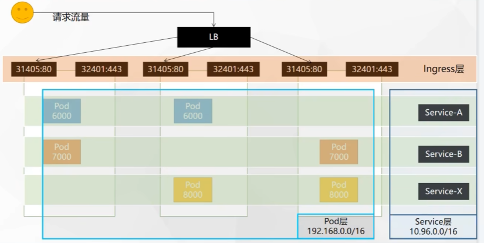
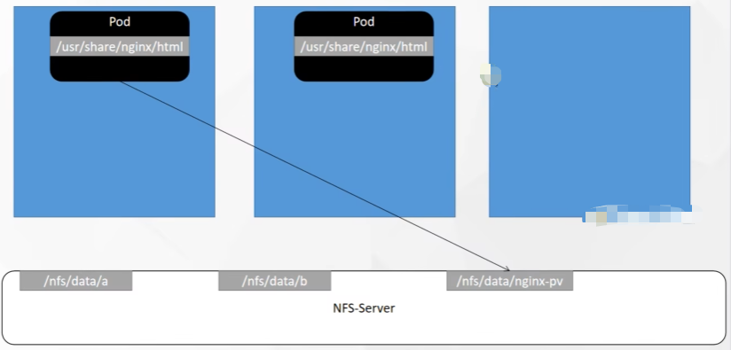
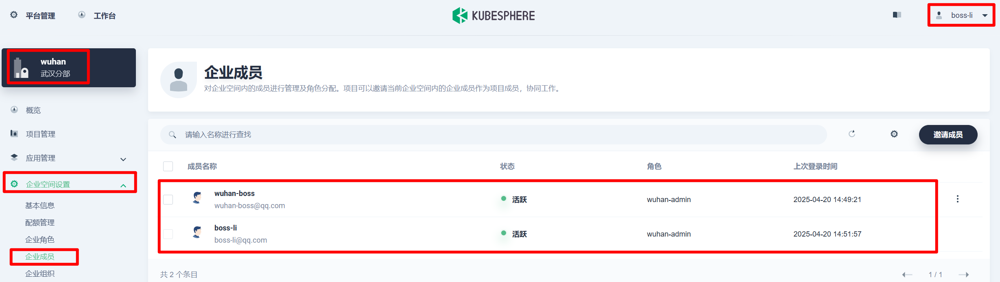

<!-- START doctoc generated TOC please keep comment here to allow auto update -->
<!-- DON'T EDIT THIS SECTION, INSTEAD RE-RUN doctoc TO UPDATE -->
**Table of Contents**  *generated with [DocToc](https://github.com/thlorenz/doctoc)*

- [1.云平台操作](#1%E4%BA%91%E5%B9%B3%E5%8F%B0%E6%93%8D%E4%BD%9C)
    - [1.1 云计算概念](#11-%E4%BA%91%E8%AE%A1%E7%AE%97%E6%A6%82%E5%BF%B5)
    - [1.2 云服务器开通](#12-%E4%BA%91%E6%9C%8D%E5%8A%A1%E5%99%A8%E5%BC%80%E9%80%9A)
    - [1.3 私有网络VPC实战](#13-%E7%A7%81%E6%9C%89%E7%BD%91%E7%BB%9Cvpc%E5%AE%9E%E6%88%98)
- [2.容器化基础](#2%E5%AE%B9%E5%99%A8%E5%8C%96%E5%9F%BA%E7%A1%80)
    - [2.1 centos下安装docker](#21-centos%E4%B8%8B%E5%AE%89%E8%A3%85docker)
    - [2.2 docker命令实战](#22-docker%E5%91%BD%E4%BB%A4%E5%AE%9E%E6%88%98)
      - [2.2.1 镜像相关命令](#221-%E9%95%9C%E5%83%8F%E7%9B%B8%E5%85%B3%E5%91%BD%E4%BB%A4)
      - [2.2.2 容器相关命令](#222-%E5%AE%B9%E5%99%A8%E7%9B%B8%E5%85%B3%E5%91%BD%E4%BB%A4)
      - [2.2.3 推送镜像到远程](#223-%E6%8E%A8%E9%80%81%E9%95%9C%E5%83%8F%E5%88%B0%E8%BF%9C%E7%A8%8B)
      - [2.2.4 其他常用命令](#224-%E5%85%B6%E4%BB%96%E5%B8%B8%E7%94%A8%E5%91%BD%E4%BB%A4)
    - [2.3 进阶实战](#23-%E8%BF%9B%E9%98%B6%E5%AE%9E%E6%88%98)
- [3.Kubernetes基础](#3kubernetes%E5%9F%BA%E7%A1%80)
  - [3.1 部署方式演变](#31-%E9%83%A8%E7%BD%B2%E6%96%B9%E5%BC%8F%E6%BC%94%E5%8F%98)
  - [3.2 kubernetes简介](#32-kubernetes%E7%AE%80%E4%BB%8B)
  - [3.3 Kubernetes架构](#33-kubernetes%E6%9E%B6%E6%9E%84)
    - [3.3.1 工作方式](#331-%E5%B7%A5%E4%BD%9C%E6%96%B9%E5%BC%8F)
    - [3.3.2 组件架构](#332-%E7%BB%84%E4%BB%B6%E6%9E%B6%E6%9E%84)
      - [3.3.2.1 控制平面组件（Control Plane Components）](#3321-%E6%8E%A7%E5%88%B6%E5%B9%B3%E9%9D%A2%E7%BB%84%E4%BB%B6control-plane-components)
      - [3.3.2.2 Node 组件](#3322-node-%E7%BB%84%E4%BB%B6)
      - [3.3.2.3 插件（Addons）](#3323-%E6%8F%92%E4%BB%B6addons)
  - [3.4 集群部署](#34-%E9%9B%86%E7%BE%A4%E9%83%A8%E7%BD%B2)
    - [3.4.1 开通云服务器](#341-%E5%BC%80%E9%80%9A%E4%BA%91%E6%9C%8D%E5%8A%A1%E5%99%A8)
    - [3.4.2 安装docker](#342-%E5%AE%89%E8%A3%85docker)
    - [3.4.3 安装kubeadm](#343-%E5%AE%89%E8%A3%85kubeadm)
    - [3.4.4 安装kubelet、kubeadm、kubectl](#344-%E5%AE%89%E8%A3%85kubeletkubeadmkubectl)
    - [3.4.5 使用kubeadm引导启动集群](#345-%E4%BD%BF%E7%94%A8kubeadm%E5%BC%95%E5%AF%BC%E5%90%AF%E5%8A%A8%E9%9B%86%E7%BE%A4)
        - [① 下载各个机器需要的镜像](#%E2%91%A0-%E4%B8%8B%E8%BD%BD%E5%90%84%E4%B8%AA%E6%9C%BA%E5%99%A8%E9%9C%80%E8%A6%81%E7%9A%84%E9%95%9C%E5%83%8F)
        - [② 初始化主节点](#%E2%91%A1-%E5%88%9D%E5%A7%8B%E5%8C%96%E4%B8%BB%E8%8A%82%E7%82%B9)
        - [③ 配置 kubectl（主节点执行）](#%E2%91%A2-%E9%85%8D%E7%BD%AE-kubectl%E4%B8%BB%E8%8A%82%E7%82%B9%E6%89%A7%E8%A1%8C)
        - [④ 安装网络插件（主节点执行）](#%E2%91%A3-%E5%AE%89%E8%A3%85%E7%BD%91%E7%BB%9C%E6%8F%92%E4%BB%B6%E4%B8%BB%E8%8A%82%E7%82%B9%E6%89%A7%E8%A1%8C)
        - [⑤ 加入node节点](#%E2%91%A4-%E5%8A%A0%E5%85%A5node%E8%8A%82%E7%82%B9)
        - [⑥ 部署dashboard](#%E2%91%A5-%E9%83%A8%E7%BD%B2dashboard)
  - [3.5 kubernetes核心实战](#35-kubernetes%E6%A0%B8%E5%BF%83%E5%AE%9E%E6%88%98)
    - [3.5.1  Kubernetes资源创建方式](#351--kubernetes%E8%B5%84%E6%BA%90%E5%88%9B%E5%BB%BA%E6%96%B9%E5%BC%8F)
    - [3.5.2 Namespace](#352-namespace)
    - [3.5.3 Pod](#353-pod)
      - [3.5.3.1 核心概念](#3531-%E6%A0%B8%E5%BF%83%E6%A6%82%E5%BF%B5)
      - [3.5.3.2 Pod相关命令](#3532-pod%E7%9B%B8%E5%85%B3%E5%91%BD%E4%BB%A4)
      - [3.5.3.3 可视化界面操作pod](#3533-%E5%8F%AF%E8%A7%86%E5%8C%96%E7%95%8C%E9%9D%A2%E6%93%8D%E4%BD%9Cpod)
      - [3.5.3.4 多容器pod](#3534-%E5%A4%9A%E5%AE%B9%E5%99%A8pod)
    - [3.5.4 deployment](#354-deployment)
      - [3.5.4.1 核心概念](#3541-%E6%A0%B8%E5%BF%83%E6%A6%82%E5%BF%B5)
      - [3.5.4.2 多副本](#3542-%E5%A4%9A%E5%89%AF%E6%9C%AC)
      - [3.5.4.3 扩缩容](#3543-%E6%89%A9%E7%BC%A9%E5%AE%B9)
      - [3.5.4.4 自愈](#3544-%E8%87%AA%E6%84%88)
      - [3.5.4.5 故障转移](#3545-%E6%95%85%E9%9A%9C%E8%BD%AC%E7%A7%BB)
      - [3.5.4.6 滚动更新](#3546-%E6%BB%9A%E5%8A%A8%E6%9B%B4%E6%96%B0)
      - [3.5.4.7 版本回退](#3547-%E7%89%88%E6%9C%AC%E5%9B%9E%E9%80%80)
    - [3.5.5 其他工作负载](#355-%E5%85%B6%E4%BB%96%E5%B7%A5%E4%BD%9C%E8%B4%9F%E8%BD%BD)
    - [3.5.6 Service](#356-service)
      - [3.5.6.1 `ClusterIP`模式](#3561-clusterip%E6%A8%A1%E5%BC%8F)
      - [3.5.6.2 `NodePort`模式](#3562-nodeport%E6%A8%A1%E5%BC%8F)
      - [3.5.6.3 核心总结](#3563-%E6%A0%B8%E5%BF%83%E6%80%BB%E7%BB%93)
    - [3.5.7 Ingress](#357-ingress)
      - [3.5.7.1 安装Ingress](#3571-%E5%AE%89%E8%A3%85ingress)
      - [3.5.7.2 创建演示所需的基础资源](#3572-%E5%88%9B%E5%BB%BA%E6%BC%94%E7%A4%BA%E6%89%80%E9%9C%80%E7%9A%84%E5%9F%BA%E7%A1%80%E8%B5%84%E6%BA%90)
      - [3.5.7.3 域名访问](#3573-%E5%9F%9F%E5%90%8D%E8%AE%BF%E9%97%AE)
      - [3.5.7.4 路径重写](#3574-%E8%B7%AF%E5%BE%84%E9%87%8D%E5%86%99)
      - [3.5.7.5 流量限制](#3575-%E6%B5%81%E9%87%8F%E9%99%90%E5%88%B6)
      - [3.5.7.6 网络模型架构](#3576-%E7%BD%91%E7%BB%9C%E6%A8%A1%E5%9E%8B%E6%9E%B6%E6%9E%84)
      - [3.5.7.7 核心概念总结](#3577-%E6%A0%B8%E5%BF%83%E6%A6%82%E5%BF%B5%E6%80%BB%E7%BB%93)
    - [3.5.8 存储抽象](#358-%E5%AD%98%E5%82%A8%E6%8A%BD%E8%B1%A1)
      - [3.5.8.1 基本概念](#3581-%E5%9F%BA%E6%9C%AC%E6%A6%82%E5%BF%B5)
      - [3.5.8.2 网络文件系统-nfs](#3582-%E7%BD%91%E7%BB%9C%E6%96%87%E4%BB%B6%E7%B3%BB%E7%BB%9F-nfs)
      - [3.5.8.3 原生方式数据挂载](#3583-%E5%8E%9F%E7%94%9F%E6%96%B9%E5%BC%8F%E6%95%B0%E6%8D%AE%E6%8C%82%E8%BD%BD)
      - [3.5.8.4 PV & PVC](#3584-pv--pvc)
        - [① 创建`pv`](#%E2%91%A0-%E5%88%9B%E5%BB%BApv)
        - [② `PVC`创建与绑定](#%E2%91%A1-pvc%E5%88%9B%E5%BB%BA%E4%B8%8E%E7%BB%91%E5%AE%9A)
        - [③ `Pod`绑定`PVC`](#%E2%91%A2-pod%E7%BB%91%E5%AE%9Apvc)
        - [④ 总结](#%E2%91%A3-%E6%80%BB%E7%BB%93)
      - [3.5.8.5 `ConfigMap`](#3585-configmap)
      - [3.5.8.6 Secret](#3586-secret)
- [4.`KubeSphere`平台安装](#4kubesphere%E5%B9%B3%E5%8F%B0%E5%AE%89%E8%A3%85)
  - [4.1 方式一：`Kubernetes`上安装`KubeSphere`](#41-%E6%96%B9%E5%BC%8F%E4%B8%80kubernetes%E4%B8%8A%E5%AE%89%E8%A3%85kubesphere)
    - [4.1.1 服务器搭建](#411-%E6%9C%8D%E5%8A%A1%E5%99%A8%E6%90%AD%E5%BB%BA)
    - [4.1.2 安装docker](#412-%E5%AE%89%E8%A3%85docker)
    - [4.1.3 安装`Kubernetes`](#413-%E5%AE%89%E8%A3%85kubernetes)
    - [4.1.4 安装`KubeSphere`前置环境](#414-%E5%AE%89%E8%A3%85kubesphere%E5%89%8D%E7%BD%AE%E7%8E%AF%E5%A2%83)
      - [4.1.4.1 nfs文件系统](#4141-nfs%E6%96%87%E4%BB%B6%E7%B3%BB%E7%BB%9F)
      - [4.1.4.2 配置默认存储](#4142-%E9%85%8D%E7%BD%AE%E9%BB%98%E8%AE%A4%E5%AD%98%E5%82%A8)
      - [4.1.4.3 metrics-server](#4143-metrics-server)
    - [4.1.5 安装`KubeSphere`](#415-%E5%AE%89%E8%A3%85kubesphere)
  - [4.2 方式二：`Linux`单节点部署`KubeSphere`](#42-%E6%96%B9%E5%BC%8F%E4%BA%8Clinux%E5%8D%95%E8%8A%82%E7%82%B9%E9%83%A8%E7%BD%B2kubesphere)
  - [4.3 `Linux`多节点部署`KubeSphere`](#43-linux%E5%A4%9A%E8%8A%82%E7%82%B9%E9%83%A8%E7%BD%B2kubesphere)
- [5.KubeSphere实战](#5kubesphere%E5%AE%9E%E6%88%98)
  - [5.1 多租户系统实战](#51-%E5%A4%9A%E7%A7%9F%E6%88%B7%E7%B3%BB%E7%BB%9F%E5%AE%9E%E6%88%98)
  - [5.2 中间件部署实战](#52-%E4%B8%AD%E9%97%B4%E4%BB%B6%E9%83%A8%E7%BD%B2%E5%AE%9E%E6%88%98)
    - [5.2.1 部署MySQL](#521-%E9%83%A8%E7%BD%B2mysql)
    - [5.2.2 部署`redis`](#522-%E9%83%A8%E7%BD%B2redis)
    - [5.2.3 部署ElasticSearch](#523-%E9%83%A8%E7%BD%B2elasticsearch)
    - [5.2.4 KubeSphere应用商店](#524-kubesphere%E5%BA%94%E7%94%A8%E5%95%86%E5%BA%97)
  - [5.3 RuoYi-Cloud部署实战](#53-ruoyi-cloud%E9%83%A8%E7%BD%B2%E5%AE%9E%E6%88%98)
- [4.使用 KubeSphere 简化 Kubernetes 集群部署](#4%E4%BD%BF%E7%94%A8-kubesphere-%E7%AE%80%E5%8C%96-kubernetes-%E9%9B%86%E7%BE%A4%E9%83%A8%E7%BD%B2)
- [5.使用 KubeSphere 简化 Kubernetes 集群与应用的管理](#5%E4%BD%BF%E7%94%A8-kubesphere-%E7%AE%80%E5%8C%96-kubernetes-%E9%9B%86%E7%BE%A4%E4%B8%8E%E5%BA%94%E7%94%A8%E7%9A%84%E7%AE%A1%E7%90%86)
- [5.DevOps 基础与实践](#5devops-%E5%9F%BA%E7%A1%80%E4%B8%8E%E5%AE%9E%E8%B7%B5)
- [5.微服务基础与实践](#5%E5%BE%AE%E6%9C%8D%E5%8A%A1%E5%9F%BA%E7%A1%80%E4%B8%8E%E5%AE%9E%E8%B7%B5)
- [6.使用KubeSphere 实现 Kubernetes 可观测性](#6%E4%BD%BF%E7%94%A8kubesphere-%E5%AE%9E%E7%8E%B0-kubernetes-%E5%8F%AF%E8%A7%82%E6%B5%8B%E6%80%A7)
- [7.KubeSphere 助力应用从云端走向边缘](#7kubesphere-%E5%8A%A9%E5%8A%9B%E5%BA%94%E7%94%A8%E4%BB%8E%E4%BA%91%E7%AB%AF%E8%B5%B0%E5%90%91%E8%BE%B9%E7%BC%98)

<!-- END doctoc generated TOC please keep comment here to allow auto update -->

原课程笔记：[云原生实战](https://www.yuque.com/leifengyang/oncloud)

> 当前笔记中的实验操作使用的服务器情况如下
>
> - 1-3章使用的linux服务器为Ubuntu
> - 4-8章使用的linux服务器为Centos

## 1.云平台操作

#### 1.1 云计算概念

国内常见云平台：阿里云、百度云、腾讯云、华为云、青云

国外常见云平台：亚马逊 AWS、微软 Azure

云平台优点：

- 环境统一

- 按需付费

- 即开即用

- 稳定性强

公有云：

- 购买云服务商提供的公共服务器

- 公有云是最常见的云计算部署类型。公有云资源（例如服务器和存储空间）由第三方云服务提供商拥有和运营，这些资源通过 Internet 提供。在公有云中，所有硬件、软件和其他支持性基础结构均为云提供商所拥有和管理。Microsoft Azure 是公有云的一个示例。

- 在公有云中，你与其他组织或云“租户”共享相同的硬件、存储和网络设备，并且你可以使用 Web 浏览器访问服务和管理帐户。公有云部署通常用于提供基于 Web 的电子邮件、网上办公应用、存储以及测试和开发环境。

- 公有云优势：

  - 成本更低：无需购买硬件或软件，仅对使用的服务付费。

  - 无需维护：维护由服务提供商提供。

  - 近乎无限制的缩放性：提供按需资源，可满足业务需求。

  - 高可靠性：具备众多服务器，确保免受故障影响。

私有云：

- 自己搭建云平台，或者购买

- 私有云由专供一个企业或组织使用的云计算资源构成。私有云可在物理上位于组织的现场数据中心，也可由第三方服务提供商托管。但是，在私有云中，服务和基础结构始终在私有网络上进行维护，硬件和软件专供组织使用。

- 这样，私有云可使组织更加方便地自定义资源，从而满足特定的 IT 需求。私有云的使用对象通常为政府机构、金融机构以及其他具备业务关键性运营且希望对环境拥有更大控制权的中型或大型组织。

- 私有云优势：

  - 灵活性更强：组织可自定义云环境以满足特定业务需求。

  - 控制力更强：资源不与其他组织共享，因此能获得更高的控制力以及更高的隐私级别。

  - 可伸缩性更强：与本地基础设施相比，私有云通常具有更强的可伸缩性。

公有云、私有云总结：没有一种云计算类型适用于所有人。多种不同的云计算模型、类型和服务已得到发展，可以满足组织快速变化的技术需求。部署云计算资源有三种不同的方法：公共云、私有云和混合云。采用的部署方法取决于业务需求。


安全组：

- 安全组在云计算中是一种虚拟防火墙，用于控制云服务器的入站和出站流量。每个安全组可以包含一系列规则，这些规则定义了允许或拒绝特定端口和IP地址的访问
- 安全组（Security Group） 是云计算环境中用于控制云服务器（如ECS、CVM、EC2等）网络流量的虚拟防火墙。它通过定义灵活的访问规则，限制进出云服务器的数据包，是保障云上资源安全的核心配置之一
- 安全组的核心作用
  - 流量控制
    - 入站规则（Inbound）：控制外部到云服务器的访问（如SSH、HTTP请求）
    - 出站规则（Outbound）：控制云服务器到外部的访问（如数据库外连、API调用）
  - 最小权限原则：默认拒绝所有流量，仅显式允许必要的通信，降低攻击面
  - 实例级防护：直接绑定到云服务器实例，无需依赖物理网络设备

- 安全组最佳实践
  - 按角色划分安全组
    - Web服务器组：放行80、443端口
    - 数据库组：仅允许内网IP访问3306（MySQL）端口
    - 跳板机组：仅允许特定IP访问22端口
  - 避免开放高危端口：如非必要，禁止开放22端口到公网，改用SSH密钥登录或VPN接入
  - 定期审计规则：清理未使用的规则，避免冗余配置导致安全风险

#### 1.2 云服务器开通

注册云平台：

- 阿里云：aliyun.com

- 腾讯云：cloud.tencent.com

- 华为云：cloud.huawei.com

- 青云：qingcloud.com

- 百度云：cloud.baidu.com

SSH客户端软件electerm 官网下载：https://electerm.github.io/electerm/

测试安装nginx并访问：

```bash
root@c3Z:~# sudo apt update
root@c3Z:~# sudo apt install nginx -y
root@c3Z:~# sudo systemctl start nginx
```

#### 1.3 私有网络VPC实战

子网计算：[在线网络计算器 | TCP/IP子网掩码计算换算 —在线工具](https://www.sojson.com/convert/subnetmask.html)

**公网IP、私有IP**：

- 云服务器实例，每个实例既有公网IP又有私有IP。公网IP用于外部访问，而私有IP用于内部网络通信。多个云服务器实例通过各自的公网IP对外提供服务，同时通过私有IP进行内部通信，比如在同一个VPC内。
- 私有IP通常是固定的。在大多数情况下，当用户创建一个云服务器实例并分配了私有IP后，这个IP地址在实例的生命周期内是不会改变的，除非用户主动释放实例或者重新配置网络。私有IP用于内部通信，比如在同一VPC内的不同实例之间通信，所以稳定性很重要。比如，AWS的EC2实例一旦启动，私有IP默认是固定的，除非实例被终止。私有IP用于内部通信（如数据库主从同步、微服务调用）,这些场景依赖私有IP的稳定性，避免因IP变动导致服务中断。
- 公网IP一般会发生变动。有的云服务提供固定的公网IP，称为弹性IP（比如AWS的Elastic IP），用户可以将其绑定到实例上，即使实例停止或重启，这个IP也不会变。但如果不使用弹性IP，普通的公网IP可能在实例重启或停止后发生变化。例如，阿里云的按量付费实例默认分配的公网IP是动态的，如果实例被释放，IP也会释放。而如果用户购买了弹性公网IP，就可以长期保留并绑定到不同的实例上。
- 云服务器可能组成一个集群，每个服务器都有独立的公网IP供用户访问，而私有IP用于服务器之间的内部数据传输或负载均衡。这种情况下，公网IP用于接收外部请求，私有IP用于内部的服务发现或数据库访问。


**虚拟私有云（VPC）**：

- 私有网络（Virtual Private Cloud, VPC） 是云计算中用于构建隔离虚拟网络环境的核心服务，允许用户在云上自定义逻辑隔离的网络空间，实现与传统数据中心类似的安全性和可控性。

- VPC允许用户在公有云中创建一个隔离的虚拟网络环境，这样他们可以在里面部署资源，比如虚拟机、数据库，同时保证这些资源的安全性和私密性。

- 传统网络和VPC的区别：传统的数据中心网络是物理隔离的，而VPC通过虚拟化技术实现逻辑隔离。

- 子网划分：子网划分是VPC的关键特性。用户可以根据需要将VPC分成多个子网。公有子网和私有子网的区别：公有子网可能有互联网网关，允许外部访问，而私有子网则通过NAT网关或实例来间接访问互联网，这样更安全。

- 路由表和安全组：每个子网都有自己的路由表，控制流量走向。安全组和网络ACL则负责不同层次的访问控制。安全组是实例级别的防火墙，状态化的，而网络ACL是子网级别的，无状态的，需要分别解释清楚。

- VPC核心概念与功能：

  - 网络隔离：VPC在公有云的多租户环境中为用户提供私有化网络，通过虚拟化技术实现与其他用户的资源隔离，确保数据安全。

  - 灵活的网络设计：

    - 子网划分：将VPC划分为多个子网（Subnet），例如：
      - 公有子网：允许直接通过互联网访问（如托管Web服务器）。
      - 私有子网：仅内部访问，需通过NAT网关或代理连接外网（如数据库）。
      - 自定义IP地址段：用户可自由分配CIDR地址块（如 `10.0.0.0/16`）。

  - 安全控制：

    - 安全组（Security Group）：充当虚拟防火墙，控制实例级别的入站/出站流量（如仅允许HTTP端口80）。
    - 网络访问控制列表（Network ACL）：子网级别的流量过滤规则（无状态，支持允许/拒绝特定IP或端口）。

  - 网络连接扩展：

    - VPC对等连接（Peering）：不同VPC之间建立私有连接，实现跨VPC资源互通。
    - VPN/专线连接：通过IPSec VPN或云服务商专线（如AWS Direct Connect、阿里云Express Connect），将VPC与本地数据中心连接，构建混合云。

  - 路由控制：自定义路由表（Route Table）定义子网流量的路径，例如：

    - 将互联网流量指向互联网网关（IGW）

    - 私有子网流量通过NAT网关访问外网


VPC网络隔离：


## 2.容器化基础

#### 2.1 centos下安装docker

参照如下文档：https://docs.docker.com/engine/install/centos/

1.移除以前docker相关包

```bash
# 移除以前docker相关包
sudo yum remove docker \
                  docker-client \
                  docker-client-latest \
                  docker-common \
                  docker-latest \
                  docker-latest-logrotate \
                  docker-logrotate \
                  docker-engine
```

2.配置yum源

```bash
sudo yum install -y yum-utils
sudo yum-config-manager \
--add-repo \
http://mirrors.aliyun.com/docker-ce/linux/centos/docker-ce.repo
```

3.安装docker

```bash
sudo yum install -y docker-ce docker-ce-cli containerd.io

#以下是在安装k8s的时候使用
yum install -y docker-ce-20.10.7 docker-ce-cli-20.10.7  containerd.io-1.4.6
```

4.启动

```bash
systemctl enable docker --now
```

5.配置加速：这里额外添加了docker的生产环境核心配置cgroup

```bash
sudo mkdir -p /etc/docker
sudo tee /etc/docker/daemon.json <<-'EOF'
{
  "registry-mirrors": ["https://82m9ar63.mirror.aliyuncs.com"],
  "exec-opts": ["native.cgroupdriver=systemd"],
  "log-driver": "json-file",
  "log-opts": {
    "max-size": "100m"
  },
  "storage-driver": "overlay2"
}
EOF
sudo systemctl daemon-reload
sudo systemctl restart docker
```

#### 2.2 docker命令实战


##### 2.2.1 镜像相关命令

```bash
docker pull nginx  #下载最新版

镜像名:版本名（标签）

docker pull nginx:1.20.1


docker pull redis  #下载最新
docker pull redis:6.2.4

## 下载来的镜像都在本地
docker images  #查看所有镜像

redis = redis:latest

# 删除镜像
docker rmi 镜像名:版本号/镜像id
```

提交改变：

```bash
# 提交改变
# docker commit [OPTIONS] CONTAINER [REPOSITORY[:TAG]]
docker commit -a "leifengyang"  -m "首页变化" 341d81f7504f guignginx:v1.0
```

镜像传输：

```bash
# 将镜像保存成压缩包
# 将经过修改的镜像保存成压缩包
docker save -o abc.tar guignginx:v1.0

# 别的机器加载这个镜像
docker load -i abc.tar

# 离线安装
```

##### 2.2.2 容器相关命令

```bash
# 启动容器
# docker run [OPTIONS] IMAGE [COMMAND] [ARG...]
# 【docker run  设置项   镜像名  】 镜像启动运行的命令（镜像里面默认有的，一般不会写）

# -d：后台运行
# --restart=always: 开机自启
docker run --name=mynginx   -d  --restart=always -p  88:80   nginx

# 查看正在运行的容器
docker ps
# 查看所有
docker ps -a
# 删除停止的容器
docker rm  容器id/名字
docker rm -f mynginx   #强制删除正在运行中的

#停止容器
docker stop 容器id/名字
#再次启动
docker start 容器id/名字

# 应用开机自启
# docker run的时候没有设置自动重启的话，也可以通过docker update进行设置
docker update 容器id/名字 --restart=always
```

端口映射：允许容器内的服务通过宿主机的端口被访问

```bash
# 使用 docker run 命令时，通过 -p 或 --publish 参数指定端口映射
docker run -p [宿主机端口]:[容器端口] [镜像名]

# 将容器内部的 80 端口映射到宿主机的 8080 端口
docker run -p 8080:80 nginx
# 访问方式：http://宿主机IP:8080

# 查看已映射的端口
docker port [容器名或ID]
```


修改容器内容：

```bash
# 进入容器内部的系统，修改容器内容
docker exec -it 容器id  /bin/bash


# 挂载数据到外部修改
docker run --name=mynginx   \
-d  --restart=always \
-p  88:80 -v /data/html:/usr/share/nginx/html:ro  \
nginx
# 修改页面只需要去 主机的 /data/html
```

提交改变：

```bash
# 提交改变
# docker commit [OPTIONS] CONTAINER [REPOSITORY[:TAG]]
docker commit -a "leifengyang"  -m "首页变化" 341d81f7504f guignginx:v1.0
```

镜像传输：

```bash
# 将镜像保存成压缩包
# 将经过修改的镜像保存成压缩包
docker save -o abc.tar guignginx:v1.0

# 别的机器加载这个镜像
docker load -i abc.tar

# 离线安装
```

##### 2.2.3 推送镜像到远程

提交改变：

```bash
# 提交改变
# docker commit [OPTIONS] CONTAINER [REPOSITORY[:TAG]]
docker commit -a "leifengyang"  -m "首页变化" 341d81f7504f guignginx:v1.0
```

推送镜像到docker hub（注册后可以创建公共仓库、私有仓库，类似GitHub）

```bash
# 推送镜像到docker hub
# docker tag local-image:tagname new-repo:tagname
# docker push new-repo:tagname

# 把旧镜像的名字，改成仓库要求的新版名字
# docker tag 本地镜像名称 符合仓库要求的命名
docker tag guignginx:v1.0 lsl/guignginx:v1.0

# 登录到docker hub
docker login       

docker logout（推送完成镜像后退出）

# 推送
docker push leifengyang/guignginx:v1.0

# 别的机器下载
docker pull leifengyang/guignginx:v1.0
```

##### 2.2.4 其他常用命令

```bash
# 日志查看
# docker logs 容器名/id   排错

# 进入容器
# docker exec -it 容器id /bin/bash

# docker 经常修改nginx配置文件，可挂载到外部修改
docker run -d -p 80:80 \
-v /data/html:/usr/share/nginx/html:ro \
-v /data/conf/nginx.conf:/etc/nginx/nginx.conf \
--name mynginx-02 \
nginx


#把容器指定位置的东西复制出来 
docker cp 5eff66eec7e1:/etc/nginx/nginx.conf  /data/conf/nginx.conf
#把外面的内容复制到容器里面
docker cp  /data/conf/nginx.conf  5eff66eec7e1:/etc/nginx/nginx.conf
```

#### 2.3 进阶实战

1.编写自己的应用：编写一个HelloWorld应用

2.将应用打包成镜像：编写Dockerfile将自己的应用打包镜像

```bash
1.以前
            Java为例
            SpringBoot打包成可执行jar
            把jar包上传给服务
            服务器运行java -jar
2.现在
            所有机器都安装Docker，任何应用都是镜像，所有机器都可以运行
            
            
3.打包-Dockerfile
# Dockerfile内容如下：
FROM openjdk:8-jdk-slim
LABEL maintainer=myname
COPY target/*.jar   /app.jar
ENTRYPOINT ["java","-jar","/app.jar"]

4.构建镜像
# docker build -t java-demo:v1.0 .
```

3.部署中间件

```bash
# 部署一个Redis+应用，尝试应用操作Redis产生数据

docker run [OPTIONS] IMAGE [COMMAND] [ARG...]

# redis使用自定义配置文件启动

docker run -v /data/redis/redis.conf:/etc/redis/redis.conf \
-v /data/redis/data:/data \
-d --name myredis \
-p 6379:6379 \
redis:latest  redis-server /etc/redis/redis.conf
```


4.启动应用容器

```bash
# 启动应用容器
docker run -d -p 8080:8080 --name myjava-app java-demo:v1.0 

# 分享镜像

# 登录docker hub
docker login
#给旧镜像起名
docker tag java-demo:v1.0  leifengyang/java-demo:v1.0
# 推送到docker hub
docker push leifengyang/java-demo:v1.0

# 别的机器
docker pull leifengyang/java-demo:v1.0
# 别的机器运行
docker run -d -p 8080:8080 --name myjava-app java-demo:v1.0 
```

## 3.Kubernetes基础

### 3.1 部署方式演变


**传统部署时代**：

- 早期，各个组织是在物理服务器上运行应用程序。由于无法限制在物理服务器中运行的应用程序资源使用，因此会导致资源分配问题。例如，如果在同一台物理服务器上运行多个应用程序，则可能会出现一个应用程序占用大部分资源的情况，而导致其他应用程序的性能下降。一种解决方案是将每个应用程序都运行在不同的物理服务器上，但是当某个应用程序资源利用率不高时，剩余资源无法被分配给其他应用程序，而且维护许多物理服务器的成本很高。

**虚拟化部署时代**：

- 因此，虚拟化技术被引入了。虚拟化技术允许你在单个物理服务器的 CPU 上运行多台虚拟机（VM）。虚拟化能使应用程序在不同 VM 之间被彻底隔离，且能提供一定程度的安全性，因为一个应用程序的信息不能被另一应用程序随意访问。

- 虚拟化技术能够更好地利用物理服务器的资源，并且因为可轻松地添加或更新应用程序，而因此可以具有更高的可扩展性，以及降低硬件成本等等好处。通过虚拟化，你可以将一组物理资源呈现为可丢弃的虚拟机集群。

- 每个 VM 是一台完整的计算机，在虚拟化硬件之上运行所有组件，包括其自己的操作系统。

**容器部署时代**：

- 容器类似于 VM，但是更宽松的隔离特性，使容器之间可以共享操作系统（OS）。因此，容器比起 VM 被认为是更轻量级的。且与 VM 类似，每个容器都具有自己的文件系统、CPU、内存、进程空间等。由于它们与基础架构分离，因此可以跨云和 OS 发行版本进行移植。容器的出现解决了应用和基础环境异构的问题，让应用可以做到一次构建，多次部署。不可否认容器是打包和运行应用程序的好方式，因此容器方式部署变得流行起来。但随着容器部署流行，仅仅基于容器的部署仍有一些问题没有解决：

  - 生产环境中，你需要管理运行着应用程序的容器，并确保服务不会下线。例如，如果一个容器发生故障，则你需要启动另一个容器。

  - 高并发时，你需要启动多个应用程序容器为系统提高高可用，并保证多个容器能负载均衡。

  - 在维护、升级版本时，你需要将运行应用程序容器从新部署，部署时必须对之前应用容器备份，一旦出现错误，需要手动启动之前容器保证系统运行。


如果以上行为交由给系统处理，是不是会更容易一些？那么谁能做到这些？我们急需一个大规模容器编排系统——kubernetes

### 3.2 kubernetes简介

kubernetes —— 大规模容器编排系统

kubernetes具有以下特性：

- **服务发现和负载均衡**：Kubernetes 可以使用 DNS 名称或自己的 IP 地址公开容器，如果进入容器的流量很大， Kubernetes 可以负载均衡并分配网络流量，从而使部署稳定。
- **存储编排**：Kubernetes 允许你自动挂载你选择的存储系统，例如本地存储、公共云提供商等。
- **自动部署和回滚**：你可以使用 Kubernetes 描述已部署容器的所需状态，它可以以受控的速率将实际状态 更改为期望状态。例如，你可以自动化 Kubernetes 来为你的部署创建新容器， 删除现有容器并将它们的所有资源用于新容器。
- **自动完成装箱计算**：Kubernetes 允许你指定每个容器所需 CPU 和内存（RAM）。 当容器指定了资源请求时，Kubernetes 可以做出更好的决策来管理容器的资源。
- **自我修复**：Kubernetes 重新启动失败的容器、替换容器、杀死不响应用户定义的 运行状况检查的容器，并且在准备好服务之前不将其通告给客户端。
- **密钥与配置管理**：Kubernetes 允许你存储和管理敏感信息，例如密码、OAuth 令牌和 ssh 密钥。 你可以在不重建容器镜像的情况下部署和更新密钥和应用程序配置，也无需在堆栈配置中暴露密钥。

Kubernetes 提供了一个可弹性运行分布式系统的框架。 Kubernetes 会满足扩展要求、故障转移、部署模式等。 例如，Kubernetes 可以轻松管理系统的 Canary 部署。

### 3.3 Kubernetes架构

#### 3.3.1 工作方式

Kubernetes Cluster = N Master Node + N Worker Node：N主节点+N工作节点； N>=1

#### 3.3.2 组件架构


类比：


工作流程图：


##### 3.3.2.1 控制平面组件（Control Plane Components）

控制平面组件会为集群做出全局决策，比如资源的调度。以及检测和响应集群事件（例如，当不满足部署的 `replicas` 字段时，启动新的 pod）。更多信息可参考 [pod文档](https://kubernetes.io/zh-cn/docs/concepts/workloads/pods/)。

> 控制平面组件可以在集群中的任何节点上运行。然而，为了简单起见，设置脚本通常会在同一个计算机上启动所有控制平面组件，并且不会在此计算机上运行用户容器。

主要的控制平面组件包括：

**kube-apiserver**：

API server是 Kubernetes 控制平面的组件，该组件负责公开了 Kubernetes API，负责处理接受请求的工作。API server 是 Kubernetes 控制平面的前端。Kubernetes API 服务器的主要实现是 `kube-apiserver`。`kube-apiserver` 设计上考虑了水平扩展，也就是说，它可以通过部署多个实例来进行扩展。你可以运行 `kube-apiserver` 的多个实例，并在这些实例之间平衡流量。

**etcd**：

一致且高度可用的键值存储，用作 Kubernetes 所有集群数据的后台数据库。

**kube-scheduler**：

`kube-scheduler` 是控制平面的组件，负责监视新创建的、未指定运行节点的 Pods，并选择节点让 Pod 在上面运行。调度决策考虑的因素包括：单个 Pod 及 Pods 集合的资源需求、软硬件及策略约束、亲和性及反亲和性规范、数据位置、工作负载间的干扰和最后时限。

**kube-controller-manager**：

`kube-controller-manager` 是控制平面的组件，负责运行控制器进程。从逻辑上讲，每个控制器都是一个单独的进程，但是为了降低复杂性，它们都被编译到同一个可执行文件，并在同一个进程中运行。

这些控制器包括：

- 节点控制器（Node Controller）：负责在节点出现故障时进行通知和响应
- 任务控制器（Job Controller）：监测代表一次性任务的 Job 对象，然后创建 Pods 来运行这些任务直至完成
- 端点分片控制器（EndpointSlice controller）：填充端点分片（EndpointSlice）对象（以提供 Service 和 Pod 之间的链接）
- 服务账号控制器（ServiceAccount controller）：为新的命名空间创建默认的服务账号（ServiceAccount）

**cloud-controller-manager（optional 可选）**：

一个 Kubernetes 控制平面组件，嵌入了特定于云平台的控制逻辑。云控制器管理器（Cloud Controller Manager）允许你将你的集群连接到云提供商的 API 之上，并将与该云平台交互的组件同与你的集群交互的组件分离开来。

`cloud-controller-manager` 仅运行特定于云平台的控制器。如果你在自己的环境中运行 Kubernetes，或者在本地计算机中运行学习环境，所部署的集群不需要有云控制器管理器。与 `kube-controller-manager` 类似，`cloud-controller-manager` 将若干逻辑上独立的控制回路组合到同一个可执行文件中，供你以同一进程的方式运行。你可以对其执行水平扩容（运行多个副本）以提升性能或者增强容错能力。

下面的控制器都包含对云平台驱动的依赖：

- 节点控制器（Node Controller）：用于在节点终止响应后检查云提供商以确定节点是否已被删除
- 路由控制器（Route Controller）：用于在底层云基础架构中设置路由
- 服务控制器（Service Controller）：用于创建、更新和删除云提供商负载均衡器

> 注意：cloud-controller-manager 是为了让云提供商代码和 Kubernetes 核心代码能够独立演进而设计的。原本位于 kube-controller-manager 中的云提供商相关的代码被移至 cloud-controller-manager 中，并允许云厂商将其与 Kubernetes 分开独立开发。

##### 3.3.2.2 Node 组件

节点组件会在每个节点上运行，负责维护运行的 Pod 并提供 Kubernetes 运行环境。

**kubelet**：

- `kubelet` 会在集群中每个节点（node）上运行。它保证容器（containers）都运行在 Pods 中。

- kubelet 接收一组通过各类机制提供给它的 PodSpecs，确保这些 PodSpecs 中描述的容器处于运行状态且健康。kubelet 不会管理不是由 Kubernetes 创建的容器。

**kube-proxy**：

- `kube-proxy` 是集群中每个节点（node）上所运行的网络代理，实现 Kubernetes 服务（Service）概念的一部分。

- kube-proxy 维护节点上的一些网络规则，这些网络规则会允许从集群内部或外部的网络会话与 Pod 进行网络通信。

- 如果操作系统提供了可用的数据包过滤层，则 kube-proxy 会通过它来实现网络规则。否则，kube-proxy 仅做流量转发。

**容器运行时（Container Runtime）**：

- 容器运行时是负责运行容器的软件。

- Kubernetes 支持许多容器运行时，例如 containerd、CRI-O、Docker 以及 Kubernetes CRI 的其他任何实现。

##### 3.3.2.3 插件（Addons）

插件使用 Kubernetes 资源（DaemonSet、Deployment 等）实现集群功能。因为这些插件提供集群级别的功能，所以插件的命名空间资源属于 `kube-system` 命名空间。

**DNS**：

尽管其他插件都并非严格意义上的必需组件，但几乎所有 Kubernetes 集群都应该有集群 DNS，因为很多示例都需要 DNS 服务。

集群 DNS 是一个 DNS 服务器，和环境中的其他 DNS 服务器一起工作，为 Kubernetes 服务提供 DNS 记录。

**Web 界面（仪表盘）**：

Dashboard 是 Kubernetes 集群的通用的、基于 Web 的用户界面。它使用户可以管理集群中运行的应用程序以及集群本身，并进行故障排除。

**容器资源监控**：

容器资源监控将关于容器的一些常见的时间序列度量值保存到一个集中的数据库中，并提供浏览这些数据的界面。

**集群层面日志**：

集群层面日志机制负责将容器的日志数据保存到一个集中的日志存储中，这种集中日志存储提供搜索和浏览接口。

### 3.4 集群部署

集群安装逻辑：


#### 3.4.1 开通云服务器

开通3台阿里云ECS服务器

- 创建ECS实例：创建3台ECS实例（1台作为Master节点，2台作为Worker节点）
- 计费模式：选择按量付费以灵活控制成本15
- 配置建议：
  - Master节点：建议2核4G及以上配置
  - Worker节点：根据应用需求选择（如2核4G）
  - 镜像：推荐使用CentOS 7或Ubuntu 20.04
- 网络配置：选择VPC网络，并分配公网IP（可选按流量计费带宽）
- 安全组配置：开放以下端口以确保集群通信：
  - Master节点：6443（API Server）、2379-2380（etcd）、10250-10252（kubelet）
  - Worker节点：30000-32767（NodePort服务）68

#### 3.4.2 安装docker

> 请为所有机器安装Docker

ubuntu安装docker：https://docs.docker.com/engine/install/ubuntu/

1.运行以下命令来卸载所有冲突的包

```bash
# 运行以下命令来卸载所有冲突的包：
root@gxZ:~# for pkg in docker.io docker-doc docker-compose docker-compose-v2 podman-docker containerd runc; do sudo apt-get remove $pkg; done
```

2.使用`apt`存储库安装

2.1 设置 Docker 的`apt`存储库

```bash
# 设置 Docker 的apt存储库
# 设置 Docker 的apt存储库 Add Docker's official GPG key:
root@gxZ:~# sudo apt-get update
root@gxZ:~# sudo apt-get install ca-certificates curl
root@gxZ:~# sudo install -m 0755 -d /etc/apt/keyrings

# 替换 Docker GPG 密钥下载源为阿里云（区别于官方文档）
root@gxZ:~# sudo curl -fsSL https://mirrors.aliyun.com/docker-ce/linux/ubuntu/gpg -o /etc/apt/keyrings/docker.asc
root@gxZ:~# sudo chmod a+r /etc/apt/keyrings/docker.asc

# Add the repository to Apt sources（替换 Docker 仓库源为阿里云）
root@gxZ:~# echo \
  "deb [arch=$(dpkg --print-architecture) signed-by=/etc/apt/keyrings/docker.asc] https://mirrors.aliyun.com/docker-ce/linux/ubuntu \
  $(lsb_release -cs) stable" | sudo tee /etc/apt/sources.list.d/docker.list > /dev/null
  
root@gxZ:~# sudo apt-get update
```

2.2 安装 Docker 包

```bash
# 要安装最新版本，请运行
root@gxZ:~# sudo apt-get install docker-ce docker-ce-cli containerd.io docker-buildx-plugin docker-compose-plugin


# 安装 Docker CE 20.10.7 和 containerd.io 1.4.6
sudo apt-get install -y \
  docker-ce=5:20.10.7~3-0~ubuntu-$(lsb_release -cs) \
  docker-ce-cli=5:20.10.7~3-0~ubuntu-$(lsb_release -cs) \
  containerd.io=1.4.6-1
```

2.3 配置案阿里云镜像加速

```bash
root@gxZ:~# sudo mkdir -p /etc/docker
sudo tee /etc/docker/daemon.json <<-'EOF'
{
  "registry-mirrors": ["https://ksfsxcjk.mirror.aliyuncs.com"]
}
EOF
sudo systemctl daemon-reload
sudo systemctl restart docker

root@iZwz9761m4nyjfjgc68wgxZ:~#
```

3.通过运行镜像来验证安装是否成功`hello-world`

```bash
root@gxZ:~# sudo docker run hello-world
```

4.设置开机自启动

```bash
systemctl enable docker --now
```

#### 3.4.3 安装kubeadm

**安装kubeadm说明**：

- 一台兼容的 Linux 主机。Kubernetes 项目为基于 Debian 和 Red Hat 的 Linux 发行版以及一些不提供包管理器的发行版提供通用的指令
- 每台机器 2 GB 或更多的 RAM （如果少于这个数字将会影响你应用的运行内存)
- 2 CPU 核或更多

- 集群中的所有机器的网络彼此均能相互连接(公网和内网都可以)
  - 解决方法：设置防火墙放行规则
- 节点之中不可以有重复的主机名、MAC 地址或 product_uuid。
  - 解决方法：设置不同hostname
- 开启机器上的某些端口
  - 解决方法：内网互信

- 禁用交换分区。为了保证 kubelet 正常工作， 必须 禁用交换分区
  - 解决方法：永久关闭


**基础环境安装**：所有linux机器执行以下操作

1.为每台服务器设置主机名

```bash
# 各个机器设置自己的域名 (使用 hostnamectl 设置永久主机名)
# 替换为对应节点的主机名（如 k8s-worker1, k8s-worker2）
root@gxZ:~# sudo hostnamectl set-hostname k8s-master
root@gyZ:~# sudo hostnamectl set-hostname k8s-worker1
root@gwZ:~# sudo hostnamectl set-hostname k8s-worker2

# 验证主机名
hostnamectl status  # 显示当前主机名
hostname            # 查看当前生效的主机名
```

2.将 SELinux 设置为 permissive 模式（相当于将其禁用）

```bash
# 将 SELinux 设置为 permissive 模式（相当于将其禁用）
sudo setenforce 0
sudo sed -i 's/^SELINUX=enforcing$/SELINUX=permissive/' /etc/selinux/config

# 说明：当前ubuntu系统可以不需要这一步
```

3.关闭swap

```bash
#关闭swap
sudo swapoff -a            # 临时关闭
sudo sed -i '/swap/s/^/#/' /etc/fstab  # 永久注释 Swap
```

4.允许 iptables 检查桥接流量

```bash
#允许 iptables 检查桥接流量
cat <<EOF | sudo tee /etc/modules-load.d/k8s.conf
br_netfilter
EOF

# 创建 Kubernetes 网络配置
cat <<EOF | sudo tee /etc/sysctl.d/k8s.conf
net.bridge.bridge-nf-call-ip6tables = 1
net.bridge.bridge-nf-call-iptables = 1
net.ipv4.ip_forward = 1
EOF

# 应用配置
sudo sysctl --system
```

#### 3.4.4 安装kubelet、kubeadm、kubectl

安装集群三大件：kubelet、kubeadm、kubectl

在 Ubuntu 系统上安装 kubelet、kubeadm 和 kubectl 的步骤如下（所有linux机器都执行）：

1.更新系统并安装依赖

```bash
root@gxZ:~# sudo apt-get update
root@gxZ:~# sudo apt-get install -y apt-transport-https ca-certificates curl
```

2.添加 Kubernetes 官方 GPG 密钥和阿里云镜像源

```bash
# 添加 GPG 密钥
root@gyZ:~# curl -fsSL https://mirrors.aliyun.com/kubernetes/apt/doc/apt-key.gpg | sudo apt-key add -

# 添加阿里云 Kubernetes 镜像源
root@iZwz9761m4nyjfjgc68wgwZ:~# cat <<EOF | sudo tee /etc/apt/sources.list.d/kubernetes.list
deb https://mirrors.aliyun.com/kubernetes/apt/ kubernetes-xenial main
EOF

# 更新软件包列表
sudo apt-get update
```

3.安装指定版本的 kubelet、kubeadm、kubectl

```bash
# 当前实验安装版本
# Ubuntu 命令（需提前配置阿里云 Kubernetes APT 源）
sudo apt-get install -y kubelet=1.20.9-00 kubeadm=1.20.9-00 kubectl=1.20.9-00
# 锁定版本（防止自动升级）
sudo apt-mark hold kubelet kubeadm kubectl
# 启动并启用 kubelet 服务（Ubuntu 与 CentOS 相同）
sudo systemctl enable --now kubelet
```

4.验证安装

```bash
# 检查版本
kubeadm version
kubectl version --client
kubelet --version

# 查看 kubelet 服务状态
sudo systemctl status kubelet
```

#### 3.4.5 使用kubeadm引导启动集群

###### ① 下载各个机器需要的镜像

1.下载各个机器需要的镜像

```bash
# 所有节点执行
# 前提是安装了Docker，且Docker服务已经启动
# 创建镜像下载脚本（Ubuntu 与 CentOS 命令相同）
sudo tee ./images.sh <<-'EOF'
#!/bin/bash
images=(
kube-apiserver:v1.20.9
kube-proxy:v1.20.9
kube-controller-manager:v1.20.9
kube-scheduler:v1.20.9
coredns:1.7.0
etcd:3.4.13-0
pause:3.2
)
for imageName in ${images[@]} ; do
  docker pull registry.cn-hangzhou.aliyuncs.com/lfy_k8s_images/$imageName
done
EOF

# 执行脚本（需已安装 Docker）
chmod +x ./images.sh && sudo ./images.sh
```

###### ② 初始化主节点

2.初始化主节点

```bash
# 添加主节点域名映射（所有节点执行）
# 所有机器添加master域名映射，以下需要修改为自己的
# 修改 IP 和域名为你实际的主节点内网 IP（Ubuntu 与 CentOS 命令相同）
echo "172.31.0.4  cluster-endpoint" | sudo tee -a /etc/hosts
# 添加完映射之后其他节点都可以通过域名ping通主节点
root@k8s-worker1:~# ping cluster-endpoint


# 执行 kubeadm 初始化（仅在主节点执行）
sudo kubeadm init \
  --apiserver-advertise-address=172.31.0.4 \
  --control-plane-endpoint=cluster-endpoint \
  --image-repository registry.cn-hangzhou.aliyuncs.com/lfy_k8s_images \
  --kubernetes-version v1.20.9 \
  --service-cidr=10.96.0.0/16 \
  --pod-network-cidr=192.168.0.0/16
# service-cidr、pod-network-cidr注意事项：尽量用这个。如果修改的话，也要保证所有网络范围不重叠

# --apiserver-advertise-address=172.31.0.4：指定API服务器对外通告的IP地址，这里设置为Master节点的内网IP，其他节点通过这个地址与API服务器通信。

# --control-plane-endpoint=cluster-endpoint：设置控制平面的端点地址，这里使用之前映射的主机名cluster-endpoint。
# 这个参数用于高可用集群，即使只有一个主节点，也可以为未来扩展预留配置，通过DNS或负载均衡器指向多个控制平面节点。

# --image-repository registry.cn-hangzhou.aliyuncs.com/lfy_k8s_images：指定拉取Kubernetes组件镜像的镜像仓库。
# 默认情况下，kubeadm会从k8s.gcr.io拉取镜像，但国内访问可能较慢或不稳定，因此使用阿里云的镜像仓库加速下载。

# --kubernetes-version v1.20.9：明确指定安装的Kubernetes版本，确保版本一致性，避免自动安装最新版可能带来的兼容性问题。

# --service-cidr=10.96.0.0/16：设置Service的CIDR范围，Kubernetes会为Service分配Cluster IP，此参数定义了这个IP段。
# 默认是10.96.0.0/12，但用户指定了更小的子网10.96.0.0/16，可能有网络规划的需要。
# 注意事项：默认 10.96.0.0/12，需确保不与物理网络或其他虚拟网络冲突。

# --pod-network-cidr=192.168.0.0/16：定义Pod网络的CIDR，不同网络插件需要不同的CIDR设置。例如，Calico默认使用192.168.0.0/16，而Flannel常用10.244.0.0/16。这里设置的CIDR需要与后续安装的网络插件配置一致，否则Pod之间无法通信


# 执行 kubeadm 初始化命令后会有如下输出，这些输出最好复制并保留（后续可能用到）
Your Kubernetes control-plane has initialized successfully!

To start using your cluster, you need to run the following as a regular user:

  mkdir -p $HOME/.kube
  sudo cp -i /etc/kubernetes/admin.conf $HOME/.kube/config
  sudo chown $(id -u):$(id -g) $HOME/.kube/config

Alternatively, if you are the root user, you can run:

  export KUBECONFIG=/etc/kubernetes/admin.conf

You should now deploy a pod network to the cluster.
Run "kubectl apply -f [podnetwork].yaml" with one of the options listed at:
  https://kubernetes.io/docs/concepts/cluster-administration/addons/

You can now join any number of control-plane nodes by copying certificate authorities
and service account keys on each node and then running the following as root:

  kubeadm join cluster-endpoint:6443 --token hums8f.vyx71prsg74ofce7 \
    --discovery-token-ca-cert-hash sha256:a394d059dd51d68bb007a532a037d0a477131480ae95f75840c461e85e2c6ae3 \
    --control-plane 

Then you can join any number of worker nodes by running the following on each as root:

kubeadm join cluster-endpoint:6443 --token hums8f.vyx71prsg74ofce7 \
    --discovery-token-ca-cert-hash sha256:a394d059dd51d68bb007a532a037d0a477131480ae95f75840c461e85e2c6ae3
```

###### ③ 配置 kubectl（主节点执行）

3.配置 kubectl（主节点执行）

```bash
# 配置 kubectl（主节点执行）
# 普通用户执行（非 root）
mkdir -p $HOME/.kube
sudo cp -i /etc/kubernetes/admin.conf $HOME/.kube/config
sudo chown $(id -u):$(id -g) $HOME/.kube/config
# 若以 root 用户操作
export KUBECONFIG=/etc/kubernetes/admin.conf
```

###### ④ 安装网络插件（主节点执行）

4.安装网络插件（主节点执行）

```bash
# 安装网络插件（主节点执行）
# 安装 Calico（需匹配 --pod-network-cidr=192.168.0.0/16）
# kubectl apply -f https://docs.projectcalico.org/v3.14/manifests/calico.yaml
curl https://docs.projectcalico.org/v3.20/manifests/calico.yaml -O
kubectl apply -f calico.yaml

# 之前设置的pod-network-cidr为默认值192.168.0.0/16,如果之前设置成了其他值，需要调整calico.yaml中的取值进行匹配
root@k8s-master:~# cat calico.yaml | grep 192.168
            #   value: "192.168.0.0/16"

# kubectl get用于获取集群中的资源信息
# 查看集群所有节点
root@k8s-master:~# kubectl get nodes
NAME         STATUS     ROLES                  AGE   VERSION
k8s-master   NotReady   control-plane,master   33m   v1.20.9

#根据配置文件，给集群创建资源
kubectl apply -f xxxx.yaml

# 查看集群部署了哪些应用？
# docker ps 等价于 kubectl get pods -A
docker ps
# 或者
kubectl get pods -A

# kubectl get pods -A
# 只能在主节点执行
# 运行中的应用在docker里面叫容器，在k8s里面叫Pod
# STATUS都是Running的时候表示成功
root@k8s-master:~# kubectl get pods -A
NAMESPACE     NAME                                       READY   STATUS    RESTARTS   AGE
kube-system   calico-kube-controllers-6dfcd885bf-zxjj2   1/1     Running   0          90s
kube-system   calico-node-kqf86                          1/1     Running   0          90s
kube-system   coredns-5897cd56c4-bpwr7                   1/1     Running   0          5h26m
kube-system   coredns-5897cd56c4-xf2xl                   1/1     Running   0          5h26m
kube-system   etcd-k8s-master                            1/1     Running   2          5h26m
kube-system   kube-apiserver-k8s-master                  1/1     Running   2          5h26m
kube-system   kube-controller-manager-k8s-master         1/1     Running   2          5h26m
kube-system   kube-proxy-c9plt                           1/1     Running   2          5h26m
kube-system   kube-scheduler-k8s-master                  1/1     Running   2          5h26m
root@k8s-master:~#

# master节点是Ready的时候表示master已经成功可用
root@k8s-master:~# kubectl get nodes
NAME         STATUS   ROLES                  AGE     VERSION
k8s-master   Ready    control-plane,master   5h27m   v1.20.9
```

###### ⑤ 加入node节点

5.加入node节点

```bash
# 执行 kubeadm 初始化命令sudo kubeadm init时输出的语句中找到加入节点的命令，执行命令之后即可加入新节点
# 所以执行sudo kubeadm init命令后一定记得复制保存命令的输出
# kubeadm join cluster-endpoint:6443 --token x5g4uy.wpjjdbgra92s25pp \
#	--discovery-token-ca-cert-hash sha256:6255797916eaee52bf9dda9429db616fcd828436708345a308f4b917d3457a22

root@k8s-worker1:~# kubeadm join cluster-endpoint:6443 --token ua1c86.toghtdd1xxpnsmkg \
    --discovery-token-ca-cert-hash sha256:8714855ee78c9189986569a0c218f46ae8d6d2e46ba4d1dbab289d33700bdc09
# 高可用部署方式，也是在这一步的时候，使用添加主节点的命令即可


# 说明：kubeadm join命令的token等信息可能会过期，可以通过如下命令获取新令牌
# kubeadm token create --print-join-command
root@k8s-master:~# kubeadm token create --print-join-command
# 输出：
kubeadm join cluster-endpoint:6443 --token 1e6svx.zgae6ip8m78pghji     --discovery-token-ca-cert-hash sha256:8704855em78c9189986569a0c218f46ae7d6d2e96ba4d2dbab286d33000bdc03
root@k8s-master:~#


# 验证集群节点状态
# 在主节点查看是否加入成功
root@k8s-master:~# kubectl get nodes
NAME          STATUS   ROLES                  AGE     VERSION
k8s-master    Ready    control-plane,master   5h39m   v1.20.9
k8s-worker1   Ready    <none>                 2m30s   v1.20.9
k8s-worker2   Ready    <none>                 2m10s   v1.20.9
```

集群自我修复能力测试：如果linux服务器重启或者宕机，重启之后节点会主动恢复

```bash
# pods的STATUS经过一段时间就变成Running
root@k8s-master:~# kubectl get pods -A
# 集群状态经过一段时间就变成Ready
root@k8s-master:~# kubectl get nodes
```

###### ⑥ 部署dashboard

6.部署dashboard

> dashboard：kubernetes官方提供的可视化web界面
>
> 文档：https://github.com/kubernetes/dashboard

```bash
# 部署dashboard
root@k8s-master:~# kubectl apply -f https://raw.githubusercontent.com/kubernetes/dashboard/v2.3.1/aio/deploy/recommended.yaml
root@k8s-master:~#

# 设置访问端口
# 运行如下命令，在配置文件中将type: ClusterIP 改成 type: NodePort
# type: ClusterIP 改为 type: NodePort
root@k8s-master:~# kubectl edit svc kubernetes-dashboard -n kubernetes-dashboard
service/kubernetes-dashboard edited
root@k8s-master:~#
```


```bash
# 找到端口，在安全组放行
# 如下命令执行后，根据输出可以看到端口为32759。只需在云服务器的安全组中放行该端口即可
root@k8s-master:~# kubectl get svc -A |grep kubernetes-dashboard
kubernetes-dashboard   dashboard-metrics-scraper   ClusterIP   10.96.41.37     <none>        8000/TCP                 20m
kubernetes-dashboard   kubernetes-dashboard        NodePort    10.96.209.171   <none>        443:32759/TCP            20m
root@k8s-master:~#

# 访问 dashboard
# 通过集群中任意节点公网IP + 上述端口 即可访问 dashboard
# 访问： https://集群任意节点公网IP:端口      https://139.198.165.238:32759
```


```bash
# 访问 dashboard时登录界面会要求输入token，要通过如下方法获取token
# 创建dash-usr.yaml文件，输入如下内容并保存（文件名不一定是dash-usr.yaml，可以任取）
root@k8s-master:~# vim dash-usr.yaml
root@k8s-master:~# cat dash-usr.yaml
#创建访问账号，准备一个yaml文件； vim dash-usr.yaml
apiVersion: v1
kind: ServiceAccount
metadata:
  name: admin-user
  namespace: kubernetes-dashboard
---
apiVersion: rbac.authorization.k8s.io/v1
kind: ClusterRoleBinding
metadata:
  name: admin-user
roleRef:
  apiGroup: rbac.authorization.k8s.io
  kind: ClusterRole
  name: cluster-admin
subjects:
- kind: ServiceAccount
  name: admin-user
  namespace: kubernetes-dashboard
root@k8s-master:~#
# 应用配置文件
root@k8s-master:~# kubectl apply -f dash-usr.yaml
root@k8s-master:~#

# 获取访问令牌
# kubectl -n kubernetes-dashboard get secret $(kubectl -n kubernetes-dashboard get sa/admin-user -o jsonpath="{.secrets[0].name}") -o go-template="{{.data.token | base64decode}}"
# 运行命令获取访问令牌，在登录界面输入访问令牌即可
root@k8s-master:~# kubectl -n kubernetes-dashboard get secret $(kubectl -n kubernetes-dashboard get sa/admin-user -o jsonpath="{.secrets[0].name}") -o go-template="{{.data.token | base64decode}}"
```

### 3.5 kubernetes核心实战

#### 3.5.1  Kubernetes资源创建方式

在 Kubernetes 中，资源（如 Pod、Service、Deployment 等）可以通过多种方式创建。kubernetes创建资源的主要方式：

- 命令行
- YAML

1.使用 `kubectl` 命令行工具直接创建资源：

```bash
# 直接通过 kubectl run 或 kubectl create 命令生成资源：
# 直接运行一个 Pod
kubectl run nginx --image=nginx

# 创建 Deployment
kubectl create deployment nginx-deploy --image=nginx

# 创建 Service
kubectl expose deployment nginx-deploy --port=80 --type=NodePort

# 命令式生成配置文件
# 通过 --dry-run=client 生成资源模板，再手动调整
# 生成 Deployment 的 YAML 文件（不实际创建）
kubectl create deployment nginx-deploy --image=nginx --dry-run=client -o yaml > nginx-deploy.yaml
```

2.使用 YAML/JSON 清单文件（声明式）。通过定义资源清单文件（Manifest），以声明式方式创建和管理资源。这是生产环境的推荐做法

```bash
# 1.编写资源清单文件（例如 nginx-deploy.yaml）：
apiVersion: apps/v1
kind: Deployment
metadata:
  name: nginx-deploy
spec:
  replicas: 3
  selector:
    matchLabels:
      app: nginx
  template:
    metadata:
      labels:
        app: nginx
    spec:
      containers:
      - name: nginx
        image: nginx:latest
        ports:
        - containerPort: 80


# 2.使用 kubectl apply 创建或更新资源
kubectl apply -f nginx-deploy.yaml
```

> 除了Deployment，k8s还有 `StatefulSet` 、`DaemonSet` 、`Job`  等 类型资源。我们都称为 `工作负载`。
>
> 有状态应用使用  `StatefulSet`  部署，无状态应用使用 `Deployment` 部署
>
> https://kubernetes.io/zh/docs/concepts/workloads/controllers/

#### 3.5.2 Namespace

Kubernetes（k8s）中的 Namespace 是一种用于在集群内划分和管理资源的逻辑机制。它可以将集群资源划分为多个虚拟分组，每个分组内的资源名称唯一，但不同 Namespace 中的资源可以同名。Namespace 主要用于多租户、多环境（如开发、测试、生产）等场景下的资源隔离和管理。


**Namespace核心概念**：

- Namespace：名称空间，用来对集群资源进行隔离划分，名称空间用来隔离资源。默认只隔离资源，不隔离网络

- Namespace作用：主要是用来做资源隔离。比如在同一个集群里，不同的团队或项目可以用不同的Namespace，避免资源命名冲突。比如开发、测试、生产环境分开，或者不同的部门用不同的Namespace，这样资源管理起来更方便

- Namespace是逻辑上的分组，资源名称在Namespace内唯一，但跨Namespace可以重复。默认的那些Namespace，比如default、kube-system、kube-public

- 资源隔离不仅仅是资源本身，还包括权限，不同Namespace的Pod默认不能互相通信，除非配置了网络策略。访问控制方面，RBAC的角色可以绑定到特定Namespace，这样权限管理更灵活。资源配额的话，可以限制每个Namespace的资源使用量，防止某个项目占用太多资源影响其他项目

- 逻辑隔离：Namespace 不是物理隔离，而是逻辑上的资源分组。例如，不同团队或项目可以使用独立的 Namespace，避免资源命名冲突。

- 默认 Namespace：Kubernetes 默认提供以下 Namespace：

  - `default`：未指定 Namespace 时使用的默认分组。

  - `kube-system`：存放 Kubernetes 系统组件（如 CoreDNS、kube-proxy）。

  - `kube-public`：存放公开访问的资源（如集群信息）。

  - `kube-node-lease`：用于节点心跳机制。

- 资源作用域：大多数资源（如 Pod、Service、Deployment）属于某个 Namespace，但部分资源（如 Node、PersistentVolume）是全局的。


**核心功能**：

1. 资源隔离
   - 不同 Namespace 中的资源相互隔离，例如同一集群中 `dev` 和 `prod` 环境的 Pod 不会相互干扰。
   - 通过 NetworkPolicy 可实现跨 Namespace 的网络隔离。
2. 访问控制
   - 结合 RBAC（基于角色的访问控制），可为不同用户/团队分配特定 Namespace 的操作权限。
   - 例如：开发团队只能访问 `dev` Namespace，运维团队可管理 `prod`。
3. 资源配额管理
   - 通过 `ResourceQuota` 限制 Namespace 的资源使用量（如 CPU、内存、Pod 数量）。
   - 防止某个 Namespace 占用过多资源影响其他业务。
4. 生命周期管理：删除 Namespace 会级联删除其下的所有资源，方便环境清理。


**操作命令**：

```bash
# 创建 Namespace
# namespace-dev.yaml
apiVersion: v1
kind: Namespace
metadata:
  name: dev


kubectl apply -f namespace-dev.yaml
# 或直接通过命令行创建
kubectl create namespace dev

# 查看 Namespace
kubectl get namespaces

# 指定 Namespace 运行资源
kubectl run nginx --image=nginx -n dev

# 删除 Namespace
kubectl delete namespace dev  # 慎用！会删除该 Namespace 下所有资源
```

#### 3.5.3 Pod

##### 3.5.3.1 核心概念

Pod：Pod是运行中的一组容器，Pod是kubernetes中应用的最小单位。在 Kubernetes 中，Pod 是最小的可调度和管理的计算单元，也是所有工作负载（如 Deployment、StatefulSet 等）的基础。Pod 封装了一个或多个紧密关联的容器，共享网络和存储资源，并作为一个整体运行在集群节点上。


**Pod 的核心概念**：

1. 容器组：
   - 一个 Pod 可以包含一个或多个容器（如主容器 + Sidecar 容器）。这些容器共享以下资源：
     - 网络：同一个 Pod 内的容器共享 IP 地址和端口空间，通过 `localhost` 直接通信
     - 存储：Pod 可以挂载共享的存储卷（Volume），供内部容器访问同一数据
   - 每个容器独立运行，但共享 Pod 的生命周期
2. Pod 的生命周期：Pod 是临时性的（Ephemeral），一旦被调度到节点后，通常会一直运行直到终止。如果 Pod 所在的节点故障，Pod 会被重新调度到其他节点（需配合控制器如 Deployment 使用）
3. Pod 设计初衷
   - Kubernetes 不直接管理容器，而是通过 Pod 抽象层实现容器的协作和资源共享
   - 适合将紧密耦合的容器（如应用 + 日志收集器）组合在一起


**Pod 的典型使用场景**：

1. 单容器 Pod：最常见场景，一个 Pod 仅运行一个容器（如 Nginx、Redis）
2. 多容器协作（Sidecar 模式）
   - 主容器 + 辅助容器协作，例如：
     - 主容器运行应用，边车容器处理日志收集、监控或代理（如 Istio 服务网格）
     - 初始化容器（Init Container）：在应用容器启动前执行任务（如下载配置、等待依赖服务）
3. 批处理任务：运行一次性任务（如数据迁移），任务完成后 Pod 自动终止


**Pod 的生命周期阶段**：Pod 在运行过程中会经历以下阶段（通过 `kubectl get pods` 查看状态）：

1. **Pending**：Pod 已被 Kubernetes 接受，但容器尚未完成调度或镜像下载
2. **Running**：Pod 已绑定到节点，所有容器已创建，至少有一个容器在运行
3. **Succeeded**：所有容器成功终止（退出码为 0），通常用于一次性任务
4. **Failed**：至少有一个容器异常终止（非零退出码）
5. **Unknown**：Pod 状态无法被集群感知（如节点失联）

##### 3.5.3.2 Pod相关命令

1.Pod相关命令：

```bash
# kubectl 创建 Pod 
# 创建一个Pod，名字叫mynginx，使用nginx镜像
root@k8s-master:~# kubectl run mynginx --image=nginx


# 查看default名称空间的Pod
# kubectl get pod 等效于 kubectl get pod -n default
root@k8s-master:~# kubectl get pod


# 查看指定命名空间的 Pod
# 查看default名称空间的Pod
root@k8s-master:~# kubectl get pod -n default

# 查看 Pod 详细信息
# pod mynginx 被分配到 k8s-worker1 节点
root@k8s-master:~# kubectl describe pod mynginx
Events:
  Type    Reason     Age    From               Message
  ----    ------     ----   ----               -------
  Normal  Scheduled  3m1s   default-scheduler  Successfully assigned default/mynginx to k8s-worker1
  Normal  Pulling    3m1s   kubelet            Pulling image "nginx"
  Normal  Pulled     2m53s  kubelet            Successfully pulled image "nginx" in 7.693068895s
  Normal  Created    2m52s  kubelet            Created container mynginx
  Normal  Started    2m52s  kubelet            Started container mynginx

# 因为pod mynginx 被分配到 k8s-worker1 节点
# 所以在k8s-worker1节点上运行docker ps可以看到mynginx
# 在其他节点运行docker ps可以不能看到mynginx
root@k8s-worker1:~# docker ps | grep mynginx
351411d01779   nginx                                                        "/docker-entrypoint.…"   25 minutes ago   Up 25 minutes             k8s_mynginx_mynginx_default_243c4bf9-be80-4ca4-8460-d6a354a43342_0
422a9ece6e4e   registry.cn-hangzhou.aliyuncs.com/lfy_k8s_images/pause:3.2   "/pause"                 25 minutes ago   Up 25 minutes             k8s_POD_mynginx_default_243c4bf9-be80-4ca4-8460-d6a354a43342_0


# 删除pod
# kubectl delete pod Pod名字
root@k8s-master:~# kubectl delete pod mynginx

# 查看Pod的运行日志
kubectl logs Pod名字

# 每个Pod - k8s都会分配一个ip
kubectl get pod -owide
# 使用Pod的ip+pod里面运行容器的端口
curl 192.168.169.136


# 集群中的任意一个机器以及任意的应用都能通过Pod分配的ip来访问这个Pod
root@k8s-master:~# kubectl get pod -owide
NAME    READY   STATUS    RESTARTS   AGE   IP               NODE          NOMINATED NODE   READINESS GATES
myapp   2/2     Running   2          22h   192.168.194.71   k8s-worker1   <none>           <none>
root@k8s-master:~#


# 进入pod内部
# kubectl exec -it  容器名称 -- /bin/bash
root@k8s-master:~# kubectl exec -it myapp -- /bin/bash
Defaulting container name to nginx.
Use 'kubectl describe pod/myapp -n default' to see all of the containers in this pod.
root@myapp:/#
```

2.通过yaml文件操作pod

```bash
# 编辑yaml文件
root@k8s-master:~# vim pod.yaml
root@k8s-master:~# cat pod.yaml
apiVersion: v1
kind: Pod
metadata:
  labels:
    run: mynginx
  name: mynginx
#  namespace: default
spec:
  containers:
  - image: nginx
    name: mynginx

# 通过yaml文件创建pod
root@k8s-master:~# kubectl apply -f pod.yaml
pod/mynginx created

# 查看pod
root@k8s-master:~# kubectl get pod
NAME      READY   STATUS    RESTARTS   AGE
mynginx   1/1     Running   0          15s

# 删除pod
root@k8s-master:~# kubectl delete -f pod.yaml
pod "mynginx" deleted
```

3.通过yaml文件创建多容器pod

```yaml
apiVersion: v1
kind: Pod
metadata:
  labels:
    run: myapp
  name: myapp
spec:
  containers:
  - image: nginx
    name: nginx
  - image: tomcat:8.5.68
    name: tomcat
```

**Pod 的操作与管理**：

1.创建 Pod：通过 YAML 文件定义 Pod（推荐声明式方式）：

```yaml
# nginx-pod.yaml
apiVersion: v1
kind: Pod
metadata:
  name: nginx-pod
spec:
  containers:
  - name: nginx
    image: nginx:latest
    ports:
    - containerPort: 80
```

```bash
# 应用配置：
kubectl apply -f nginx-pod.yaml
```

2.查看 Pod：

```bash
kubectl get pods                 # 列出所有 Pod
kubectl describe pod nginx-pod   # 查看 Pod 详细信息
kubectl logs nginx-pod -c nginx  # 查看容器日志
```

3.进入 Pod 的容器：

```bash
kubectl exec -it nginx-pod -- /bin/bash  # 进入容器执行命令
```

4.删除 Pod：

```bash
kubectl delete pod nginx-pod
# 强制删除（卡在 Terminating 状态时）
kubectl delete pod nginx-pod --force --grace-period=0
```

##### 3.5.3.3 可视化界面操作pod

**可视化界面操作pod**：通过dashboard创建，将yaml配置上传即可创建


##### 3.5.3.4 多容器pod

多容器Pod：

- Pod是Kubernetes中最小的调度单位，而一个Pod可以包含多个容器。这些容器共享网络和存储资源，紧密协作完成特定任务。比如，主容器运行应用，而另一个容器处理日志收集或监控

- 使用多容器Pod的优势：资源共享、协同工作、生命周期同步等

为什么需要多容器 Pod？

- 紧密协作：多个容器共享相同的网络命名空间（相同 IP 和端口）和存储卷，适合需要直接通信或共享数据的场景。
- 职责分离：每个容器专注于单一任务（如主应用、日志收集、监控代理等），但共同完成一个完整功能。
- 生命周期同步：Pod 内的容器同时启动和终止，适合需要协同工作的场景。

配置多容器 Pod（YAML 示例）：

```yaml
apiVersion: v1
kind: Pod
metadata:
  name: multi-container-pod
spec:
  volumes:
    - name: shared-data
      emptyDir: {}  # 临时共享存储卷
  containers:
    # 主容器：运行 Nginx
    - name: nginx-container
      image: nginx
      ports:
        - containerPort: 80
      volumeMounts:
        - name: shared-data
          mountPath: /usr/share/nginx/html  # 挂载到 Web 根目录

    # 边车容器：同步数据到共享目录
    - name: sidecar-container
      image: busybox
      command: ["/bin/sh", "-c"]
      args:
        - echo "Hello from Sidecar!" > /shared-data/index.html;
          sleep 3600
      volumeMounts:
        - name: shared-data
          mountPath: /shared-data  # 挂载同一卷
```

通过yaml文件创建多容器pod：一个pod中包含**nginx容器**和**tomcat容器**

```yaml
# yaml文件
apiVersion: v1
kind: Pod
metadata:
  labels:
    run: myapp
  name: myapp
spec:
  containers:
  - image: nginx
    name: nginx
  - image: tomcat:8.5.68
    name: tomcat
```

```bash
# 通过yaml文件创建多容器pod
# 一个pod中包含nginx容器和tomcat容器
root@k8s-master:~# vim multi-contain.yaml

root@k8s-master:~# cat multi-contain.yaml
apiVersion: v1
kind: Pod
metadata:
  labels:
    run: myapp
  name: myapp
spec:
  containers:
  - image: nginx
    name: nginx
  - image: tomcat:8.5.68
    name: tomcat

root@k8s-master:~# kubectl apply -f multi-contain.yaml
pod/myapp created

root@k8s-master:~# kubectl get pod -owide
NAME    READY   STATUS    RESTARTS   AGE   IP               NODE          NOMINATED NODE   READINESS GATES
myapp   2/2     Running   0          10m   192.168.194.72   k8s-worker1   <none>           <none>

root@k8s-master:~# curl 192.168.194.72:80

root@k8s-master:~# curl 192.168.194.72:8080
```

同一个pod中的多个容器共享网络空间、共享存储空间。创建pod时，同一个pod中存在多个相同类型的容器（如多个nginx）,通常会出现端口冲突错误


在dashboard中选择创建的多容器pod，点击“执行”选项，然后选择进入具体的容器进行操作


#### 3.5.4 deployment

> deployment：控制Pod，使Pod拥有多副本，自愈，扩缩容等能力

##### 3.5.4.1 核心概念

**Deployment**：Deployment 是一种用于管理无状态应用的核心控制器对象，它简化了 Pod 的声明式部署、滚动更新、回滚和扩缩容操作。Deployment 是 Kubernetes 中管理无状态应用的核心抽象，提供了高效的声明式部署、滚动更新和故障恢复能力。通过合理使用 Deployment，可以实现应用的自动化运维和高可用性。

**Deployment 的核心作用**：

- 声明式管理：通过 YAML 文件定义应用的目标状态（如副本数、镜像版本），Kubernetes 自动确保实际状态与目标一致。
- 滚动更新与回滚：支持无缝更新应用版本，并可在更新失败时快速回滚到历史版本。
- 副本控制：确保指定数量的 Pod 副本始终运行，自动替换故障 Pod。
- 版本历史记录：保留更新历史，便于追踪和回滚。

**Deployment 的关键功能**：

1. 副本集（ReplicaSet）管理：Deployment 通过创建和管理 ReplicaSet 来控制 Pod 副本数量。每个 ReplicaSet 对应一个 Pod 模板版本，确保指定数量的 Pod 运行。示例：当更新镜像时，Deployment 会创建新的 ReplicaSet，并逐步替换旧的 Pod

2. 滚动更新（Rolling Update）：逐步用新版本的 Pod 替换旧版本，确保服务不中断。可自定义更新策略：

   ```yaml
   strategy:
     type: RollingUpdate
     rollingUpdate:
       maxUnavailable: 1  # 更新期间允许的最大不可用 Pod 数
       maxSurge: 1        # 更新期间允许超出副本数的最大 Pod 数
   ```

3. 回滚（Rollback）：若新版本出现问题，可快速回滚到之前的任一版本：

```bash
kubectl rollout undo deployment/<deployment-name> --to-revision=<revision-number>
```

4. 扩缩容（Scaling）：手动或自动调整 Pod 副本数：

```bash
kubectl scale deployment/<deployment-name> --replicas=5
```

**Deployment 的 YAML 示例**：

```bash
apiVersion: apps/v1
kind: Deployment
metadata:
  name: nginx-deployment
  labels:
    app: nginx
spec:
  replicas: 3  # 指定 Pod 副本数
  selector:
    matchLabels:
      app: nginx  # 匹配 Pod 标签
  template:
    metadata:
      labels:
        app: nginx  # Pod 标签需与 selector 匹配
    spec:
      containers:
      - name: nginx
        image: nginx:1.25.1  # 指定容器镜像
        ports:
        - containerPort: 80
        resources:
          limits:
            memory: "128Mi"
            cpu: "500m"
        livenessProbe:       # 健康检查
          httpGet:
            path: /
            port: 80
          initialDelaySeconds: 15
          periodSeconds: 20
```

**关键字段说明**：

- `replicas`：Pod 副本数量。
- `selector`：通过标签选择管理的 Pod。
- `template`：定义 Pod 的模板（包含容器、资源限制、探针等配置）。
- `strategy`：更新策略（默认 `RollingUpdate`）。

**操作 Deployment 的常用命令**：

| 命令                                                         | 说明                             |
| :----------------------------------------------------------- | :------------------------------- |
| `kubectl create -f deployment.yaml`                          | 创建 Deployment                  |
| `kubectl get deployments`                                    | 查看 Deployment 状态             |
| `kubectl describe deployment <deployment-name>`              | 查看详细信息（事件、副本状态等） |
| `kubectl edit deployment <deployment-name>`                  | 直接编辑 Deployment 配置         |
| `kubectl rollout status deployment/<deployment-name>`        | 查看滚动更新进度                 |
| `kubectl rollout history deployment/<deployment-name>`       | 查看更新历史记录                 |
| `kubectl rollout undo deployment/<deployment-name>`          | 回滚到上一版本                   |
| `kubectl set image deployment/<deployment-name> nginx=nginx:1.25.2` | 更新容器镜像（触发滚动更新）     |

**Deployment 的典型使用场景**：

1. **Web 服务部署**：确保多副本的 Web 服务器持续运行。
2. **持续交付（CI/CD）**：与流水线工具集成，实现自动化发布。
3. **蓝绿部署/金丝雀发布**：通过调整流量权重逐步验证新版本（需配合 Service 或 Ingress）。
4. **弹性伸缩**：结合 HPA（Horizontal Pod Autoscaler）实现自动扩缩容。

**Deployment 与其他控制器对比**：

| 控制器          | 适用场景                     | 特点                                            |
| :-------------- | :--------------------------- | :---------------------------------------------- |
| **Deployment**  | 无状态应用（如 Web 服务）    | 支持滚动更新、回滚，管理 ReplicaSet             |
| **StatefulSet** | 有状态应用（如数据库）       | 提供稳定的网络标识、持久化存储，有序部署/扩缩容 |
| **DaemonSet**   | 节点级守护进程（如日志收集） | 确保每个节点运行一个 Pod                        |
| **Job**         | 一次性任务                   | 运行完成后终止，支持并行任务                    |

**最佳实践**：

1. **避免直接操作 Pod**：始终通过 Deployment 管理 Pod，而非直接创建裸 Pod。
2. **资源限制**：为容器设置 `resources.limits` 和 `resources.requests`，防止资源耗尽。
3. **健康检查**：配置 `livenessProbe` 和 `readinessProbe`，提高应用自愈能力。
4. **版本控制**：使用明确的镜像标签（如 `nginx:1.25.1`），避免使用 `latest`。

##### 3.5.4.2 多副本

deployment多副本


```bash
# 创建多副本deploy
# kubectl create deployment my-dep --image=nginx --replicas=3
root@k8s-master:~# kubectl create deployment my-dep --image=nginx --replicas=3
deployment.apps/my-dep created
# 分析
# 创建一个名为 my-dep 的 Deployment 资源，使用 nginx 镜像，并确保始终有 3 个 Pod 副本 运行。
# my-dep：这是Deployment的名称，用户自定义的
# --image=nginx：指定使用的容器镜像，这里是nginx
# --replicas=3：设置副本数为3，即希望同时运行3个Pod实例


# 查看deploy
root@k8s-master:~# kubectl get deploy
NAME     READY   UP-TO-DATE   AVAILABLE   AGE
my-dep   3/3     3            3           114s

# 删除deploy
root@k8s-master:~# kubectl delete deploy my-dep
root@k8s-master:~# kubectl get deploy
No resources found in default namespace.


# 使用yaml配置文件创建多副本deploy
# 编辑配置文件replicas-deploy.yaml
root@k8s-master:~# vim replicas-deploy.yaml
root@k8s-master:~# cat replicas-deploy.yaml
apiVersion: apps/v1
kind: Deployment
metadata:
  labels:
    app: my-dep
  name: my-dep
spec:
  replicas: 3
  selector:
    matchLabels:
      app: my-dep
  template:
    metadata:
      labels:
        app: my-dep
    spec:
      containers:
      - image: nginx
        name: nginx

root@k8s-master:~# kubectl apply -f replicas-deploy.yaml
root@k8s-master:~# kubectl get deploy
NAME     READY   UP-TO-DATE   AVAILABLE   AGE
my-dep   3/3     3            3           7s
```

##### 3.5.4.3 扩缩容

Deployment：扩缩容


```bash
root@k8s-master:~# kubectl get deploy
NAME     READY   UP-TO-DATE   AVAILABLE   AGE
my-dep   3/3     3            3           42m

# 扩容
root@k8s-master:~# kubectl scale --replicas=5 deploy/my-dep
deployment.apps/my-dep scaled
root@k8s-master:~# kubectl get deploy
NAME     READY   UP-TO-DATE   AVAILABLE   AGE
my-dep   5/5     5            5           44m

# 缩容
root@k8s-master:~# kubectl scale --replicas=2 deploy/my-dep
deployment.apps/my-dep scaled
root@k8s-master:~# kubectl get deploy
NAME     READY   UP-TO-DATE   AVAILABLE   AGE
my-dep   2/2     2            2           44m

# 扩展副本数至 5
kubectl scale deployment/my-dep --replicas=5

# 缩减副本数至 2
kubectl scale deployment/my-dep --replicas=2


# 使用kubectl edit deploy命令实现扩缩容
# 在编辑页面修改replicas参数即可实现扩缩容
root@k8s-master:~# kubectl edit deploy my-dep
apiVersion: apps/v1
kind: Deployment
spec:
  progressDeadlineSeconds: 600
  replicas: 2
  revisionHistoryLimit: 10
  selector:
    matchLabels:
      app: my-dep
```

##### 3.5.4.4 自愈

自愈演示一：`kubectl create deployment`创建Pod的被删除以后可以自愈

```bash
# 使用kubectl run 创建Pod 和 使用kubectl create deployment创建deployment

# 使用kubectl run 创建Pod
root@k8s-master:~# kubectl run mynginx --image=nginx
pod/mynginx created

# 使用kubectl create deployment创建deployment
root@k8s-master:~# kubectl create deployment mytomcat --image=tomcat:8.5.68
deployment.apps/mytomcat created

root@k8s-master:~# kubectl get pod
NAME                        READY   STATUS              RESTARTS   AGE
mynginx                     1/1     Running             0          19s
mytomcat-6f5f895f4f-kl9hl   0/1     ContainerCreating   0          5s

# kubectl run创建的pod, 删除后不会自动重建
root@k8s-master:~# kubectl delete pod mynginx
pod "mynginx" deleted

root@k8s-master:~# kubectl get pod
NAME                        READY   STATUS    RESTARTS   AGE
mytomcat-6f5f895f4f-kl9hl   1/1     Running   0          2m38s


# 使用kubectl create deployment创建deployment,删除后会主动重建
# 删除 Pod 后，Deployment 会自动重建新 Pod
root@k8s-master:~# kubectl delete pod mytomcat-6f5f895f4f-kl9hl
pod "mytomcat-6f5f895f4f-kl9hl" deleted
root@k8s-master:~# kubectl get pod
NAME                        READY   STATUS    RESTARTS   AGE
mytomcat-6f5f895f4f-wlbgv   1/1     Running   0          8s
root@k8s-master:~#


# 核心区别：控制器与自愈能力
# kubectl run 和 kubectl create deployment 核心区别：控制器与自愈能力
# 1.kubectl run（直接创建 Pod）：无控制器管理：Pod 是独立资源，无版本记录，没有副本控制、滚动更新或自愈能力。
# 2.kubectl create deployment（创建 Deployment）：Deployment 通过 ReplicaSet 管理 Pod，确保副本数符合预期


# 查看deploy
root@k8s-master:~# kubectl get deploy
NAME       READY   UP-TO-DATE   AVAILABLE   AGE
mytomcat   1/1     1            1           22h

# 删除deploy
root@k8s-master:~# kubectl delete deploy mytomcat
deployment.apps "mytomcat" deleted
root@k8s-master:~#
```

`kubectl run` 和 `kubectl create deployment`创建的资源类型对比：

| 命令                                                       | 创建的资源类型 | 管理方式                         | 示例结果分析                                                 |
| :--------------------------------------------------------- | :------------- | :------------------------------- | :----------------------------------------------------------- |
| `kubectl run mynginx --image=nginx`                        | Pod            | 直接创建单实例 Pod，无控制器管理 | `kubectl get pod` 显示一个独立的 Pod `mynginx`，删除后不会自动重建 |
| `kubectl create deployment mytomcat --image=tomcat:8.5.68` | Deployment     | 创建 Deployment，由控制器管理    | 生成 Deployment、ReplicaSet 和 Pod（名称随机，如 `mytomcat-xxxxx`）。删除 Pod 后，Deployment 会自动重建新 Pod |

`kubectl run` 和 `kubectl create deployment`功能特性对比：

| 特性         | `kubectl run` (Pod)        | `kubectl create deployment` (Deployment)     |
| :----------- | :------------------------- | :------------------------------------------- |
| **副本管理** | ❌ 仅单实例                 | ✅ 支持多副本扩缩容                           |
| **滚动更新** | ❌ 无法更新                 | ✅ 支持无缝升级和回滚                         |
| **自愈能力** | ❌ Pod 删除后需手动重建     | ✅ 自动重建故障或删除的 Pod                   |
| **版本历史** | ❌ 无版本记录               | ✅ 保留更新历史，支持回滚                     |
| **Pod 名称** | ✅ 用户指定（如 `mynginx`） | ❌ 随机生成（如 `mytomcat-6f5f895f4f-kl9hl`） |

自愈演示二：docker stop停止容器后，pod自动恢复

```bash
# k8s-master节点查看deploy
root@k8s-master:~# kubectl get deploy
NAME     READY   UP-TO-DATE   AVAILABLE   AGE
my-dep   2/2     2            2           74m

# k8s-master节点查看pod
root@k8s-master:~# kubectl get pod
NAME                      READY   STATUS    RESTARTS   AGE
my-dep-5b7868d854-bv56k   1/1     Running   0          75m
my-dep-5b7868d854-x67f9   1/1     Running   0          31m

# k8s-master节点查看pod信息，可以看到两个pod都在 k8s-worker2 节点
root@k8s-master:~# kubectl get pod -owide
NAME                      READY   STATUS    RESTARTS   AGE   IP              NODE          NOMINATED NODE   READINESS GATES
my-dep-5b7868d854-bv56k   1/1     Running   0          75m   192.168.126.8   k8s-worker2   <none>           <none>
my-dep-5b7868d854-x67f9   1/1     Running   0          31m   192.168.126.9   k8s-worker2   <none>           <none>

# 在k8s-worker2 节点查看容器，并在k8s-worker2节点将容器停止
root@k8s-worker2:~# docker ps | grep my-dep-5b7868d854-bv56k
13b39a5bbd3a   nginx                                                        "/docker-entrypoint.…"   About an hour ago   Up About an hour             k8s_nginx_my-dep-5b7868d854-bv56k_default_7408e703-f03e-48a4-bb7e-732a1516703b_0
769ce210056a   registry.cn-hangzhou.aliyuncs.com/lfy_k8s_images/pause:3.2   "/pause"                 About an hour ago   Up About an hour             k8s_POD_my-dep-5b7868d854-bv56k_default_7408e703-f03e-48a4-bb7e-732a1516703b_0
# 在k8s-worker2节点将容器停止
root@k8s-worker2:~# docker stop 13b39a5bbd3a
13b39a5bbd3a

# 一段时间后回到k8s-master节点查看pod运行情况
# 可以发现my-dep-5b7868d854-bv56k已经自愈，RESTARTS为1，表示重启了1次
# 说明pod发生故障、被误操作停止之后，仍然会自动恢复
root@k8s-master:~# kubectl get pod -owide
NAME                      READY   STATUS    RESTARTS   AGE   IP              NODE          NOMINATED NODE   READINESS GATES
my-dep-5b7868d854-bv56k   1/1     Running   1          79m   192.168.126.8   k8s-worker2   <none>           <none>
my-dep-5b7868d854-x67f9   1/1     Running   0          35m   192.168.126.9   k8s-worker2   <none>           <none>
root@k8s-master:~# kubectl get pod
NAME                      READY   STATUS    RESTARTS   AGE
my-dep-5b7868d854-bv56k   1/1     Running   1          79m
my-dep-5b7868d854-x67f9   1/1     Running   0          35m
```

##### 3.5.4.5 故障转移

pod运行在k8s-worker2服务器节点上，主动将k8s-worker2服务器停止，一段时间后自动恢复到k8s-worker1节点上

```bash
# 查看集群pod，两个pod都运行在k8s-worker2节点
root@k8s-master:~# kubectl get pod -owide
NAME                      READY   STATUS    RESTARTS   AGE   IP               NODE          NOMINATED NODE   READINESS GATES
my-dep-5b7868d854-bv56k   1/1     Running   2          12h   192.168.126.11   k8s-worker2   <none>           <none>
my-dep-5b7868d854-x67f9   1/1     Running   1          11h   192.168.126.12   k8s-worker2   <none>           <none>

# 将k8s-worker2服务器停止

# 将k8s-worker2服务器停止后
# 查看集群pod状态 
root@k8s-master:~# kubectl get pod -owide
NAME                      READY   STATUS    RESTARTS   AGE   IP               NODE          NOMINATED NODE   READINESS GATES
my-dep-5b7868d854-bv56k   1/1     Running   2          12h   192.168.126.11   k8s-worker2   <none>           <none>
my-dep-5b7868d854-x67f9   1/1     Running   1          11h   192.168.126.12   k8s-worker2   <none>           <none>

# 再次查看集群pod状态 
root@k8s-master:~# kubectl get pod -w
NAME                      READY   STATUS        RESTARTS   AGE
my-dep-5b7868d854-bv56k   1/1     Terminating   2          12h
my-dep-5b7868d854-fpkdk   1/1     Running       0          36s
my-dep-5b7868d854-t76dr   1/1     Running       0          36s
my-dep-5b7868d854-x67f9   1/1     Terminating   1          11h


# 再次查看集群pod状态 
root@k8s-master:~# kubectl get pod -owide
NAME                      READY   STATUS        RESTARTS   AGE   IP               NODE          NOMINATED NODE   READINESS GATES
my-dep-5b7868d854-bv56k   1/1     Terminating   2          12h   192.168.126.11   k8s-worker2   <none>           <none>
my-dep-5b7868d854-fpkdk   1/1     Running       0          49s   192.168.194.81   k8s-worker1   <none>           <none>
my-dep-5b7868d854-t76dr   1/1     Running       0          49s   192.168.194.80   k8s-worker1   <none>           <none>
my-dep-5b7868d854-x67f9   1/1     Terminating   1          11h   192.168.126.12   k8s-worker2   <none>           <none>


# Kubernetes中节点失效时的处理机制:
# 当节点不可达时，kube-controller-manager会检测到节点状态变为NotReady或者Unreachable。
# 默认情况下，节点控制器会在节点持续不可达一段时间后，标记节点为ConditionUnknown，然后经过一段时间（默认是5分钟）后，开始驱逐该节点上的Pod
# 具体的驱逐时间可能取决于配置的--pod-eviction-timeout参数
# Pod的驱逐并不是立即发生的，因为kube-controller-manager需要等待一定的时间来确认节点是否真的下线，避免网络波动导致的误判。
# 在这段等待时间内，Pod会处于Terminating或者Unknown状态。当超过容忍时间后，这些Pod会被标记为终止，并且Deployment控制器会创建新的Pod副本到其他可用节点上。
# 这里的Pod是由Deployment（my-dep）管理的，所以当原来的Pod被驱逐后，Deployment会创建新的Pod实例，以维持所需的副本数。比如，原本有两个副本在worker2上，当worker2宕机后，这两个Pod会被标记为Terminating，然后Deployment会创建两个新的Pod，调度到其他健康的节点上，如worker1或者worker3
```

##### 3.5.4.6 滚动更新


Kubernetes 的 Deployment 滚动更新（Rolling Update） 是用于无中断更新应用程序的核心机制。它通过逐步替换旧版本 Pod 为新版本 Pod，确保服务在更新过程中始终可用。以下是滚动更新的关键原理和流程：

滚动更新核心机制：

- 分批替换 Pod：逐步创建新 Pod，同时逐步终止旧 Pod。确保在更新过程中始终有足够数量的 Pod 处理流量。

- 可控更新速度：通过参数 maxSurge 和 maxUnavailable 控制更新速度
  - maxSurge：允许超出期望副本数的 Pod 数量（默认 25%）。
  - maxUnavailable：允许不可用 Pod 的最大比例（默认 25%）。

- 健康检查：依赖 Readiness Probe 检测新 Pod 是否就绪。只有新 Pod 就绪后，才会继续替换下一个旧 Pod。


**滚动更新流程**：

> 假设 Deployment 期望副本数为 **3**，更新镜像从 `v1` 到 `v2`：

1.初始状态

```bash
Pods: [v1, v1, v1]  # 全部运行旧版本
```

2.创建第一个新 Pod

- 根据 `maxSurge`，可能先创建 1 个新 Pod（如 `maxSurge=1`）
- 此时总 Pod 数 = 4（3 旧 + 1 新）

```bash
Pods: [v1, v1, v1, v2]  # 新 Pod 启动中
```

3.等待新 Pod 就绪，就绪后终止旧pod

- 新 Pod 通过 `Readiness Probe` 后，旧 Pod 开始终止

```bash
Pods: [v1, v1, v2]  # 终止 1 个旧 Pod，总副本数回到 3
```

4.重复替换过程

- 继续创建第二个新 Pod，终止第二个旧 Pod

```bash
Pods: [v1, v2, v2]  # 替换第二个旧 Pod
```

5.完成更新

- 所有旧 Pod 被替换为新 Pod

```bash
Pods: [v2, v2, v2]  # 全部为新版本
```

**配置滚动更新策略**：在 Deployment 的 YAML 中定义更新策略：

```yaml
apiVersion: apps/v1
kind: Deployment
metadata:
  name: my-dep
spec:
  strategy:
    type: RollingUpdate
    rollingUpdate:
      maxSurge: 1        # 允许最多同时创建 1 个新 Pod
      maxUnavailable: 0  # 确保更新期间始终有 100% 的 Pod 可用
  replicas: 3
  template:
    spec:
      containers:
        - name: my-app
          image: my-app:v2
```

**关键操作命令**：

```bash
# 触发滚动更新：修改 Deployment 的镜像版本
kubectl set image deployment/my-dep my-app=my-app:v2

# 查看更新状态
kubectl rollout status deployment/my-dep

# 暂停/恢复更新
kubectl rollout pause deployment/my-dep    # 暂停
kubectl rollout resume deployment/my-dep   # 恢复

# 回滚到旧版本
kubectl rollout undo deployment/my-dep --to-revision=2  # 回滚到指定版本
```

演示：

```bash
# 查看pod
root@k8s-master:~# kubectl get pod
NAME                      READY   STATUS    RESTARTS   AGE
my-dep-5b7868d854-fpkdk   1/1     Running   0          59m
my-dep-5b7868d854-t76dr   1/1     Running   0          59m


# 查看deploy
root@k8s-master:~# kubectl get deploy
NAME     READY   UP-TO-DATE   AVAILABLE   AGE
my-dep   2/2     2            2           13h
root@k8s-master:~#


# 查看my-dep的配置，可以看到my-dep使用的镜像是nginx
# kubectl get deploy my-dep -oyaml 命令用于以 YAML 格式 获取名为 my-dep 的 Deployment 的详细配置信息
# kubectl get用于获取集群中的资源信息，这里的deploy是deployment的缩写，my-dep是具体的部署名称
# -oyaml参数指定以YAML格式输出，这样可以看到详细的配置信息
root@k8s-master:~# kubectl get deploy my-dep -oyaml
apiVersion: apps/v1
kind: Deployment
spec:
  template:
    metadata:
      creationTimestamp: null
      labels:
        app: my-dep
    spec:
      containers:
      - image: nginx
        imagePullPolicy: Always
        name: nginx

root@k8s-master:~# kubectl get pod -owide
NAME                      READY   STATUS    RESTARTS   AGE   IP               NODE          NOMINATED NODE   READINESS GATES
my-dep-5b7868d854-fpkdk   1/1     Running   0          67m   192.168.194.81   k8s-worker1   <none>           <none>
my-dep-5b7868d854-t76dr   1/1     Running   0          67m   192.168.194.80   k8s-worker1   <none>           <none>


# 触发滚动更新：修改 Deployment 的镜像版本
# kubectl set image deployment/my-dep nginx=nginx:1.16.1 --record
root@k8s-master:~# kubectl set image deployment/my-dep nginx=nginx:1.16.1 --record
^Croot@k8s-master:~# kubectl get pod -w
NAME                      READY   STATUS    RESTARTS   AGE
my-dep-6b48cbf4f9-rqz2w   1/1     Running   0          37s
my-dep-6b48cbf4f9-zzqlq   1/1     Running   0          28s

# 版本回退
# kubectl rollout status deployment/my-dep
```

##### 3.5.4.7 版本回退

> 版本回退的过程和滚动更新的过程

```bash
# 查看版本历史记录
# kubectl rollout history deployment/my-dep
root@k8s-master:~# kubectl rollout history deployment/my-dep
deployment.apps/my-dep
REVISION  CHANGE-CAUSE
1         <none>
2         kubectl set image deployment/my-dep nginx=nginx:1.16.1 --record=true


# 查看某个历史详情
# kubectl rollout history deployment/my-dep --revision=2
# nginx镜像为nginx:1.16.1
root@k8s-master:~# kubectl rollout history deployment/my-dep --revision=2
deployment.apps/my-dep with revision #2
Pod Template:
  Labels:       app=my-dep
        pod-template-hash=6b48cbf4f9
  Annotations:  kubernetes.io/change-cause: kubectl set image deployment/my-dep nginx=nginx:1.16.1 --record=true
  Containers:
   nginx:
    Image:      nginx:1.16.1
    Port:       <none>
    Host Port:  <none>
    Environment:        <none>
    Mounts:     <none>
  Volumes:      <none>


# 回滚(回到上次)
kubectl rollout undo deployment/my-dep

# 回滚(回到指定版本)
kubectl rollout undo deployment/my-dep --to-revision=2

root@k8s-master:~# kubectl get pod -w
NAME                      READY   STATUS    RESTARTS   AGE
my-dep-6b48cbf4f9-rqz2w   1/1     Running   0          13m
my-dep-6b48cbf4f9-zzqlq   1/1     Running   0          13m

# 回滚(回到指定版本)
root@k8s-master:~# kubectl rollout undo deployment/my-dep --to-revision=1
deployment.apps/my-dep rolled back
root@k8s-master:~# kubectl get pod -w
NAME                      READY   STATUS    RESTARTS   AGE
my-dep-5b7868d854-6njlv   1/1     Running   0          13s
my-dep-5b7868d854-rpqpq   1/1     Running   0          14s


# 回滚之后nginx镜像为最初的nginx
root@k8s-master:~# kubectl get deploy/my-dep -oyaml | grep image
      {"apiVersion":"apps/v1","kind":"Deployment","metadata":{"annotations":{},"labels":{"app":"my-dep"},"name":"my-dep","namespace":"default"},"spec":{"replicas":3,"selector":{"matchLabels":{"app":"my-dep"}},"template":{"metadata":{"labels":{"app":"my-dep"}},"spec":{"containers":[{"image":"nginx","name":"nginx"}]}}}}
                f:imagePullPolicy: {}
                f:image: {}
      - image: nginx
        imagePullPolicy: Always
root@k8s-master:~#
```

#### 3.5.5 其他工作负载

> 除了Deployment，k8s还有 `StatefulSet` 、`DaemonSet` 、`Job`  等 类型资源。我们都称为 `工作负载`。有状态应用使用  `StatefulSet`  部署，无状态应用使用 `Deployment` 部署
>
> 工作负载相关文档：https://kubernetes.io/zh/docs/concepts/workloads/controllers/


Deployment：无状态应用部署，比如微服务，提供多副本等功能

StatefulSet：有状态应用部署，比如redis，提供稳定的存储、网络等功能

Daemonset：守护型应用部署，比如日志收集组件，在每个机器都运行一份

Job/CronJob：定时任务部署，比如垃圾清理组件，可以在指定时间运行


**AI扩展**：

Kubernetes（K8s）中的 **工作负载（Workloads）** 是用于定义和管理容器化应用程序运行方式的核心对象。它们描述了如何部署、扩展和维护 Pod 的生命周期，以适应不同应用场景的需求。以下是 Kubernetes 中主要工作负载类型的详细介绍：

1.**Pod**：

- 核心作用：Pod 是 Kubernetes 的最小调度单元，代表一个或多个容器的组合（共享网络和存储资源）
- 适用场景：
  - 简单测试或临时任务（直接运行单个容器）
  - 需要紧密耦合的多容器协作（如日志收集器 + 主应用）
- 关键特性：生命周期短暂（不直接用于生产部署，通常由控制器管理）
- 示例：

```yaml
apiVersion: v1
kind: Pod
metadata:
  name: my-pod
spec:
  containers:
    - name: nginx
      image: nginx:latest
```

2.**ReplicaSet（副本集）**

- 核心作用：确保指定数量的 Pod 副本始终运行，用于维护 Pod 的副本数（通常由 Deployment 间接管理）
- 适用场景：需要简单副本控制的场景（但推荐直接使用 Deployment）
- 关键特性：通过标签选择器匹配 Pod、支持水平扩缩容（`kubectl scale`）
- 示例：

```yaml
apiVersion: apps/v1
kind: ReplicaSet
metadata:
  name: my-rs
spec:
  replicas: 3
  selector:
    matchLabels:
      app: my-app
  template:
    metadata:
      labels:
        app: my-app
    spec:
      containers:
        - name: nginx
          image: nginx:latest
```

3.**Deployment（部署）**

- 核心作用：管理 ReplicaSet 和 Pod，支持声明式更新（如滚动更新、回滚），是 无状态应用 的核心控制器
- 适用场景：Web 服务、API 服务等无状态应用。需要自动化滚动更新或版本回滚的场景
- 关键特性：
  - 滚动更新（Rolling Update）、蓝绿发布（需手动配置）
  - 版本历史记录（通过 `kubectl rollout history` 查看）
- 示例：

```yaml
apiVersion: apps/v1
kind: Deployment
metadata:
  name: my-dep
spec:
  replicas: 3
  strategy:
    type: RollingUpdate
    rollingUpdate:
      maxSurge: 1
      maxUnavailable: 0
  selector:
    matchLabels:
      app: my-app
  template:
    metadata:
      labels:
        app: my-app
    spec:
      containers:
        - name: nginx
          image: nginx:1.25
```

4.**StatefulSet（有状态集）**

- 核心作用：管理有状态应用的 Pod（如数据库、分布式存储），提供稳定的网络标识和持久化存储
- 适用场景：MySQL、Redis、ZooKeeper 等需要持久化数据或唯一标识的服务
- 关键特性：
  - 稳定 Pod 名称（如 `my-statefulset-0`, `my-statefulset-1`）
  - 有序部署/扩缩容（按顺序启动或终止 Pod）
  - 持久化存储（通过 PersistentVolume 绑定）
- 示例：

```yaml
apiVersion: apps/v1
kind: StatefulSet
metadata:
  name: mysql
spec:
  serviceName: mysql-headless  # 关联 Headless Service
  replicas: 3
  selector:
    matchLabels:
      app: mysql
  template:
    metadata:
      labels:
        app: mysql
    spec:
      containers:
        - name: mysql
          image: mysql:8.0
          volumeMounts:
            - name: data
              mountPath: /var/lib/mysql
  volumeClaimTemplates:
    - metadata:
        name: data
      spec:
        accessModes: [ "ReadWriteOnce" ]
        resources:
          requests:
            storage: 10Gi
```

5.**DaemonSet（守护进程集）**:

- 核心作用：确保所有（或指定）节点上运行一个 Pod 的副本，适用于节点级别的后台服务
- 适用场景：
  - 日志收集（如 Fluentd）、监控代理（如 Prometheus Node Exporter）
  - 网络插件（如 Calico、Cilium）
- 关键特性：
  - 自动跟随节点扩缩容（新增节点时自动创建 Pod）
  - 可通过 `nodeSelector` 或 `affinity` 限制运行节点
- 示例：

```yaml
apiVersion: apps/v1
kind: DaemonSet
metadata:
  name: fluentd
spec:
  selector:
    matchLabels:
      name: fluentd
  template:
    metadata:
      labels:
        name: fluentd
    spec:
      containers:
        - name: fluentd
          image: fluent/fluentd:latest
      tolerations:
        - key: node-role.kubernetes.io/master
          effect: NoSchedule  # 允许在 Master 节点运行
```

6.**Job 和 CronJob**

6.1 **Job**

- 核心作用：创建一次性任务，确保 Pod 成功运行到完成（如数据处理、批量任务）
- 适用场景：数据库迁移、离线计算任务
- 关键特性：支持并行执行多个 Pod（通过 `completions` 和 `parallelism` 配置）
- 示例：

```yaml
apiVersion: batch/v1
kind: Job
metadata:
  name: data-import
spec:
  completions: 3     # 需要成功运行 3 次
  parallelism: 1     # 每次运行 1 个 Pod
  template:
    spec:
      containers:
        - name: importer
          image: data-importer:latest
      restartPolicy: OnFailure
```

6.2 **CronJob**

- 核心作用：基于时间调度周期性地运行 Job（类似 Linux 的 `cron`）
- 适用场景：定时备份、每日报表生成
- 示例：

```yaml
apiVersion: batch/v1
kind: CronJob
metadata:
  name: daily-backup
spec:
  schedule: "0 0 * * *"   # 每天 0 点执行
  jobTemplate:
    spec:
      template:
        spec:
          containers:
            - name: backup
              image: backup-tool:latest
          restartPolicy: OnFailure
```


#### 3.5.6 Service

> Service：
>
> - Pod的服务发现与负载均衡
>
> - Service是将一组 [Pods](https://kubernetes.io/docs/concepts/workloads/pods/pod-overview/) 公开为网络服务的抽象方法

##### 3.5.6.1 `ClusterIP`模式

>  下图中3个pod组成一个service，统一对外暴露服务


service负载均衡演示：

```bash
# 查看之前部署的pod（镜像为nginx）
root@k8s-master:~# kubectl get pod -owide
NAME                      READY   STATUS    RESTARTS   AGE   IP               NODE          NOMINATED NODE   READINESS GATES
my-dep-5b7868d854-6njlv   1/1     Running   1          9h    192.168.194.85   k8s-worker1   <none>           <none>
my-dep-5b7868d854-c7tcr   1/1     Running   0          24s   192.168.126.17   k8s-worker2   <none>           <none>
my-dep-5b7868d854-rpqpq   1/1     Running   1          9h    192.168.126.16   k8s-worker2   <none>           <none>


# 进入pod并修改nginx的index.html页面
# 进入第一个 Pod（my-dep-5b7868d854-6njlv）
root@k8s-master:~# kubectl exec -it my-dep-5b7868d854-6njlv -- /bin/sh
# echo "1111" > /usr/share/nginx/html/index.html
# cat /usr/share/nginx/html/index.html
1111


# 进入pod并修改nginx的index.html页面
# 进入第二个 Pod（my-dep-5b7868d854-c7tcr）
root@k8s-master:~# kubectl exec -it my-dep-5b7868d854-c7tcr -- /bin/sh
# echo "2222" > /usr/share/nginx/html/index.html
# cat /usr/share/nginx/html/index.html
2222


# 进入pod并修改nginx的index.html页面
# 进入第三个 Pod（my-dep-5b7868d854-rpqpq）
root@k8s-master:~# kubectl exec -it my-dep-5b7868d854-rpqpq -- /bin/sh
# echo "3333" > /usr/share/nginx/html/index.html
# cat /usr/share/nginx/html/index.html
3333


# 通过访问3个pod各自的ip:端口，可以得到对应的首页内容
# Nginx默认监听80端口（HTTP）
root@k8s-master:~# curl 192.168.194.85
1111
root@k8s-master:~# curl 192.168.126.17
2222
root@k8s-master:~# curl 192.168.126.16
3333


# 暴露Deploy为一个 Service （ClusterIP模式）
# 将名为 my-dep 的 Deployment 暴露为一个 Service
# 从而允许集群内或外部的客户端访问该 Deployment 管理的 Pod
# --port=8000          Service 对外暴露的端口号
# --target-port=80     将 Service 接收的流量转发到 Pod 的 80 端口
# 外部访问流量的路径：
# 用户/客户端 → Service 的 8000 端口 → Pod 的 80 端口（容器内应用）
# kubectl expose deployment my-dep --port=8000 --target-port=80
# kubectl expose deploy my-dep --port=8000 --target-port=80
# 等同于没有--type的
# kubectl expose deployment my-dep --port=8000 --target-port=80 --type=ClusterIP
root@k8s-master:~# kubectl expose deploy my-dep --port=8000 --target-port=80
service/my-dep exposed


# 默认行为说明
# kubectl expose deploy 命令默认行为说明
# Service 类型：若不指定 --type 参数，默认创建 ClusterIP 类型的 Service（仅限集群内部访问）
# 标签选择器：Service 会自动继承 Deployment 的 Pod 标签（例如 app: my-dep）


# 也可以通过yaml的方式创建Service
# yaml文件示例
apiVersion: v1
kind: Service
metadata:
  labels:
    app: my-dep
  name: my-dep
spec:
  selector:
    app: my-dep
  ports:
  - port: 8000
    protocol: TCP
    targetPort: 80


# 查看service
root@k8s-master:~# kubectl get service
NAME         TYPE        CLUSTER-IP      EXTERNAL-IP   PORT(S)    AGE
kubernetes   ClusterIP   10.96.0.1       <none>        443/TCP    5d10h
my-dep       ClusterIP   10.96.212.111   <none>        8000/TCP   21s


# 访问 (service的ip + 端口8000)，可以发现流量被分发到不同的pod
# 集群内使用service的ip:port就可以负载均衡的访问
root@k8s-master:~# curl 10.96.212.111:8000
1111
root@k8s-master:~# curl 10.96.212.111:8000
3333
root@k8s-master:~# curl 10.96.212.111:8000
3333
root@k8s-master:~# curl 10.96.212.111:8000
2222


# 列出当前命名空间中的所有 Pod，并显示它们的 标签（Labels）
# 通过标签快速识别 Pod 的归属（如所属 Deployment、应用名称等）
root@k8s-master:~# kubectl get pod --show-labels
NAME                      READY   STATUS    RESTARTS   AGE   LABELS
my-dep-5b7868d854-6njlv   1/1     Running   1          10h   app=my-dep,pod-template-hash=5b7868d854
my-dep-5b7868d854-c7tcr   1/1     Running   0          53m   app=my-dep,pod-template-hash=5b7868d854
my-dep-5b7868d854-rpqpq   1/1     Running   1          10h   app=my-dep,pod-template-hash=5b7868d854
root@k8s-master:~#


# 使用标签检索Pod
# 筛选属于 my-dep 应用的 Pod
# kubectl get pod -l app=my-dep
root@k8s-master:~# kubectl get pod -l app=my-dep
NAME                      READY   STATUS    RESTARTS   AGE
my-dep-5b7868d854-6njlv   1/1     Running   1          10h
my-dep-5b7868d854-c7tcr   1/1     Running   0          60m
my-dep-5b7868d854-rpqpq   1/1     Running   1          10h
```

集群内任意位置通过`service的ip:port`就可以负载均衡的访问到service、通过`服务名.所在名称空间.svc `也可以负载均衡的访问到service

```bash
# 创建一个deploy（镜像为tomcat）
root@k8s-master:~# kubectl create deploy my-tomcat --image=tomcat
deployment.apps/my-tomcat created

# 进入到my-tomcat这个pod中
# 通过 (service的ip:port) 就可以负载均衡的访问
# 通过 (服务名.所在名称空间.svc) 也可以负载均衡的访问
root@k8s-master:~# kubectl get pod | grep my-tomcat
my-tomcat-b4c9b6565-9p7xc   1/1     Running   0          46s

# 进入到my-tomcat这个pod中
# 通过 (service的ip:port) 就可以负载均衡的访问
root@k8s-master:~# kubectl exec -it  my-tomcat-b4c9b6565-9p7xc -- /bin/sh
# curl 10.96.212.111:8000
3333
# curl 10.96.212.111:8000
1111
# curl 10.96.212.111:8000
2222


# 进入到my-tomcat这个pod中
# 通过 (服务名.所在名称空间.svc) 也可以负载均衡的访问
# curl my-dep.default.svc:8000
3333
# curl my-dep.default.svc:8000
2222
# curl my-dep.default.svc:8000
1111
```

总结：

- `--type=ClusterIP`：指定 Service 类型为 ClusterIP（默认类型），表示该 Service 仅在集群内部可访问

- `ClusterIP`模式特点：

  - 分配一个集群内部 IP（CLUSTER-IP），外部无法直接访问
  - 适用于内部服务间通信（如微服务间调用）

- `ClusterIP`模式访问方式：

  - 集群内部访问

    - 通过 `Cluster-IP`：`curl 10.96.212.111:8000`

    - 通过 Service 名称（需在同一命名空间）`curl my-dep:8000`
      （Kubernetes DNS 会自动解析 Service 名称到 Cluster-IP）

  - 无法从集群外部直接访问

    - `ClusterIP` 类型不暴露节点端口或外部 IP，仅用于内部通信

    - 若需外部访问，需配合其他机制（如 `Ingress` 或修改 Service 类型为 `NodePort`/`LoadBalancer`）

##### 3.5.6.2 `NodePort`模式

>  下图中3个pod组成一个service，统一对外暴露服务


```bash
# 删除my-dep这个service
root@k8s-master:~# kubectl delete svc my-dep
root@k8s-master:~# kubectl get svc

# 重新暴露成NodePort模式的service
# kubectl expose deployment my-dep --port=8000 --target-port=80 --type=NodePort
# --type=NodePort  指定 Service 类型为 NodePort
root@k8s-master:~# kubectl expose deployment my-dep --port=8000 --target-port=80 --type=NodePort
service/my-dep exposed


# 通过yaml创建service
apiVersion: v1
kind: Service
metadata:
  labels:
    app: my-dep
  name: my-dep
spec:
  ports:
  - port: 8000
    protocol: TCP
    targetPort: 80
  selector:
    app: my-dep
  type: NodePort


# NodePort模式：
# 集群外可通过 （任意节点的 IP + 随机分配的端口） 访问该 Service
# Kubernetes 会自动分配一个范围在 30000-32767 的端口（也可手动指定）
# NodePort范围在 30000-32767 之间


# 查看service信息
# 此处Kubernetes自动分配的端口是32123
# 集群外可通过 （任意节点的 IP + 随机分配的端口） 访问该 Service
root@k8s-master:~# kubectl get svc
NAME         TYPE        CLUSTER-IP      EXTERNAL-IP   PORT(S)          AGE
kubernetes   ClusterIP   10.96.0.1       <none>        443/TCP          5d23h
my-dep       NodePort    10.96.200.133   <none>        8000:32123/TCP   9s


# 查看pod信息
root@k8s-master:~# kubectl get pod
NAME                        READY   STATUS    RESTARTS   AGE
my-dep-5b7868d854-6njlv     1/1     Running   2          22h
my-dep-5b7868d854-c7tcr     1/1     Running   1          13h
my-dep-5b7868d854-rpqpq     1/1     Running   2          22h


# 修改3个pod的nginx首页内容
root@k8s-master:~# kubectl exec -it my-dep-5b7868d854-6njlv -- /bin/sh
# echo "1111" > /usr/share/nginx/html/index.html
# cat /usr/share/nginx/html/index.html
1111
# exec attach failed: error on attach stdin: read escape sequence
command terminated with exit code 126
root@k8s-master:~# kubectl exec -it my-dep-5b7868d854-c7tcr -- /bin/sh
# echo "2222" > /usr/share/nginx/html/index.html
# cat /usr/share/nginx/html/index.html
2222
# exec attach failed: error on attach stdin: read escape sequence
command terminated with exit code 126
root@k8s-master:~# kubectl exec -it my-dep-5b7868d854-rpqpq -- /bin/sh
# echo "3333" > /usr/share/nginx/html/index.html
# cat /usr/share/nginx/html/index.html
3333
# exec attach failed: error on attach stdin: read escape sequence
command terminated with exit code 126


# 集群内访问（CLUSTER-IP + 端口），可以正常负载均衡到pod
root@k8s-master:~# curl 10.96.200.133:8000
1111
root@k8s-master:~# curl 10.96.200.133:8000
2222
root@k8s-master:~# curl 10.96.200.133:8000
3333
```

此处随机分配的端口为32123，配置安全组进行放行。集群外可通过 （任意节点的 IP + 随机分配的端口） 访问该 Service，如在浏览器访问`http://任意节点的IP:32123/`


总结：

`--type=NodePort`：指定 Service 类型为 `NodePort`

`NodePort`模式特点：

- 集群外可通过 `任意节点的 IP + 随机分配的端口` 访问该 Service
- Kubernetes 会自动分配一个范围在 30000-32767 的端口（也可手动指定）

`NodePort`模式访问方式：

- 集群内部访问：
  - 通过 Cluster-IP：`curl 10.96.200.133:8000`
  - 通过 Service 名称：`curl my-dep:8000`（需在集群 DNS 生效的命名空间内）
- 集群外部访问：
  - 通过任意节点 `IP + NodePort：http://<Node-IP>:随机分配的端口`
  - 例如：`http://192.168.1.100:32123`

##### 3.5.6.3 核心总结

Service：k8s中的 Service 是一种抽象资源，用于为动态变化的 Pod 集合提供稳定的访问入口，并实现负载均衡

Service 的核心作用：

1. 稳定访问点：Pod 的 IP 是动态分配的，Service 通过固定的虚拟 IP（ClusterIP）或 DNS 名称提供稳定访问，屏蔽 Pod 的变化
2. 负载均衡：将流量自动分发到多个后端 Pod，支持多种负载均衡策略（如轮询、会话保持）
3. 服务发现：集群内通过 DNS 名称（如 `<service-name>.<namespace>.svc.cluster.local`）访问 Service，无需感知 Pod IP

Service 的类型：

1. ClusterIP（默认）：仅在集群内部暴露服务，分配一个虚拟 IP。适用场景：微服务间的内部通信

2. NodePort：

   - 在 ClusterIP 基础上，在每个节点上开放一个静态端口（范围：30000-32767）
   - 外部可通过 `<NodeIP>:<NodePort>` 访问服务
   - 适用场景：开发测试或简单外部访问

3. LoadBalancer：

   - 在 NodePort 基础上，由云提供商（如 AWS、GCP）自动创建外部负载均衡器，分配外部 IP
   - 适用场景：生产环境对外暴露服务

4. ExternalName

   - 将服务映射到外部 DNS 名称（如 `foo.example.com`），通过 CNAME 记录实现

   - 适用场景：集成外部服务（如数据库）

工作原理：

- 标签选择器（Label Selector）：Service 通过 `selector` 匹配具有特定标签的 Pod（如 `app: myapp`），动态维护端点列表
- Endpoints：自动创建 Endpoints 对象，记录符合条件 Pod 的 IP 和端口。若 Service 无选择器，需手动管理 Endpoints
- kube-proxy：每个节点上的 `kube-proxy` 组件负责流量转发，支持两种模式：
  - iptables：通过规则链实现负载均衡（默认，适合小规模）
  - IPVS：基于内核哈希表，高效支持大规模服务

#### 3.5.7 Ingress

> Ingress：Service的统一网关入口
>
> Ingress官网地址：https://kubernetes.github.io/ingress-nginx/


##### 3.5.7.1 安装Ingress

```bash
# 安装Ingress
# 下载ingress的yaml配置文件
# wget https://raw.githubusercontent.com/kubernetes/ingress-nginx/controller-v0.47.0/deploy/static/provider/baremetal/deploy.yaml

root@k8s-master:~# wget https://raw.githubusercontent.com/kubernetes/ingress-nginx/controller-v0.47.0/deploy/static/provider/baremetal/deploy.yaml


# 修改镜像deploy.yaml中的image参数
# vi deploy.yaml
# 将image的值改为如下值：
# registry.cn-hangzhou.aliyuncs.com/lfy_k8s_images/ingress-nginx-controller:v0.46.0
root@k8s-master:~# vi deploy.yaml
root@k8s-master:~# cat deploy.yaml | grep image
          image: registry.cn-hangzhou.aliyuncs.com/lfy_k8s_images/ingress-nginx-controller:v0.46.0
root@k8s-master:~# cat deploy.yaml | grep -A 5 -B 5 image
    spec:
      dnsPolicy: ClusterFirst
      containers:
        - name: controller
          image: registry.cn-hangzhou.aliyuncs.com/lfy_k8s_images/ingress-nginx-controller:v0.46.0
          imagePullPolicy: IfNotPresent
          lifecycle:
            preStop:
              exec:
                command:
                  - /wait-shutdown

# 安装ingress
root@k8s-master:~# kubectl apply -f deploy.yaml

# 检查安装的结果
# kubectl get pod,svc -n ingress-nginx
root@k8s-master:~# kubectl get pod,svc -n ingress-nginx
NAME                                            READY   STATUS      RESTARTS   AGE
pod/ingress-nginx-admission-create-fj84j        0/1     Completed   0          66s
pod/ingress-nginx-admission-patch-p5g7h         0/1     Completed   1          66s
pod/ingress-nginx-controller-65bf56f7fc-gg2cf   1/1     Running     0          66s

NAME                                         TYPE        CLUSTER-IP     EXTERNAL-IP   PORT(S)                      AGE
service/ingress-nginx-controller             NodePort    10.96.193.56   <none>        80:31064/TCP,443:30635/TCP   66s
service/ingress-nginx-controller-admission   ClusterIP   10.96.33.13    <none>        443/TCP                      66s

# 检查安装的结果
# 重要输出信息：
# ingress-nginx   ingress-nginx-controller  NodePort    10.96.193.56    <none> 80:31064/TCP,443:30635/TCP
# 服务器安全组要把svc暴露的端口要放行（此处要放行31064端口 和 30635 端口）
# 最后别忘记把svc暴露的端口要放行 （此处要放行31064端口 和 30635 端口）
root@k8s-master:~# kubectl get svc -A
NAMESPACE              NAME                                 TYPE        CLUSTER-IP      EXTERNAL-IP   PORT(S)                      AGE
ingress-nginx          ingress-nginx-controller             NodePort    10.96.193.56    <none>        80:31064/TCP,443:30635/TCP   4m5s
ingress-nginx          ingress-nginx-controller-admission   ClusterIP   10.96.33.13     <none>        443/TCP                      4m5s


# 上述ingress的访问方式：
# Service 类型：NodePort，允许通过集群节点的 IP + 端口访问服务。
# 集群内部：curl 10.96.193.56:80 或 curl 10.96.193.56:443。
# 集群外部：http://<节点IP>:31064 或 https://<节点IP>:30635。
```

##### 3.5.7.2 创建演示所需的基础资源

创建基础资源：创建后续用来演示的基础Deployment、Service


```bash
root@k8s-master:~# vi test-ingress.yaml

# YAML 文件定义了 2 个 Deployment 和 2 个 Service，分别部署两个应用（hello-server 和 nginx-demo）
# 并通过 Service 暴露服务
root@k8s-master:~# cat test-ingress.yaml
apiVersion: apps/v1
kind: Deployment
metadata:
  name: hello-server
spec:
  replicas: 2
  selector:
    matchLabels:
      app: hello-server
  template:
    metadata:
      labels:
        app: hello-server
    spec:
      containers:
      - name: hello-server
        image: registry.cn-hangzhou.aliyuncs.com/lfy_k8s_images/hello-server
        ports:
        - containerPort: 9000
---
apiVersion: apps/v1
kind: Deployment
metadata:
  labels:
    app: nginx-demo
  name: nginx-demo
spec:
  replicas: 2
  selector:
    matchLabels:
      app: nginx-demo
  template:
    metadata:
      labels:
        app: nginx-demo
    spec:
      containers:
      - image: nginx
        name: nginx
---
apiVersion: v1
kind: Service
metadata:
  labels:
    app: nginx-demo
  name: nginx-demo
spec:
  selector:
    app: nginx-demo
  ports:
  - port: 8000
    protocol: TCP
    targetPort: 80
---
apiVersion: v1
kind: Service
metadata:
  labels:
    app: hello-server
  name: hello-server
spec:
  selector:
    app: hello-server
  ports:
  - port: 8000
    protocol: TCP
    targetPort: 9000


# 通过test-ingress.yaml创建资源
root@k8s-master:~# kubectl apply -f test-ingress.yaml
deployment.apps/hello-server created
deployment.apps/nginx-demo created
service/nginx-demo created
service/hello-server created

# 查看Service
root@k8s-master:~# kubectl get svc
NAME           TYPE        CLUSTER-IP      EXTERNAL-IP   PORT(S)          AGE
hello-server   ClusterIP   10.96.14.236    <none>        8000/TCP         5m46s
nginx-demo     ClusterIP   10.96.178.220   <none>        8000/TCP         5m47s

# 访问nginx-demo  
root@k8s-master:~# curl 10.96.178.220:8000
<!DOCTYPE html>
<html>
<head>
<title>Welcome to nginx!</title>
<style>
html { color-scheme: light dark; }
body { width: 35em; margin: 0 auto;
font-family: Tahoma, Verdana, Arial, sans-serif; }
</style>
</head>
<body>
<h1>Welcome to nginx!</h1>
<p>If you see this page, the nginx web server is successfully installed and
working. Further configuration is required.</p>

<p>For online documentation and support please refer to
<a href="http://nginx.org/">nginx.org</a>.<br/>
Commercial support is available at
<a href="http://nginx.com/">nginx.com</a>.</p>

<p><em>Thank you for using nginx.</em></p>
</body>
</html>

# 访问 hello-server
root@k8s-master:~# curl 10.96.14.236:8000
Hello World!
```

##### 3.5.7.3 域名访问

域名访问：https://kubernetes.github.io/ingress-nginx/user-guide/basic-usage/


ingress按域名访问yaml配置文件：

```bash
apiVersion: networking.k8s.io/v1
kind: Ingress
metadata:
  name: ingress-host-bar
spec:
  ingressClassName: nginx  # 指定使用的 Ingress 控制器（需提前部署）
  rules:
  - host: "hello.atguigu.com"  # 域名1
    http:
      paths:
      - pathType: Prefix       # 路径匹配类型（前缀匹配）
        path: "/"              # 匹配所有路径
        backend:
          service:
            name: hello-server  # 后端服务名称（关联到 Service）
            port:
              number: 8000      # Service 的端口（非容器端口）
  - host: "demo.atguigu.com"   # 域名2
    http:
      paths:
      - pathType: Prefix
        path: "/"
        backend:
          service:
            name: nginx-demo    # 关联到另一个 Service
            port:
              number: 8000
```

根据配置创建ingress

```bash
root@k8s-master:~# vi ingress-rule01.yaml
root@k8s-master:~# cat ingress-rule01.yaml
apiVersion: networking.k8s.io/v1
kind: Ingress
metadata:
  name: ingress-host-bar
spec:
  ingressClassName: nginx
  rules:
  - host: "hello.atguigu.com"
    http:
      paths:
      - pathType: Prefix
        path: "/"
        backend:
          service:
            name: hello-server
            port:
              number: 8000
  - host: "demo.atguigu.com"
    http:
      paths:
      - pathType: Prefix
        path: "/"
        backend:
          service:
            name: nginx-demo
            port:
              number: 8000

# 应用配置
root@k8s-master:~# kubectl apply -f ingress-rule01.yaml
ingress.networking.k8s.io/ingress-host-bar created

# 查看ingress
root@k8s-master:~# kubectl get ingress
NAME               CLASS   HOSTS                                ADDRESS       PORTS   AGE
ingress-host-bar   nginx   hello.atguigu.com,demo.atguigu.com   172.20.64.3   80      4m54s


# 查看k8s-master节点公网IP
root@k8s-master:~# curl ifconfig.me
47.113.104.115


# 修改hosts 文件（Windows 的 C:\Windows\System32\drivers\etc\hosts）
# 在hosts文件添加如下内容
47.113.104.115 hello.atguigu.com
47.113.104.115 demo.atguigu.com


# 在本地win11系统进行访问
# curl http://hello.atguigu.com 和 curl 47.113.104.115 区别
# 使用域名访问时，curl会在HTTP请求头中包含Host: hello.atguigu.com，而直接使用IP地址的话，Host头会是47.113.104.115
C:\Users\hhh>curl http://hello.atguigu.com:31064
Hello World!
C:\Users\hhh>curl http://demo.atguigu.com:31064
<!DOCTYPE html>
<html>
<head>
<title>Welcome to nginx!</title>
<style>
html { color-scheme: light dark; }
body { width: 35em; margin: 0 auto;
font-family: Tahoma, Verdana, Arial, sans-serif; }
</style>
</head>
<body>
<h1>Welcome to nginx!</h1>
<p>If you see this page, the nginx web server is successfully installed and
working. Further configuration is required.</p>

<p>For online documentation and support please refer to
<a href="http://nginx.org/">nginx.org</a>.<br/>
Commercial support is available at
<a href="http://nginx.com/">nginx.com</a>.</p>

<p><em>Thank you for using nginx.</em></p>
</body>
</html>


# 查看ingress信息
root@k8s-master:~# kubectl get ing
NAME               CLASS   HOSTS                                ADDRESS       PORTS   AGE
ingress-host-bar   nginx   hello.atguigu.com,demo.atguigu.com   172.20.64.3   80      15h


# 编辑ingress-host-bar信息，将nginx的path配置为/nginx
root@k8s-master:~# kubectl edit ing ingress-host-bar
# 查看修改后的path配置参数

root@k8s-master:~# kubectl get ing ingress-host-bar -o yaml | grep -A 3 -B 3 path
  rules:
  - host: hello.atguigu.com
    http:
      paths:
      - backend:
          service:
            name: hello-server
            port:
              number: 8000
        path: /
        pathType: Prefix
  - host: demo.atguigu.com
    http:
      paths:
      - backend:
          service:
            name: nginx-demo
            port:
              number: 8000
        path: /nginx   # 把请求会转给下面的服务，下面的服务一定要能处理这个路径，不能处理就是404
        pathType: Prefix
status:
  loadBalancer:
    ingress:
root@k8s-master:~#


# 在本地win11系统进行访问
C:\Users\22418>curl http://demo.atguigu.com:31064/nginx
```

##### 3.5.7.4 路径重写

路径重写：https://kubernetes.github.io/ingress-nginx/user-guide/nginx-configuration/annotations/#rewrite

```bash
apiVersion: networking.k8s.io/v1
kind: Ingress  
metadata:
  annotations:
    nginx.ingress.kubernetes.io/rewrite-target: /$2   # 路径重写规则
  name: ingress-host-bar
spec:
  ingressClassName: nginx
  rules:
  - host: "hello.atguigu.com"
    http:
      paths:
      - pathType: Prefix
        path: "/"
        backend:
          service:
            name: hello-server
            port:
              number: 8000
  - host: "demo.atguigu.com"
    http:
      paths:
      - pathType: Prefix
        path: "/nginx(/|$)(.*)"  # 把请求会转给下面的服务，下面的服务一定要能处理这个路径，不能处理就是404
        backend:
          service:
            name: nginx-demo  ## java，比如使用路径重写，去掉前缀nginx
            port:
              number: 8000
```

**路径重写逻辑**：

1.正则表达式解析：`path: "/nginx(/|$)(.*)"`

- `(/|$)`：匹配 `/` 或字符串结束（如 `/nginx` 或 `/nginx/`）
- `(.*)`：捕获所有后续路径（即 `$2` 对应的内容）

2.重写目标 (`rewrite-target`)

```bash
nginx.ingress.kubernetes.io/rewrite-target: /$2
```

- `$2` 表示正则表达式中第二个捕获组（即 `(.*)` 部分）
- 效果：将原始路径中的 `/nginx/xxx` 重写为 `/xxx`


**完整访问流程**：

- 用户访问 demo.atguigu.com/nginx/test

- Ingress 控制器匹配到路径规则 /nginx(/|$)(.*)

- 通过 rewrite-target 将路径重写为 /test

- 请求被转发到 nginx-demo:8000/test

- 后端服务处理该请求并返回响应


**annotations的核心作用**：

1.传递控制器的扩展配置：不同 Ingress 控制器通过特定的 annotations 实现高级功能（如路径重写、限流、认证等）。示例中的 nginx.ingress.kubernetes.io/rewrite-target 是 Nginx Ingress Controller 的专用注解，用于定义路径重写规则

2.annotations不影响 Kubernetes 核心逻辑：Annotations 不会改变 Kubernetes API 的行为，仅由控制器自行解析。例如：删除 rewrite-target 注解不会导致 Ingress 资源失效，但路径重写功能将丢失

3.灵活性和可扩展性：annotations允许用户在不修改控制器代码的前提下，通过声明式配置启用或调整功能。不同控制器支持的注解可能不同（如 Nginx 和 Traefik 的注解语法差异）

##### 3.5.7.5 流量限制

流量限制：https://kubernetes.github.io/ingress-nginx/user-guide/nginx-configuration/annotations/#rate-limiting

```yaml
apiVersion: networking.k8s.io/v1
kind: Ingress
metadata:
  name: ingress-limit-rate
  annotations:
    nginx.ingress.kubernetes.io/limit-rps: "1"
spec:
  ingressClassName: nginx
  rules:
  - host: "haha.atguigu.com"
    http:
      paths:
      - pathType: Exact
        path: "/"
        backend:
          service:
            name: nginx-demo
            port:
              number: 8000
```

流量限制演示：

```bash
# 编辑配置规则
root@k8s-master:~# vi ingress-rule02.yaml
root@k8s-master:~# cat ingress-rule02.yaml
apiVersion: networking.k8s.io/v1
kind: Ingress
metadata:
  name: ingress-limit-rate
  annotations:
    nginx.ingress.kubernetes.io/limit-rps: "1"
spec:
  ingressClassName: nginx
  rules:
  - host: "haha.atguigu.com"
    http:
      paths:
      - pathType: Exact
        path: "/"
        backend:
          service:
            name: nginx-demo
            port:
              number: 8000

# 应用规则
root@k8s-master:~# kubectl apply -f ingress-rule02.yaml
ingress.networking.k8s.io/ingress-limit-rate created

# 查看ingress
root@k8s-master:~# kubectl get ing
NAME                 CLASS   HOSTS                                ADDRESS       PORTS   AGE
ingress-host-bar     nginx   hello.atguigu.com,demo.atguigu.com   172.20.64.3   80      16h
ingress-limit-rate   nginx   haha.atguigu.com                     172.20.64.3   80      31s

# 修改hosts 文件（Windows 的 C:\Windows\System32\drivers\etc\hosts）
# 在hosts文件添加如下内容
47.113.104.115 haha.atguigu.com

# 访问测试，
C:\Users\22418>curl http://haha.atguigu.com:31064
# 浏览器中访问频率超过配置中的限制时，浏览器页面显示503 Service Temporarily Unavailable
```

##### 3.5.7.6 网络模型架构



##### 3.5.7.7 核心概念总结

AI：

**Ingress** ： Ingress 是一种管理外部访问集群内服务的 API 对象，专注于 **HTTP/HTTPS 流量**（L7 层）的路由和负载均衡。与 Service 不同，Ingress 提供更灵活的规则（如基于域名、路径的路由），并能集成 TLS 加密


**Ingress 的核心作用**：

- 统一流量入口：为多个服务提供单一外部访问入口（通过域名或 IP），避免为每个服务单独暴露端口
- 基于规则的流量路由：支持按域名（host）、URL 路径（path）、请求头等条件将流量分发到不同后端服务
- TLS 终止：集中管理 HTTPS 证书，解密流量后转发到后端服务（无需每个服务单独处理 TLS）
- 负载均衡：支持多种负载均衡策略（如轮询、加权路由）


**Ingress 的核心组件**：

1.Ingress 资源（Resource）：定义路由规则的 YAML 配置文件（如将 `example.com/app1` 路由到 Service A）。示例配置：

```yaml
apiVersion: networking.k8s.io/v1
kind: Ingress
metadata:
  name: my-ingress
spec:
  rules:
  - host: example.com
    http:
      paths:
      - path: /app1
        pathType: Prefix
        backend:
          service:
            name: service-a
            port:
              number: 80
      - path: /app2
        pathType: Prefix
        backend:
          service:
            name: service-b
            port:
              number: 80
```

2.Ingress Controller

- 实际处理流量的组件（如 Nginx、Traefik、HAProxy 等），负责解析 Ingress 规则并配置负载均衡器

- 需单独部署，通常以 DaemonSet 或 Deployment 形式运行
- 常见控制器：
  - Nginx Ingress Controller（最流行，功能丰富）
  - Traefik（动态配置，支持 Let's Encrypt）
  - AWS ALB Ingress Controller（集成 AWS 负载均衡器）


**Ingress 的工作原理**：

- 用户请求流程：
  - 外部请求到达 Ingress Controller（通过外部负载均衡器或 NodePort）
  - Ingress Controller 根据 Ingress 资源中定义的规则匹配请求（如域名、路径）
  - 流量被转发到对应的 Kubernetes Service（通常是 ClusterIP 类型），再由 Service 负载均衡到 Pod

- 与 Service 的关系：
  - Ingress 不直接暴露 Pod，而是通过 Service 间接访问 Pod
  - Service 提供内部负载均衡，Ingress 提供外部路由和 L7 层逻辑


**Ingress 的常见类型**：

1.单服务路由：简单暴露一个服务

```yaml
spec:
  defaultBackend:
    service:
      name: default-service
      port:
        number: 80
```

2.基于域名的路由：不同域名指向不同服务

```yaml
rules:
- host: app1.example.com
  http:
    paths:
    - backend: service-a
- host: app2.example.com
  http:
    paths:
    - backend: service-b
```

3.基于路径的路由：同一域名下按路径分发

```yaml
rules:
- host: example.com
  http:
    paths:
    - path: /api
      backend: api-service
    - path: /static
      backend: static-service
```

4.TLS 加密：为域名配置 HTTPS

```yaml
spec:
  tls:
  - hosts:
    - example.com
    secretName: example-tls  # 证书存储在 Secret 中
```

**使用场景**：

- 多服务统一入口：通过一个 IP 暴露多个服务（如微服务架构）
- 蓝绿部署/金丝雀发布：按权重将流量分发给新旧版本（需控制器支持）
- A/B 测试：基于请求头或 Cookie 路由到不同服务
- 静态文件托管：将 /static 路径路由到对象存储服务（如 S3）


**部署步骤**：

1.部署 Ingress Controller

```bash
# 以 Nginx 为例
kubectl apply -f https://raw.githubusercontent.com/kubernetes/ingress-nginx/main/deploy/static/provider/cloud/deploy.yaml
```

2.创建 Ingress 资源

```yaml
# ingress.yaml
apiVersion: networking.k8s.io/v1
kind: Ingress
metadata:
  name: my-ingress
spec:
  rules:
  - host: "myapp.example.com"
    http:
      paths:
      - path: /
        pathType: Prefix
        backend:
          service:
            name: my-service
            port:
              number: 80
```

```bash
kubectl apply -f ingress.yaml
```

3.配置 DNS：将域名解析到 Ingress Controller 的外部 IP（或负载均衡器地址）

**总结**：Ingress 是 Kubernetes 中管理外部 HTTP/HTTPS 流量的核心组件，通过声明式路由规则实现了灵活的服务暴露和流量控制。结合 Ingress Controller，开发者可以轻松实现高级路由策略、TLS 加密和多云环境适配，是构建生产级应用的关键基础设施

#### 3.5.8 存储抽象

##### 3.5.8.1 基本概念

> 核心：Kubernetes（k8s）的存储抽象是为了解决容器化应用中**持久化存储**的需求而设计的。由于容器本身是临时性的（ephemeral），直接为Pod挂载宿主机目录存在弊端，当容器重启或重新调度时，其内部存储的数据可能丢失。所以通过 PV/PVC 抽象存储资源，实现在容器化环境中的跨节点持久化存储

一.直接为Pod挂载宿主机目录：Pod 重启可能被调度到其他节点，导致访问不同宿主机目录


```yaml
# 一.直接为Pod挂载宿主机目录
# 直接为Pod挂载宿主机目录（使用 hostPath）：将节点（宿主机）上的目录挂载到 Pod 的容器中
# Pod 挂载目录通过定义 Volume 和 VolumeMounts 实现
apiVersion: v1
kind: Pod
metadata:
  name: hostpath-pod
spec:
  containers:
  - name: nginx
    image: nginx:latest
    volumeMounts:
    - name: host-volume  # 引用 Volume 名称
      mountPath: /app/data  # 容器内的挂载路径
  volumes:
  - name: host-volume    # 定义 Volume 名称
    hostPath:
      path: /data        # 宿主机的目录路径
      type: Directory    # 类型（Directory 表示必须是目录）
      

# 参数说明：
# hostPath.path: 宿主机上的目录路径（需确保节点存在此路径）
# hostPath.type: 验证路径的类型，可选值：
# Directory：路径必须是已存在的目录
# DirectoryOrCreate：路径不存在则自动创建目录
# File、FileOrCreate：挂载单个文件


# 注意事项：
# 适合开发测试或需访问宿主机文件的场景
# 节点绑定：Pod 重启可能被调度到其他节点，导致访问不同宿主机目录
# 安全性：直接挂载宿主机目录可能引发安全风险，生产环境慎用
# 避免直接使用 hostPath，除非明确需要访问宿主机文件
```

二.持久化存储。通过 PV/PVC 抽象存储资源，实现跨节点持久化存储（如云存储、NFS 等）


##### 3.5.8.2 网络文件系统-nfs

> NFS（Network File System，网络文件系统） 是一种分布式文件系统协议，允许不同计算机之间通过网络共享文件和目录。NFS作为网络文件系统，可以跨节点共享存储，非常适合K8s集群中的持久化需求。
>
> **基本工作流程**：
>
> - **客户端**：通过挂载远程 NFS 目录到本地路径，像访问本地文件一样操作远程文件
> - **服务端**：导出（Export）指定的目录，并控制客户端的访问权限
> - **协议**：基于 RPC（远程过程调用）实现，依赖 `portmap` 或 `rpcbind` 服务管理端口映射


```bash
# 安装 NFS 服务，并进行数据共享存储

# Ubuntu/Debian
# sudo apt update && sudo apt install nfs-kernel-server （master节点执行）
# Worker节点只需安装客户端工具
# sudo apt install nfs-common （Worker节点执行）


# CentOS/RHEL
# 所有节点执行sudo yum install nfs-utils
# sudo yum install nfs-utils
# nfs-utils 是一个复合包，同时包含 NFS 服务端（nfs-server）和客户端（nfs-common）所需的工具


# 当前为Ubuntu系统。安装方式如下：
# 1. 在 NFS 服务端（通常选择 master 节点）执行以下操作：
root@k8s-master:~# sudo apt update && sudo apt install nfs-kernel-server -y
# 创建共享目录
root@k8s-master:~# sudo mkdir -p /nfs/data
# 配置共享目录权限（可选，按需调整）
# 测试环境简化权限，生产环境需严格配置
root@k8s-master:~# sudo chmod 777 /nfs/data

# 编辑 NFS 导出配置文件
root@k8s-master:~# echo "/nfs/data *(insecure,rw,sync,no_root_squash,no_subtree_check)" | sudo tee /etc/exports

# 重新加载 NFS 配置使修改生效
root@k8s-master:~# sudo exportfs -rva

# 启动并启用 NFS 服务
root@k8s-master:~# sudo systemctl enable nfs-kernel-server --now


# 2.在所有 Kubernetes 工作节点（包括 master 如果它也是节点）安装 NFS 客户端：
# 在 k8s-worker1 和 k8s-worker2 上执行
# sudo apt update && sudo apt install nfs-common -y
root@k8s-worker1:~# sudo apt update && sudo apt install nfs-common -y
root@k8s-worker2:~# sudo apt update && sudo apt install nfs-common -y


# 3. 验证 NFS 共享可访问性
root@k8s-master:~# curl ifconfig.me
120.77.76.158
# 在任意节点（包括客户端）检查 NFS 共享是否可见
# showmount -e <NFS服务器IP地址>
# 示例（假设 master IP 是 192.168.1.100）：
# showmount -e 192.168.1.100
root@k8s-master:~# showmount -e 120.77.76.158
Export list for 120.77.76.158:
/nfs/data *

root@k8s-worker1:~# showmount -e 120.77.76.158
Export list for 120.77.76.158:
/nfs/data *

root@k8s-worker2:~# showmount -e 120.77.76.158
Export list for 120.77.76.158:
/nfs/data *


# 4.可选：手动挂载测试（验证基础功能）
# 在工作节点k8s-worker1进行临时挂载测试
# 执行以下命令挂载 nfs 服务器上的共享目录到k8s-worker1的路径 /mnt/nfs-test
root@k8s-work8s-worker1ker1:~# sudo mkdir -p /mnt/nfs-test
root@k8s-worker1:~# sudo mount -t nfs 120.77.76.158:/nfs/data /mnt/nfs-test
root@k8s-worker1:~# echo "Hello NFS" | sudo tee /mnt/nfs-test/test.txt
Hello NFS
root@k8s-worker1:~# cat /mnt/nfs-test/test.txt
Hello NFS

# 在k8s-master看到数据正确同步
root@k8s-master:~# cat /nfs/data/test.txt
Hello NFS

# 在k8s-master进行数据写入
root@k8s-master:~# echo "Hello NFS, I am master" | sudo tee /nfs/data/test.txt
root@k8s-master:~# cat /nfs/data/test.txt
Hello NFS, I am master

# 在k8s-worker1看到数据正确同步
root@k8s-worker1:~# cat /mnt/nfs-test/test.txt
Hello NFS, I am master

# 注意：k8s-worker2目前还没有进行挂载，无法查看共享数据
root@k8s-worker2:~# cat /mnt/nfs-test/test.txt
cat: /mnt/nfs-test/test.txt: No such file or directory
root@k8s-worker2:~# cat /nfs/data/test.txt
cat: /nfs/data/test.txt: No such file or directory


# k8s-worker2也挂载 nfs 服务器上的共享目录之后，同样可以看到共享的数据
root@k8s-worker2:~# sudo mkdir -p /mnt/nfs-test
root@k8s-worker2:~# sudo mount -t nfs 120.77.76.158:/nfs/data /mnt/nfs-test
root@k8s-worker2:~# cat /mnt/nfs-test/test.txt
Hello NFS, I am master
```


##### 3.5.8.3 原生方式数据挂载

1.Deployment yaml配置文件

```yaml
apiVersion: apps/v1        # 使用 apps/v1 版本的 Deployment API
kind: Deployment           # 资源类型为 Deployment
metadata:
  labels:
    app: nginx-pv-demo     # 为该 Deployment 打上标签
  name: nginx-pv-demo      # Deployment 名称
spec:
  replicas: 2              # 期望维持 2 个 Pod 副本
  selector:
    matchLabels:
      app: nginx-pv-demo   # 通过标签选择器关联 Pod
  template:                # Pod 模板定义
    metadata:
      labels:
        app: nginx-pv-demo # Pod 的标签（必须与 selector.matchLabels 一致）
    spec:
      containers:          # 容器定义
      - image: nginx       # 使用 nginx 镜像
        name: nginx        # 容器名称
        volumeMounts:      # 定义容器内的卷挂载
        - name: html       # 引用的卷名称
          mountPath: /usr/share/nginx/html  # 挂载到容器内的路径
      volumes:             # 定义 Pod 级别的存储卷
        - name: html       # 卷名称（与 volumeMounts.name 对应）
          nfs:             # 使用 NFS 类型的卷
            server: 172.20.64.2     # NFS 服务器 内网 IP
            path: /nfs/data/nginx-pv  # NFS 共享路径


核心功能解读
（1）Deployment 控制器
    副本管理：确保始终有 2 个 Pod 实例运行，自动处理节点故障或 Pod 异常终止。
    滚动更新：支持无缝更新镜像版本（需配置 strategy 字段，当前未显式定义，使用默认策略）。
（2）存储卷设计
    NFS 集成：将 NFS 共享目录 /nfs/data/nginx-pv 挂载到容器的 /usr/share/nginx/html 路径。
    适用场景：多 Pod 共享同一静态资源（如 HTML 文件），实现内容一致性。
读写模式：默认 readOnly: false（可读写），若需只读需显式声明。
```

2.原生方式数据挂载演示：

```bash
root@k8s-master:~# ip a | grep "inet "
    inet 172.20.64.2/20 metric 100 brd 172.20.79.255 scope global dynamic eth0

# 创建NFS共享路径
root@k8s-master:~# mkdir -p /nfs/data/nginx-pv

root@k8s-master:~# vi deploy-nfs.yaml
root@k8s-master:~# cat deploy-nfs.yaml
apiVersion: apps/v1        # 使用 apps/v1 版本的 Deployment API
kind: Deployment           # 资源类型为 Deployment
metadata:
  labels:
    app: nginx-pv-demo     # 为该 Deployment 打上标签
  name: nginx-pv-demo      # Deployment 名称
spec:
  replicas: 2              # 期望维持 2 个 Pod 副本
  selector:
    matchLabels:
      app: nginx-pv-demo   # 通过标签选择器关联 Pod
  template:                # Pod 模板定义
    metadata:
      labels:
        app: nginx-pv-demo # Pod 的标签（必须与 selector.matchLabels 一致）
    spec:
      containers:          # 容器定义
      - image: nginx       # 使用 nginx 镜像
        name: nginx        # 容器名称
        volumeMounts:      # 定义容器内的卷挂载
        - name: html       # 引用的卷名称
          mountPath: /usr/share/nginx/html  # 挂载到容器内的路径
      volumes:             # 定义 Pod 级别的存储卷
        - name: html       # 卷名称（与 volumeMounts.name 对应）
          nfs:             # 使用 NFS 类型的卷
            server: 172.20.64.2     # NFS 服务器 内网 IP
            path: /nfs/data/nginx-pv  # NFS 共享路径

root@k8s-master:~# kubectl apply -f deploy-nfs.yaml
deployment.apps/nginx-pv-demo created

root@k8s-master:~# kubectl get pod
NAME                             READY   STATUS    RESTARTS   AGE
nginx-pv-demo-7d96695d84-8lvpm   1/1     Running   0          16s
nginx-pv-demo-7d96695d84-j9xtm   1/1     Running   0          16s


# 如果部署过程中出现错误，可以删除之后重新部署
# root@k8s-master:~# kubectl delete -f deploy-nfs.yaml

# 验证NFS挂载是否成功
# 1.进入Pod检查挂载点
root@k8s-master:~# kubectl exec -it nginx-pv-demo-7d96695d84-8lvpm -- /bin/sh
# ls /usr/share/nginx/html
# echo "test" > /usr/share/nginx/html/test.txt
# exit

# 验证NFS挂载是否成功
# 2.返回宿主机检查NFS服务器共享目录
root@k8s-master:~# cat /nfs/data/nginx-pv/test.txt
test


# 原生挂载存在的问题
# 1.需要手动创建NFS共享路径（上面的mkdir -p /nfs/data/nginx-pv）
# 2.将pod删除后，挂载的文件中的数据不会跟着删除
root@k8s-master:~# kubectl delete -f deploy-nfs.yaml
deployment.apps "nginx-pv-demo" deleted
root@k8s-master:~# kubectl get pod
# 将pod删除后，挂载的文件中的数据不会跟着删除
root@k8s-master:~# cat /nfs/data/nginx-pv/test.txt
test
```

3.图示：



##### 3.5.8.4 PV & PVC

> PV：持久卷（Persistent Volume），将应用需要持久化的数据保存到指定位置
> PVC：持久卷声明（Persistent Volume Claim），声明需要使用的持久卷规格
>
> PV是集群中的存储资源，由管理员预先配置，而PVC是用户对存储的请求。PVC会根据请求的存储大小、访问模式和StorageClass来绑定到合适的PV
>
> 3.5.8.4 演示图示：


###### ① 创建`pv`

> 创建`pv`池
>
> 静态供应

```bash
# 静态供应
# k8s-master（nfs主节点）创建PV池
root@k8s-master:~# mkdir -p /nfs/data/01
root@k8s-master:~# mkdir -p /nfs/data/02
root@k8s-master:~# mkdir -p /nfs/data/03
```

> 创建PV（3个PV）

```yaml
# 创建PV（3个PV）的yaml配置文件
apiVersion: v1
kind: PersistentVolume
metadata:
  name: pv01-10m
spec:
  capacity:
    storage: 10M
  accessModes:
    - ReadWriteMany
  storageClassName: nfs
  nfs:
    path: /nfs/data/01
    server: 172.20.64.2
---
apiVersion: v1
kind: PersistentVolume
metadata:
  name: pv02-1gi
spec:
  capacity:
    storage: 1Gi
  accessModes:
    - ReadWriteMany
  storageClassName: nfs
  nfs:
    path: /nfs/data/02
    server: 172.20.64.2
---
apiVersion: v1
kind: PersistentVolume
metadata:
  name: pv03-3gi
spec:
  capacity:
    storage: 3Gi
  accessModes:
    - ReadWriteMany
  storageClassName: nfs
  nfs:
    path: /nfs/data/03
    server: 172.20.64.2
```

> 配置文件解读

```yaml
# 配置文件解读
# 解读三个PersistentVolume的配置
# 三个PersistentVolume（PV）资源，分别命名为pv01-10m、pv02-1gi和pv03-3gi
# 三个PV都使用NFS作为存储后端，指向不同的路径和服务器
#  PV pv01-10m
apiVersion: v1
kind: PersistentVolume
metadata:
  name: pv01-10m              # PV 名称，标识为 10MB 的存储资源
spec:
  capacity:
    storage: 10M              # 存储容量为 10MB（注意：通常单位使用 Gi/Mi，如 10Mi）
  accessModes:
    - ReadWriteMany           # 允许多个节点同时读写
  storageClassName: nfs       # 属于名为 "nfs" 的 StorageClass
  nfs:
    path: /nfs/data/01        # NFS 服务器上的挂载路径
    server: 172.20.64.2        # NFS 服务器 IP 地址
    
# PV pv02-1gi
apiVersion: v1
kind: PersistentVolume
metadata:
  name: pv02-1gi              # PV 名称，标识为 1GiB 的存储资源
spec:
  capacity:
    storage: 1Gi              # 存储容量为 1GiB（约 1074MB）
  accessModes:
    - ReadWriteMany           # 允许多个节点同时读写
  storageClassName: nfs       # 属于名为 "nfs" 的 StorageClass
  nfs:
    path: /nfs/data/02        # 不同的 NFS 路径
    server: 172.20.64.2        # NFS 服务器 IP 地址
    
# PV pv03-3gi
apiVersion: v1
kind: PersistentVolume
metadata:
  name: pv03-3gi              # PV 名称，标识为 3GiB 的存储资源
spec:
  capacity:
    storage: 3Gi              # 存储容量为 3GiB（约 3221MB）
  accessModes:
    - ReadWriteMany           # 允许多个节点同时读写
  storageClassName: nfs      # 属于名为 "nfs" 的 StorageClass
  nfs:
    path: /nfs/data/03        # 不同的 NFS 路径
    server: 172.20.64.2        # NFS 服务器 IP 地址


# StorageClass（storageClassName: nfs）
# 通过 storageClassName 将 PV 分类为 nfs，便于 PVC 按需绑定
# 注意：
# 此处 nfs 是自定义的 StorageClass 名称，需确保集群中存在同名 StorageClass（或手动管理 PV 绑定）
# 若未启用动态供给（Dynamic Provisioning），StorageClass 仅用于分类，不影响 PV 的创建

# NFS 配置（nfs.path 和 nfs.server）
# server: 172.20.64.2：NFS 服务器的 IP 地址。
# path：NFS 服务器上的共享目录路径，需确保该路径存在且权限正确。
```

实操演示：

```bash
# 查看k8s-master的ip地址
root@k8s-master:~# ifconfig | grep -A 1 eth0
eth0: flags=4163<UP,BROADCAST,RUNNING,MULTICAST>  mtu 1500
        inet 172.20.64.2  netmask 255.255.240.0  broadcast 172.20.79.255

# 编辑配置文件
root@k8s-master:~# vi pv.yaml
root@k8s-master:~# cat pv.yaml
apiVersion: v1
kind: PersistentVolume
metadata:
  name: pv01-10m
spec:
  capacity:
    storage: 10M
  accessModes:
    - ReadWriteMany
  storageClassName: nfs
  nfs:
    path: /nfs/data/01
    server: 172.20.64.2
---
apiVersion: v1
kind: PersistentVolume
metadata:
  name: pv02-1gi
spec:
  capacity:
    storage: 1Gi
  accessModes:
    - ReadWriteMany
  storageClassName: nfs
  nfs:
    path: /nfs/data/02
    server: 172.20.64.2
---
apiVersion: v1
kind: PersistentVolume
metadata:
  name: pv03-3gi
spec:
  capacity:
    storage: 3Gi
  accessModes:
    - ReadWriteMany
  storageClassName: nfs
  nfs:
    path: /nfs/data/03
    server: 172.20.64.2
    
# 创建资源
root@k8s-master:~# kubectl apply -f pv.yaml
persistentvolume/pv01-10m created
persistentvolume/pv02-1gi created
persistentvolume/pv03-3gi created

# 查看persistentvolume资源
# 三个PV的状态都是Available，并没有绑定PVC
root@k8s-master:~# kubectl get persistentvolume
NAME       CAPACITY   ACCESS MODES   RECLAIM POLICY   STATUS      CLAIM   STORAGECLASS   REASON   AGE
pv01-10m   10M        RWX            Retain           Available           nfs                     3m46s
pv02-1gi   1Gi        RWX            Retain           Available           nfs                     3m46s
pv03-3gi   3Gi        RWX            Retain           Available           nfs                     3m46s
root@k8s-master:~#
```

###### ② `PVC`创建与绑定

`PVC`配置文件：

```yaml
# 创建一个PersistentVolumeClaim（PVC）叫做nginx-pvc，请求200Mi的存储空间
# 指定nfs作为StorageClass，并且访问模式是ReadWriteMany（RWX）
kind: PersistentVolumeClaim
apiVersion: v1
metadata:
  name: nginx-pvc
spec:
  accessModes:
    - ReadWriteMany
  resources:
    requests:
      storage: 200Mi
  storageClassName: nfs
```

创建`PVC`：

```bash
# 编辑PVC配置文件
root@k8s-master:~# vi pvc.yaml
root@k8s-master:~# cat pvc.yaml
kind: PersistentVolumeClaim
apiVersion: v1
metadata:
  name: nginx-pvc
spec:
  accessModes:
    - ReadWriteMany
  resources:
    requests:
      storage: 200Mi
  storageClassName: nfs
  
# 创建PVC资源
root@k8s-master:~# kubectl apply -f pvc.yaml
persistentvolumeclaim/nginx-pvc created

# 查看PV状态
# pv02-1gi 的状态从 Available 变为 Bound，且 CLAIM 字段显示 default/nginx-pvc
# 结论：PVC nginx-pvc 成功绑定到 PV pv02-1gi
root@k8s-master:~# kubectl get pv
NAME       CAPACITY   ACCESS MODES   RECLAIM POLICY   STATUS      CLAIM               STORAGECLASS   REASON   AGE
pv01-10m   10M        RWX            Retain           Available                       nfs                     39h
pv02-1gi   1Gi        RWX            Retain           Bound       default/nginx-pvc   nfs                     39h
pv03-3gi   3Gi        RWX            Retain           Available                       nfs                     39h

# 删除PVC
root@k8s-master:~# kubectl delete -f pvc.yaml
persistentvolumeclaim "nginx-pvc" deleted

# 再次查看PV
# pv02-1gi 的状态从 Bound 变为 Released
# CLAIM 字段仍保留原 PVC 信息（default/nginx-pvc），但 PVC 已不存在
# 其他 PV（pv01-10m 和 pv03-3gi）仍处于 Available 状态
root@k8s-master:~# kubectl get pv
NAME       CAPACITY   ACCESS MODES   RECLAIM POLICY   STATUS      CLAIM               STORAGECLASS   REASON   AGE
pv01-10m   10M        RWX            Retain           Available                       nfs                     39h
pv02-1gi   1Gi        RWX            Retain           Released    default/nginx-pvc   nfs                     39h
pv03-3gi   3Gi        RWX            Retain           Available                       nfs                     39h


# PV 的回收策略（Reclaim Policy）
# 在 PV 的 spec.reclaimPolicy 中定义，决定 PVC 删除后 PV 和存储数据的处理方式：

# 1.Retain（默认静态供给策略）：
# PVC 删除后，PV 状态变为 Released，数据保留，但 PV 无法直接被新 PVC 绑定
# 需手动清理数据并删除 PV，再重新创建 PV 才能复用
# Released状态的PV需要手动干预才能重新变为Available

# 2.Delete（动态供给常用策略）：
# PVC 删除后，自动删除 PV 和外部存储资源（如云盘、NFS 目录等）

# 3.Recycle（已废弃）：
# 通过删除 PV 目录下的所有文件重新初始化（不安全，不推荐使用）


# 再次创建PVC资源
root@k8s-master:~# kubectl apply -f pvc.yaml
persistentvolumeclaim/nginx-pvc created

# pv03-3gi 状态变为 Bound，绑定到新的 nginx-pvc
# 原因：pv02-1gi 处于 Released 状态无法复用，Kubernetes 选择下一个满足条件的 PV（pv03-3gi）
root@k8s-master:~# kubectl get pv
NAME       CAPACITY   ACCESS MODES   RECLAIM POLICY   STATUS      CLAIM               STORAGECLASS   REASON   AGE
pv01-10m   10M        RWX            Retain           Available                       nfs                     39h
pv02-1gi   1Gi        RWX            Retain           Released    default/nginx-pvc   nfs                     39h
pv03-3gi   3Gi        RWX            Retain           Bound       default/nginx-pvc   nfs                     39h


# 查看PVC详情
root@k8s-master:~# kubectl get pvc
NAME        STATUS   VOLUME     CAPACITY   ACCESS MODES   STORAGECLASS   AGE
nginx-pvc   Bound    pv03-3gi   3Gi        RWX            nfs            3h33m
```

###### ③ `Pod`绑定`PVC`

资源配置文件解读：

```yaml
# yaml配置文件
# 创建Pod并绑定PVC
apiVersion: apps/v1
kind: Deployment
metadata:
  labels:
    app: nginx-deploy-pvc
  name: nginx-deploy-pvc
spec:
  replicas: 2                  # 定义 Pod 副本数为 2
  selector:
    matchLabels:
      app: nginx-deploy-pvc    # 匹配 Pod 标签以管理副本
  template:
    metadata:
      labels:
        app: nginx-deploy-pvc  # Pod 标签
    spec:
      containers:
      - image: nginx
        name: nginx
        volumeMounts:          # 容器内挂载卷
        - name: html           # 引用 volumes 中定义的卷名称
          mountPath: /usr/share/nginx/html  # 挂载路径
      volumes:
        - name: html          # 定义卷名称
          persistentVolumeClaim:
            claimName: nginx-pvc  # 绑定已存在的 PVC
            

# 一、Pod 挂载 PVC 的流程
# 1.PVC 绑定：
# 创建 Pod 时，Kubernetes 检查 PVC nginx-pvc 是否已绑定到 PV
# 若 PVC 处于 Bound 状态，则挂载对应的 PV（如 pv02-1gi 或 pv03-3gi）

# 2.存储挂载：
# PV 的后端存储（如 NFS 路径 /nfs/data/02）被挂载到 Pod 的指定路径（/usr/share/nginx/html）


# 3.多 Pod 共享存储：
# 由于 PVC 的 accessModes 为 ReadWriteMany，多个 Pod 可同时读写同一存储
# 需要注意的是，PVC的accessModes必须是ReadWriteMany（RWX），才能支持多个Pod同时读写同一个卷
# 否则，如果PV只支持ReadWriteOnce（RWO），则无法被多个Pod同时挂载


# 二、关键配置项
# volumes.persistentVolumeClaim.claimName：
# 指定要绑定的 PVC 名称，必须在同一命名空间下存在且已绑定 PV

# volumeMounts.mountPath：
# 定义容器内挂载路径，此处为 Nginx 默认静态资源目录

# replicas: 2：
# 两个 Pod 实例共享同一 PVC，需确保 PV 支持 ReadWriteMany 模式
# 由于使用的是NFS作为后端存储，多个Pod可以同时访问同一个NFS目录
```

演示：

```bash
# 编辑资源文件
root@k8s-master:~# vi nginx-pod-pvc.yaml
root@k8s-master:~# cat nginx-pod-pvc.yaml
apiVersion: apps/v1
kind: Deployment
metadata:
  labels:
    app: nginx-deploy-pvc
  name: nginx-deploy-pvc
spec:
  replicas: 2
  selector:
    matchLabels:
      app: nginx-deploy-pvc
  template:
    metadata:
      labels:
        app: nginx-deploy-pvc
    spec:
      containers:
      - image: nginx
        name: nginx
        volumeMounts:
        - name: html
          mountPath: /usr/share/nginx/html
      volumes:
        - name: html
          persistentVolumeClaim:
            claimName: nginx-pvc

# 创建Pod并绑定PVC
root@k8s-master:~# kubectl apply -f nginx-pod-pvc.yaml
deployment.apps/nginx-deploy-pvc created

# 查看pod
root@k8s-master:~# kubectl get pods -l app=nginx-deploy-pvc
NAME                                READY   STATUS    RESTARTS   AGE
nginx-deploy-pvc-79fc8558c7-9qc72   1/1     Running   0          29s
nginx-deploy-pvc-79fc8558c7-c4crw   1/1     Running   0          29s

# 查看pvc,pv
root@k8s-master:~# kubectl get pvc,pv
NAME                              STATUS   VOLUME     CAPACITY   ACCESS MODES   STORAGECLASS   AGE
persistentvolumeclaim/nginx-pvc   Bound    pv03-3gi   3Gi        RWX            nfs            4h3m

NAME                        CAPACITY   ACCESS MODES   RECLAIM POLICY   STATUS      CLAIM               STORAGECLASS   REASON   AGE
persistentvolume/pv01-10m   10M        RWX            Retain           Available                       nfs                     43h
persistentvolume/pv02-1gi   1Gi        RWX            Retain           Released    default/nginx-pvc   nfs                     43h
persistentvolume/pv03-3gi   3Gi        RWX            Retain           Bound       default/nginx-pvc   nfs                     43h


# 验证存储挂载
# 进入 Pod 写入测试文件：
root@k8s-master:~# kubectl exec -it nginx-deploy-pvc-79fc8558c7-9qc72 -- sh
# echo "Hello from Pod 1" > /usr/share/nginx/html/test.txt
# exit

# 在另一 Pod 中读取文件
root@k8s-master:~# kubectl exec -it nginx-deploy-pvc-79fc8558c7-c4crw -- cat /usr/share/nginx/html/test.txt
Hello from Pod 1
root@k8s-master:~#
```


###### ④ 总结

> 3.5.8.4 演示图示：


> 3.5.8.4 演示总结：

```bash
# PV是集群中的存储资源，由管理员预先配置，而PVC是用户对存储的请求。PVC会根据请求的存储大小、访问模式和StorageClass来绑定到合适的PV

# 1.创建三个PersistentVolume（PV）资源，分别命名为pv01-10m、pv02-1gi和pv03-3gi。这些PV都使用了NFS作为存储后端，指向不同的路径和服务器

# 2.接着，创建一个PersistentVolumeClaim（PVC）叫做nginx-pvc，请求200Mi的存储空间，同样指定了nfs作为StorageClass，并且访问模式是ReadWriteMany（RWX）

# 3.创建三个不同大小的PV：10M、1Gi和3Gi。然后创建了一个请求200Mi的PVC

# 4.根据Kubernetes的匹配规则，PVC会寻找满足条件的PV。因为200Mi等于200MiB，而可用的PV中，pv02-1gi的容量是1Gi，即1024Mi，大于请求的200Mi，所以会绑定到pv02-1gi这个PV
```

##### 3.5.8.5 `ConfigMap`

> `ConfigMap`：抽取应用配置，并且可以自动更新


```bash
# 创建 Redis 配置文件并生成 ConfigMap

# 创建配置文件
root@k8s-master:~# vi redis.conf
root@k8s-master:~# cat redis.conf
appendonly yes

# 从文件创建 ConfigMap
# 将本地文件 redis.conf 转换为 ConfigMap
# 创建名为redis-conf的ConfigMap，内容来自文件redis.conf
root@k8s-master:~# kubectl create cm redis-conf --from-file=redis.conf
configmap/redis-conf created

# 查看 ConfigMap
root@k8s-master:~# kubectl get cm
NAME               DATA   AGE
redis-conf         1      29s   
# 新创建的 Redis 配置 ConfigMap


# 可以将配置文件删除
# 删除本地的redis.conf文件，不会影响已经创建的ConfigMap
root@k8s-master:~# rm -rf redis.conf
root@k8s-master:~# kubectl get cm redis-conf -oyaml
apiVersion: v1
data:
  redis.conf: |
    appendonly yes
kind: ConfigMap
metadata:
  creationTimestamp: "2025-04-10T14:54:08Z"
  managedFields:
  - apiVersion: v1
    fieldsType: FieldsV1
    fieldsV1:
      f:data:
        .: {}
        f:redis.conf: {}
    manager: kubectl-create
    operation: Update
    time: "2025-04-10T14:54:08Z"
  name: redis-conf
  namespace: default
  resourceVersion: "405413"
  uid: 4fdddffc-de83-4fa1-ba72-64c46f254284


# 核心内容解读
# data.redis.conf：ConfigMap 中存储的 Redis 配置文件内容
# metadata.name：ConfigMap 名称，后续 Pod 通过此名称引用
root@k8s-master:~# kubectl get cm redis-conf -oyaml
apiVersion: v1
data:
  redis.conf: |            # 键名是文件名，值是文件内容
    appendonly yes         # Redis 配置：启用 AOF 持久化
kind: ConfigMap
metadata:
  name: redis-conf         # ConfigMap 名称
  namespace: default       # 所属命名空间
# data.redis.conf：ConfigMap 中存储的 Redis 配置文件内容
# metadata.name：ConfigMap 名称，后续 Pod 通过此名称引用
```

```bash
# 创建 Pod 并挂载 ConfigMap

root@k8s-master:~# vi cm-redis.yaml
root@k8s-master:~# cat cm-redis.yaml
# 定义了一个Pod的配置，其中使用了ConfigMap作为卷挂载到容器内部
apiVersion: v1
kind: Pod
metadata:
  name: redis
spec:
  containers:
  - name: redis
    image: redis
    command:
      - redis-server
      - "/redis-master/redis.conf"  #指的是redis容器内部的位置
    ports:
    - containerPort: 6379
    volumeMounts:
    - mountPath: /data
      name: data
    - mountPath: /redis-master
      name: config
  volumes:
    - name: data
      emptyDir: {}
    - name: config
      configMap:
        name: redis-conf
        items:
        - key: redis.conf
          path: redis.conf

# Pod 配置文件 cm-redis.yaml 解析
# 一、挂载 ConfigMap：
# 1.将 ConfigMap redis-conf 中的键 redis.conf 挂载到容器的 /redis-master/redis.conf
# 2.Redis 服务启动时通过 redis-server /redis-master/redis.conf 加载配置

# 二、数据持久化
# 1.emptyDir 卷挂载到 /data，用于 Redis 的 AOF 或 RDB 持久化（但 Pod 删除后数据丢失，仅适用于临时测试）
# 2.网络配置：容器暴露 6379 端口，允许其他 Pod 通过 Service 访问 Redis 服务
apiVersion: v1
kind: Pod
metadata:
  name: redis
spec:
  containers:
  - name: redis
    image: redis
    command:
      - redis-server
      - "/redis-master/redis.conf"    # 指定 Redis 配置文件路径（容器内路径）
    ports:
    - containerPort: 6379            # Redis 服务端口
    volumeMounts:
    - mountPath: /data               # 挂载空目录卷用于数据存储
      name: data
    - mountPath: /redis-master       # 挂载 ConfigMap 卷
      name: config
  volumes:
    - name: data
      emptyDir: {}                   # 临时空目录卷（Pod 删除后数据丢失）
    - name: config
      configMap:
        name: redis-conf             # 引用 ConfigMap 名称
        items:
        - key: redis.conf            # ConfigMap 中的键名
          path: redis.conf           # 挂载到容器内的文件名


root@k8s-master:~# kubectl apply -f cm-redis.yaml
pod/redis created

root@k8s-master:~# kubectl get pod
NAME                                READY   STATUS    RESTARTS   AGE
redis                               1/1     Running   0          98s

# 验证 ConfigMap 挂载
# 进入 Pod 查看挂载的配置文件
root@k8s-master:~# kubectl exec -it redis -- cat /redis-master/redis.conf
appendonly yes
root@k8s-master:~#

#  验证 Redis 配置生效
# 进入 Redis CLI 检查配置
root@k8s-master:~# kubectl exec -it redis -- redis-cli config get appendonly
1) "appendonly"
2) "yes"
# 结论：Redis 服务已加载 ConfigMap 中的配置，AOF 持久化已启用


# 验证数据写入
# 写入测试数据
root@k8s-master:~# kubectl exec -it redis -- redis-cli set foo bar
OK

# 查看 AOF 文件（数据持久化）
root@k8s-master:~# kubectl exec -it redis -- ls /data
appendonly.aof
root@k8s-master:~# kubectl exec -it redis -- cat /data/appendonly.aof
*2
$6
SELECT
$1
0
*3
$3
set
$3
foo
$3
bar
# 结论：数据成功写入 AOF 文件，持久化功能正常
```

```bash
# 实验：Kubernetes 自动将更新后的 ConfigMap 同步到 Pod 挂载的卷中
# 修改编辑名为redis-conf的ConfigMap配置
# 向 redis.conf 添加 requirepass 123456（设置 Redis 密码）
root@k8s-master:~# kubectl edit cm redis-conf
configmap/redis-conf edited
# 查看修改后的配置
root@k8s-master:~# kubectl get cm redis-conf -oyaml
apiVersion: v1
data:
  redis.conf: |
    appendonly yes
    requirepass 123456
kind: ConfigMap
metadata:
  creationTimestamp: "2025-04-10T14:54:08Z"
  managedFields:
  - apiVersion: v1
    fieldsType: FieldsV1
    fieldsV1:
      f:data: {}
    manager: kubectl-create
    operation: Update
    time: "2025-04-10T14:54:08Z"
  - apiVersion: v1
    fieldsType: FieldsV1
    fieldsV1:
      f:data:
        f:redis.conf: {}
    manager: kubectl-edit
    operation: Update
    time: "2025-04-10T16:37:12Z"
  name: redis-conf
  namespace: default
  resourceVersion: "414920"
  uid: 4fdddffc-de83-4fa1-ba72-64c46f254284

# 验证 Pod 中的配置文件
root@k8s-master:~# kubectl exec -it redis -- cat /redis-master/redis.conf
appendonly yes
requirepass 123456
# 现象：Pod 内挂载的配置文件 /redis-master/redis.conf 已包含新配置 requirepass 123456
# 结论：Kubernetes 会自动将更新后的 ConfigMap 同步到 Pod 挂载的卷中（修改了CM，Pod里面的配置文件会跟着变）


# 验证是否为热更新（不重启 Pod 生效，Redis服务是否在不重启的情况下应用了新配置）
# 确认了Pod中的配置文件已经更新，但不确定是否实现了热更新，也就是应用是否在不重启的情况下加载了新的配置
root@k8s-master:~# kubectl exec -it redis -- redis-cli
127.0.0.1:6379> keys *
1) "foo"
127.0.0.1:6379>
root@k8s-master:~# kubectl exec -it redis -- redis-cli config get requirepass
1) "requirepass"
2) ""
# 不用密码就可以查询，说明不是热更新
# Pod部署的中间件自己本身没有热更新能力
# 需要重启pod才能应用最新的配置
```

AI：

一、**ConfigMap** ：

- ConfigMap 是 Kubernetes 中用于管理 非敏感配置数据 的核心资源，旨在将应用配置与容器镜像解耦，实现配置的灵活管理和多环境适配。ConfigMap 是 Kubernetes 配置管理的核心工具，通过 环境变量、文件挂载 等方式实现应用配置的灵活注入。结合 CI/CD 流程和版本控制，可显著提升多环境部署效率。需注意其 不加密 特性，敏感数据应使用 Secret 管理
- 数据存储类型：
  - 键值对（Key-Value）：如 debug: "true"
  - 完整配置文件：如 nginx.conf、application.properties
  - 环境变量：直接注入容器运行时环境
- 与 Pod 的交互方式：
  - 环境变量：将 ConfigMap 的值注入容器的环境变量
  - 卷挂载：将 ConfigMap 中的文件或全部数据挂载到容器内指定路径
  - 命令行参数：在容器启动命令中引用 ConfigMap 的值
- 数据更新策略：
  - 环境变量：需重启 Pod 才能生效
  - 卷挂载：若以 Volume 方式挂载，Kubernetes 会自动更新文件（需应用支持热加载）
  - 子路径挂载（subPath）：更新 ConfigMap 后不会同步到容器内
- 限制：
  - 大小限制：单个 ConfigMap 不超过 1 MiB
  - 命名空间隔离：ConfigMap 属于特定命名空间，Pod 只能引用同命名空间的 ConfigMap


二、**ConfigMap** 的创建方式：

1.通过 kubectl 命令行创建：

- 从文件创建（适合完整配置文件）：

```bash
kubectl create configmap nginx-config --from-file=nginx.conf
```

- 从目录创建（合并目录下所有文件）：

```bash
kubectl create configmap app-config --from-file=configs/
```

- 从字面量创建（适合简单键值对）：

```bash
kubectl create configmap env-config \
  --from-literal=log_level=debug \
  --from-literal=cache_enabled=true
```

2.通过 YAML 文件定义

```yaml
apiVersion: v1
kind: ConfigMap
metadata:
  name: game-config
  namespace: default
data:
  # 键值对
  player_initial_lives: "3"
  # 完整配置文件
  game.properties: |
    enemy.types=aliens,monsters
    player.maximum-lives=5    
```

三、在 Pod 中引用 `ConfigMap`

1.作为环境变量

```yaml
apiVersion: v1
kind: Pod
metadata:
  name: myapp-pod
spec:
  containers:
    - name: myapp
      image: myapp:latest
      env:
        - name: LOG_LEVEL          # 环境变量名
          valueFrom:
            configMapKeyRef:
              name: env-config     # ConfigMap 名称
              key: log_level       # 键名
```

2.挂载为文件（Volume 方式）

```yaml
spec:
  containers:
    - name: nginx
      image: nginx
      volumeMounts:
        - name: config-volume
          mountPath: /etc/nginx/conf.d  # 挂载目标路径
  volumes:
    - name: config-volume
      configMap:
        name: nginx-config        # ConfigMap 名称
        items:
          - key: nginx.conf      # ConfigMap 中的键
            path: nginx.conf      # 容器内文件名
```

3.作为命令行参数

```yaml
spec:
  containers:
    - name: myapp
      image: myapp:latest
      command: ["/bin/sh", "-c", "echo $(LOG_LEVEL) && ./start.sh"]
      env:
        - name: LOG_LEVEL
          valueFrom:
            configMapKeyRef:
              name: env-config
              key: log_level
```

案例演示：

```bash
# 创建 ConfigMap
kubectl create configmap app-config \
  --from-literal=color=blue \
  --from-file=settings.properties

# 在 Deployment 中引用
apiVersion: apps/v1
kind: Deployment
metadata:
  name: webapp
spec:
  template:
    spec:
      containers:
        - name: web
          image: webapp:latest
          env:
            - name: APP_COLOR
              valueFrom:
                configMapKeyRef:
                  name: app-config
                  key: color
          volumeMounts:
            - name: config-volume
              mountPath: /etc/app/config
      volumes:
        - name: config-volume
          configMap:
            name: app-config
            
# 验证配置生效
kubectl exec webapp-pod -- cat /etc/app/config/settings.properties

# 验证配置生效
kubectl exec webapp-pod -- printenv APP_COLOR
```

##### 3.5.8.6 Secret

> Secret 对象类型用来保存敏感信息，例如密码、OAuth 令牌和 SSH 密钥。 将这些信息放在 secret 中比放在 [Pod](https://kubernetes.io/docs/concepts/workloads/pods/pod-overview/) 的定义或者 [容器镜像](https://kubernetes.io/zh/docs/reference/glossary/?all=true#term-image) 中来说更加安全和灵活

1.创建secret

```bash
# 创建 Docker Registry Secret
# 创建Kubernetes Secret，用于从 私有 Docker 镜像仓库 拉取镜像时的身份认证
kubectl create secret docker-registry leifengyang-docker \
--docker-username=lll \
--docker-password=123456 \
--docker-email=123456789@qq.com

# 命令格式
kubectl create secret docker-registry regcred \
  --docker-server=<你的镜像仓库服务器> \
  --docker-username=<你的用户名> \
  --docker-password=<你的密码> \
  --docker-email=<你的邮箱地址>
# 参数说明
# docker-registry：Secret 类型，专用于 Docker 镜像仓库认证
# --docker-username：镜像仓库的用户名（必填）
# --docker-password：镜像仓库的密码（必填）
# --docker-email：邮箱（可选，某些仓库可能需要）
# --docker-server：镜像仓库地址（可选，默认为 https://index.docker.io/v1/，即 Docker Hub）
```

2.创建pod的时候使用secret

```yaml
# pod资源定义private-nginx.yaml文件
# 定义一个 Pod，从私有仓库拉取镜像 leifengyang/guignginx:v1.0
# 并通过 imagePullSecrets 指定认证凭据
apiVersion: v1
kind: Pod
metadata:
  name: private-nginx
spec:
  containers:
  - name: private-nginx
    image: leifengyang/guignginx:v1.0
  imagePullSecrets:
  - name: leifengyang-docker  # 引用前面创建的 Secret
```

3.创建`pod`

```bash
kubectl apply -f private-nginx.yaml
```


AI：

**Secret**：Secret 是 Kubernetes 中用于管理 **敏感数据**（如密码、API 密钥、TLS 证书等）的核心资源，其设计目标是安全地存储和传递敏感信息。与 ConfigMap 类似，Secret 将数据与容器镜像解耦，但针对安全性做了额外优化。

**类型分类**：

| 类型                                  | 用途                     | 示例                           |
| :------------------------------------ | :----------------------- | :----------------------------- |
| `Opaque`                              | 通用敏感数据（默认类型） | 用户名、密码、API 密钥         |
| `kubernetes.io/dockerconfigjson`      | 私有镜像仓库认证信息     | Docker Hub、私有 Registry 凭据 |
| `kubernetes.io/tls`                   | TLS 证书和私钥           | HTTPS 证书                     |
| `kubernetes.io/service-account-token` | 服务账号令牌             | 用于 Pod 身份认证              |

**Secret 的创建方式**：

```bash
# 从文件创建（适合证书、密钥文件）
kubectl create secret generic tls-secret \
  --from-file=tls.crt=./cert.pem \
  --from-file=tls.key=./key.pem

# 从字面量创建（适合简单键值对）：
kubectl create secret generic db-secret \
  --from-literal=username=admin \
  --from-literal=password=S3cr3t!

# Docker Registry 认证
kubectl create secret docker-registry regcred \
  --docker-server=registry.example.com \
  --docker-username=user \
  --docker-password=pass \
  --docker-email=user@example.com

#  通过 YAML 文件定义
apiVersion: v1
kind: Secret
metadata:
  name: app-secret
type: Opaque
data:
  # Base64 编码后的值
  api-key: U0VDUkVUX0tFWTg4OA==
  config.yaml: |
    Zm9vOiBiYXI=
```

**在 Pod 中引用 Secret**：

1. 作为环境变量

```yaml
spec:
  containers:
    - name: app
      image: myapp:latest
      env:
        - name: DB_PASSWORD
          valueFrom:
            secretKeyRef:
              name: db-secret    # Secret 名称
              key: password      # Secret 中的键名
```

2. 挂载为文件（Volume 方式）

```yaml
spec:
  containers:
    - name: app
      image: myapp:latest
      volumeMounts:
        - name: secret-volume
          mountPath: /etc/secrets
          readOnly: true
  volumes:
    - name: secret-volume
      secret:
        secretName: tls-secret  # Secret 名称
        items:
          - key: tls.crt       # Secret 中的键名
            path: certificate.crt  # 容器内文件名
```

3. 拉取私有镜像

```yaml
spec:
  imagePullSecrets:
    - name: regcred     # 引用 Docker Registry Secret
  containers:
    - name: private-app
      image: registry.example.com/private-app:latest
```

## 4.`KubeSphere`平台安装

官网：https://kubesphere.com.cn/

> KubeSphere容器平台：
>
> - Kubesphere是基于 Kubernetes 构建的分布式、多租户、多集群、企业级开源客器平台，具有强大且完善的网络与存储能力，并通过极简的人机交互提供完善的多集群管理、CI/CD、微服务治理、应用管理等功能，帮助企业在云、虚拟化及物理机等异构基础设施上快速构建、部署及运维容器架构，实现应用的敏进开发与全生命周期管理
> - KubeSphere 是一款**开源的企业级 Kubernetes 容器平台**，旨在简化 Kubernetes 的运维与管理，提供全栈化 IT 自动化和可视化的企业级功能。它基于 Kubernetes 构建，支持多云与多集群管理，并集成了 DevOps、服务网格、应用商店、监控告警等核心能力，适用于云原生应用的开发、部署与运维
>
> KubeSphere 的核心特性：
>
> 1. **多集群与多云管理**
>    - 统一管理多个 Kubernetes 集群（本地、公有云、边缘节点）。
>    - 支持跨集群的应用部署和资源调度。
> 2. **可视化操作界面**
>    - 提供类云厂商的 Web 控制台，降低 Kubernetes 的学习门槛。
>    - 支持资源监控、日志查询、存储管理等操作。
> 3. **DevOps 自动化流水线**
>    - 内置 Jenkins 和 GitOps，支持代码构建、测试、部署的全流程自动化。
>    - 提供代码质量检测、多环境发布（开发/测试/生产）功能。
> 4. **微服务治理（服务网格）**
>    - 集成 Istio，支持流量管理、灰度发布、链路追踪。
>    - 可视化展示服务间依赖关系和性能指标。
> 5. **应用商店与应用生命周期管理**
>    - 提供 Helm Chart 仓库，支持一键部署常见应用（如 MySQL、Redis）。
>    - 支持自定义应用模板和企业级应用分发。
> 6. **监控与告警**
>    - 集成 Prometheus 和 Grafana，实时监控集群资源、应用性能。
>    - 支持自定义告警规则，对接 Slack、邮件等通知渠道。
> 7. **安全与权限管理**
>    - 基于角色的访问控制（RBAC），支持多租户隔离。
>    - 审计日志、网络策略、镜像安全扫描等功能。


`KubeSphere`的三种安装方式：

- `Kubernetes`上安装`KubeSphere`
- `Linux`单节点部署`KubeSphere`
- `Linux`多节点部署`KubeSphere`

### 4.1 方式一：`Kubernetes`上安装`KubeSphere`

> 释放之前的服务器，重新创建全新的Centos服务器（CentOS 7.9 64位）进行实验

安装步骤：

- 选择4核8G(master)、8核16G(node1)、8核16G(node2)三台机器，按量付费进行实验
- 安装Docker
- 安装Kubernetes
- 安装KubeSphere前置环境
- 安装KubeSphere

#### 4.1.1 服务器搭建

1.选择4核8G(master)、8核16G(node1)、8核16G(node2)三台机器，按量付费进行实验（所有节点执行）

#### 4.1.2 安装docker

2.安装Docker（所有节点执行）

```bash
# 安装Docker (所有节点都要安装)
# https://docs.docker.com/engine/install/centos/
# 卸载旧版本 Docker
[root@k8s-master ~]# sudo yum remove docker \
                  docker-client \
                  docker-client-latest \
                  docker-common \
                  docker-latest \
                  docker-latest-logrotate \
                  docker-logrotate \
                  docker-engine

# 安装 yum-utils 工具
[root@k8s-master ~]# sudo yum install -y yum-utils

# 配置docker的yum地址
# 配置 Docker 的 YUM 镜像源（阿里云）
[root@k8s-master ~]# sudo yum-config-manager \
--add-repo \
http://mirrors.aliyun.com/docker-ce/linux/centos/docker-ce.repo

# 安装指定版本
[root@k8s-master ~]# sudo yum install -y docker-ce-20.10.7 docker-ce-cli-20.10.7 containerd.io-1.4.6

# 启动&开机启动docker
[root@k8s-master ~]# systemctl enable docker --now

# docker加速配置
# 配置 Docker 镜像加速器（阿里云）
# 设置 systemd 作为 Cgroup 驱动
sudo mkdir -p /etc/docker
sudo tee /etc/docker/daemon.json <<-'EOF'
{
  "exec-opts": ["native.cgroupdriver=systemd"],
  "registry-mirrors": ["https://<你的阿里云镜像加速器地址>.mirror.aliyuncs.com"]
}
EOF

# 重载配置并重启 Docker
sudo systemctl daemon-reload
sudo systemctl restart docker

sudo systemctl enable docker && sudo systemctl start docker
```

#### 4.1.3 安装`Kubernetes`

3.安装`Kubernetes`

3.1 基本环境（所有节点执行）

```bash
# 安装Kubernetes

# 基本环境要求
# 每个机器使用内网ip互通
# 每个机器配置自己的hostname，不能用localhost

# ssh连接新建的服务器，设置主机名称
# k8s-master
[root@iZw]# sudo hostnamectl set-hostname k8s-master
[root@iZw ~]# hostname
k8s-master

# k8s-worker1
[root@iZw ~]# sudo hostnamectl set-hostname k8s-worker1
[root@iZw ~]# hostname
k8s-worker1

# k8s-worker2
[root@iZw ~]#  sudo hostnamectl set-hostname k8s-worker2
[root@iZw ~]# hostname
k8s-worker2


# 关闭swap,禁用交换分区（所有节点执行）
# swapoff -a是临时关闭swap
# sed命令注释掉/etc/fstab中的swap行，防止重启后重新启用
[root@k8s-master ~]# swapoff -a
[root@k8s-master ~]# sed -ri 's/.*swap.*/#&/' /etc/fstab
# 关闭swap
# 或者使用如下命令
swapoff -a
sed -i '/swap/s/^/#/g' /etc/fstab
reboot
# 或者
swapoff -a                  # 临时关闭
sed -i '/ swap / s/^/#/' /etc/fstab  # 永久关闭
systemctl restart kubelet


# 设置 SELinux 为 Permissive 模式（所有节点执行）
# 将 SELinux 设置为 permissive 模式（相当于将其禁用）
# SELinux在强制模式可能会干扰Kubernetes的组件，特别是容器和网络相关的服务，所以禁用是常见的做法
[root@k8s-master ~]# sudo setenforce 0
[root@k8s-master ~]# sudo sed -i 's/^SELINUX=enforcing$/SELINUX=permissive/' /etc/selinux/config

# 关闭防火墙（所有节点执行）
[root@k8s-master ~]# systemctl stop firewalld && systemctl disable firewalld


# 允许 iptables 检查桥接流量
# 作用：加载 br_netfilter 内核模块，使 iptables 能够处理桥接流量
# 原因：Kubernetes 网络插件（如 Calico、Flannel）依赖桥接流量过滤功能，否则 Pod 间通信可能异常
[root@k8s-master ~]# cat <<EOF | sudo tee /etc/modules-load.d/k8s.conf
overlay
br_netfilter
EOF

sudo modprobe overlay
sudo modprobe br_netfilter

# 配置网络参数
# net.bridge.bridge-nf-call-iptables=1：允许 iptables 处理桥接的 IPv4 流量
# net.bridge.bridge-nf-call-ip6tables=1：允许 ip6tables 处理桥接的 IPv6 流量
# net.ipv4.ip_forward=1：启用 IPv4 数据包转发（关键容器跨节点通信）
[root@k8s-master ~]# cat <<EOF | sudo tee /etc/sysctl.d/k8s.conf
net.bridge.bridge-nf-call-ip6tables = 1
net.bridge.bridge-nf-call-iptables = 1
net.ipv4.ip_forward = 1
EOF


# 应用内核参数
# 重新加载所有 sysctl 配置文件（包括 /etc/sysctl.d/*.conf），使修改的内核参数立即生效
[root@k8s-master ~]# sudo sysctl --system


# 查看主节点k8s-master的IP地址
[root@k8s-master ~]# ip a
2: eth0: <BROADCAST,MULTICAST,UP,LOWER_UP> mtu 1500 qdisc mq state UP group default qlen 1000
    link/ether 00:16:3e:23:15:0d brd ff:ff:ff:ff:ff:ff
    inet 172.20.66.144/20 brd 172.20.79.255 scope global dynamic eth0

# 查看主节点k8s-worker1的IP地址
[root@k8s-worker1 ~]# ip a
2: eth0: <BROADCAST,MULTICAST,UP,LOWER_UP> mtu 1500 qdisc mq state UP group default qlen 1000
    link/ether 00:16:3e:23:15:0a brd ff:ff:ff:ff:ff:ff
    inet 172.20.66.142/20 brd 172.20.79.255 scope global dynamic eth0

# 查看主节点k8s-worker2的IP地址
[root@k8s-worker2 ~]# ip a
2: eth0: <BROADCAST,MULTICAST,UP,LOWER_UP> mtu 1500 qdisc mq state UP group default qlen 1000
    link/ether 00:16:3e:23:15:0b brd ff:ff:ff:ff:ff:ff
    inet 172.20.66.143/20 brd 172.20.79.255 scope global dynamic eth0


# 编辑所有节点的 /etc/hosts 文件，添加 IP 与主机名映射
echo "172.20.66.144 k8s-master
172.20.66.142 k8s-worker1
172.20.66.143 k8s-worker2" >> /etc/hosts
```

3.2 安装kubelet、kubeadm、kubectl（所有节点执行）

```bash
# 配置k8s的yum源地址
[root@k8s-master ~]#  cat <<EOF | sudo tee /etc/yum.repos.d/kubernetes.repo
[kubernetes]
name=Kubernetes
baseurl=http://mirrors.aliyun.com/kubernetes/yum/repos/kubernetes-el7-x86_64
enabled=1
gpgcheck=0
repo_gpgcheck=0
gpgkey=http://mirrors.aliyun.com/kubernetes/yum/doc/yum-key.gpg
   http://mirrors.aliyun.com/kubernetes/yum/doc/rpm-package-key.gpg
EOF

# 安装 kubelet，kubeadm，kubectl
[root@k8s-master ~]# sudo yum install -y kubelet-1.20.9 kubeadm-1.20.9 kubectl-1.20.9 --disableexcludes=kubernetes
# --disableexcludes=kubernetes: 临时禁用 yum 配置中可能存在的针对 Kubernetes 的排除规则
# 某些系统默认会排除 Kubernetes 软件包的更新（例如防止版本冲突），此选项确保安装能正常进行


# 启动kubelet
[root@k8s-master ~]# sudo systemctl enable --now kubelet


# 验证安装
# 检查版本
kubeadm version
kubectl version --client
kubelet --version


# 主节点执行
sudo systemctl status kubelet
```

3.3 下载各个机器需要的镜像（所有节点执行）

```bash
# 所有节点执行
# 前提是安装了Docker，且Docker服务已经启动
# 创建镜像下载脚本（Ubuntu 与 CentOS 命令相同）
sudo tee ./images.sh <<-'EOF'
#!/bin/bash
images=(
kube-apiserver:v1.20.9
kube-proxy:v1.20.9
kube-controller-manager:v1.20.9
kube-scheduler:v1.20.9
coredns:1.7.0
etcd:3.4.13-0
pause:3.2
)
for imageName in ${images[@]} ; do
  docker pull registry.cn-hangzhou.aliyuncs.com/lfy_k8s_images/$imageName
done
EOF

# 执行脚本（需已安装 Docker）
chmod +x ./images.sh && sudo ./images.sh
```

3.4 初始化master节点

```bash
# 初始化master节点（master主节点执行）
kubeadm init \
--apiserver-advertise-address=172.20.66.144 \
--control-plane-endpoint=k8s-master \
--image-repository registry.aliyuncs.com/google_containers \
--kubernetes-version v1.20.9 \
--service-cidr=10.96.0.0/16 \
--pod-network-cidr=192.168.0.0/16
# --apiserver-advertise-address=<主节点IP>
# --apiserver-advertise-address=172.20.66.138：指定API服务器对外通告的IP地址，这里设置为Master节点的内网IP，其他节点通过这个地址与API服务器通信


# 记录初始化master节点命令输出的关键信息
# 记录master执行完成后的日志
# 命令输出
Your Kubernetes control-plane has initialized successfully!

To start using your cluster, you need to run the following as a regular user:

  mkdir -p $HOME/.kube
  sudo cp -i /etc/kubernetes/admin.conf $HOME/.kube/config
  sudo chown $(id -u):$(id -g) $HOME/.kube/config

Alternatively, if you are the root user, you can run:

  export KUBECONFIG=/etc/kubernetes/admin.conf

You should now deploy a pod network to the cluster.
Run "kubectl apply -f [podnetwork].yaml" with one of the options listed at:
  https://kubernetes.io/docs/concepts/cluster-administration/addons/

You can now join any number of control-plane nodes by copying certificate authorities
and service account keys on each node and then running the following as root:

  kubeadm join k8s-master:6443 --token bvhdsn.w0g3xzx00c48gc5b \
    --discovery-token-ca-cert-hash sha256:03717b99113cc8239b4159cfe0137bb8305b7ce07d938a5dd48d3943d26d89db \
    --control-plane

Then you can join any number of worker nodes by running the following on each as root:

kubeadm join k8s-master:6443 --token bvhdsn.w0g3xzx00c48gc5b \
    --discovery-token-ca-cert-hash sha256:03717b99113cc8239b4159cfe0137bb8305b7ce07d938a5dd48d3943d26d89db

# 执行输出中的命令（主节点执行）
# To start using your cluster, you need to run the following as a regular user
[root@k8s-master ~]# mkdir -p $HOME/.kube
  sudo cp -i /etc/kubernetes/admin.conf $HOME/.kube/config
  sudo chown $(id -u):$(id -g) $HOME/.kube/config
# 若以 root 用户操作
export KUBECONFIG=/etc/kubernetes/admin.conf


# 查看 kubelet 服务状态
sudo systemctl status kubelet


# 安装Calico网络插件（master主节点执行）
# Calico官方文档：https://docs.tigera.io/calico/latest/getting-started/kubernetes/self-managed-onprem/onpremises#install-calico
# 下面的这个文件好像有问题
# 如果有问题，可以使用仓库中的calico.yaml文件（好像是拉取不到镜像的问题，可以修改下配置中的镜像源）
[root@k8s-master ~]# curl https://docs.projectcalico.org/v3.20/manifests/calico.yaml -O
[root@k8s-master ~]# kubectl apply -f calico.yaml
# 出错后可以删去
# 清理旧配置
# kubectl delete -f calico.yaml
kubectl delete -f calico.yaml
rm -rf /etc/cni/net.d/*
systemctl restart kubelet


# 查看Calico创建过程
[root@k8s-master ~]# kubectl get pod -A
[root@k8s-master ~]# kubectl get pods -n kube-system | grep calico


# 查看集群节点
# 等待1-2分钟，执行 kubectl get nodes 应看到 k8s-master 状态为 Ready
[root@k8s-master ~]# kubectl get nodes
```

3.5 添加worker节点

```bash
[root@k8s-worker1 ~]# kubeadm join k8s-master:6443 --token n509zk.zffjfu0012b94p7t     --discovery-token-ca-cert-hash sha256:0856476dabe6ed607acc97f6fb8c298a5049100130f25c0c14e61ca2850b74fd

[root@k8s-worker2 ~]# kubeadm join k8s-master:6443 --token n509zk.zffjfu0012b94p7t     --discovery-token-ca-cert-hash sha256:0856476dabe6ed607acc97f6fb8c298a5049100130f25c0c14e61ca2850b74fd

[root@k8s-master ~]# kubectl get nodes
NAME          STATUS   ROLES                  AGE     VERSION
k8s-master    Ready    control-plane,master   6h16m   v1.20.9
k8s-worker1   Ready    <none>                 98s     v1.20.9
k8s-worker2   Ready    <none>                 48s     v1.20.9


# 通过如下命令在主节点生成token 和 命令
[root@k8s-master ~]# kubeadm token create --print-join-command
kubeadm join k8s-master:6443 --token chmnpk.p5cwjew953u2r6wy     --discovery-token-ca-cert-hash sha256:03717b99113cc8239b4159cfe0137bb8305b7ce07d938a5dd48d3943d26d89db
```

#### 4.1.4 安装`KubeSphere`前置环境

> 官方文档：https://kubesphere.io/zh/docs/v3.4/quick-start/minimal-kubesphere-on-k8s/
>
> Prerequisites
>
> - 如需在 Kubernetes 上安装KubeSphere v3.1.1，您的 Kubemetes 版本必频为：1.17x、1.18.x、1.19.x或
>   1.20.x
> - 确保机器满足最低硬件要求：CPU>1核，内存>2 GB。
> - 在安装之前，需要配置 Kubernetes 集群中的默认存储类型

##### 4.1.4.1 nfs文件系统

1.安装nfs-server

```bash
# 安装 nfs-utils (所有节点都执行)
# nfs-utils软件包包含以下内容:
# NFS 客户端/服务端工具：如 mount.nfs、nfsstat
# RPC 绑定工具：如 rpcinfo
# 服务管理：如 nfs-server.service（NFS 服务端依赖）
[root@k8s-master ~]# yum install -y nfs-utils
```

```bash
# 在master 执行以下命令 (在master执行)
[root@k8s-master ~]# echo "/nfs/data/ *(insecure,rw,sync,no_root_squash)" > /etc/exports

# 执行以下命令，启动 nfs 服务;创建共享目录 (在master执行)
[root@k8s-master ~]# mkdir -p /nfs/data

#  (在master执行)
[root@k8s-master ~]# systemctl enable rpcbind
[root@k8s-master ~]# systemctl enable nfs-server
[root@k8s-master ~]# systemctl start rpcbind
[root@k8s-master ~]# systemctl start nfs-server

# 使配置生效 (在master执行)
[root@k8s-master ~]# exportfs -r

# 检查配置是否生效 (在master执行)
[root@k8s-master ~]# exportfs
/nfs/data       <world>
```

2.配置nfs-client（选做）（在worker节点执行）

```bash
# 查询master的ip，主节点ip为 172.20.66.144
[root@k8s-master ~]# ip a
2: eth0: <BROADCAST,MULTICAST,UP,LOWER_UP> mtu 1500 qdisc mq state UP group default qlen 1000
    link/ether 00:16:3e:23:15:0d brd ff:ff:ff:ff:ff:ff
    inet 172.20.66.144/20 brd 172.20.79.255 scope global dynamic eth0


# 在worker节点执行如下命令
# showmount -e 172.20.66.144
# mkdir -p /nfs/data
# mount -t nfs 172.20.66.144:/nfs/data /nfs/data
[root@k8s-worker1 ~]# showmount -e 172.20.66.144
Export list for 172.20.66.144:
/nfs/data *
[root@k8s-worker1 ~]# mkdir -p /nfs/data
[root@k8s-worker1 ~]# mount -t nfs 172.20.66.144:/nfs/data /nfs/data
```

##### 4.1.4.2 配置默认存储

配置默认存储

> 配置动态供应的默认存储类。默认 StorageClass（通过 `kubectl get sc` 确认）
>
> 注意：要指定自己nfs服务器地址
>
> yaml配置文件：

```yaml
## 创建了一个存储类
apiVersion: storage.k8s.io/v1
kind: StorageClass
metadata:
  name: nfs-storage
  annotations:
    storageclass.kubernetes.io/is-default-class: "true"
provisioner: k8s-sigs.io/nfs-subdir-external-provisioner
parameters:
  archiveOnDelete: "true"  ## 删除pv的时候，pv的内容是否要备份

---
apiVersion: apps/v1
kind: Deployment
metadata:
  name: nfs-client-provisioner
  labels:
    app: nfs-client-provisioner
  # replace with namespace where provisioner is deployed
  namespace: default
spec:
  replicas: 1
  strategy:
    type: Recreate
  selector:
    matchLabels:
      app: nfs-client-provisioner
  template:
    metadata:
      labels:
        app: nfs-client-provisioner
    spec:
      serviceAccountName: nfs-client-provisioner
      containers:
        - name: nfs-client-provisioner
          image: registry.cn-hangzhou.aliyuncs.com/lfy_k8s_images/nfs-subdir-external-provisioner:v4.0.2
          # resources:
          #    limits:
          #      cpu: 10m
          #    requests:
          #      cpu: 10m
          volumeMounts:
            - name: nfs-client-root
              mountPath: /persistentvolumes
          env:
            - name: PROVISIONER_NAME
              value: k8s-sigs.io/nfs-subdir-external-provisioner
            - name: NFS_SERVER
              value: 172.20.66.144 ## 指定自己nfs服务器地址
            - name: NFS_PATH
              value: /nfs/data  ## nfs服务器共享的目录
      volumes:
        - name: nfs-client-root
          nfs:
            server: 172.20.66.144 ## 指定自己nfs服务器地址
            path: /nfs/data
---
apiVersion: v1
kind: ServiceAccount
metadata:
  name: nfs-client-provisioner
  # replace with namespace where provisioner is deployed
  namespace: default
---
kind: ClusterRole
apiVersion: rbac.authorization.k8s.io/v1
metadata:
  name: nfs-client-provisioner-runner
rules:
  - apiGroups: [""]
    resources: ["nodes"]
    verbs: ["get", "list", "watch"]
  - apiGroups: [""]
    resources: ["persistentvolumes"]
    verbs: ["get", "list", "watch", "create", "delete"]
  - apiGroups: [""]
    resources: ["persistentvolumeclaims"]
    verbs: ["get", "list", "watch", "update"]
  - apiGroups: ["storage.k8s.io"]
    resources: ["storageclasses"]
    verbs: ["get", "list", "watch"]
  - apiGroups: [""]
    resources: ["events"]
    verbs: ["create", "update", "patch"]
---
kind: ClusterRoleBinding
apiVersion: rbac.authorization.k8s.io/v1
metadata:
  name: run-nfs-client-provisioner
subjects:
  - kind: ServiceAccount
    name: nfs-client-provisioner
    # replace with namespace where provisioner is deployed
    namespace: default
roleRef:
  kind: ClusterRole
  name: nfs-client-provisioner-runner
  apiGroup: rbac.authorization.k8s.io
---
kind: Role
apiVersion: rbac.authorization.k8s.io/v1
metadata:
  name: leader-locking-nfs-client-provisioner
  # replace with namespace where provisioner is deployed
  namespace: default
rules:
  - apiGroups: [""]
    resources: ["endpoints"]
    verbs: ["get", "list", "watch", "create", "update", "patch"]
---
kind: RoleBinding
apiVersion: rbac.authorization.k8s.io/v1
metadata:
  name: leader-locking-nfs-client-provisioner
  # replace with namespace where provisioner is deployed
  namespace: default
subjects:
  - kind: ServiceAccount
    name: nfs-client-provisioner
    # replace with namespace where provisioner is deployed
    namespace: default
roleRef:
  kind: Role
  name: leader-locking-nfs-client-provisioner
  apiGroup: rbac.authorization.k8s.io
```

```bash
#  编辑配置文件
[root@k8s-master ~]# vi sc.yaml
[root@k8s-master ~]# cat sc.yaml 
## 创建了一个存储类
apiVersion: storage.k8s.io/v1
kind: StorageClass
metadata:
  name: nfs-storage
  annotations:
    storageclass.kubernetes.io/is-default-class: "true"
provisioner: k8s-sigs.io/nfs-subdir-external-provisioner
parameters:
  archiveOnDelete: "true"  ## 删除pv的时候，pv的内容是否要备份

---
apiVersion: apps/v1
kind: Deployment
metadata:
  name: nfs-client-provisioner
  labels:
    app: nfs-client-provisioner
  # replace with namespace where provisioner is deployed
  namespace: default
spec:
  replicas: 1
  strategy:
    type: Recreate
  selector:
    matchLabels:
      app: nfs-client-provisioner
  template:
    metadata:
      labels:
        app: nfs-client-provisioner
    spec:
      serviceAccountName: nfs-client-provisioner
      containers:
        - name: nfs-client-provisioner
          image: registry.cn-hangzhou.aliyuncs.com/lfy_k8s_images/nfs-subdir-external-provisioner:v4.0.2
          # resources:
          #    limits:
          #      cpu: 10m
          #    requests:
          #      cpu: 10m
          volumeMounts:
            - name: nfs-client-root
              mountPath: /persistentvolumes
          env:
            - name: PROVISIONER_NAME
              value: k8s-sigs.io/nfs-subdir-external-provisioner
            - name: NFS_SERVER
              value: 172.20.66.144 ## 指定自己nfs服务器地址
            - name: NFS_PATH
              value: /nfs/data  ## nfs服务器共享的目录
      volumes:
        - name: nfs-client-root
          nfs:
            server: 172.20.66.144 ## 指定自己nfs服务器地址
            path: /nfs/data
---
apiVersion: v1
kind: ServiceAccount
metadata:
  name: nfs-client-provisioner
  # replace with namespace where provisioner is deployed
  namespace: default
---
kind: ClusterRole
apiVersion: rbac.authorization.k8s.io/v1
metadata:
  name: nfs-client-provisioner-runner
rules:
  - apiGroups: [""]
    resources: ["nodes"]
    verbs: ["get", "list", "watch"]
  - apiGroups: [""]
    resources: ["persistentvolumes"]
    verbs: ["get", "list", "watch", "create", "delete"]
  - apiGroups: [""]
    resources: ["persistentvolumeclaims"]
    verbs: ["get", "list", "watch", "update"]
  - apiGroups: ["storage.k8s.io"]
    resources: ["storageclasses"]
    verbs: ["get", "list", "watch"]
  - apiGroups: [""]
    resources: ["events"]
    verbs: ["create", "update", "patch"]
---
kind: ClusterRoleBinding
apiVersion: rbac.authorization.k8s.io/v1
metadata:
  name: run-nfs-client-provisioner
subjects:
  - kind: ServiceAccount
    name: nfs-client-provisioner
    # replace with namespace where provisioner is deployed
    namespace: default
roleRef:
  kind: ClusterRole
  name: nfs-client-provisioner-runner
  apiGroup: rbac.authorization.k8s.io
---
kind: Role
apiVersion: rbac.authorization.k8s.io/v1
metadata:
  name: leader-locking-nfs-client-provisioner
  # replace with namespace where provisioner is deployed
  namespace: default
rules:
  - apiGroups: [""]
    resources: ["endpoints"]
    verbs: ["get", "list", "watch", "create", "update", "patch"]
---
kind: RoleBinding
apiVersion: rbac.authorization.k8s.io/v1
metadata:
  name: leader-locking-nfs-client-provisioner
  # replace with namespace where provisioner is deployed
  namespace: default
subjects:
  - kind: ServiceAccount
    name: nfs-client-provisioner
    # replace with namespace where provisioner is deployed
    namespace: default
roleRef:
  kind: Role
  name: leader-locking-nfs-client-provisioner
  apiGroup: rbac.authorization.k8s.io
  


[root@k8s-master ~]# kubectl get sc
NAME                    PROVISIONER                                   RECLAIMPOLICY   VOLUMEBINDINGMODE   ALLOWVOLUMEEXPANSION   AGE
nfs-storage (default)   k8s-sigs.io/nfs-subdir-external-provisioner   Delete          Immediate           false                  47s
[root@k8s-master ~]# 
```

测试默认存储：

```bash
# PVC 配置文件
kind: PersistentVolumeClaim
apiVersion: v1
metadata:
  name: nginx-pvc
spec:
  accessModes:
    - ReadWriteMany
  resources:
    requests:
      storage: 200Mi
      
# 编辑PVC配置文件 
[root@k8s-master ~]# vi pvc.yaml
[root@k8s-master ~]# cat pvc.yaml 
kind: PersistentVolumeClaim
apiVersion: v1
metadata:
  name: nginx-pvc
spec:
  accessModes:
    - ReadWriteMany
  resources:
    requests:
      storage: 200Mi
      

[root@k8s-master ~]# kubectl apply -f pvc.yaml 
persistentvolumeclaim/nginx-pvc created
[root@k8s-master ~]# kubectl get pvc
NAME        STATUS   VOLUME                                     CAPACITY   ACCESS MODES   STORAGECLASS   AGE
nginx-pvc   Bound    pvc-48cbb69c-27c9-4e48-af57-d120939c1932   200Mi      RWX            nfs-storage    43s
```

##### 4.1.4.3 metrics-server

> metrics-server：集群指标监控组件

```yaml
apiVersion: v1
kind: ServiceAccount
metadata:
  labels:
    k8s-app: metrics-server
  name: metrics-server
  namespace: kube-system
---
apiVersion: rbac.authorization.k8s.io/v1
kind: ClusterRole
metadata:
  labels:
    k8s-app: metrics-server
    rbac.authorization.k8s.io/aggregate-to-admin: "true"
    rbac.authorization.k8s.io/aggregate-to-edit: "true"
    rbac.authorization.k8s.io/aggregate-to-view: "true"
  name: system:aggregated-metrics-reader
rules:
- apiGroups:
  - metrics.k8s.io
  resources:
  - pods
  - nodes
  verbs:
  - get
  - list
  - watch
---
apiVersion: rbac.authorization.k8s.io/v1
kind: ClusterRole
metadata:
  labels:
    k8s-app: metrics-server
  name: system:metrics-server
rules:
- apiGroups:
  - ""
  resources:
  - pods
  - nodes
  - nodes/stats
  - namespaces
  - configmaps
  verbs:
  - get
  - list
  - watch
---
apiVersion: rbac.authorization.k8s.io/v1
kind: RoleBinding
metadata:
  labels:
    k8s-app: metrics-server
  name: metrics-server-auth-reader
  namespace: kube-system
roleRef:
  apiGroup: rbac.authorization.k8s.io
  kind: Role
  name: extension-apiserver-authentication-reader
subjects:
- kind: ServiceAccount
  name: metrics-server
  namespace: kube-system
---
apiVersion: rbac.authorization.k8s.io/v1
kind: ClusterRoleBinding
metadata:
  labels:
    k8s-app: metrics-server
  name: metrics-server:system:auth-delegator
roleRef:
  apiGroup: rbac.authorization.k8s.io
  kind: ClusterRole
  name: system:auth-delegator
subjects:
- kind: ServiceAccount
  name: metrics-server
  namespace: kube-system
---
apiVersion: rbac.authorization.k8s.io/v1
kind: ClusterRoleBinding
metadata:
  labels:
    k8s-app: metrics-server
  name: system:metrics-server
roleRef:
  apiGroup: rbac.authorization.k8s.io
  kind: ClusterRole
  name: system:metrics-server
subjects:
- kind: ServiceAccount
  name: metrics-server
  namespace: kube-system
---
apiVersion: v1
kind: Service
metadata:
  labels:
    k8s-app: metrics-server
  name: metrics-server
  namespace: kube-system
spec:
  ports:
  - name: https
    port: 443
    protocol: TCP
    targetPort: https
  selector:
    k8s-app: metrics-server
---
apiVersion: apps/v1
kind: Deployment
metadata:
  labels:
    k8s-app: metrics-server
  name: metrics-server
  namespace: kube-system
spec:
  selector:
    matchLabels:
      k8s-app: metrics-server
  strategy:
    rollingUpdate:
      maxUnavailable: 0
  template:
    metadata:
      labels:
        k8s-app: metrics-server
    spec:
      containers:
      - args:
        - --cert-dir=/tmp
        - --kubelet-insecure-tls
        - --secure-port=4443
        - --kubelet-preferred-address-types=InternalIP,ExternalIP,Hostname
        - --kubelet-use-node-status-port
        image: registry.cn-hangzhou.aliyuncs.com/lfy_k8s_images/metrics-server:v0.4.3
        imagePullPolicy: IfNotPresent
        livenessProbe:
          failureThreshold: 3
          httpGet:
            path: /livez
            port: https
            scheme: HTTPS
          periodSeconds: 10
        name: metrics-server
        ports:
        - containerPort: 4443
          name: https
          protocol: TCP
        readinessProbe:
          failureThreshold: 3
          httpGet:
            path: /readyz
            port: https
            scheme: HTTPS
          periodSeconds: 10
        securityContext:
          readOnlyRootFilesystem: true
          runAsNonRoot: true
          runAsUser: 1000
        volumeMounts:
        - mountPath: /tmp
          name: tmp-dir
      nodeSelector:
        kubernetes.io/os: linux
      priorityClassName: system-cluster-critical
      serviceAccountName: metrics-server
      volumes:
      - emptyDir: {}
        name: tmp-dir
---
apiVersion: apiregistration.k8s.io/v1
kind: APIService
metadata:
  labels:
    k8s-app: metrics-server
  name: v1beta1.metrics.k8s.io
spec:
  group: metrics.k8s.io
  groupPriorityMinimum: 100
  insecureSkipTLSVerify: true
  service:
    name: metrics-server
    namespace: kube-system
  version: v1beta1
  versionPriority: 100
```

```bash
# 编辑配置文件
[root@k8s-master ~]# vi metrics.yaml
[root@k8s-master ~]# cat metrics.yaml 
apiVersion: v1
kind: ServiceAccount
metadata:
  labels:
    k8s-app: metrics-server
  name: metrics-server
  namespace: kube-system
---
apiVersion: rbac.authorization.k8s.io/v1
kind: ClusterRole
metadata:
  labels:
    k8s-app: metrics-server
    rbac.authorization.k8s.io/aggregate-to-admin: "true"
    rbac.authorization.k8s.io/aggregate-to-edit: "true"
    rbac.authorization.k8s.io/aggregate-to-view: "true"
  name: system:aggregated-metrics-reader
rules:
- apiGroups:
  - metrics.k8s.io
  resources:
  - pods
  - nodes
  verbs:
  - get
  - list
  - watch
---
apiVersion: rbac.authorization.k8s.io/v1
kind: ClusterRole
metadata:
  labels:
    k8s-app: metrics-server
  name: system:metrics-server
rules:
- apiGroups:
  - ""
  resources:
  - pods
  - nodes
  - nodes/stats
  - namespaces
  - configmaps
  verbs:
  - get
  - list
  - watch
---
apiVersion: rbac.authorization.k8s.io/v1
kind: RoleBinding
metadata:
  labels:
    k8s-app: metrics-server
  name: metrics-server-auth-reader
  namespace: kube-system
roleRef:
  apiGroup: rbac.authorization.k8s.io
  kind: Role
  name: extension-apiserver-authentication-reader
subjects:
- kind: ServiceAccount
  name: metrics-server
  namespace: kube-system
---
apiVersion: rbac.authorization.k8s.io/v1
kind: ClusterRoleBinding
metadata:
  labels:
    k8s-app: metrics-server
  name: metrics-server:system:auth-delegator
roleRef:
  apiGroup: rbac.authorization.k8s.io
  kind: ClusterRole
  name: system:auth-delegator
subjects:
- kind: ServiceAccount
  name: metrics-server
  namespace: kube-system
---
apiVersion: rbac.authorization.k8s.io/v1
kind: ClusterRoleBinding
metadata:
  labels:
    k8s-app: metrics-server
  name: system:metrics-server
roleRef:
  apiGroup: rbac.authorization.k8s.io
  kind: ClusterRole
  name: system:metrics-server
subjects:
- kind: ServiceAccount
  name: metrics-server
  namespace: kube-system
---
apiVersion: v1
kind: Service
metadata:
  labels:
    k8s-app: metrics-server
  name: metrics-server
  namespace: kube-system
spec:
  ports:
  - name: https
    port: 443
    protocol: TCP
    targetPort: https
  selector:
    k8s-app: metrics-server
---
apiVersion: apps/v1
kind: Deployment
metadata:
  labels:
    k8s-app: metrics-server
  name: metrics-server
  namespace: kube-system
spec:
  selector:
    matchLabels:
      k8s-app: metrics-server
  strategy:
    rollingUpdate:
      maxUnavailable: 0
  template:
    metadata:
      labels:
        k8s-app: metrics-server
    spec:
      containers:
      - args:
        - --cert-dir=/tmp
        - --kubelet-insecure-tls
        - --secure-port=4443
        - --kubelet-preferred-address-types=InternalIP,ExternalIP,Hostname
        - --kubelet-use-node-status-port
        image: registry.cn-hangzhou.aliyuncs.com/lfy_k8s_images/metrics-server:v0.4.3
        imagePullPolicy: IfNotPresent
        livenessProbe:
          failureThreshold: 3
          httpGet:
            path: /livez
            port: https
            scheme: HTTPS
          periodSeconds: 10
        name: metrics-server
        ports:
        - containerPort: 4443
          name: https
          protocol: TCP
        readinessProbe:
          failureThreshold: 3
          httpGet:
            path: /readyz
            port: https
            scheme: HTTPS
          periodSeconds: 10
        securityContext:
          readOnlyRootFilesystem: true
          runAsNonRoot: true
          runAsUser: 1000
        volumeMounts:
        - mountPath: /tmp
          name: tmp-dir
      nodeSelector:
        kubernetes.io/os: linux
      priorityClassName: system-cluster-critical
      serviceAccountName: metrics-server
      volumes:
      - emptyDir: {}
        name: tmp-dir
---
apiVersion: apiregistration.k8s.io/v1
kind: APIService
metadata:
  labels:
    k8s-app: metrics-server
  name: v1beta1.metrics.k8s.io
spec:
  group: metrics.k8s.io
  groupPriorityMinimum: 100
  insecureSkipTLSVerify: true
  service:
    name: metrics-server
    namespace: kube-system
  version: v1beta1
  versionPriority: 100


[root@k8s-master ~]# kubectl apply -f metrics.yaml 

[root@k8s-master ~]# kubectl top nodes
NAME          CPU(cores)   CPU%   MEMORY(bytes)   MEMORY%   
k8s-master    225m         2%     1289Mi          8%        
k8s-worker1   121m         1%     640Mi           4%        
k8s-worker2   106m         1%     640Mi           4%     
```

#### 4.1.5 安装`KubeSphere`

> https://kubesphere.com.cn/
>
> https://kubesphere.io/zh/docs/v3.4/quick-start/minimal-kubesphere-on-k8s/

1.下载核心文件（如果下载不到，请复制附录的内容）

```bash
# 安装wget
[root@k8s-master ~]# yum install -y wget

# 1、下载核心文件
# 如果下载不到，请复制附录的内容
# wget https://github.com/kubesphere/ks-installer/releases/download/v3.1.1/kubesphere-installer.yaml
# wget https://github.com/kubesphere/ks-installer/releases/download/v3.1.1/cluster-configuration.yaml
[root@k8s-master kubesphere]# wget https://github.com/kubesphere/ks-installer/releases/download/v3.1.1/kubesphere-installer.yaml

[root@k8s-master kubesphere]# wget https://github.com/kubesphere/ks-installer/releases/download/v3.1.1/cluster-configuration.yaml

[root@k8s-master kubesphere]# ls
cluster-configuration.yaml  kubesphere-installer.yaml
```

2.修改cluster-configuration

> 在 cluster-configuration.yaml中指定我们需要开启的功能
>
> 参照官网“启用可插拔组件”：https://kubesphere.io/zh/docs/v3.4/pluggable-components/

```bash
[root@k8s-master kubesphere]# vi cluster-configuration.yaml
[root@k8s-master kubesphere]# cat cluster-configuration.yaml 
---
apiVersion: installer.kubesphere.io/v1alpha1
kind: ClusterConfiguration
metadata:
  name: ks-installer
  namespace: kubesphere-system
  labels:
    version: v3.1.1
spec:
  persistence:
    storageClass: ""        # If there is no default StorageClass in your cluster, you need to specify an existing StorageClass here.
  authentication:
    jwtSecret: ""           # Keep the jwtSecret consistent with the Host Cluster. Retrieve the jwtSecret by executing "kubectl -n kubesphere-system get cm kubesphere-config -o yaml | grep -v "apiVersion" | grep jwtSecret" on the Host Cluster.
  local_registry: ""        # Add your private registry address if it is needed.
  etcd:
    monitoring: true       # Enable or disable etcd monitoring dashboard installation. You have to create a Secret for etcd before you enable it.
    endpointIps: 172.20.66.144  # etcd cluster EndpointIps. It can be a bunch of IPs here. 指定成主节点的ip
    port: 2379              # etcd port.
    tlsEnable: true
  common:
    redis:
      enabled: true
    openldap:
      enabled: true
    minioVolumeSize: 20Gi # Minio PVC size.
    openldapVolumeSize: 2Gi   # openldap PVC size.
    redisVolumSize: 2Gi # Redis PVC size.
    monitoring:
      # type: external   # Whether to specify the external prometheus stack, and need to modify the endpoint at the next line.
      endpoint: http://prometheus-operated.kubesphere-monitoring-system.svc:9090 # Prometheus endpoint to get metrics data.
    es:   # Storage backend for logging, events and auditing.
      # elasticsearchMasterReplicas: 1   # The total number of master nodes. Even numbers are not allowed.
      # elasticsearchDataReplicas: 1     # The total number of data nodes.
      elasticsearchMasterVolumeSize: 4Gi   # The volume size of Elasticsearch master nodes.
      elasticsearchDataVolumeSize: 20Gi    # The volume size of Elasticsearch data nodes.
      logMaxAge: 7                     # Log retention time in built-in Elasticsearch. It is 7 days by default.
      elkPrefix: logstash              # The string making up index names. The index name will be formatted as ks-<elk_prefix>-log.
      basicAuth:
        enabled: false
        username: ""
        password: ""
      externalElasticsearchUrl: ""
      externalElasticsearchPort: ""
  console:
    enableMultiLogin: true  # Enable or disable simultaneous logins. It allows different users to log in with the same account at the same time.
    port: 30880
  alerting:                # (CPU: 0.1 Core, Memory: 100 MiB) It enables users to customize alerting policies to send messages to receivers in time with different time intervals and alerting levels to choose from.
    enabled: true         # Enable or disable the KubeSphere Alerting System.
    # thanosruler:
    #   replicas: 1
    #   resources: {}
  auditing:                # Provide a security-relevant chronological set of records，recording the sequence of activities happening on the platform, initiated by different tenants.
    enabled: true         # Enable or disable the KubeSphere Auditing Log System.
  devops:                  # (CPU: 0.47 Core, Memory: 8.6 G) Provide an out-of-the-box CI/CD system based on Jenkins, and automated workflow tools including Source-to-Image & Binary-to-Image.
    enabled: true             # Enable or disable the KubeSphere DevOps System.
    jenkinsMemoryLim: 2Gi      # Jenkins memory limit.
    jenkinsMemoryReq: 1500Mi   # Jenkins memory request.
    jenkinsVolumeSize: 8Gi     # Jenkins volume size.
    jenkinsJavaOpts_Xms: 512m  # The following three fields are JVM parameters.
    jenkinsJavaOpts_Xmx: 512m
    jenkinsJavaOpts_MaxRAM: 2g
  events:                  # Provide a graphical web console for Kubernetes Events exporting, filtering and alerting in multi-tenant Kubernetes clusters.
    enabled: true         # Enable or disable the KubeSphere Events System.
    ruler:
      enabled: true
      replicas: 2
  logging:                 # (CPU: 57 m, Memory: 2.76 G) Flexible logging functions are provided for log query, collection and management in a unified console. Additional log collectors can be added, such as Elasticsearch, Kafka and Fluentd.
    enabled: true         # Enable or disable the KubeSphere Logging System.
    logsidecar:
      enabled: true
      replicas: 2
  metrics_server:                    # (CPU: 56 m, Memory: 44.35 MiB) It enables HPA (Horizontal Pod Autoscaler).
    enabled: false                   # Enable or disable metrics-server.
  monitoring:
    storageClass: ""                 # If there is an independent StorageClass you need for Prometheus, you can specify it here. The default StorageClass is used by default.
    # prometheusReplicas: 1          # Prometheus replicas are responsible for monitoring different segments of data source and providing high availability.
    prometheusMemoryRequest: 400Mi   # Prometheus request memory.
    prometheusVolumeSize: 20Gi       # Prometheus PVC size.
    # alertmanagerReplicas: 1          # AlertManager Replicas.
  multicluster:
    clusterRole: none  # host | member | none  # You can install a solo cluster, or specify it as the Host or Member Cluster.
  network:
    networkpolicy: # Network policies allow network isolation within the same cluster, which means firewalls can be set up between certain instances (Pods).
      # Make sure that the CNI network plugin used by the cluster supports NetworkPolicy. There are a number of CNI network plugins that support NetworkPolicy, including Calico, Cilium, Kube-router, Romana and Weave Net.
      enabled: true # Enable or disable network policies.
    ippool: # Use Pod IP Pools to manage the Pod network address space. Pods to be created can be assigned IP addresses from a Pod IP Pool.
      type: calico # Specify "calico" for this field if Calico is used as your CNI plugin. "none" means that Pod IP Pools are disabled.
    topology: # Use Service Topology to view Service-to-Service communication based on Weave Scope.
      type: none # Specify "weave-scope" for this field to enable Service Topology. "none" means that Service Topology is disabled.
  openpitrix: # An App Store that is accessible to all platform tenants. You can use it to manage apps across their entire lifecycle.
    store:
      enabled: true # Enable or disable the KubeSphere App Store.
  servicemesh:         # (0.3 Core, 300 MiB) Provide fine-grained traffic management, observability and tracing, and visualized traffic topology.
    enabled: true     # Base component (pilot). Enable or disable KubeSphere Service Mesh (Istio-based).
  kubeedge:          # Add edge nodes to your cluster and deploy workloads on edge nodes.
    enabled: true   # Enable or disable KubeEdge.
    cloudCore:
      nodeSelector: {"node-role.kubernetes.io/worker": ""}
      tolerations: []
      cloudhubPort: "10000"
      cloudhubQuicPort: "10001"
      cloudhubHttpsPort: "10002"
      cloudstreamPort: "10003"
      tunnelPort: "10004"
      cloudHub:
        advertiseAddress: # At least a public IP address or an IP address which can be accessed by edge nodes must be provided.
          - ""            # Note that once KubeEdge is enabled, CloudCore will malfunction if the address is not provided.
        nodeLimit: "100"
      service:
        cloudhubNodePort: "30000"
        cloudhubQuicNodePort: "30001"
        cloudhubHttpsNodePort: "30002"
        cloudstreamNodePort: "30003"
        tunnelNodePort: "30004"
    edgeWatcher:
      nodeSelector: {"node-role.kubernetes.io/worker": ""}
      tolerations: []
      edgeWatcherAgent:
        nodeSelector: {"node-role.kubernetes.io/worker": ""}
        tolerations: []
```

```bash
# 创建资源
[root@k8s-master kubesphere]# kubectl apply -f kubesphere-installer.yaml 
[root@k8s-master kubesphere]# kubectl apply -f cluster-configuration.yaml 
[root@k8s-master kubesphere]# kubectl get  pod  -A
NAMESPACE                      NAME                                               READY   STATUS              RESTARTS   AGE
kubesphere-system              openpitrix-import-job-dmcwk                        0/1     Completed           0          19m

[root@k8s-master kubesphere]# kubectl get  pod  -n kubesphere-system
NAME                                    READY   STATUS              RESTARTS   AGE
ks-apiserver-6c64d7bb57-d8r7j           0/1     ContainerCreating   0          3m54s
ks-console-6d6d765964-nxkpj             1/1     Running             0          3m47s
ks-controller-manager-bb8c78dc7-s2xlc   0/1     ContainerCreating   0          3m53s
ks-installer-54c6bcf76b-fh788           1/1     Running             0          7m1s
minio-f69748945-s78df                   1/1     Running             0          4m56s
openldap-0                              1/1     Running             1          5m7s
openpitrix-import-job-dmcwk             0/1     Init:0/1            0          2m7s
redis-58f948c9b4-vhxgj                  1/1     Running             0          5m14s
[root@k8s-master kubesphere]# 
```

```bash
# 检查安装日志：
[root@k8s-master kubesphere]# kubectl logs -n kubesphere-system $(kubectl get pod -n kubesphere-system -l 'app in (ks-install, ks-installer)' -o jsonpath='{.items[0].metadata.name}') -f

# 安装成功后可在日志中看到 登录地址和密码
# 注意安全组要放行30880端口
# 访问任意机器节点的 30880端口
Collecting installation results ...
#####################################################
###              Welcome to KubeSphere!           ###
#####################################################

Console: http://172.20.66.144:30880
Account: admin
Password: P@88w0rd

# 查看pod
[root@k8s-master kubesphere]# kubectl get  pod  -A
# 某些节点存在问题可以查看日志进行排查
[root@k8s-master kubesphere]# kubectl describe pod -n kubesphere-system openpitrix-import-job-dmcwk


# prometheus-k8s-0 的状态异常。查看日志进行排查
[root@k8s-master kubesphere]# kubectl get  pod  -A
NAMESPACE                      NAME                                               READY   STATUS              RESTARTS   AGE
kubesphere-monitoring-system   prometheus-k8s-0                                   0/3     ContainerCreating   0          28m
kubesphere-monitoring-system   prometheus-k8s-1                                   0/3     ContainerCreating   0          28m
# prometheus-k8s-0 的状态异常。查看日志进行排查
[root@k8s-master kubesphere]# kubectl describe pod -n kubesphere-monitoring-system  prometheus-k8s-0
# 日志中有如下错误提醒（挂载失败）。原因：etcd监控证书找不到问题
# Warning  FailedMount  15m (x3 over 20m)   kubelet            Unable to attach or mount volumes: unmounted volumes=[secret-kube-etcd-client-certs], unattached volumes=[secret-kube-etcd-client-certs prometheus-k8s-token-hq4b9 config config-out tls-assets prometheus-k8s-db prometheus-k8s-rulefiles-0]: timed out waiting for the condition
# prometheus-k8s-0 的状态异常解决：解决etcd监控证书找不到问题
# 解决etcd监控证书找不到问题（官方文档中存在解决方案）
# 使用命令：kubectl -n kubesphere-monitoring-system create secret generic kube-etcd-client-certs  --from-file=etcd-client-ca.crt=/etc/kubernetes/pki/etcd/ca.crt  --from-file=etcd-client.crt=/etc/kubernetes/pki/apiserver-etcd-client.crt  --from-file=etcd-client.key=/etc/kubernetes/pki/apiserver-etcd-client.key
[root@k8s-master kubesphere]# kubectl -n kubesphere-monitoring-system create secret generic kube-etcd-client-certs  --from-file=etcd-client-ca.crt=/etc/kubernetes/pki/etcd/ca.crt  --from-file=etcd-client.crt=/etc/kubernetes/pki/apiserver-etcd-client.crt  --from-file=etcd-client.key=/etc/kubernetes/pki/apiserver-etcd-client.key
```

### 4.2 方式二：`Linux`单节点部署`KubeSphere`

> 官方文档：[在 Linux 上以 All-in-One 模式安装 KubeSphere](https://kubesphere.io/zh/docs/v3.4/quick-start/all-in-one-on-linux/#硬件推荐配置)

1.开通服务器

```bash
# 4c8g；centos7.9；防火墙放行  30000~32767端口
# 指定hostname
# hostnamectl set-hostname node1

# ssh连接新建的服务器，设置主机名称
# k8s-master
[root@iZw]# sudo hostnamectl set-hostname k8s-master
[root@iZw ~]# hostname
k8s-master
```

2.下载 KubeKey

```bash
# 先执行以下命令以确保您从正确的区域下载 KubeKey
# export KKZONE=cn
[root@k8s-master ~]# export KKZONE=cn


# 执行以下命令下载 KubeKey
# curl -sfL https://get-kk.kubesphere.io | VERSION=v3.0.13 sh -
[root@k8s-master ~]# curl -sfL https://get-kk.kubesphere.io | VERSION=v3.0.13 sh -

# 或者执行以下命令下载 KubeKey（如果能正常访问 GitHub/Googleapis）
# curl -sfL https://get-kk.kubesphere.io | VERSION=v3.0.13 sh -

[root@k8s-master ~]# ls
kk  kubekey-v3.0.13-linux-amd64.tar.gz
[root@k8s-master ~]# chmod +x kk
```

3.使用KubeKey引导安装集群

```bash
# 若要同时安装 Kubernetes 和 KubeSphere，可参考以下示例命令：
# ./kk create cluster --with-kubernetes v1.22.12 --with-kubesphere v3.4.1
[root@k8s-master ~]# ./kk create cluster --with-kubernetes v1.22.12 --with-kubesphere v3.4.1
```

4.验证安装结果

```bash
# 验证安装结果
# kubectl logs -n kubesphere-system $(kubectl get pod -n kubesphere-system -l 'app in (ks-install, ks-installer)' -o jsonpath='{.items[0].metadata.name}') -f


```

5.安装后开启功能

> 安装后按需开启功能：
>
> - 在安装后启用 Devops：https://kubesphere.io/zh/docs/pluggable-components/devops
> - 在安装后启用审计日志：https://kubesphere.io/zh/docs/v3.4/pluggable-components/auditing-logs/
>
> 如 在安装后启用审计日志：
>
> 1. 以 `admin` 用户登录控制台。点击左上角的**平台管理**，选择**集群管理**。
> 2. 点击**定制资源定义**，在搜索栏中输入 `clusterconfiguration`，点击搜索结果查看其详细页面。


### 4.3 `Linux`多节点部署`KubeSphere`

> 官方文档：https://kubesphere.io/zh/docs/v3.4/installing-on-linux/introduction/multioverview/

1.准备三台服务器

```bash
# 准备三台服务器
# 4c8g(master)
# 8c16g*2(worker)
# centos7.9
# 内网互通
# 每个机器有自己域名
# 防火墙开放30000~32767端口

# 基本环境要求
# 每个机器使用内网ip互通
# 每个机器配置自己的hostname，不能用localhost

# ssh连接新建的服务器，设置主机名称
# k8s-master
[root@iZw]# sudo hostnamectl set-hostname k8s-master
[root@iZw ~]# hostname
k8s-master

# k8s-worker1
[root@iZw ~]# sudo hostnamectl set-hostname k8s-worker1
[root@iZw ~]# hostname
k8s-worker1

# k8s-worker2
[root@iZw ~]#  sudo hostnamectl set-hostname k8s-worker2
[root@iZw ~]# hostname
k8s-worker2


# /etc/hosts 包含 IP 与主机名映射
# 查看master主节点ip
[root@k8s-master ~]# ip a
2: eth0: <BROADCAST,MULTICAST,UP,LOWER_UP> mtu 1500 qdisc pfifo_fast state UP group default qlen 1000
    inet 172.20.66.142/20 brd 172.20.79.255 scope 


# 查看k8s-worker1节点ip
[root@k8s-worker1 ~]# ip a
2: eth0: <BROADCAST,MULTICAST,UP,LOWER_UP> mtu 
    inet 172.20.66.140/20 brd 172.20.79.255 scope global dynamic eth0


# 查看k8s-worker2节点ip
[root@k8s-worker2 ~]# ip a
2: eth0: <BROADCAST,MULTICAST,UP,LOWER_UP> mtu
    inet 172.20.66.141/20 brd 172.20.79.255 scope global dynamic eth0


# 编辑所有节点的 /etc/hosts 文件，添加 IP 与主机名映射
echo "172.20.66.142 k8s-master
172.20.66.140 k8s-worker1
172.20.66.141 k8s-worker2" >> /etc/hosts


# 防火墙永久开放 30000-32767 端口（TCP协议）
firewall-cmd --zone=public --add-port=30000-32767/tcp --permanent
# 重新加载防火墙配置，使端口开放生效
firewall-cmd --reload
# 或
# systemctl stop firewalld && systemctl disable firewalld


# 所有节点
# 安装 socat、conntrack 等依赖
yum install -y conntrack socat ebtables ipset ipvsadm chrony


# 编辑 /etc/sysctl.conf 文件
# Calico 需要 net.ipv4.conf.all.rp_filter 设置为 0 或 1，否则会导致 Calico 容器反复崩溃
# sudo vi /etc/sysctl.conf
# 添加或修改如下内容
# net.ipv4.conf.all.rp_filter = 1
# net.ipv4.ip_forward = 1

# 更好的方法（CentOS 上优雅且高效地设置 Linux 内核参数）
# 持久化写入 /etc/sysctl.d/99-custom.conf，避免直接修改 sysctl.conf 造成冲突
[root@k8s-master ~]# echo "net.ipv4.conf.all.rp_filter = 1" | sudo tee /etc/sysctl.d/99-custom.conf
net.ipv4.conf.all.rp_filter = 1
[root@k8s-master ~]# echo "net.ipv4.ip_forward = 1" | sudo tee -a /etc/sysctl.d/99-custom.conf
net.ipv4.ip_forward = 1
[root@k8s-master ~]# cat /etc/sysctl.d/99-custom.conf
net.ipv4.conf.all.rp_filter = 1
net.ipv4.ip_forward = 1
# 重新加载所有 sysctl 配置文件
[root@k8s-master ~]# sudo sysctl --system
```

2.下载KubeKey

```bash
# 下载KubeKey
[root@k8s-master ~]# export KKZONE=cn
[root@k8s-master ~]# curl -sfL https://get-kk.kubesphere.io | VERSION=v1.1.1 sh -

[root@k8s-master ~]# ls
kk  kubekey-v1.1.1-linux-amd64.tar.gz  README.md  README_zh-CN.md

# 为 kk 添加可执行权限
[root@k8s-master ~]# chmod +x kk
```

3.使用KubeKey创建集群

3.1 创建示例配置文件

```bash
# 1.创建示例配置文件
# ./kk create config [--with-kubernetes version] [--with-kubesphere version] [(-f | --file) path]
# ./kk create config --with-kubernetes v1.20.4 --with-kubesphere v3.1.1
[root@k8s-master ~]# ./kk create config --with-kubernetes v1.20.4 --with-kubesphere v3.1.1


[root@k8s-master ~]# ls
config-sample.yaml  kk  kubekey-v1.1.1-linux-amd64.tar.gz  README.md  README_zh-CN.md
```

3.2 编辑配置文件

```bash
# 2.编辑配置文件
# 使用vim编辑，或者可以将文件下载到本地电脑，编辑后复制回去
# PS D:\in> scp -i  "k8s.pem" root@47.115.32.214:/root/config-sample.yaml D:\in-action
[root@k8s-master ~]# yum install -y vim


# 查看原始配置文件
# 代码仓库存在config-sample.yaml 文件
[root@k8s-master ~]# cat config-sample.yaml 


# 配置免密 SSH 登录（推荐替代密码）
# 为了避免在配置文件中明文存储密码，强烈建议使用 SSH 密钥对认证：
# 1. 在 Master 节点生成密钥对
# 生成密钥对（默认保存到 ~/.ssh/id_rsa）
# ssh-keygen -t rsa -b 4096
[root@k8s-master ~]# ssh-keygen -t rsa -b 4096
[root@k8s-master ~]# chmod 600 /root/.ssh/id_rsa
[root@k8s-master ~]# chmod 700 /root/.ssh


# 2. 将公钥分发到所有节点（master节点执行）
# 将公钥复制到目标节点的 ~/.ssh/authorized_keys 文件
# 内网ip:
# 172.20.66.142 k8s-master
# 172.20.66.140 k8s-worker1
# 172.20.66.141 k8s-worker2
# ssh-copy-id -i ~/.ssh/id_rsa.pub root@172.20.66.142
# ssh-copy-id -i ~/.ssh/id_rsa.pub root@172.20.66.140
# ssh-copy-id -i ~/.ssh/id_rsa.pub root@172.20.66.141  
[root@k8s-master ~]# ssh-copy-id root@172.20.66.137
[root@k8s-master ~]# ssh-copy-id -i /root/.ssh/id_rsa.pub root@172.20.66.140
[root@k8s-master ~]# ssh-copy-id -i /root/.ssh/id_rsa.pub root@172.20.66.141

# 复制出错的话，可以手动复制
# 将公钥复制到目标节点的 ~/.ssh/authorized_keys 文件
# 获取公钥内容 （在 Master 节点 执行）
cat /root/.ssh/id_rsa.pub
# 复制输出内容（类似 ssh-rsa AAAAB3NzaC1yc2E...）

# 在 Worker 节点执行
mkdir -p ~/.ssh
chmod 700 ~/.ssh
echo "粘贴公钥内容" >> ~/.ssh/authorized_keys
chmod 600 ~/.ssh/authorized_keys
exit


# 从 master 节点测试到 worker 节点的 SSH 连接
ssh root@172.20.66.140
ssh root@172.20.66.141


# AI补充:
# SSH 密钥认证原理
# SSH 密钥认证通过非对称加密实现安全登录：
# 私钥（Private Key）：存储在客户端（如 Master 节点），需严格保密
# 公钥（Public Key）：上传到目标服务器（如 Worker 节点），用于验证私钥持有者身份
# 认证流程：客户端发起连接时，服务器使用公钥加密随机数，客户端用私钥解密后返回结果，验证成功则允许登录


# 编辑配置文件
# 代码仓库可以获取config-sample-apply.yaml
[root@k8s-master ~]# vi config-sample-apply.yaml
[root@k8s-master ~]# cat config-sample-apply.yaml 
apiVersion: kubekey.kubesphere.io/v1alpha1
kind: Cluster
metadata:
  name: sample
spec:
  hosts:
    - { name: k8s-master, address: 172.20.66.142, internalAddress: 172.20.66.142, user: root, privateKeyPath: "/root/.ssh/id_rsa" }
    - { name: k8s-worker1, address: 172.20.66.140, internalAddress: 172.20.66.140, user: root, privateKeyPath: "/root/.ssh/id_rsa" }
    - { name: k8s-worker2, address: 172.20.66.141, internalAddress: 172.20.66.141, user: root, privateKeyPath: "/root/.ssh/id_rsa" }
  roleGroups:
    etcd:
      - k8s-master      # 应指向 master 节点
    master:
      - k8s-master       # 应指向 master 节点
    worker:
      - k8s-worker1
      - k8s-worker2
  controlPlaneEndpoint:
    domain: lb.kubesphere.local
    address: ""
    port: 6443
  kubernetes:
    version: v1.20.4
    imageRepo: kubesphere
    clusterName: cluster.local
  network:
    plugin: calico
    kubePodsCIDR: 10.233.64.0/18
    kubeServiceCIDR: 10.233.0.0/18
  registry:
    registryMirrors: []
    insecureRegistries: []
  addons: []


---
apiVersion: installer.kubesphere.io/v1alpha1
kind: ClusterConfiguration
metadata:
  name: ks-installer
  namespace: kubesphere-system
  labels:
    version: v3.1.1
spec:
  persistence:
    storageClass: ""
  authentication:
    jwtSecret: ""
  zone: ""
  local_registry: ""
  etcd:
    monitoring: false
    endpointIps: localhost
    port: 2379
    tlsEnable: true
  common:
    redis:
      enabled: false
    redisVolumSize: 2Gi
    openldap:
      enabled: false
    openldapVolumeSize: 2Gi
    minioVolumeSize: 20Gi
    monitoring:
      endpoint: http://prometheus-operated.kubesphere-monitoring-system.svc:9090
    es:
      elasticsearchMasterVolumeSize: 4Gi
      elasticsearchDataVolumeSize: 20Gi
      logMaxAge: 7
      elkPrefix: logstash
      basicAuth:
        enabled: false
        username: ""
        password: ""
      externalElasticsearchUrl: ""
      externalElasticsearchPort: ""
  console:
    enableMultiLogin: true
    port: 30880
  alerting:
    enabled: false
    # thanosruler:
    #   replicas: 1
    #   resources: {}
  auditing:
    enabled: false
  devops:
    enabled: false
    jenkinsMemoryLim: 2Gi
    jenkinsMemoryReq: 1500Mi
    jenkinsVolumeSize: 8Gi
    jenkinsJavaOpts_Xms: 512m
    jenkinsJavaOpts_Xmx: 512m
    jenkinsJavaOpts_MaxRAM: 2g
  events:
    enabled: false
    ruler:
      enabled: true
      replicas: 2
  logging:
    enabled: false
    logsidecar:
      enabled: true
      replicas: 2
  metrics_server:
    enabled: false
  monitoring:
    storageClass: ""
    prometheusMemoryRequest: 400Mi
    prometheusVolumeSize: 20Gi
  multicluster:
    clusterRole: none
  network:
    networkpolicy:
      enabled: false
    ippool:
      type: none
    topology:
      type: none
  openpitrix:
    store:
      enabled: false
  servicemesh:
    enabled: false
  kubeedge:
    enabled: false
    cloudCore:
      nodeSelector: {"node-role.kubernetes.io/worker": ""}
      tolerations: []
      cloudhubPort: "10000"
      cloudhubQuicPort: "10001"
      cloudhubHttpsPort: "10002"
      cloudstreamPort: "10003"
      tunnelPort: "10004"
      cloudHub:
        advertiseAddress:
          - ""
        nodeLimit: "100"
      service:
        cloudhubNodePort: "30000"
        cloudhubQuicNodePort: "30001"
        cloudhubHttpsNodePort: "30002"
        cloudstreamNodePort: "30003"
        tunnelNodePort: "30004"
    edgeWatcher:
      nodeSelector: {"node-role.kubernetes.io/worker": ""}
      tolerations: []
      edgeWatcherAgent:
        nodeSelector: {"node-role.kubernetes.io/worker": ""}
        tolerations: []

```

3.3 创建集群

```bash
# 创建集群
# ./kk create cluster -f config-sample-apply.yaml
[root@k8s-master ~]# ./kk create cluster -f config-sample-apply.yaml

# 创建成功后输出如下：
clusterconfiguration.installer.kubesphere.io/ks-installer created
#####################################################
###              Welcome to KubeSphere!           ###
#####################################################

Console: http://172.20.66.142:30880
Account: admin
Password: P@88w0rd
```

4.查看进度

```bash
# kubectl logs -n kubesphere-system $(kubectl get pod -n kubesphere-system -l app=ks-install -o jsonpath='{.items[0].metadata.name}') -f
[root@k8s-master ~]# kubectl logs -n kubesphere-system $(kubectl get pod -n kubesphere-system -l app=ks-install -o jsonpath='{.items[0].metadata.name}') -f

# kubectl get pod -A
```

## 5.KubeSphere实战

### 5.1 多租户系统实战

> KubeSphere 的多租户系统是其核心功能之一，旨在为 Kubernetes 集群提供企业级的资源隔离、权限管理和协作能力。通过层级化的租户模型，KubeSphere 能够支持多团队、多项目在同一个 Kubernetes 集群中共存，同时保障资源的安全性和可控性

多租户系统


用户角色：

- workspaces-manager：平台企业空间管理员，管理平台所有企业空间
- users-manager：平台用户管理员，管理平台所有用户
- platform-regular：平台普通用户，在被邀请加入企业空间或集群之前没有任何资源操作权限
- platform-admin：平台管理员，可以管理平台内的所有资源

1.平台用户管理员`users-manager`添加用户

1.1 创建users-manager（平台用户管理员）

> 创建hr-zhang，分配users-manager角色（平台用户管理员）


1.2 users-manager（平台用户管理员）添加用户

> 登录hr-zhang，添加其他用户。首先添加boss-li用户，分配workspaces-manager角色（平台企业空间管理员）


1.3 workspaces-manager（平台企业空间管理员）创建企业空间

> 登录boss-li账号，创建企业空间wuhan、sehnzhen


1.4 users-manager（平台用户管理员）添加用户

> 登录hr-zhang，添加更多用户。添加wuhan-boss、shenzhen-boss、big-sun、dev-liu、pm-wang等用户，分配platform-regular（平台普通用户）


2.平台企业空间管理员`workspaces-manager`

2.1 登录平台企业空间管理员`workspaces-manager`账号，在企业空间下邀请用户

> 登录boss-li账号，在wuhan企业空间下邀请用户wuhan-boss，分配wuhan-admin（企业空间管理员）。企业空间管理员，可以管理企业空间下所有的资源



2.2 登录wuhan-boss账号

> 登录wuhan-boss账号，可以发现该账号可以管理wuhan企业空间


2.3 登录wuhan-boss账号，邀请用户到wuhan企业空间

> 邀请用户到wuhan企业空间，为pm-wang分配角色wuhan-self-provisioner（企业空间普通成员，可以在企业空间下创建 DevOps 工程和项目）。其他用户分配角色wuhan-regular（企业空间普通成员，无法创建 DevOps 工程和项目）


3.登录wuhan-self-provisioner（企业空间普通成员）

3.1 登录pm-wang账号，创建项目


3.2 在具体的项目中邀请项目成员

> viewer：项目观察者，可以查看项目下所有的资源。
> operator：项目维护者，可以管理项目下除用户和角色之外的资源。
> admin：项目管理员，可以管理项目下所有的资源。


3.3 登录项目成员账号。

> 项目下存在：应用负载、服务、工作负载、任务、应用路由、容器组、存储管理、配置中心


### 5.2 中间件部署实战

> 应用部署需要关注的信息【应用部署三要素】
>
> - 应用的部署方式
> - 应用的数据挂载（数据，配置文件）
> - 应用的可访问性


#### 5.2.1 部署MySQL

1.mysql容器启动命令回顾

```bash
docker run -p 3306:3306 --name mysql-01 \
-v /mydata/mysql/log:/var/log/mysql \
-v /mydata/mysql/data:/var/lib/mysql \
-v /mydata/mysql/conf:/etc/mysql/conf.d \
-e MYSQL_ROOT_PASSWORD=root \
--restart=always \
-d mysql:5.7 
```

2.mysql配置`my.cnf`示例

```bash
[client]
default-character-set=utf8mb4
 
[mysql]
default-character-set=utf8mb4
 
[mysqld]
init_connect='SET collation_connection = utf8mb4_unicode_ci'
init_connect='SET NAMES utf8mb4'
character-set-server=utf8mb4
collation-server=utf8mb4_unicode_ci
skip-character-set-client-handshake
skip-name-resolve
```

3.mysql部署分析


4.KubeSphere部署mysql

4.1 创建mysql的ConfigMap配置mysql-conf：`项目 -> 配置中心 -> 配置` 


4.2 创建PVC：`存储管理 -> 存储卷 -> 创建存储卷`


4.3 创建mysql有状态副本集：`应用负载 -> 工作负载 -> 创建有状态副本集`


5.mysql访问

> 1、集群内部，直接通过应用的  【服务名.项目名】 直接访问  
>
> ​    mysql -uroot -h**his-mysql-glgf.his** -p 
>
> 2、集群外部


#### 5.2.2 部署`redis`

1.redis容器启动命令回顾

```bash
#创建配置文件
## 1、准备redis配置文件内容
mkdir -p /mydata/redis/conf && vim /mydata/redis/conf/redis.conf


##配置示例
appendonly yes
port 6379
bind 0.0.0.0


#docker启动redis
docker run -d -p 6379:6379 --restart=always \
-v /mydata/redis/conf/redis.conf:/etc/redis/redis.conf \
-v  /mydata/redis-01/data:/data \
 --name redis-01 redis:6.2.5 \
 redis-server /etc/redis/redis.conf
```

2.redis部署分析


3.KubeSphere部署redis

3.1 创建redis的ConfigMap配置`redis.conf`：`项目 -> 配置中心 -> 配置` 


3.2 创建redis有状态副本集：`应用负载 -> 工作负载 -> 创建有状态副本集`


#### 5.2.3 部署ElasticSearch

1.es容器启动命令回顾

```bash
# 创建数据目录
mkdir -p /mydata/es-01 && chmod 777 -R /mydata/es-01

# 容器启动
docker run --restart=always -d -p 9200:9200 -p 9300:9300 \
-e "discovery.type=single-node" \
-e ES_JAVA_OPTS="-Xms512m -Xmx512m" \
-v es-config:/usr/share/elasticsearch/config \
-v /mydata/es-01/data:/usr/share/elasticsearch/data \
--name es-01 \
elasticsearch:7.13.4
```

2.es部署分析


> 注意： 子路径挂载，配置修改后，k8s不会对其Pod内的相关配置文件进行热更新，需要自己重启Pod

3.KubeSphere部署ElasticSearch

3.1 创建ElasticSearch的ConfigMap配置：`项目 -> 配置中心 -> 配置` 


3.2 创建ElasticSearch有状态副本集：`应用负载 -> 工作负载 -> 创建有状态副本集`


#### 5.2.4 KubeSphere应用商店

**应用商店部署中间件**：

> 中间件的部署是一个固化的流程，KubeSphere将常用的中间件整理到应用商店，可以在应用商店搜索需要的应用进行安装部署
>
> 从应用商店部署RabbitMQ


**应用仓库**：

- 使用企业空间管理员（wuhan-boss）登录，设置应用仓库

- 学习Helm即可，去helm的应用市场添加一个仓库地址，比如：bitnami

### 5.3 RuoYi-Cloud部署实战

1.项目

> https://gitee.com/y_project/RuoYi-Cloud

2.架构


```
kubesphere.com.cn

KubeSphere实战

多租户系统实战

中间件部署实战

RuoYi-Cloud部署实战
```


## 4.使用 KubeSphere 简化 Kubernetes 集群部署

## 5.使用 KubeSphere 简化 Kubernetes 集群与应用的管理


## 5.DevOps 基础与实践

```
DevOps 基础概念
DevOps 过程简介
DevOps 运维和弹性伸缩
DevOps 沙盘演练(示例应用)
从企业视角了解 DevOps 的实施路径
DevOps 核心技术及常见生态工具集简介  DevOps元素周期表
持续集碳/技术交付全流程流水线工具的设计与落地
在 KubeSphere 上实践 Devps 流水线   尚硅谷-尚医通项目实战
```

## 5.微服务基础与实践

## 6.使用KubeSphere 实现 Kubernetes 可观测性

```
集群与应用日志
监控与告譬
```

## 7.KubeSphere 助力应用从云端走向边缘


